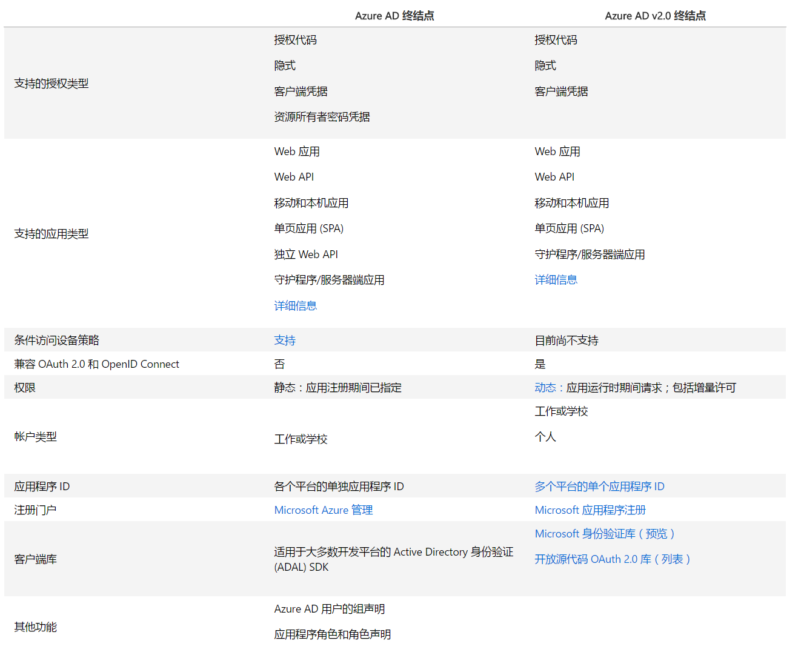
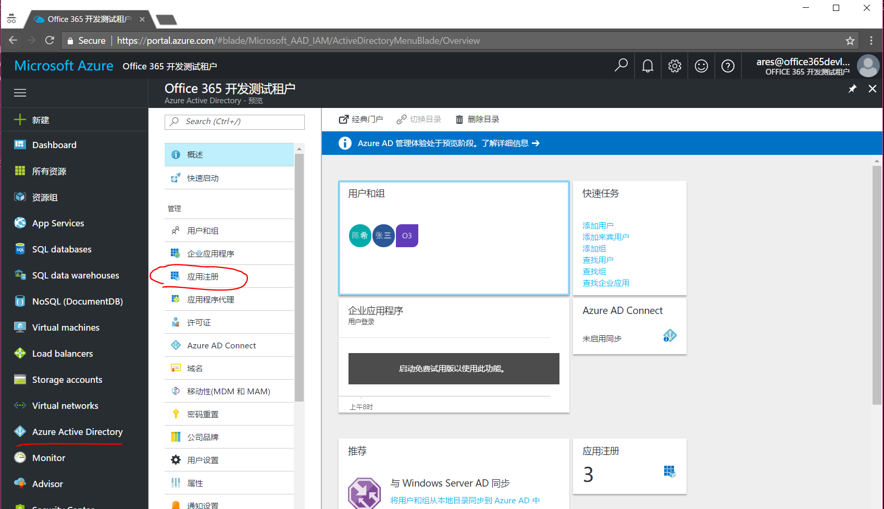
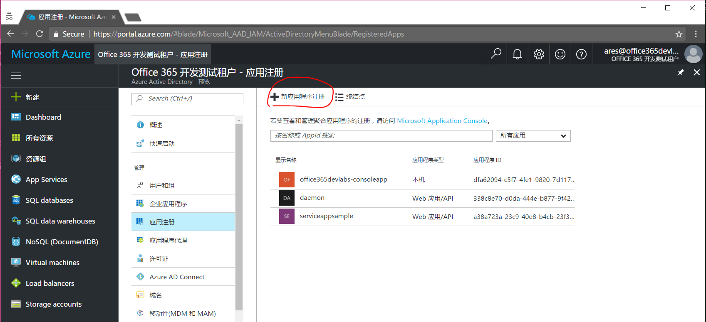
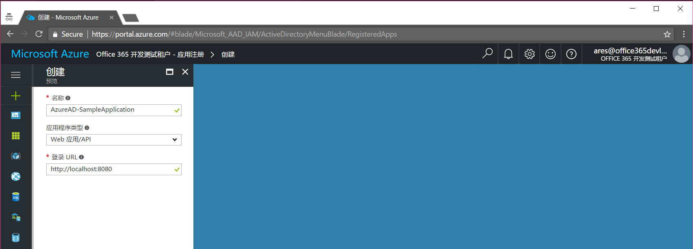
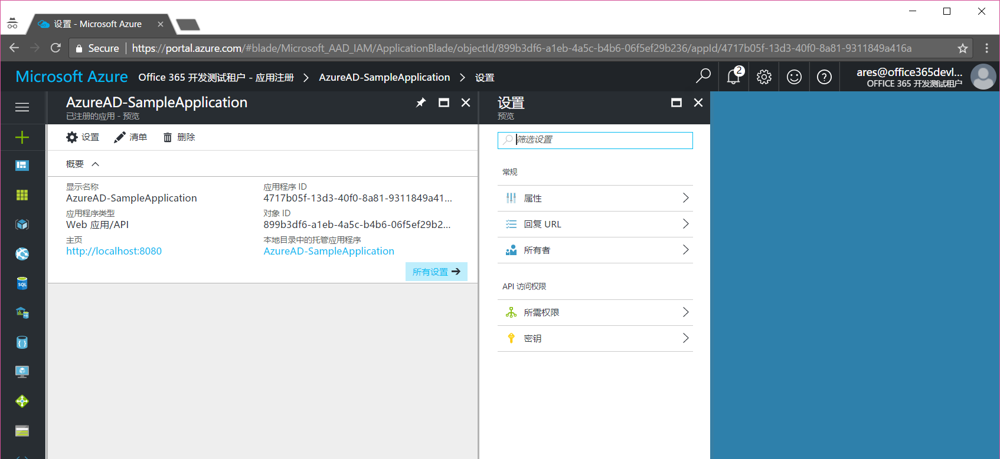
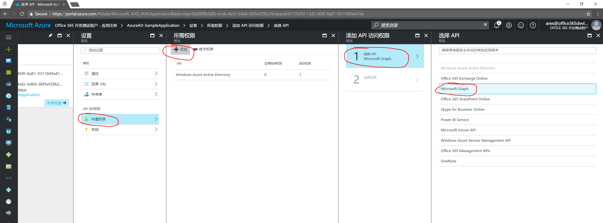
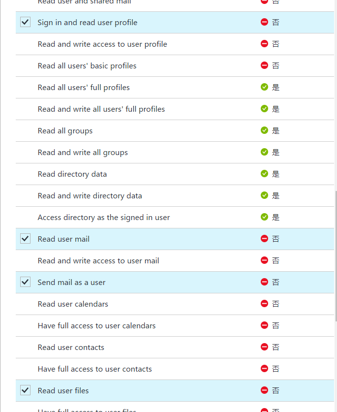
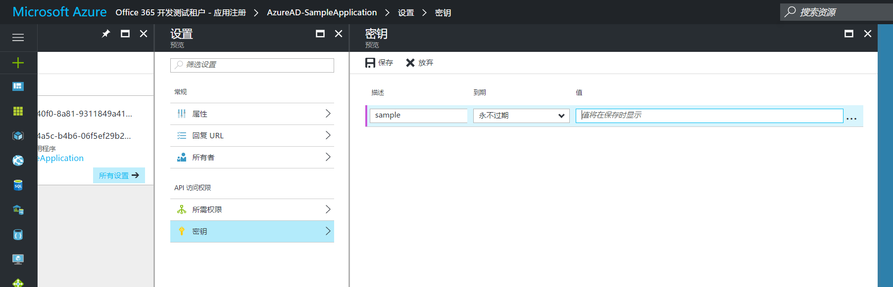
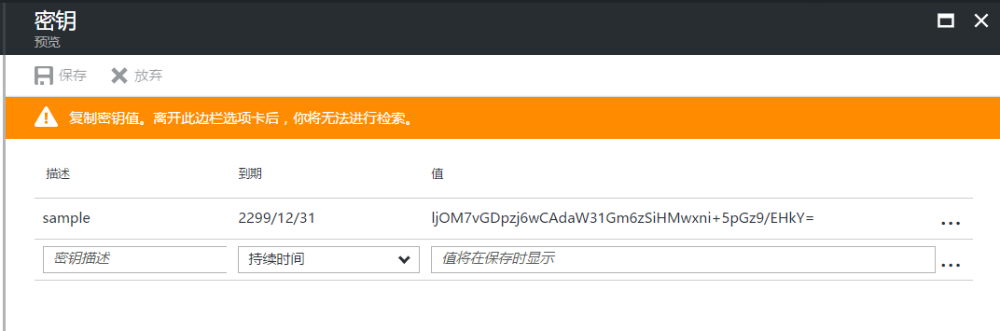
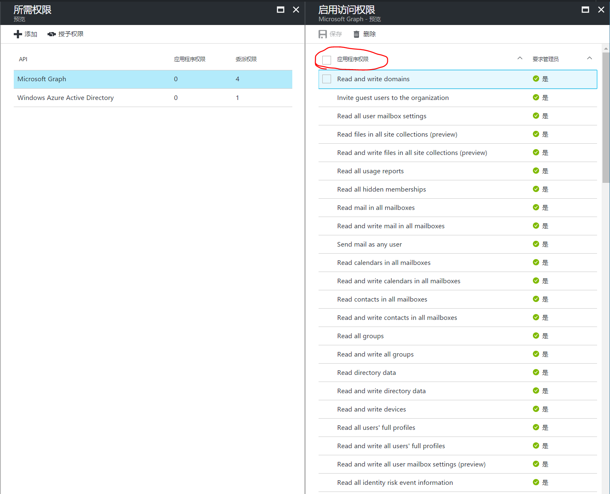

# 注册Azure AD 应用程序

> 作者：陈希章 发表于2017年3月22日

在此前的文章中，我给大家介绍了分别用Graph 浏览器以及第三方工具（POSTMAN）快速体验Microsoft Graph的功能，其中有一个重要的环节就是，开发人员需要访问Microsoft Graph的话，其实是事先需要注册一个应用程序的。Graph 浏览器是特例，因为这个应用程序是微软官方注册好的。而大家在POSTMAN这篇文章中已经看到我注册的自定义应用程序的效果。我这里再针对这个问题展开介绍。

目前针对Microsoft Graph的应用程序注册，有两种途径：

1. Azure AD应用程序，它仅适合于开发人员希望用户能授权访问工作或者学校的账号。
1. Azure AD 2.0应用程序，它适合于开发人员希望既希望用户授权访问工作或者学校的账号，也能授权访问个人账号。

>前一种方式也可以称为Azure AD 1.0，从趋势上来说，后者将逐渐全面取代，成为日后主要的方式。但就目前而言，2.0中所提供的服务数量还没有1.0多。

## 创建应用程序

这一篇文章，我首先介绍Azure AD应用程序这种注册方式。

我在之前已经介绍过，其实Microsoft Graph的一个基础是Azure AD，所以第一步需要使用你的Office 365账号登录到Azure管理中心 <https://portal.azure.com>

点击左侧的Azure Active Directory，然后点击“应用注册”

点击“新应用程序注册”按钮，输入必要的信息即可创建一个新的应用程序

这里要给大家介绍，Auzre AD应用程序有两种主要类型，一种是Web应用/API，另外一种是“本机”应用，其中通常指的是网站或者服务站点，或者则指的是桌面应用或者移动应用。如果选择前者，那么需要提供登录Url, 这个需要填写对应的网站真正的登录路径；而如果选择了后者，则需要提供重定向URL，这个地址其实是可以随便填，例如http://localhost 即可。

点击“创建”按钮，就可以快速完成应用程序的创建工作。

## 申请权限

接下来我们需要为这个应用程序申请必要的权限。点击上图中的“所需权限”按钮，然后依次进行如下操作

在委派权限中选择如下四个权限

## 创建密钥 [可选]

这一步并不是必须的。一般情况下，我们调用Microsoft Graph之前，都会弹出（或者跳转）到指定的页面要求用户去输入账号信息，并且亲自确认授权。但是如果我们的应用程序是一个后台的服务，它需要一直运行，而且是没有交互界面的，这种情况下则需要另外创建一个密钥，同时采用Client Credential的方式来获取授权。（这个具体代码的做法，我会在后续的范例程序中做介绍）

创建密钥很简单，你需要指定名称和时效，然后点击“保存”后，会自动生成一个密钥。请一定注意，这个密钥必须马上复制妥善地保存，因为在此刷新页面它就不可查看了。

如果我们是为后台服务类应用程序进行注册，那么除了创建密钥外，还需要为应用程序申请“应用程序权限”，而不是“委派权限”。
> 委派的意思，指的是代理当前用户进行操作，所以它是需要用户交互式授权的。而“应用程序权限”则是不跟具体某个用户有关，是直接授予应用程序的权限。

## 小结

要进行Microsoft Graph的开发，必须要在Azure AD中进行应用程序的注册，由于历史的原因，目前我们有两个不同的版本。本文介绍了Auzre AD 1.0中注册应用程序的步骤，并且也说明了三种不同类型的应用（Web 应用/API ，本机，后台服务），以及两种不同的权限（委派权限，应用程序权限）。
