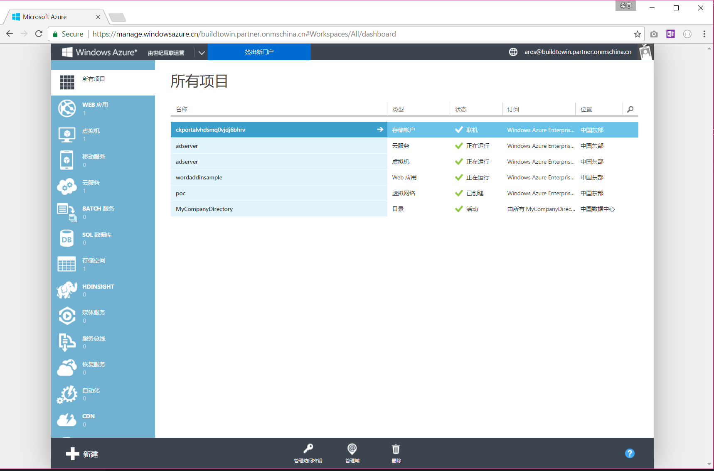
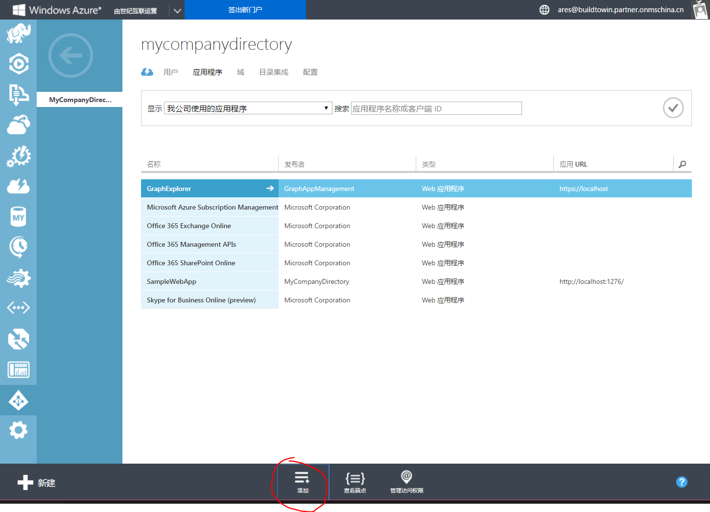
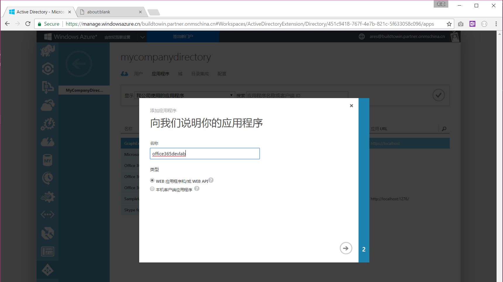
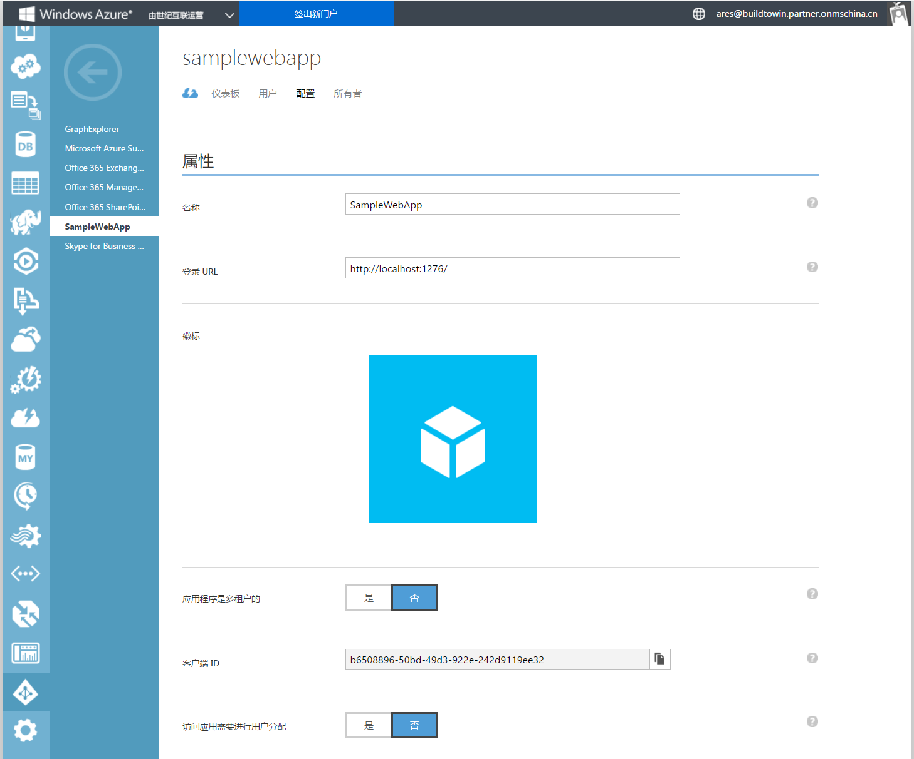
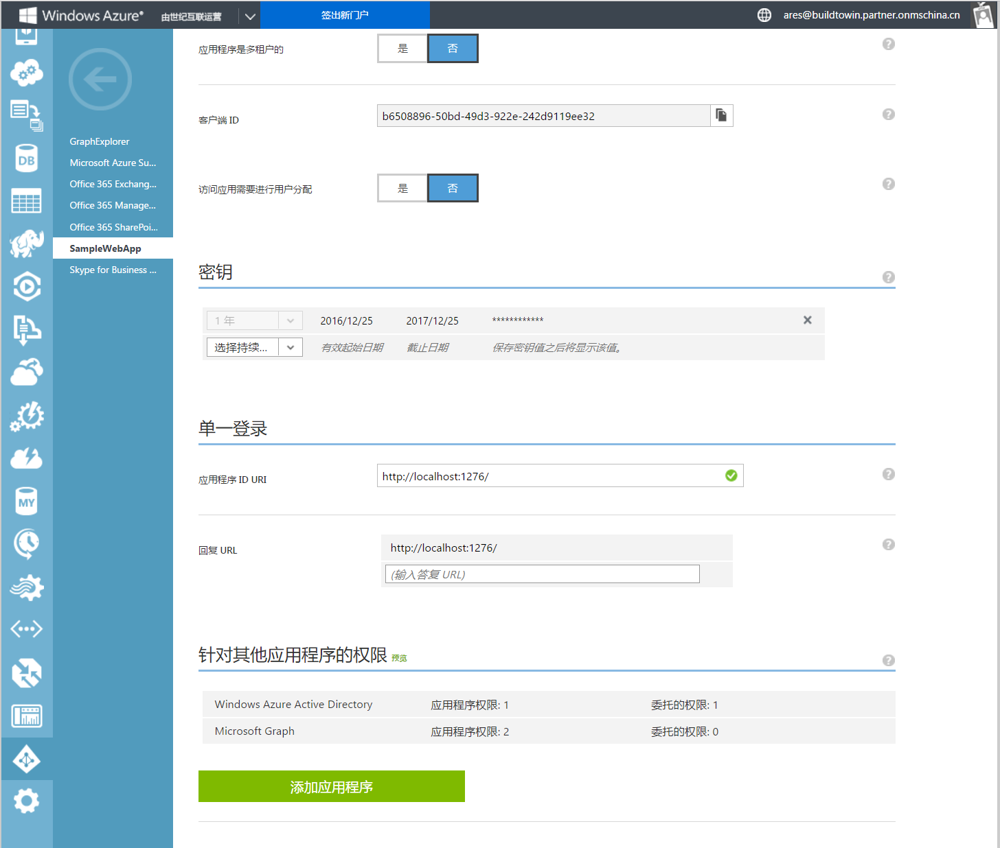
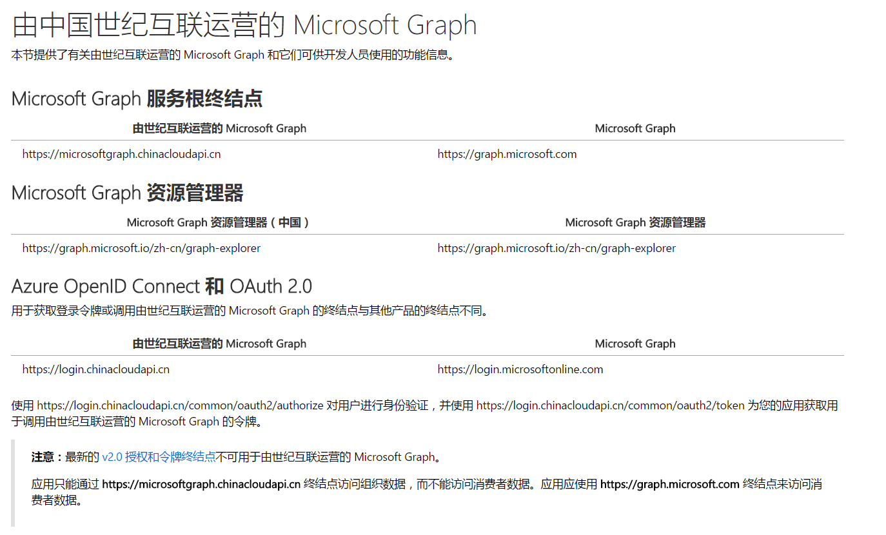
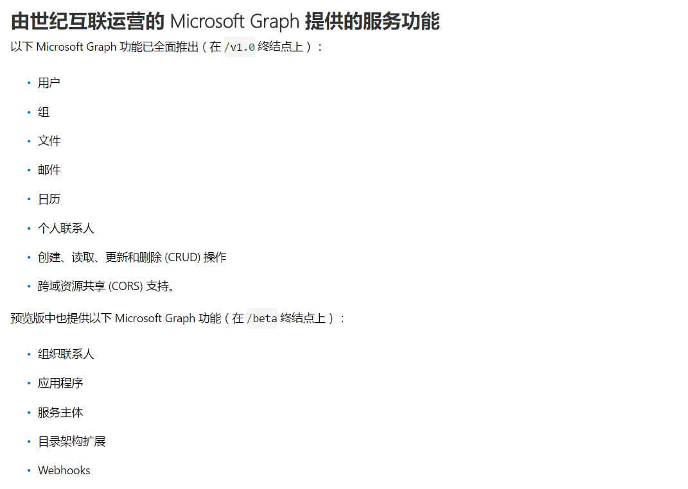

# 中国版Office 365 应用程序注册
> 作者：陈希章 发表于 2017年3月23日

中国版Office 365是由世纪互联进行运营的一个云服务，单纯从技术角度来看的话，它基本保持了与国际版的同步。但是由于两个版本本质上是完全独立的，其中最关键的就是账号系统是分开的，所以在使用角度，不管是直接用户还是开发人员，会有些小小的差异。

就应用程序注册这件事情而言，中国版Office 365的操作方式有如下的特点：
1. 注册地址不一样，这个能理解
2. 目前仅支持Azure AD 1.0
3. 功能和用法跟国际版还略有差异 

## 注册应用程序
你需要登录到<https://manage.windowsazure.cn>这个管理门户（旧版）才能进行中国版Office 365应用程序注册。
>需要注意的是，目前国内版的Azure，如果要管理活动目录（AD），还只能用旧版。而且如果你是刚开通中国版的Office 365，那么默认还无法访问到对应的Azure AD的，这有点让人迷惑，但我这里有一个变通办法 <http://www.cnblogs.com/chenxizhang/p/6010139.html> 

点击左侧的“Active Directory”，可以管理当前租户的活动目录，也可以看到目前注册好的应用程序列表

点击“添加”，系统会提供一个向导引导你进行应用程序注册

下图展示了一个配置好的应用程序截图

>在每个配置项处如果有疑问，都可以通过点击问号按钮查看详细信息

## 功能和用法差异
在用法上面，主要是登录地址不同。

功能也确实是有差异的，但这个差距会越来越小。详细情况，请参考下面的链接
<https://developer.microsoft.com/zh-cn/graph/docs/concepts/deployments>
