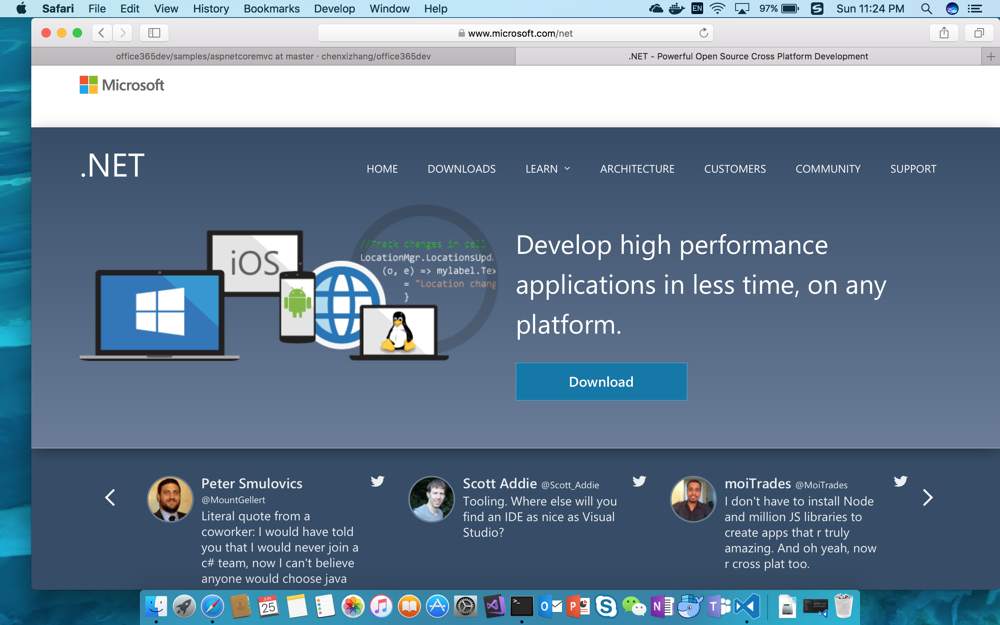
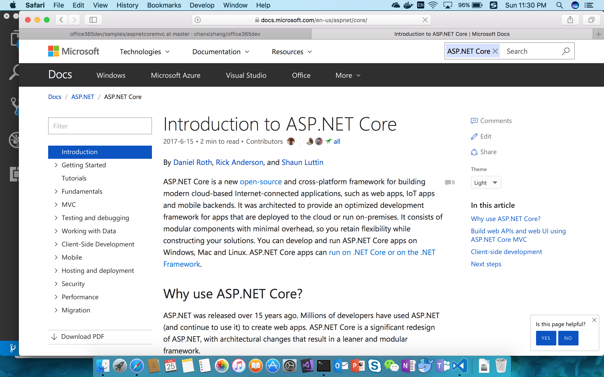
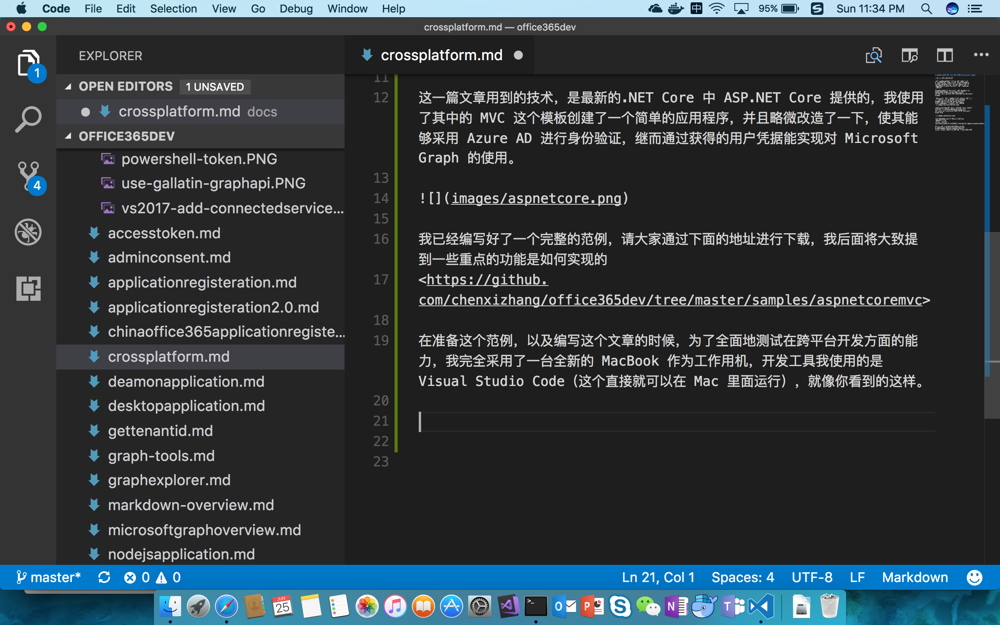
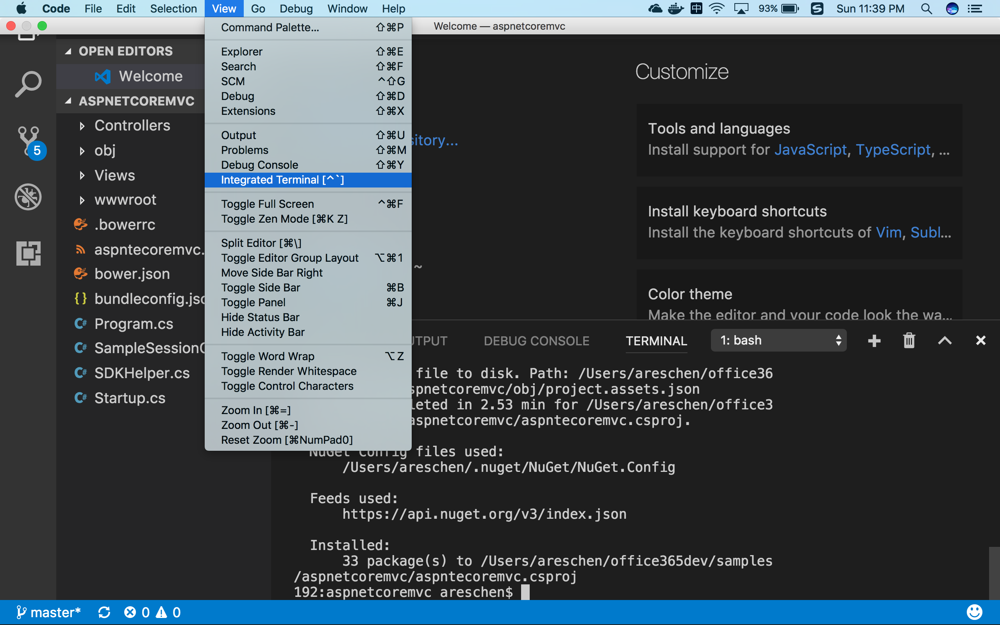
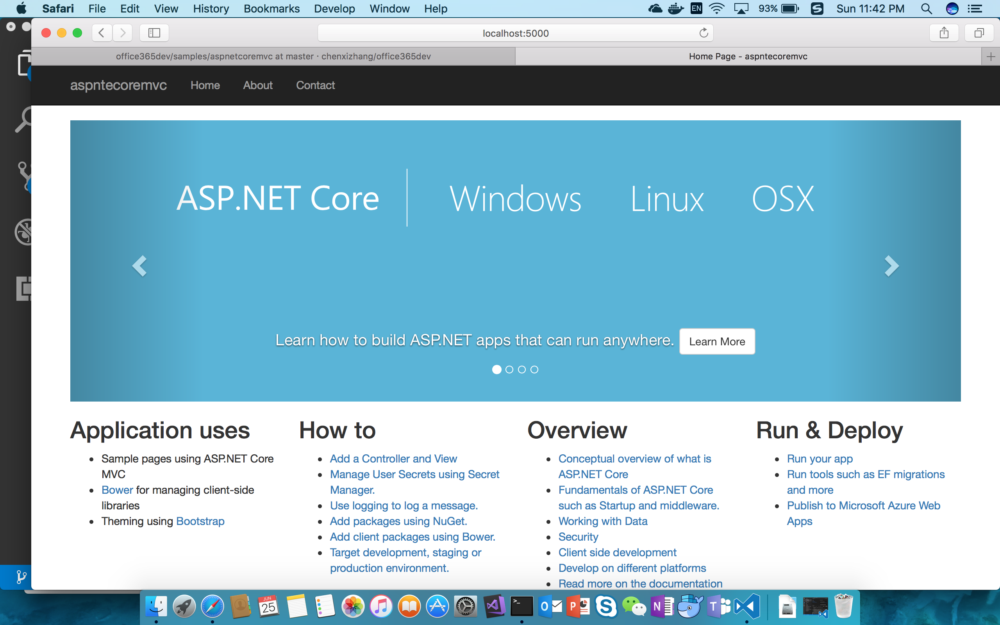
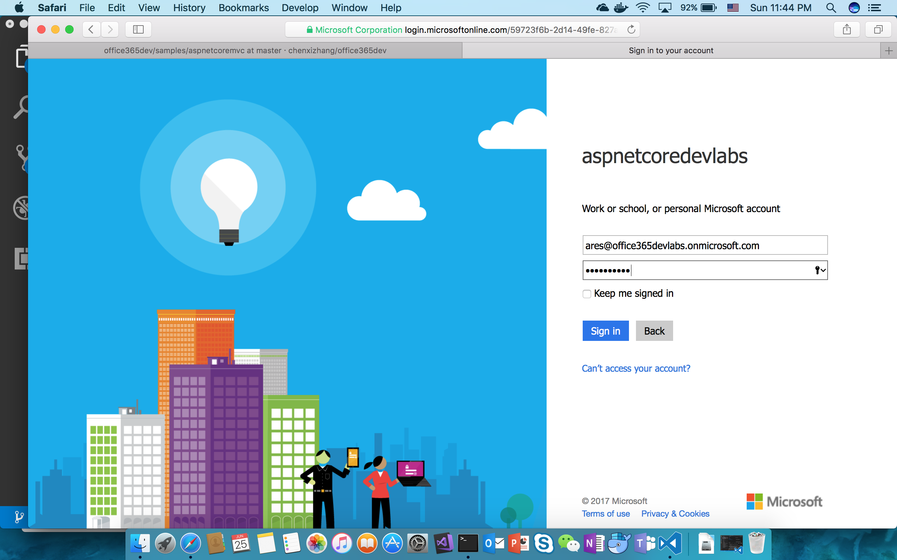
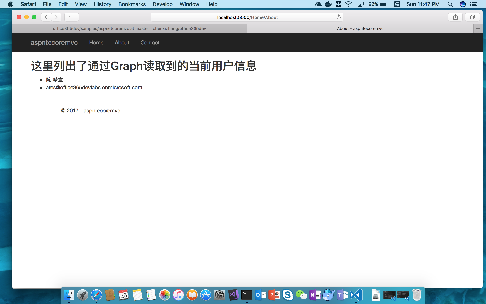

# 跨平台应用集成(在ASP.NET Core MVC 应用程序中集成 Microsoft Graph)

> 作者：陈希章 发表于 2017年6月25日

## 谈一谈.NET 的跨平台

终于要写到这一篇了。跨平台的支持可以说是 Office 365 平台在设计伊始就考虑的目标。我在前面的文章已经提到过了，Microsoft Graph 服务针对一些主流的开源平台（主要用来做跨平台应用）都有支持，例如 python,nodejs 等。他们真的非常好用，与此同时我虽然对他们也有一定的了解，但要跟我最熟悉的 Microsoft .NET 来比较的话，我自然还是更喜欢后者了。

所以，一直在等待合适的时间，要来写 Microsoft .NET 的跨平台应用，这是多么令人期待的事情啊。经过一段时间的研究，我今天正式隆重地给大家介绍，如何在 ASP.NET Core 平台上面构建一个 MVC 应用程序，并且在里面集成 Microsoft Graph。

关于Microsoft .NET 这几年的发展，我是感到比较兴奋的，作为一个从.NET 1.1就开始追随的骨灰级粉丝，我很高兴地看到现在.NET 已经真正迈出了跨平台的脚步，而且完全开源了。如果要讲这个话题，恐怕我是一时半会刹不住车的，所以我就此打住吧，有兴趣的朋友们可以通过下面这个网址了解更多.NET 的发展情况。


这一篇文章用到的技术，是最新的.NET Core 中 ASP.NET Core 提供的，我使用了其中的 MVC 这个模板创建了一个简单的应用程序，并且略微改造了一下，使其能够采用 Azure AD 进行身份验证，继而通过获得的用户凭据能实现对 Microsoft Graph 的使用。



## ASP.NET Core MVC 整合了 Graph 的场景效果

我已经编写好了一个完整的范例，请大家通过下面的地址进行下载，我后面将大致提到一些重点的功能是如何实现的
<https://github.com/chenxizhang/office365dev/tree/master/samples/aspnetcoremvc>

在准备这个范例，以及编写这个文章的时候，为了全面地测试在跨平台开发方面的能力，我完全采用了一台全新的 MacBook 作为工作用机，开发工具我使用的是 Visual Studio Code（这个直接就可以在 Mac 里面运行），就像你看到的这样。



好的，大致背景我也交代清楚了，如果大家下载了代码，可以跟我一起来体验一下这个应用程序运行起来的效果吧 —— 我推荐你也用 Visual Studio Code 来打开这个应用程序。（是的，你不再需要安装 Visual Studio 完整版）

打开命令行工具，我们很快要运行几个命令


请运行下面的命令，下载当前项目所依赖的一些组件包
> dotnet restore

然后运行下面的命令，可以将当前项目运行起来
> dotnet run 

如果不出意外的话，我写好的这个简单的应用程序会启动起来，并且在本机的5000端口进行监听



看起来跟我们一般的 MVC 程序真的是一样一样的，此时，请点击页面顶部左上角的“About”，看看会发生什么呢



输入正确的用户名和密码后，你就可以看到该用户的基本信息了



好了，功能确实就是这样，足够简单，不是吗？但是正如我猜想你应该会想到的那样，只要打开了 Graph 这扇大门，无穷的宝藏就等着你尽情地创造性地利用了。

## 代码解析

下面我还是简单地讲解一下我在标准的模板基础上做过哪些定制，从而实现了上面的功能的。

> 要创建这个应用程序，你需要安装 dotnet sdk（<https://www.microsoft.com/net/download/core> ），然后在本地命令行工具中运行 dotnet new mvc 即可

首先，我为项目添加了几个外部组件包，这是通过修改项目定义文件（aspnetcoremvc.csproj）来实现的。

```
<PackageReference Include="Microsoft.Graph" Version="1.4.0"/>
<PackageReference Include="Microsoft.AspNetCore.Authentication.OpenIdConnect" Version="1.1.0"/>
<PackageReference Include="Microsoft.AspNetCore.Authentication.Cookies" Version="1.1.0"/>
<PackageReference Include="Microsoft.IdentityModel.Clients.ActiveDirectory" Version="3.13.9"/>
<PackageReference Include="Microsoft.AspNetCore.Session" Version="1.1.0"/>
<PackageReference Include="Microsoft.Extensions.Caching.Memory" Version="1.1.2"/>

```

> 这些组件都是托管在 nuget.org 这个网站上面，甚至整个 dotnet core 的核心组件也都是开源托管在这个上面。一般添加完这些组件后，都需要运行 dotnet restore 命令在本地进行还原。

然后，我修改了 Startup.cs 文件。这是  asp.net core 应用程序的一个标准文件，用来定义程序入口，加载相关服务和中间件。（这里涉及的知识面太多，以至于我无法一一说明，有兴趣可以参考 <https://asp.net/core> 了解。

```
using System;
using System.Collections.Generic;
using System.Linq;
using System.Threading.Tasks;
using Microsoft.AspNetCore.Builder;
using Microsoft.AspNetCore.Hosting;
using Microsoft.Extensions.Configuration;
using Microsoft.Extensions.DependencyInjection;
using Microsoft.Extensions.Logging;
//这里增加了一写命名空间导入
using Microsoft.Extensions.Caching;
using Microsoft.AspNetCore.Authentication.Cookies;
using Microsoft.AspNetCore.Authentication.OpenIdConnect;
using Microsoft.AspNetCore.Session;
using Microsoft.IdentityModel.Protocols.OpenIdConnect;
using Microsoft.IdentityModel.Clients.ActiveDirectory;
using Microsoft.AspNetCore.Authentication;
using System.Security.Claims;
using Microsoft.AspNetCore.Http;

namespace aspntecoremvc
{
    public class Startup
    {

        // This method gets called by the runtime. Use this method to add services to the container.
        //这里引入一些服务，注入一些组件
        public void ConfigureServices(IServiceCollection services)
        {
            services.AddSession();
            services.AddAuthentication(sharedoptions => sharedoptions.SignInScheme = CookieAuthenticationDefaults.AuthenticationScheme);
           
            // Add framework services.
            services.AddMvc();
        }

        //这里定义了一些静态信息
        private readonly string ClientId="e91ef175-e38d-4feb-b1ed-f243a6a81b93";
        private readonly string Authority=String.Format("https://login.microsoftonline.com/{0}","office365devlabs.onmicrosoft.com");
        private readonly string ClientSecret="2F5jdoGGNn59oxeDLE9fXx5tD86uvzIji74dmLaj3YI=";
        private readonly string GraphResourceId="https://graph.microsoft.com";
        private readonly string CallbackPath ="/signin-oidc";

        // This method gets called by the runtime. Use this method to configure the HTTP request pipeline.
        public void Configure(IApplicationBuilder app, IHostingEnvironment env, ILoggerFactory loggerFactory)
        {
            loggerFactory.AddConsole();
            loggerFactory.AddDebug();

            if (env.IsDevelopment())
            {
                app.UseDeveloperExceptionPage();
                app.UseBrowserLink();
            }
            else
            {
                app.UseExceptionHandler("/Home/Error");
            }

            app.UseStaticFiles();
            //这里几步是最关键的，定义了如何进行身份认证以及如何保存
            app.UseSession();
            app.UseCookieAuthentication();
            app.UseOpenIdConnectAuthentication(new OpenIdConnectOptions{
                ClientId = ClientId,
                Authority = Authority,
                ClientSecret = ClientSecret,
                ResponseType = OpenIdConnectResponseType.CodeIdToken,
                CallbackPath = CallbackPath,
                GetClaimsFromUserInfoEndpoint =true,
                Events = new OpenIdConnectEvents{
                    OnAuthorizationCodeReceived = OnAuthorizationCodeReceived
                }
            });

            app.UseMvc(routes =>
            {
                routes.MapRoute(
                    name: "default",
                    template: "{controller=Home}/{action=Index}/{id?}");
            });
        }
        private async Task OnAuthorizationCodeReceived(AuthorizationCodeReceivedContext context)
        {
            
            // 将 Token 信息保存在 session 里面，后续 Graph 就可以直接调用了

            string userObjectId = (context.Ticket.Principal.FindFirst("http://schemas.microsoft.com/identity/claims/objectidentifier"))?.Value;
            ClientCredential clientCred = new ClientCredential(ClientId, ClientSecret);
            AuthenticationContext authContext = new AuthenticationContext(Authority, new SampleSessionCache(userObjectId, context.HttpContext.Session));
            AuthenticationResult authResult = await authContext.AcquireTokenByAuthorizationCodeAsync(
                context.ProtocolMessage.Code, new Uri(context.Properties.Items[OpenIdConnectDefaults.RedirectUriForCodePropertiesKey]), clientCred, GraphResourceId);

            
        }

        private Task OnAuthenticationFailed(FailureContext context)
        {
            context.HandleResponse();
            context.Response.Redirect("/Home/Error?message=" + context.Failure.Message);
            return Task.FromResult(0);
        }
    }
}

```

我还专门定义了一个简单的类用来保存 Token 信息。为了简单起见，我们将 Token 保存在 Session 里面，这样的话，用户登陆一次后，在一个会话里面就不需要多次登录，而是可以直接重用这些 Token。

这个类其实我是重用了之前在 ASP.NET MVC 开发中的那个类，没有什么特别要交待的，请直接打开 SampleSessionCache.cs 这个文件了解即可。

接下来，为了便于后续在 Controller 里面快速地访问到 Graph，我对 GraphServiceClient 进行了封装，请参考 SDKHelper.cs 这个文件

```
using System;
using System.Collections.Generic;
using System.Linq;
using System.Security.Claims;
using System.Threading.Tasks;
using Microsoft.AspNetCore.Authorization;
using Microsoft.AspNetCore.Mvc;
using Microsoft.Extensions.Configuration;
using Microsoft.IdentityModel.Clients.ActiveDirectory;
using Microsoft.Graph;
using System.Net.Http.Headers;
using Microsoft.AspNetCore.Http;


namespace aspntecoremvc{
    public static class SDKHelper{
        
        //这里其实是对 ControllerBase 这个类型进行了扩展
        public static async Task<GraphServiceClient> GetAuthenticatedClient(this ControllerBase controller){

            var Authority = String.Format("https://login.microsoftonline.com/{0}","office365devlabs.onmicrosoft.com");
            var ClientId = "e91ef175-e38d-4feb-b1ed-f243a6a81b93";
            var ClientSecret = "2F5jdoGGNn59oxeDLE9fXx5tD86uvzIji74dmLaj3YI=";
            var GraphResourceId = "https://graph.microsoft.com";


            string userObjectId = controller.HttpContext.User.FindFirst("http://schemas.microsoft.com/identity/claims/objectidentifier")?.Value;
            ClientCredential clientCred = new ClientCredential(ClientId, ClientSecret);
            AuthenticationContext authContext = new AuthenticationContext(Authority, new SampleSessionCache(userObjectId, controller.HttpContext.Session));
            AuthenticationResult result = await authContext.AcquireTokenSilentAsync(GraphResourceId,ClientId);

            GraphServiceClient client = new GraphServiceClient(new DelegateAuthenticationProvider(async request=>{
                request.Headers.Authorization = new AuthenticationHeaderValue("bearer", result.AccessToken);
                await Task.FromResult(0);
            }));

            return client;

        }

    }

}

```


有了上面的准备，在真正需要用到 Graph 服务的地方，我们的代码是非常简单的，请参考 HomeController.cs 文件中的 About 方法

```
[Authorize]//用这个标记该方法需要用户登录
public async Task<IActionResult> About()
{
    var client = await this.GetAuthenticatedClient();  
    //获取用户详细信息，然后传递给视图
    return View(await client.Me.Request().GetAsync());
}
```

到这里为止，我的这个例子的主要代码就解释完了。你可能会觉得，这太简单了吧。如果你这样认为，我一方面感到很高兴，因为这是我希望呈现出来的效果；另一方面我要提醒你的是，由于 asp.net core 是一个还比较新的技术，这方面的材料相当少，其实我还是做了相当多的研究才精炼成这样的，其间遇到过多少坑，多少曲折迂回，不足以外人道也，但我很看好 asp.net core，并且将持续在此之上进行投资，这也几乎是可以肯定的。


## 结语

这个例子实现的功能并没有什么惊天动地的，但与咱们之前一系列的范例相呼应的是，我是要帮助大家打开 Microsoft Graph 的大门，至于你要怎么去利用里面丰富的宝藏，我就选择的权利交给你自己。

写到这里，我的这个系列文章的第一个大的里程碑应该是要实现了。我用了将近四个月的时间，写了十几篇跟 Office 365 开发入门，以及具体的 Microsoft Graph 开发有关的文章，差不多算是比较完整了。

我还将继续写后续的内容，例如 Office Add-ins，SharePoint 开发，Teams 开发（Bot 等），有兴趣的朋友们可继续关注。


## 2017年6月30日更新

作为一个不断追求代码复用的程序猿，我这两天在上面这个范例基础上对代码进行了一定的封装，如果你此时查看代码的话，会发现已经有了较大的不同。

首先，我将所有公用的代码全部提取到了一个单独的项目（[Office365GraphCoreMVCHelper](https://github.com/chenxizhang/office365dev/tree/master/samples/Office365GraphCoreMVCHelper) ）中，这里面的关键代码有

一个用来读取配置文件的类型
```
namespace Office365GraphCoreMVCHelper
{
    public class AppSetting
    {

        public Info Office365ApplicationInfo { get; set; }

        public class Info
        {
            public string ClientId { get; set; }
            public string ClientSecret { get; set; }
            public string Authority { get; set; }

            public string GraphResourceId { get; set; }
        }
    }
}

```

一个可公用的Startup类型
```
using System;
using System.Collections.Generic;
using System.Linq;
using System.Threading.Tasks;
using Microsoft.AspNetCore.Builder;
using Microsoft.AspNetCore.Hosting;
using Microsoft.Extensions.Configuration;
using Microsoft.Extensions.DependencyInjection;
using Microsoft.Extensions.Logging;
using Microsoft.Extensions.Caching;
using Microsoft.AspNetCore.Authentication.Cookies;
using Microsoft.AspNetCore.Authentication.OpenIdConnect;
using Microsoft.AspNetCore.Session;
using Microsoft.IdentityModel.Protocols.OpenIdConnect;
using Microsoft.IdentityModel.Clients.ActiveDirectory;
using Microsoft.AspNetCore.Authentication;
using System.Security.Claims;
using Microsoft.AspNetCore.Http;
using Microsoft.AspNetCore.Mvc;
using Microsoft.Extensions.Options;

namespace Office365GraphCoreMVCHelper
{
    public class Startup
    {

        static IConfigurationRoot Configuration { get; set; }

        public Startup(IHostingEnvironment env)
        {
            Configuration = new ConfigurationBuilder()
                            .SetBasePath(env.ContentRootPath)
                            .AddJsonFile("appsettings.json")
                            .Build();
        }

        // This method gets called by the runtime. Use this method to add services to the container.
        public void ConfigureServices(IServiceCollection services)
        {

            //这里将配置信息注入到应用程序中
            services.AddOptions();
            services.Configure<AppSetting>(Configuration);

            services.AddSession();
            services.AddAuthentication(sharedoptions => sharedoptions.SignInScheme = CookieAuthenticationDefaults.AuthenticationScheme);

            // Add framework services.
            services.AddMvc();
        }


        // This method gets called by the runtime. Use this method to configure the HTTP request pipeline.
        public void Configure(IApplicationBuilder app, IHostingEnvironment env, ILoggerFactory loggerFactory)
        {
            loggerFactory.AddConsole();
            loggerFactory.AddDebug();

            if (env.IsDevelopment())
            {
                app.UseDeveloperExceptionPage();
                app.UseBrowserLink();
            }
            else
            {
                app.UseExceptionHandler("/Home/Error");
            }

            //ConfigureMiddleware(app,env,loggerFactory);

            app.UseStaticFiles();
            app.UseSession();
            app.UseCookieAuthentication();
            //获得之前注入的配置信息
            var options = app.ApplicationServices.GetRequiredService<IOptions<AppSetting>>();

            app.UseOpenIdConnectAuthentication(new OpenIdConnectOptions
            {
                ClientId = options.Value.Office365ApplicationInfo.ClientId,
                Authority = options.Value.Office365ApplicationInfo.Authority,
                ClientSecret = options.Value.Office365ApplicationInfo.ClientSecret,
                ResponseType = OpenIdConnectResponseType.CodeIdToken,
                CallbackPath = "/signin-oidc",
                GetClaimsFromUserInfoEndpoint = true,
                Events = new OpenIdConnectEvents
                {
                    OnAuthorizationCodeReceived = async (context) =>
                    {
                        string userObjectId = (context.Ticket.Principal.FindFirst("http://schemas.microsoft.com/identity/claims/objectidentifier"))?.Value;
                        ClientCredential clientCred = new ClientCredential(options.Value.Office365ApplicationInfo.ClientId, options.Value.Office365ApplicationInfo.ClientSecret);
                        AuthenticationContext authContext = new AuthenticationContext(options.Value.Office365ApplicationInfo.Authority, new SampleSessionCache(userObjectId, context.HttpContext.Session));
                        AuthenticationResult authResult = await authContext.AcquireTokenByAuthorizationCodeAsync(
                            context.ProtocolMessage.Code, new Uri(context.Properties.Items[OpenIdConnectDefaults.RedirectUriForCodePropertiesKey]), clientCred, options.Value.Office365ApplicationInfo.GraphResourceId);
                    }
                }
            });

            app.UseMvc(routes =>
            {
                routes.MapRoute(
                    name: "default",
                    template: "{controller=Home}/{action=Index}/{id?}");
            });
        }

        private Task OnAuthenticationFailed(FailureContext context)
        {
            context.HandleResponse();
            context.Response.Redirect("/Home/Error?message=" + context.Failure.Message);
            return Task.FromResult(0);
        }
    }
}
```


改造过的SDKHelper类型，主要增加了从配置文件中读取信息的功能
```
using System;
using System.Net.Http.Headers;
using System.Threading.Tasks;
using Microsoft.Graph;
using Microsoft.IdentityModel.Clients.ActiveDirectory;
using Microsoft.AspNetCore.Mvc;
using Microsoft.Extensions.Options;
using Microsoft.AspNetCore.Builder;

namespace Office365GraphCoreMVCHelper
{
    public static class SDKHelper
    {
        public static async Task<GraphServiceClient> GetAuthenticatedClient(this ControllerBase controller,IOptions<AppSetting> options)
        {
            var Authority = options.Value.Office365ApplicationInfo.Authority;
            var ClientId = options.Value.Office365ApplicationInfo.ClientId;
            var ClientSecret = options.Value.Office365ApplicationInfo.ClientSecret;
            var GraphResourceId = options.Value.Office365ApplicationInfo.GraphResourceId;


            string userObjectId = controller.HttpContext.User.FindFirst("http://schemas.microsoft.com/identity/claims/objectidentifier")?.Value;
            ClientCredential clientCred = new ClientCredential(ClientId, ClientSecret);
            AuthenticationContext authContext = new AuthenticationContext(Authority, new SampleSessionCache(userObjectId, controller.HttpContext.Session));
            AuthenticationResult result = await authContext.AcquireTokenSilentAsync(GraphResourceId, ClientId);

            GraphServiceClient client = new GraphServiceClient(new DelegateAuthenticationProvider(async request =>
            {
                request.Headers.Authorization = new AuthenticationHeaderValue("bearer", result.AccessToken);
                await Task.FromResult(0);
            }));

            return client;

        }

    }
}
```

由于有了这个公用的组件，那么在aspnetcoremvc这个主程序中，我可以极大地简化代码。

首先，我在项目文件中定义了对公用组件的引用

```

<Project Sdk="Microsoft.NET.Sdk.Web">

  <PropertyGroup>
    <TargetFramework>netcoreapp1.1</TargetFramework>
  </PropertyGroup>


  <ItemGroup>
    <PackageReference Include="Microsoft.AspNetCore" Version="1.1.2" />
    <PackageReference Include="Microsoft.AspNetCore.Mvc" Version="1.1.3" />
    <PackageReference Include="Microsoft.AspNetCore.StaticFiles" Version="1.1.2" />
    <PackageReference Include="Microsoft.Extensions.Logging.Debug" Version="1.1.2" />
    <PackageReference Include="Microsoft.VisualStudio.Web.BrowserLink" Version="1.1.2" />
    <PackageReference Include="Microsoft.Graph" Version="1.4.0"/>
    <PackageReference Include="Microsoft.AspNetCore.Authentication.OpenIdConnect" Version="1.1.0"/>
    <PackageReference Include="Microsoft.AspNetCore.Authentication.Cookies" Version="1.1.0"/>
    <PackageReference Include="Microsoft.IdentityModel.Clients.ActiveDirectory" Version="3.13.9"/>
    <PackageReference Include="Microsoft.AspNetCore.Session" Version="1.1.0"/>
    <PackageReference Include="Microsoft.Extensions.Caching.Memory" Version="1.1.2"/>
  </ItemGroup>
  <ItemGroup>   
    <ProjectReference Include="..\Office365GraphCoreMVCHelper\Office365GraphCoreMVCHelper.csproj" />
  </ItemGroup>  

</Project>

```

然后，我删除了该项目中的Startup类型，取而代之的在Program中直接引用公用组件中定义好的那个Startup

```
using System;
using System.Collections.Generic;
using System.IO;
using System.Linq;
using System.Threading.Tasks;
using Microsoft.AspNetCore.Hosting;
using Office365GraphCoreMVCHelper;

namespace aspntecoremvc
{
    public class Program
    {
        public static void Main(string[] args)
        {
            var host = new WebHostBuilder()
                .UseSetting("startupAssembly","Office365GraphCoreMVCHelper")
                .UseKestrel()
                .UseContentRoot(Directory.GetCurrentDirectory())
                .UseIISIntegration()
                .Build();

            host.Run();
        }
    }
}
```

当然，我们需要定义一个配置文件来保存clientId等信息，该文件命名为appsettings.json

```
{
    "Office365ApplicationInfo":{
        "ClientId":"e91ef175-e38d-4feb-b1ed-f243a6a81b93",
        "ClientSecret":"2F5jdoGGNn59oxeDLE9fXx5tD86uvzIji74dmLaj3YI=",
        "Authority":"https://login.microsoftonline.com/office365devlabs.onmicrosoft.com",
        "GraphResourceId":"https://graph.microsoft.com"
    }
}
```


最后，在HomeController（或者同类需要用到Microsoft Graph的Controller）中，通过下面的代码来实现调用

```
using System;
using System.Collections.Generic;
using System.Linq;
using System.Security.Claims;
using System.Threading.Tasks;
using Microsoft.AspNetCore.Authorization;
using Microsoft.AspNetCore.Mvc;
using Microsoft.Extensions.Configuration;
using Microsoft.IdentityModel.Clients.ActiveDirectory;
using Microsoft.Graph;
using System.Net.Http.Headers;
using Office365GraphCoreMVCHelper;
using Microsoft.Extensions.Options;

namespace aspntecoremvc.Controllers
{
    public class HomeController : Controller
    {
        private readonly IOptions<AppSetting> Options;
        public HomeController(IOptions<AppSetting> options)
        {
            this.Options = options;
        }
    
        public IActionResult Index()
        {

            return View();
        }

        [Authorize]
        public async Task<IActionResult> About()
        {
            var client = await this.GetAuthenticatedClient(this.Options);            
            return View(await client.Me.Request().GetAsync());
        }

        public IActionResult Contact()
        {
            ViewData["Message"] = "Your contact page.";

            return View();
        }

        public IActionResult Error()
        {
            return View();
        }
    }
}

```