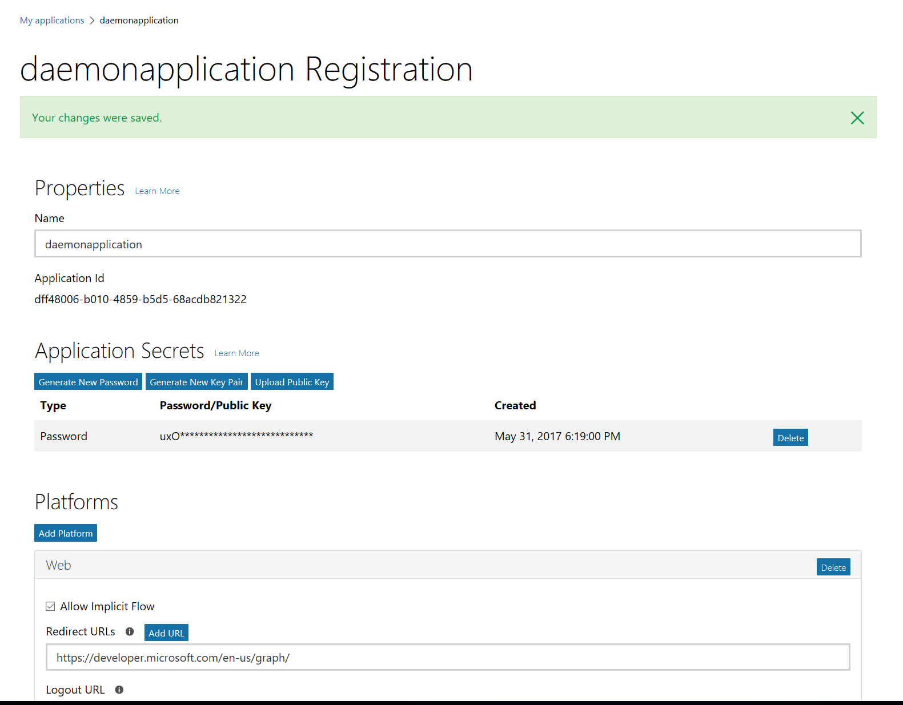
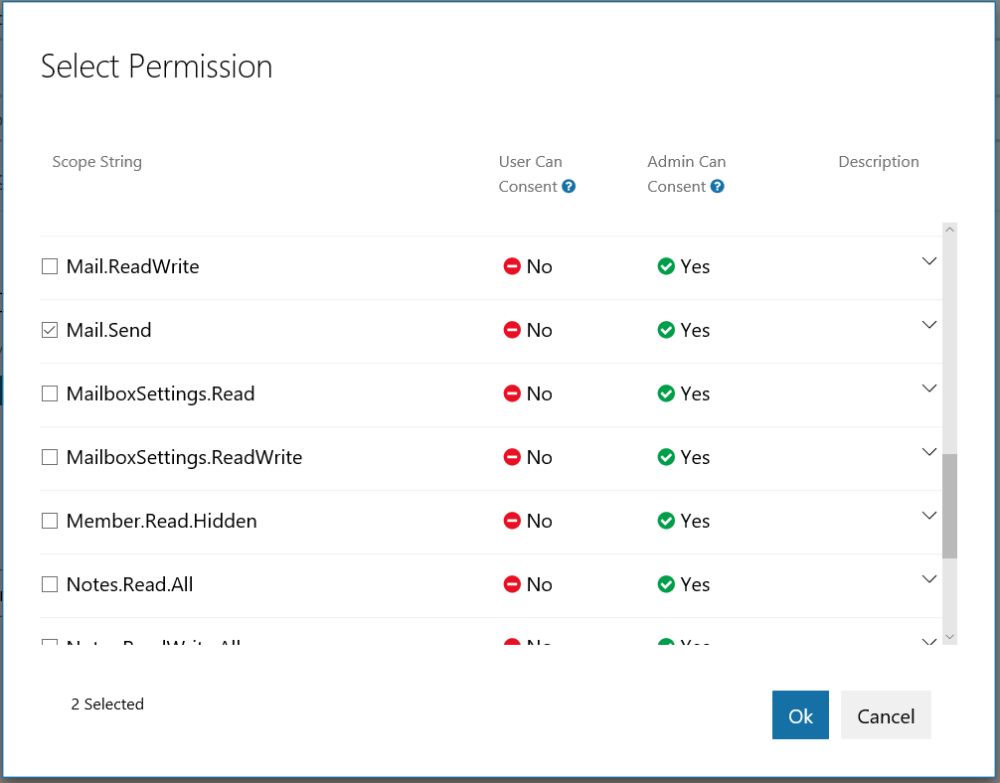
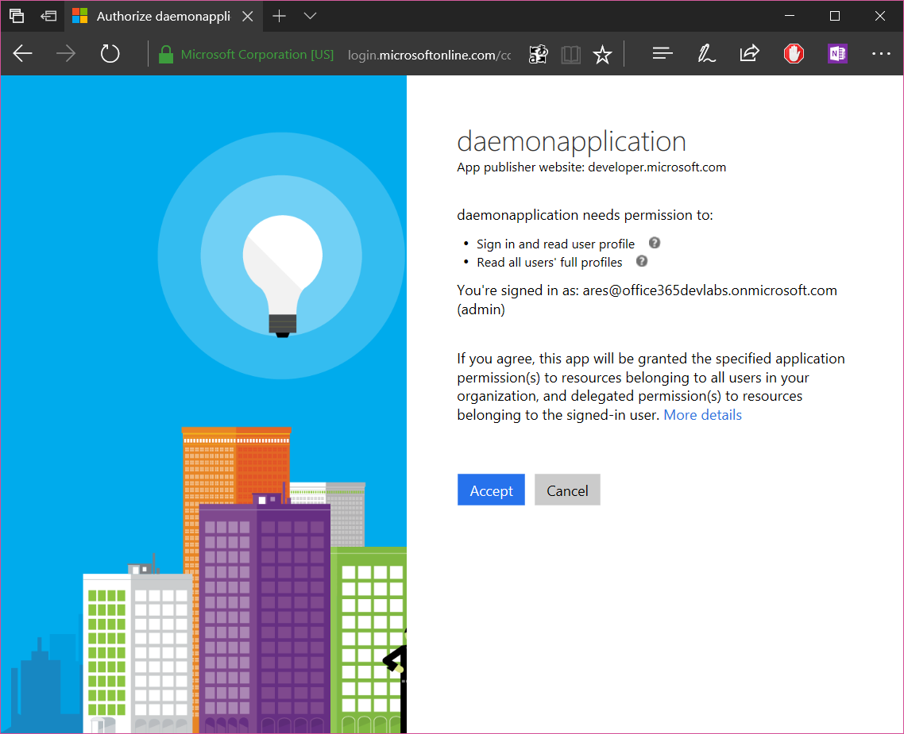
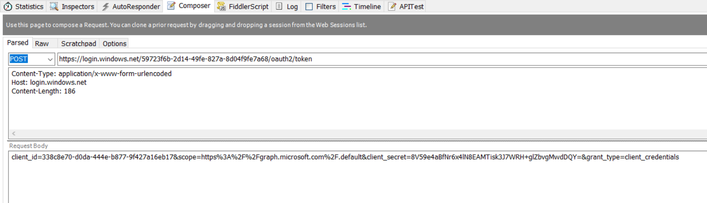
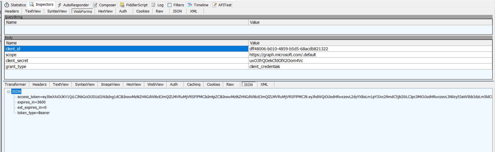
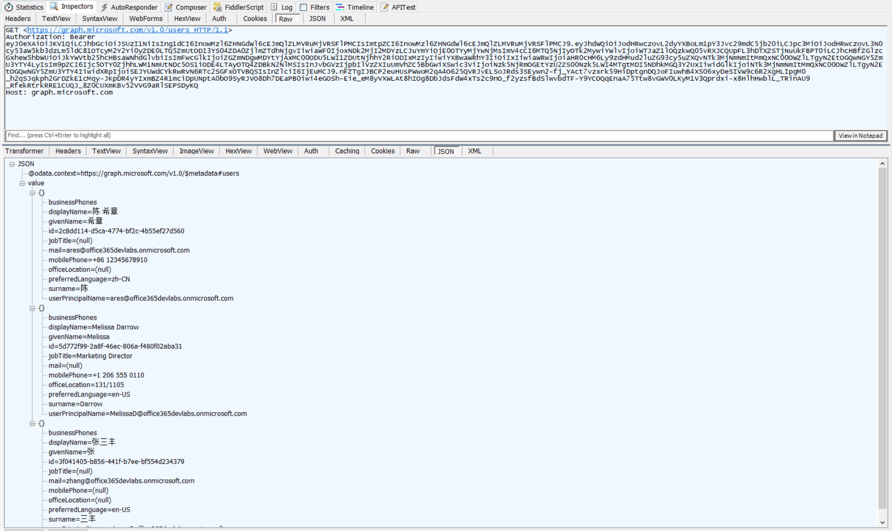
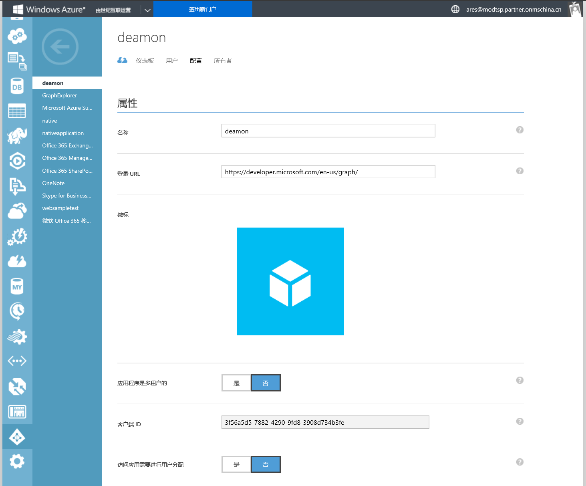
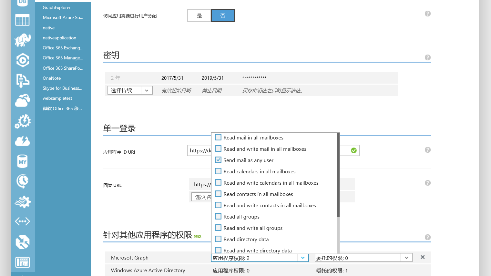
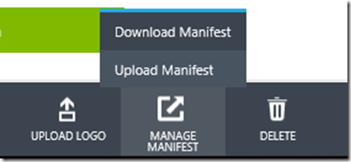
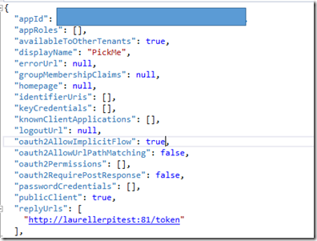

# 在无人值守程序（服务）中调用Micrsooft Graph

> 作者：陈希章 发表于 2017年5月31日

## 什么是无人值守程序（服务）

我在此前用了几篇文章分别介绍了在桌面应用程序（控制台），Web应用程序（ASP.NET MVC），以及PowerSehll脚本中如何访问Microsoft Graph，今天这一篇要继续讲一个场景：在无人值守程序中访问Microsoft Graph。那么什么是无人值守程序呢？通常我们将此类程序定义为不需要（不允许）用户进行干预，一般用来在后台自动化运行的程序。在英文文档中，我们将其称之为daemon application，广义上说，也包括了服务这种特殊的应用程序。

无人值守程序与Microsoft Graph的集成，要遵守一般的流程，但也有自己的一些特点，总结起来有如下的步骤

1. 注册应用程序
1. 配置应用程序权限
1. 获得管理员同意
1. 获得访问令牌
1. 使用令牌访问资源

> 关于这个话题，官方有一个英文的文档，请参考 <https://developer.microsoft.com/en-us/graph/docs/concepts/auth_v2_service>

## 注册应用程序

针对Azure AD的不同版本，注册应用程序的过程我此前已经有专门的文章介绍了，请参考

1. 注册Azure AD 2.0应用程序（支持国际版，支持Office 365账号以及个人账号登录，功能可能有所缺失，但这个是以后的方向），[文章链接](applicationregisteration2.0.md)
1. 注册Azure AD 1.0应用程序（支持国际版和中国版，仅支持Office 365账号登录，功能最全），[文章链接1](applicationregisteration.md)，[文章链接2](chinaoffice365applicationregisteration.md)

本文先演示注册Azure AD 2.0应用，具体的步骤就不做截图了，唯一要提醒的是

1. 应用程序类型设置为Web
1. ReplyUrl可以设置为一个通用的地址，我喜欢设置为 <https://developer.microsoft.com/en-us/graph/>



## 配置应用程序权限

这是无人值守应用程序注册的时候，要特别注意的。由于该程序是没有用户参与的，所以它无法使用某个特定用户的身份做什么事情，而是使用一个统一的身份，该身份我们称为Application Identity，而相应的，我们要为程序申请的权限也是所谓的“Application Permissions”，而不是“Delegated Permissions”。

本例中，我想为应用程序申请两个权限：一个是用来获取所有用户信息的，另外一个是用来代替任何用户发送邮件。



## 获得管理员同意

由于无人值守的程序其实是自动化运行的，无需用户进行参与进行授权，而它进行的操作，却又有可能要代表用户的行为。所以通常这些权限都需要得到真正的Office 365 Tenant管理员同意才能真正生效。

> 其实细心的朋友在上图中也应该可以看出来，几乎所有Application Permission都是需要管理员同意的（Admin Consent）

要获得管理员同意，你可以将下面的这个链接发送给用户的Office 365 Tenant管理员

<https://login.microsoftonline.com/common/adminconsent?client_id=dff48006-b010-4859-b5d5-68acdb821322&state=12345&redirect_uri=https://developer.microsoft.com/en-us/graph/>

管理员需要在下面这样的界面中对应用程序所申请的权限进行确认



正常情况下，完成授权后页面会被导航到下面的地址，请确认admin_consent的值为true，并记录下来tenant的值。这个表示用户的Office 365 Tenant的编号，后面我们需要用到。

<https://developer.microsoft.com/en-us/graph/?admin_consent=True&tenant=59723f6b-2d14-49fe-827a-8d04f9fe7a68&state=12345>

## 获取访问令牌

无人值守应用程序，不需要用户参与进行授权，所以它获取令牌的方式也略有不同。你可以在应用程序里面使用下面的方式发起一个POST请求来获得访问令牌（Access Token）。

```HTML
POST https://login.windows.net/59723f6b-2d14-49fe-827a-8d04f9fe7a68/oauth2/token
Content-Type: application/x-www-form-urlencoded
Host: login.windows.net

client_id=338c8e70-d0da-444e-b877-9f427a16eb17&scope=https%3A%2F%2Fgraph.microsoft.com%2F.default&client_secret=8V59e4aBfNr6x4lN8EAMTisk3J7WRH+glZbvgMwdDQY=&grant_type=client_credentials
```



正常情况下，这个请求将返回如下的结果



请复制得到的这个access_token的值。请注意，默认情况下，这个access_token会在1个小时后过期。至于怎么刷新token，我会在后续文章中介绍。

## 使用令牌访问资源

有了这个access_token，应用程序就可以尽情地访问Microsoft Graph的资源了。例如，通过下面的请求可以获取到对应的Office 365 Tenant中的所有用户信息。



## 使用一个控制台程序来实现代码逻辑

上面演示的时候，我用了Fiddler这个小工具来模拟发起请求，并且快速地查看到结果。下面用一个简单的应用程序，来实现代码逻辑，给大家参考。
>这个程序使用了最简单的代码实现，并添加了Newtonsoft.Json这个Package

```C#
using Newtonsoft.Json.Linq;
using System;
using System.Net.Http;

namespace daemonapplication
{
    class Program
    {
        static void Main(string[] args)
        {
            //准备环境
            var clientId = "dff48006-b010-4859-b5d5-68acdb821322";
            var client_secret = "uxO3frQOekCfdOfX2Oom4Vc";
            var tenantId = "59723f6b-2d14-49fe-827a-8d04f9fe7a68";

            var client = new HttpClient();

            //获得令牌
            var request = new HttpRequestMessage(HttpMethod.Post, $"https://login.microsoftonline.com/{tenantId}/oauth2/v2.0/token");
            var body = new StringContent($"grant_type=client_credentials&client_id={clientId}&scope=https%3A%2F%2Fgraph.microsoft.com%2F.default&client_secret={client_secret}");
            body.Headers.ContentType.MediaType = "application/x-www-form-urlencoded";
            request.Content = body;
            var access_token = JObject.Parse(client.SendAsync(request).Result.Content.ReadAsStringAsync().Result)["access_token"].ToString();

            //访问资源
            request = new HttpRequestMessage(HttpMethod.Get, "https://graph.microsoft.com/v1.0/users");
            request.Headers.Authorization = new System.Net.Http.Headers.AuthenticationHeaderValue("Bearer", access_token);

            var users = JObject.Parse(client.SendAsync(request).Result.Content.ReadAsStringAsync().Result)["value"];

            foreach (var item in users)
            {
                Console.WriteLine($"displayName:{item["displayName"]},email:{item["email"]}");
            }

            Console.Read();


        }
    }
}
```

## 使用Azure AD 1.0

上面的例子很简单易懂，但如果我们使用的是Azure AD 1.0（国际版同时支持1.0和2.0，中国版则只支持1.0），则注册应用程序和使用Microsoft Graph的方式会略有不同。

### 注册Azure 1.0 应用程序（中国版）

请参考之前的两篇文章了解如何在Azure 1.0的环境中注册应用程序

1. 国际版 [链接](applicationregisteration.md)
1. 中国版 [链接](chinaoffice365applicationregisteration.md)

和上面提到的一样，有两点需要注意

1. 应用程序类型设置为Web
1. ReplyUrl可以设置为一个通用的地址，我喜欢设置为 <https://developer.microsoft.com/en-us/graph/>



### 配置Azure 1.0 应用程序权限（中国版）

和上面提到的一样，这里需要申请Application permission，而不是delegation permission



这里需要注意修改Manifest文件（先下载，然后编辑，最后上传），允许隐式授权




### 获得管理员同意 (中国版)

和Azure AD 2.0明显不同的是，在1.0中，获取管理员同意，需要使用如下的链接

<https://login.chinacloudapi.cn/12c0cdab-3c40-4e86-80b9-3e6f98d2d344/oauth2/authorize?prompt=admin_consent&response_type=token&redirect_uri=https://developer.microsoft.com/en-us/graph/&resource=https://microsoftgraph.chinacloudapi.cn&client_id=3f56a5d5-7882-4290-9fd8-3908d734b3fe>

此处的关键在于有一个prompt=admin_consent的参数，正常情况下，管理员进行授权确认后会跳转到下面这样的地址，里面已经包含了一个access_token

<https://developer.microsoft.com/en-us/graph/#access_token=eyJ0eXAiOiJKV1QiLCJub25jZSI6IkFRQUJBQUFBQUFDckhLdnJ4N0cyU2FaYlpoLXREbnA3Z1BvSDFZc2w5MWlxU0x4Qmdqc1ZXODhmMDR5Vm11Tm1pZGlWZGFJclY5MEhLTl9aUXlXMENERlowcWdwRnBfOWw4Wkhpb21LdkNSM19LQURMdWZ3R1NBQSIsImFsZyI6IlJTMjU2IiwieDV0IjoiWTFjenBtLXhpY2FRVFZYQzlPU2JXN3pHeHRRIiwia2lkIjoiWTFjenBtLXhpY2FRVFZYQzlPU2JXN3pHeHRRIn0.eyJhdWQiOiJodHRwczovL21pY3Jvc29mdGdyYXBoLmNoaW5hY2xvdWRhcGkuY24iLCJpc3MiOiJodHRwczovL3N0cy5jaGluYWNsb3VkYXBpLmNuLzEyYzBjZGFiLTNjNDAtNGU4Ni04MGI5LTNlNmY5OGQyZDM0NC8iLCJpYXQiOjE0OTYyNDI0MjQsIm5iZiI6MTQ5NjI0MjQyNCwiZXhwIjoxNDk2MjQ2MzI0LCJhY3IiOiIxIiwiYWlvIjoiQVNRQTIvOEFBQUFBd2E2S3Y1YmVVRGtSVTliY2pBTzBKbFVJb0xaYzk3bEtkYW5hbzRzMFJTVT0iLCJhbXIiOlsicHdkIl0sImFwcF9kaXNwbGF5bmFtZSI6ImRlYW1vbiIsImFwcGlkIjoiM2Y1NmE1ZDUtNzg4Mi00MjkwLTlmZDgtMzkwOGQ3MzRiM2ZlIiwiYXBwaWRhY3IiOiIwIiwiZmFtaWx5X25hbWUiOiLpmYgiLCJnaXZlbl9uYW1lIjoi5biM56ugIiwiaXBhZGRyIjoiMTgwLjE1Mi4yMi41MiIsIm5hbWUiOiLpmYgg5biM56ugIiwib2lkIjoiZjU1MjRmMTAtYTNlYy00Njg3LTllMzktNWFkNmU1ZTY3MDVhIiwicGxhdGYiOiIzIiwicHVpZCI6IjIwMDM3RkZFODExNjMyMDUiLCJzY3AiOiJNYWlsLlNlbmQgVXNlci5SZWFkLkFsbCIsInN1YiI6InhpckVWTFBtVG1BRFpJTW1sZTdBajZwS0NQU2JHMlNGU3EzN3JQaV9rWkUiLCJ0aWQiOiIxMmMwY2RhYi0zYzQwLTRlODYtODBiOS0zZTZmOThkMmQzNDQiLCJ1bmlxdWVfbmFtZSI6ImFyZXNAbW9kdHNwLnBhcnRuZXIub25tc2NoaW5hLmNuIiwidXBuIjoiYXJlc0Btb2R0c3AucGFydG5lci5vbm1zY2hpbmEuY24iLCJ1dGkiOiJRSEswVy0xdXcwbTlxWW9TekNvRUFBIiwidmVyIjoiMS4wIn0.EZhZhKFXzS1hVkz5HNEFSG9lcL6CSRyjqRNEMTYpM0Q4wp7UICf1_61PQFCe_5opnZlEMl-e7sHJ2W4Ni1hqjASUxOamFoQ5pBVNQ-WgEfhX_QPJXLBbyMdFguRPdrXy1AqzYGqFQ_mtmjqFa0w7nXf4LI7vgx7MRPMm5YDljnK4vk4oXC9M7fb4EcU7g26XrBUnTz6Es_IGT9SUqAXYLDjfI3dC06GqtjRrTwtd0AYwbbUPZ288j4XZ_fb8x1lj97ZpIFZh-STnIZUatIij0dFphMrFhUig0YbMtCxlfsrpZgPyuwlrrXbnj5fgWw1ABj3xKrEaWbVt5XCT4T9-aA&token_type=Bearer&expires_in=3599&session_state=022f05fb-4b3f-4f86-b593-cbda90232a7a&admin_consent=True>


### 获取访问令牌（中国版）

这一步可以跳过，因为上面这一步已经获得了access_token

### 使用令牌访问资源（中国版）

```C#
using System;
using System.Net.Http;
using System.Threading.Tasks;

namespace ConsoleApp6
{
    class Program
    {
        static void Main(string[] args)
        {
            var result = GetUsers().Result;
            Console.WriteLine(result);

            Console.Read();

        }


        static async Task<string> GetUsers()
        {
            var token = "eyJ0eXAiOiJKV1QiLCJub25jZSI6IkFRQUJBQUFBQUFDckhLdnJ4N0cyU2FaYlpoLXREbnA3Z1BvSDFZc2w5MWlxU0x4Qmdqc1ZXODhmMDR5Vm11Tm1pZGlWZGFJclY5MEhLTl9aUXlXMENERlowcWdwRnBfOWw4Wkhpb21LdkNSM19LQURMdWZ3R1NBQSIsImFsZyI6IlJTMjU2IiwieDV0IjoiWTFjenBtLXhpY2FRVFZYQzlPU2JXN3pHeHRRIiwia2lkIjoiWTFjenBtLXhpY2FRVFZYQzlPU2JXN3pHeHRRIn0.eyJhdWQiOiJodHRwczovL21pY3Jvc29mdGdyYXBoLmNoaW5hY2xvdWRhcGkuY24iLCJpc3MiOiJodHRwczovL3N0cy5jaGluYWNsb3VkYXBpLmNuLzEyYzBjZGFiLTNjNDAtNGU4Ni04MGI5LTNlNmY5OGQyZDM0NC8iLCJpYXQiOjE0OTYyNDI0MjQsIm5iZiI6MTQ5NjI0MjQyNCwiZXhwIjoxNDk2MjQ2MzI0LCJhY3IiOiIxIiwiYWlvIjoiQVNRQTIvOEFBQUFBd2E2S3Y1YmVVRGtSVTliY2pBTzBKbFVJb0xaYzk3bEtkYW5hbzRzMFJTVT0iLCJhbXIiOlsicHdkIl0sImFwcF9kaXNwbGF5bmFtZSI6ImRlYW1vbiIsImFwcGlkIjoiM2Y1NmE1ZDUtNzg4Mi00MjkwLTlmZDgtMzkwOGQ3MzRiM2ZlIiwiYXBwaWRhY3IiOiIwIiwiZmFtaWx5X25hbWUiOiLpmYgiLCJnaXZlbl9uYW1lIjoi5biM56ugIiwiaXBhZGRyIjoiMTgwLjE1Mi4yMi41MiIsIm5hbWUiOiLpmYgg5biM56ugIiwib2lkIjoiZjU1MjRmMTAtYTNlYy00Njg3LTllMzktNWFkNmU1ZTY3MDVhIiwicGxhdGYiOiIzIiwicHVpZCI6IjIwMDM3RkZFODExNjMyMDUiLCJzY3AiOiJNYWlsLlNlbmQgVXNlci5SZWFkLkFsbCIsInN1YiI6InhpckVWTFBtVG1BRFpJTW1sZTdBajZwS0NQU2JHMlNGU3EzN3JQaV9rWkUiLCJ0aWQiOiIxMmMwY2RhYi0zYzQwLTRlODYtODBiOS0zZTZmOThkMmQzNDQiLCJ1bmlxdWVfbmFtZSI6ImFyZXNAbW9kdHNwLnBhcnRuZXIub25tc2NoaW5hLmNuIiwidXBuIjoiYXJlc0Btb2R0c3AucGFydG5lci5vbm1zY2hpbmEuY24iLCJ1dGkiOiJRSEswVy0xdXcwbTlxWW9TekNvRUFBIiwidmVyIjoiMS4wIn0.EZhZhKFXzS1hVkz5HNEFSG9lcL6CSRyjqRNEMTYpM0Q4wp7UICf1_61PQFCe_5opnZlEMl-e7sHJ2W4Ni1hqjASUxOamFoQ5pBVNQ-WgEfhX_QPJXLBbyMdFguRPdrXy1AqzYGqFQ_mtmjqFa0w7nXf4LI7vgx7MRPMm5YDljnK4vk4oXC9M7fb4EcU7g26XrBUnTz6Es_IGT9SUqAXYLDjfI3dC06GqtjRrTwtd0AYwbbUPZ288j4XZ_fb8x1lj97ZpIFZh-STnIZUatIij0dFphMrFhUig0YbMtCxlfsrpZgPyuwlrrXbnj5fgWw1ABj3xKrEaWbVt5XCT4T9-aA";

            HttpClient client = new HttpClient();
            client.DefaultRequestHeaders.Add("Authorization", "Bearer " + token);
            HttpResponseMessage response = await client.GetAsync("https://microsoftgraph.chinacloudapi.cn/v1.0/users/");
            string retResp = await response.Content.ReadAsStringAsync();

            return retResp;
        }
    }
}
```

如果我们将代码再演化一下，使用Microsoft.Graph进行访问的话，会更加轻松惬意，因为可以完全基于强类型的方式进行操作

```C#
using Microsoft.Graph;
using System;
using System.Threading.Tasks;
using System.Linq;

namespace ConsoleApp6
{
    class Program
    {
        static void Main(string[] args)
        {
            var result = GetUsers().Result;

            foreach (var item in result)
            {
                Console.WriteLine(item.DisplayName);
            }

            Console.Read();

        }


        static async Task<IGraphServiceUsersCollectionPage> GetUsers()
        {
            var token = "eyJ0eXAiOiJKV1QiLCJub25jZSI6IkFRQUJBQUFBQUFDckhLdnJ4N0cyU2FaYlpoLXREbnA3Z1BvSDFZc2w5MWlxU0x4Qmdqc1ZXODhmMDR5Vm11Tm1pZGlWZGFJclY5MEhLTl9aUXlXMENERlowcWdwRnBfOWw4Wkhpb21LdkNSM19LQURMdWZ3R1NBQSIsImFsZyI6IlJTMjU2IiwieDV0IjoiWTFjenBtLXhpY2FRVFZYQzlPU2JXN3pHeHRRIiwia2lkIjoiWTFjenBtLXhpY2FRVFZYQzlPU2JXN3pHeHRRIn0.eyJhdWQiOiJodHRwczovL21pY3Jvc29mdGdyYXBoLmNoaW5hY2xvdWRhcGkuY24iLCJpc3MiOiJodHRwczovL3N0cy5jaGluYWNsb3VkYXBpLmNuLzEyYzBjZGFiLTNjNDAtNGU4Ni04MGI5LTNlNmY5OGQyZDM0NC8iLCJpYXQiOjE0OTYyNDI0MjQsIm5iZiI6MTQ5NjI0MjQyNCwiZXhwIjoxNDk2MjQ2MzI0LCJhY3IiOiIxIiwiYWlvIjoiQVNRQTIvOEFBQUFBd2E2S3Y1YmVVRGtSVTliY2pBTzBKbFVJb0xaYzk3bEtkYW5hbzRzMFJTVT0iLCJhbXIiOlsicHdkIl0sImFwcF9kaXNwbGF5bmFtZSI6ImRlYW1vbiIsImFwcGlkIjoiM2Y1NmE1ZDUtNzg4Mi00MjkwLTlmZDgtMzkwOGQ3MzRiM2ZlIiwiYXBwaWRhY3IiOiIwIiwiZmFtaWx5X25hbWUiOiLpmYgiLCJnaXZlbl9uYW1lIjoi5biM56ugIiwiaXBhZGRyIjoiMTgwLjE1Mi4yMi41MiIsIm5hbWUiOiLpmYgg5biM56ugIiwib2lkIjoiZjU1MjRmMTAtYTNlYy00Njg3LTllMzktNWFkNmU1ZTY3MDVhIiwicGxhdGYiOiIzIiwicHVpZCI6IjIwMDM3RkZFODExNjMyMDUiLCJzY3AiOiJNYWlsLlNlbmQgVXNlci5SZWFkLkFsbCIsInN1YiI6InhpckVWTFBtVG1BRFpJTW1sZTdBajZwS0NQU2JHMlNGU3EzN3JQaV9rWkUiLCJ0aWQiOiIxMmMwY2RhYi0zYzQwLTRlODYtODBiOS0zZTZmOThkMmQzNDQiLCJ1bmlxdWVfbmFtZSI6ImFyZXNAbW9kdHNwLnBhcnRuZXIub25tc2NoaW5hLmNuIiwidXBuIjoiYXJlc0Btb2R0c3AucGFydG5lci5vbm1zY2hpbmEuY24iLCJ1dGkiOiJRSEswVy0xdXcwbTlxWW9TekNvRUFBIiwidmVyIjoiMS4wIn0.EZhZhKFXzS1hVkz5HNEFSG9lcL6CSRyjqRNEMTYpM0Q4wp7UICf1_61PQFCe_5opnZlEMl-e7sHJ2W4Ni1hqjASUxOamFoQ5pBVNQ-WgEfhX_QPJXLBbyMdFguRPdrXy1AqzYGqFQ_mtmjqFa0w7nXf4LI7vgx7MRPMm5YDljnK4vk4oXC9M7fb4EcU7g26XrBUnTz6Es_IGT9SUqAXYLDjfI3dC06GqtjRrTwtd0AYwbbUPZ288j4XZ_fb8x1lj97ZpIFZh-STnIZUatIij0dFphMrFhUig0YbMtCxlfsrpZgPyuwlrrXbnj5fgWw1ABj3xKrEaWbVt5XCT4T9-aA";

            GraphServiceClient client = new GraphServiceClient(
                new DelegateAuthenticationProvider(async (request) =>
                {
                    await Task.Run(() => { request.Headers.Add("Authorization", $"Bearer {token}"); });
                }));

            client.BaseUrl = "https://microsoftgraph.chinacloudapi.cn/v1.0";

            var result = client.Users.Request().GetAsync().Result;

            return result;
        }
    }
}
```