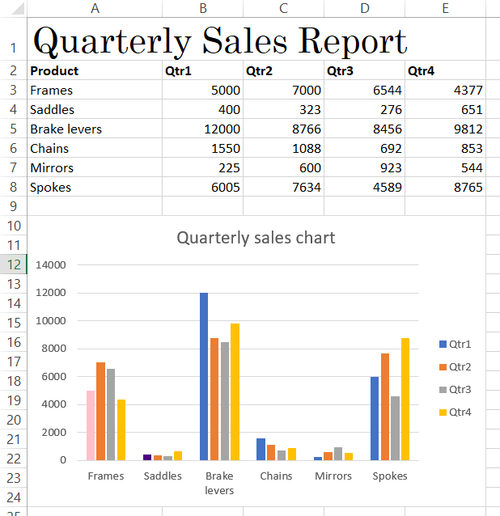
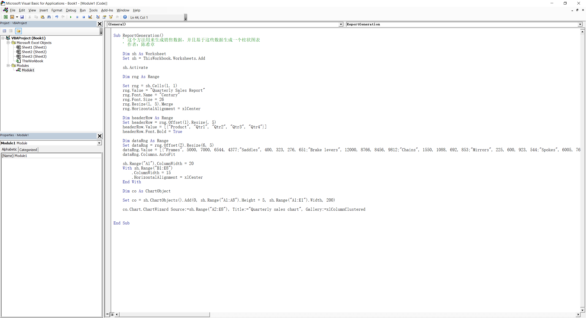
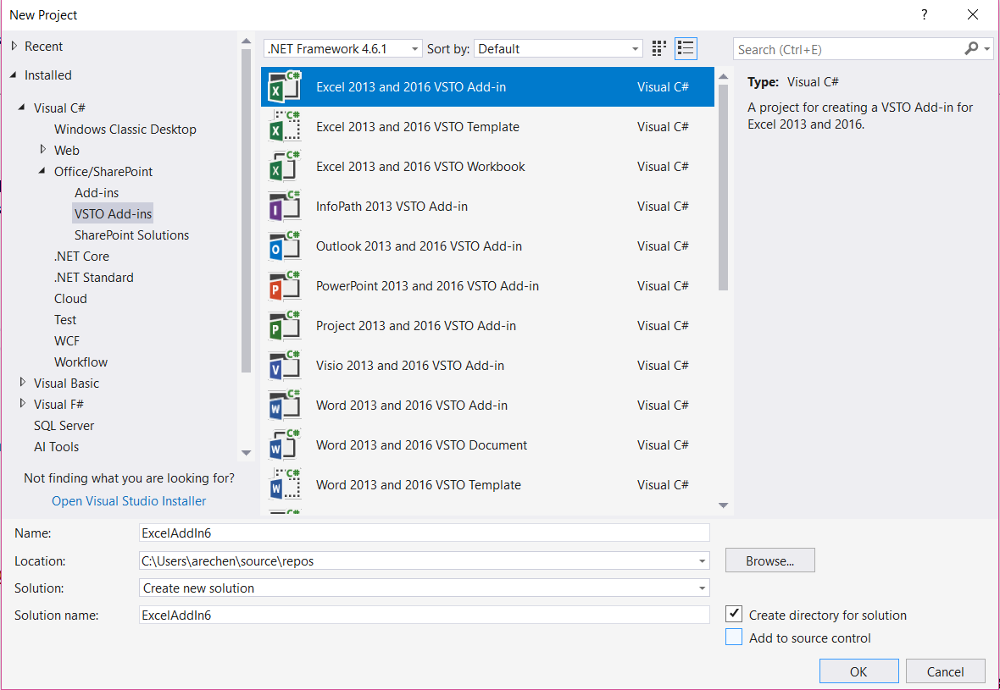
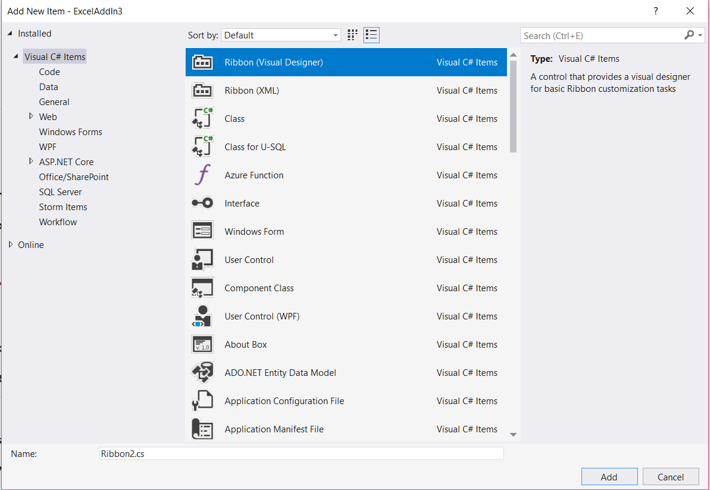
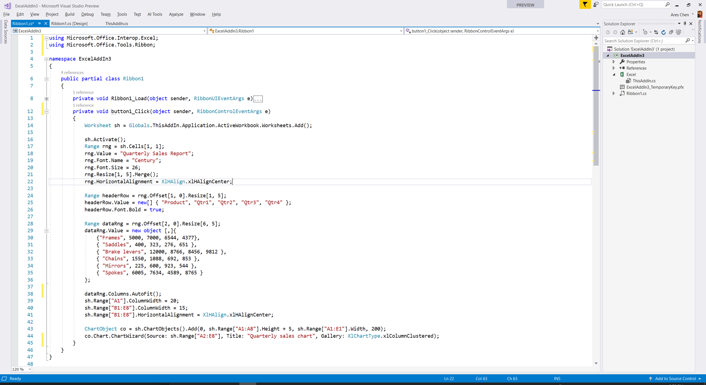
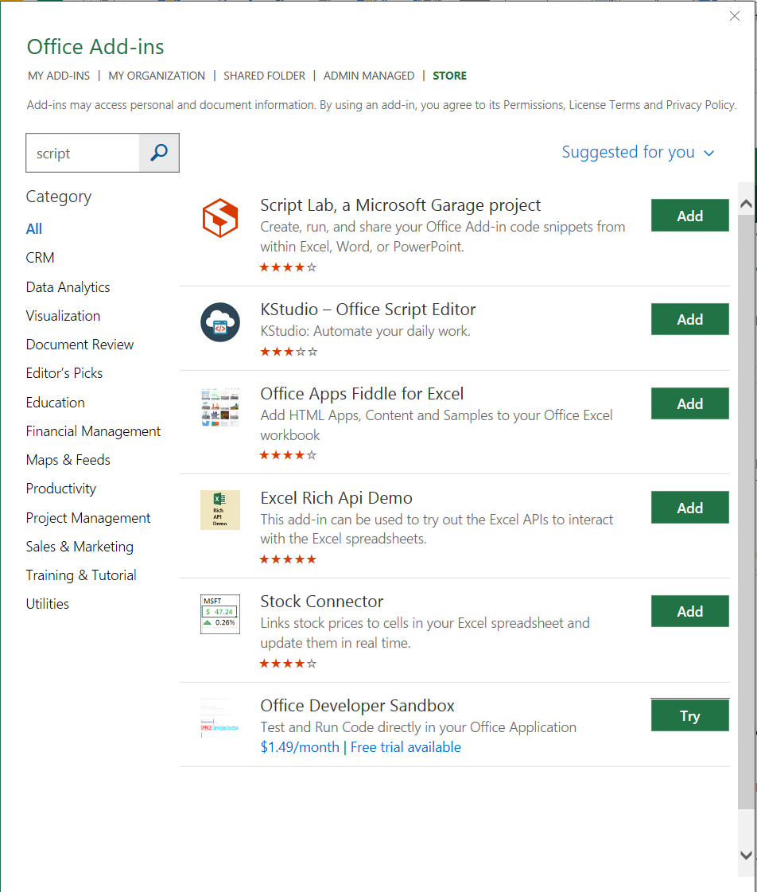
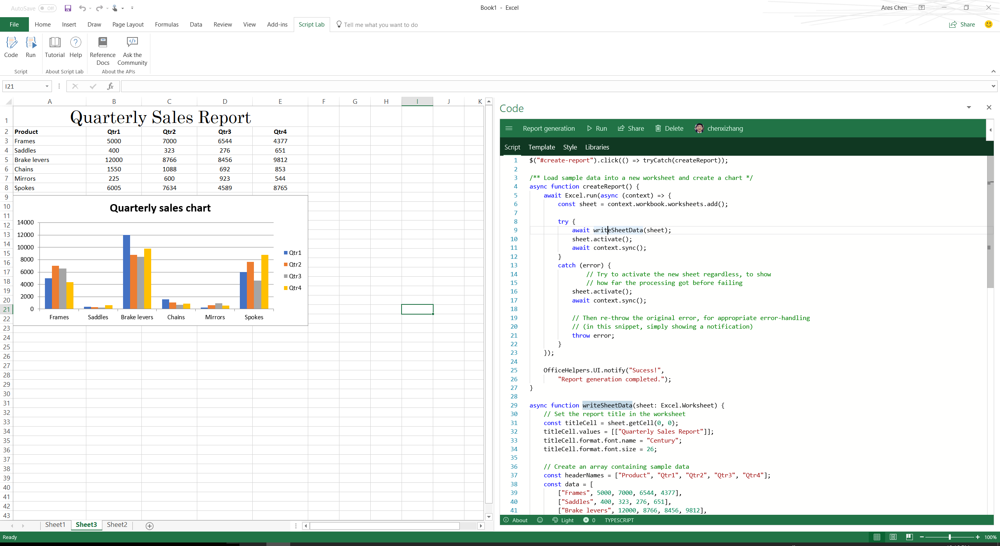

# 实战Excel Add-in的三种玩法
> 作者：陈希章 发表于 2017年11月26日

## 前言
这个系列文章应该有一阵子没有更新了，原因是一如既往的多，但是根本所在是我对于某些章节其实还没有完全想好怎么写，尤其是对于Office Add-in这块 —— 到底是要每个都去单独写一遍，还是有其他什么好的写法会对读者更有帮助？正如我在 [这篇文章](https://www.linkedin.com/pulse/%E6%88%91%E5%88%86%E4%BA%AB%E7%BB%99%E5%A4%A7%E5%AE%B6%E7%9A%84%E4%B8%AA%E4%BA%BA%E5%86%99%E4%BD%9C%E7%BB%8F%E9%AA%8C-%E5%B8%8C%E7%AB%A0-%E9%99%88/?trackingId=oVKlHAByFMtC%2FPtv58IMnw%3D%3D) 分享的一些关于写作的个人经验那样，我为此颇费了一些心思琢磨，直到最近才做出了一个选择：我将不拘泥于每个应用都写一次，而是尝试总结一些共性的操作指南。本文将是一个尝试，以我对于Office Add-in开发的了解，Excel所占的比重相对较高（根据不完全统计，在应用商店所有Office Add-in中，Excel占到40%左右），所以我希望用本文的Excel Add-in的实际案例，给广大的Office Add-in开发人员直观地了解三种不同的开发技术是如何过渡和共存的，以帮助大家做出自己的选择。

> 本文所提到的三种玩法，是指最早的VBA技术，后来的VSTO技术，以及现在更推荐的Web Add-in的技术。如果大家对于这些基本概念以及Office 365的开发还不太熟悉，欢迎阅读我此前写好的 Office 365开发概述和生态环境介绍：[上篇](office365dev-overview-1.md)，[下篇](office365dev-overview-2.md)

## 案例介绍
我一向鼓励在实践中学习。为了演示如何自定义开发，并且比对不同的技术下面实现方式的差异，本文将以下面的一个需求作为案例展开。假设我们需要为Excel增加一项功能，用户点击一个菜单或者按钮后，可以动态生成一些统计数据，并且根据这些数据生成一个柱状图。

## VBA —— 一曲肝肠断，天涯何处觅知音

VBA 是我们最早的一个用来扩展Office 应用程序的技术，由于其简单易用且功能强大，在全世界范围内拥有数以亿计的用户。实现上面提到的这样的需求，其实是VBA很擅长的，尤其是数据如果本身就来自于Excel内部的话。

学习VBA的一个最好起点就是用录制宏。以本案例而言，即便你是VBA的新手，也可以尝试一步一步地输入数据并且生成图表，然后将生成的代码稍作整理和修改后，可能就是下面这样子的。

完整代码可以通过 <https://gist.github.com/chenxizhang/3bc5e940f59f9e30d13cb88e3a6c8a6a> 获取，请在Excel的VBA编辑器中，新建一个模块，然后将这个代码复制进去，最后按下F5运行即可看到效果。

> 2017年12月12日：有读者反馈说这个代码复制到64位版本的Excel中执行会报错。确实是这样的，因为32位和64位在一些数据类型方面有较大差异，以上代码只能在32位版本的Excel中运行。

## VSTO —— 出道即巅峰，从未被超越

VSTO是2005年正式引入的，它带来的好处是可以基于功能强大且已经被证明成功的Microsoft .NET平台进行编程，这意味着你可以使用宇宙最强的Visual Studio进行快速开发，同时使用 .NET Framework 的全部功能，可以访问到任何你想要的资源。VSTO的开发语言有VB.NET和C#两种。

我个人目前用的最多的是C#，以我自己的亲身体会来看，从VBA转到VSTO，短期来说，使用VB.NET可能是最简单的，因为语法绝大部分都是一致的。但长期来看，我还是建议大家学习一下C#这门专门为.NET设计的语言。

Visual Studio 的项目模板非常强大，它会自动生成很多的代码。对于一个VSTO的Add-in来说，我们最常见的做法会为它创建对应的Ribbon工具栏，当用户单击了某个按钮后，再根据当前的上下文进行相关的代码处理。

你可以在Ribbon 的设计器中，添加一个按钮，然后将下面的代码复制到按钮的单击事件中,然后按下F5即可进行调试。

完整代码可以通过<https://gist.github.com/chenxizhang/c249740f63edf8c29d18700fb357474d> 或者 <https://gist.github.com/chenxizhang/e75b849b1d2ef6eab5d742a9c976527d> 获取，前者是VB.NET代码，后者是C#代码。

## Web Add-in —— 向云而生，机遇和挑战共存

Web Add-in是从Office 2013开始支持的新的开发模式，它具有划时代的意义，主要在于利用业界标准的Web开发技术来做Add-in开发，同时具有跨平台和设备的先天优势，集中化部署也降低了运维的复杂性。

不同于VBA到VSTO的平滑过渡，这个新技术对于传统的VBA和VSTO的开发者来说，最大的挑战在于要学习全新的Web开发的技术。Web Add-in包含但不仅限于下面这些主流技术，请大家有一定的心理准备。

1. HTML
2. CSS
3. Javacript
4. Typescript (可选)
5. NodeJS （可选）

前面三个是基础，如果有兴趣学习，我推荐一个不错的网站 <http://w3school.com.cn/>。

后面两个是高级部分，但很可能会成为以后的主流。有兴趣可以通过他们的官方网站进行学习。

我的范例是使用NodeJS来实现的，所以如果要运行范例，则需要先安装好NodeJS的运行环境，请参考 <https://nodejs.org/en/> .

在开发工具这个方面，Visual Studio仍然提供了非常好用的模板，但Visual Studio Code可能是一个更好的选择，尤其是你准备学习和使用基于NodeJS来开发Office Add-in的话。

一下子讲了这么多，是不是已经有点头大了？一个好消息是，我们现在有一个有意思的小插件—— Script lab —— 可以在不离开Excel界面的情况下，快速开始学习Web Add-in的开发。这个插件本身就是一个非常典型的Add-in的范例，是由微软内部开发的，它提供了很多样例代码，可以帮助开发者熟悉全新的基于javascript的对象模型。

只要你拥有Office 365的账号，你就可以免费使用这个插件。具体的操作方式是在顶部的Ribbon工具栏中，找到“Insert”这个选项卡，然后单击里面的“Store”这个按钮，搜索Script lab即可进行安装。

安装成功后，顶部的Ribbon工具栏会多出来一个选项卡“Script Lab”，点击“Code”按钮，然后找到Report generation 这个Sample，如下图所示

你现在无需做任何代码的修改，直接Run就可以看到上图的效果了。

> 请注意，官方提供的这个Report Generation的Sample其实有一个小的代码问题，它在设置图表的数据源时没有把标题行包括进去，我已经修改了这个Sample，有需要可以通过 <https://gist.github.com/chenxizhang/cebfde8cf08c55d54d5cdb336b166cee> 查看，并且导入到你的Sample库中去。

关于在Visual Studio Code中如何开发和测试Office Add-in，微软官方也有一篇文章可以参考：<https://code.visualstudio.com/docs/other/office> 。我这里要告诉大家的好消息是，你用Script lab运行成功的代码，几乎可以原封不动地复制粘贴到Visual Studio Code中去，做成一个真正的Add-in，并且通过你的渠道分发出去。（这些内容我后续还会专门的文章展开讲解）。

## 结语

虽然我做这方面研究已经有相当长时间了，但真正这三个技术放一起对比讨论，却是直到昨天我在与大中华区两个影响力最大的Office中文技术社区（ExcelHome和ExcelPX）的专家朋友们聚会讨论时才首次展示。我用这个作为例子的主要目的，是希望让大家看到技术的发展路线，理解为什么要这么变化，同时并且通过实例让大家更加有信心，虽然学习新东西会遇到一些挑战的，但大家也能清楚地看到，代码的结构、逻辑其实是相通的。说到底，这也是一个程序员的基本素养 —— 我们从来不会停止探索，而因为我们有编程的思维，所以我们毫无畏惧。

关于本次活动，我分享的资料，如有兴趣，也可以通过 [这里](assets/Office技术社区新老朋友见面会-陈希章.pdf) 下载到。