# Excel as a Service —— Excel+Microsoft Graph居然可以这么玩
> 作者：陈希章 发表于 2018年4月10日

## 前言

据不完全统计，全世界使用Excel作为电子表格和数据处理的用户数以十亿计，这不仅得益于它的使用简便，同时还因为它内置了很多强大的函数，结合你的想象力可以编写出各种公式，并可快速根据数据生成图表和透视分析等。另一方面，Excel在整个Office家族中也是拥有开发者最多的一个组件，不管是在客户端的VBA宏和VSTO插件开发，以及在早些年出现在SharePoint Server中的Excel Service（包括用来呈现Excel文件的Web Part，以及一套XML Web Service可供远程调用Excel的功能，包括自定义Excel函数等。

在Office 365的时代，SharePoint Online中已经将Excel Service的功能删除掉了，取而代之的是2016年7月份左右揭开神秘面纱的Microsoft Graph Excel API，融入Microsoft Graph大家族的Excel Service快速迭代，目前它的功能也趋向稳定了。今天我将用一个实例来介绍一下它的奇妙设计和应用场景。

## 范例介绍

设想一下，你用Excel做了一份非常强大的“抵押贷款测算表”，这里面可以通过输入几个参数，使用Excel自带的PMT函数计算每月还款额，据此快速生成一个还款计划，如下图所示：

> PMT 是一个财务函数，用于根据固定付款额和固定利率计算贷款的付款额。有兴趣可以参考 https://support.office.com/zh-cn/article/PMT-%E5%87%BD%E6%95%B0-0214DA64-9A63-4996-BC20-214433FA6441 的帮助。

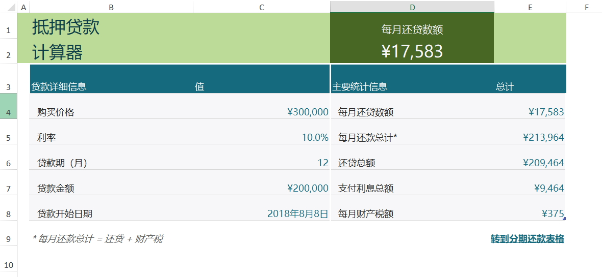

与此同时，你还可以很轻松地生成一个数据列表，和对应的图表，如下图所示

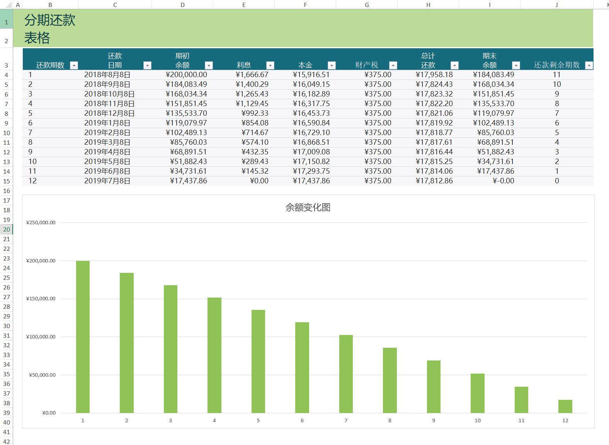

通过改变“购买价格”、“利率”、“贷款期”、“贷款金额”等单元格的数值，Excel会自动计算其他单元格的数值，包括自动刷新图表。这一切对广大的“表哥表姐”来说都是非常熟悉的体验。

那么问题来了：如果你的一个网页中也要实现“抵押贷款测算”的功能，你是不是应该自己去实现一次PMT这种函数的功能呢？我不知道，但我觉得你读了本文后会改变一些想法—— 我们完全可以将这些计算交给Excel Service去做，前端应用直接调用即可。

使用Microsoft Graph中的Excel API，你不仅可以访问工作簿，工作表和单元格、表格和图表等，修改他们的属性和数值，甚至还可以将图表用图片的形式读取过来，一切都在你的掌握之中。接下去用一个范例代码演示这些奇妙的场景。

> Microsoft Graph Excel API的官方文档，请参考 <https://developer.microsoft.com/en-us/graph/docs/api-reference/v1.0/resources/excel>

## 使用Microsoft Graph 获取工作簿和单元格

要使用Micrsosoft Graph Excel API,你只需要将Excel文件放到OneDrive for Business或者SharePoint Online的文档库中即可。例如，我将演示用的文件放在了一个目录中：

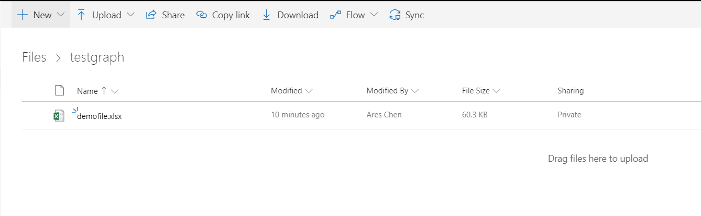

你需要了解一些Microsoft Graph的背景知识，如果你对Microsoft Graph比较陌生，建议你参考我之前的两篇文章

- [Microsoft Graph 概述](/docs/microsoftgraphoverview.md)
- [通过Graph Explorer体验Microsoft Graph](/docs/graphexplorer.md)

本文所采用的方式就是用Graph Explorer这种方式来操作Microsoft Graph Excel API。我的这个文件是在OneDrive for Business 的个人云盘的根目录下面的testgraph目录中，文件名为 demofile.xlsx，所以我可以使用`GET https://graph.microsoft.com/v1.0/me/drive/root:/testgraph/demofile.xlsx:/workbook`获取到这个工作簿

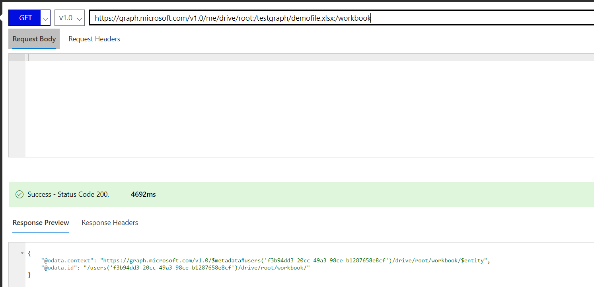

通过 `GET https://graph.microsoft.com/v1.0/me/drive/root:/testgraph/demofile.xlsx:/workbook/worksheets` 可以获取工作簿中所有的工作表信息

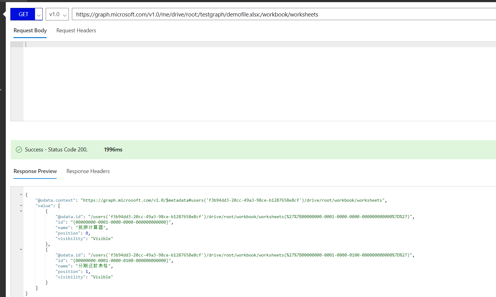

通过 `GET https://graph.microsoft.com/v1.0/me/drive/root:/testgraph/demofile.xlsx:/workbook/worksheets/抵押计算器/range(address='c4')` 可以获取名称为“抵押计算器“的工作表中的C4单元格对象

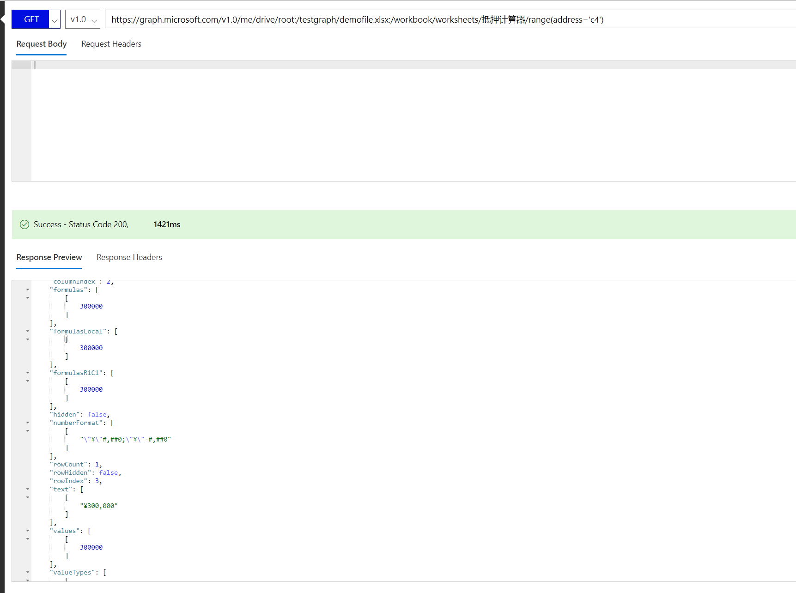

当然，也可以通过名称访问单元格对象，语法是 `GET https://graph.microsoft.com/v1.0/me/drive/root:/testgraph/demofile.xlsx:/workbook/names/每月还贷数额` 这样的

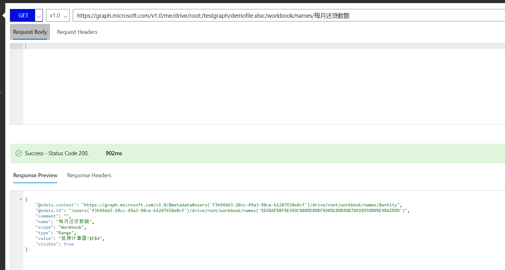

你还可以返回多个单元格的数值，例如下面这样的查询 `GET https://graph.microsoft.com/v1.0/me/drive/root:/testgraph/demofile.xlsx:/workbook/worksheets/抵押计算器/range(address='c4:c6')/values`

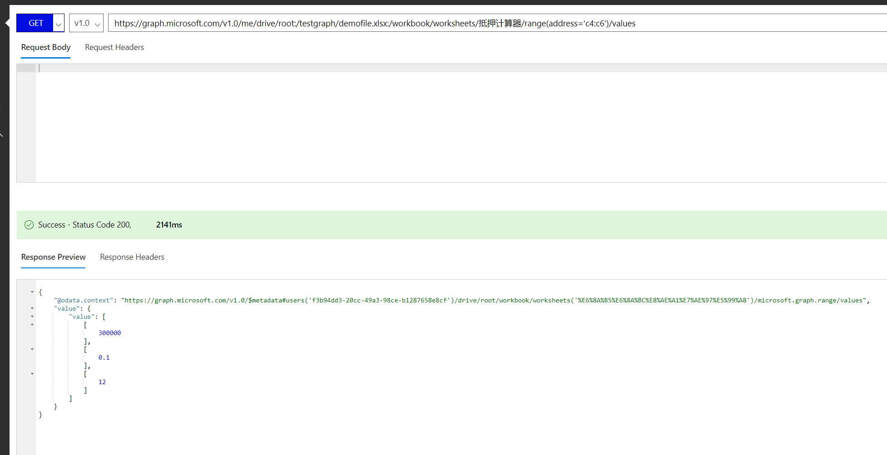

## 更新单元格内容

上一节我用几种不同的语法展示了如何获取工作簿、工作表和单元格（包括直接查询它的数值），那么如果我们希望能修改某个单元格的数值，应该怎么做呢？下面的例子演示了如何将名称为“抵押计算器“的工作表中的C4的数值修改为一个新的值，例如400000.

需要注意的是，查询数据我们一般用的API请求方法是GET，而修改数据则需要用到的请求方法是PATCH。为了实现上面所提到的单元格修改需求，我们要执行的查询是 `PATCH https://graph.microsoft.com/v1.0/me/drive/root:/testgraph/demofile.xlsx:/workbook/worksheets/抵押计算器/range(address='c4')`,与此同时，还需要提供新的数值。

```
{
     values:[[400000]]
}

```
> PATCH方法可以对目标对象执行局部更新。上面的代码我们只提供了Values这个属性集合，但其实还可以增加其他的属性，来达到一次修改多个属性的目的。

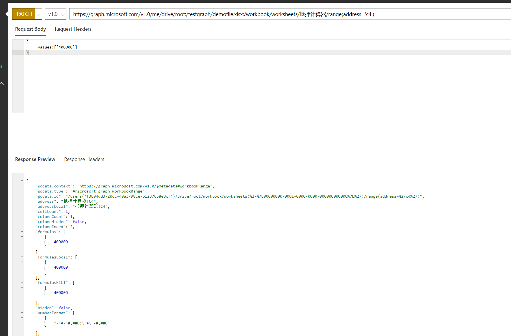

执行成功后，你可以发现C4的数值已经变成了400000。

> 这里我埋了一个伏笔，如果你在程序中用如上的方式修改了某个单元格(A)的数值，然后去获取另外一个单元格（B）的值，假设B跟A是有公式的关系，你可能期望的是B的值也会立即刷新。但事实上，它不会。这里涉及到一些相对复杂的概念，就是Excel API有两种访问的模式，我们现在用的这种，是所谓的“非持久化会话模式”，一般用来查询数据，或者修改后不保存，所以在下一次查询的时候，其实你获取的还是旧值。 关于如何创建持久会话，并且在多个查询中共用它，请参考 <https://developer.microsoft.com/en-us/graph/docs/api-reference/v1.0/api/workbook_createsession> 的详细说明。

## 获取工作表中的图表

我们已经知道了如何访问工作簿的单元格，以及如何更新它们的数值，这已经可以让我们轻松实现很多业务场景了：你可以在Excel中做好很多复杂的公式，设计数据之间的关系，然后通过API修改某些单元格的值，然后去获取其他单元格的值，看起来你的应用具有了类似Excel那样神奇的功能，但其实所有的事情都还是Excel在默默地为你服务，你所做的只是调用一两次接口而已。

接下来还要演示一个有意思的场景是将工作表中的图表用图片的形式提取出来，这个场景特别适合于我们已经经过了数据的处理，然后希望将图表展现在前端的应用中。Excel API可以将一个图表以一个Base64字符串的形式返回，客户端可以利用这个进行图片展现。

听起来很玄的事情，其实也只是一个GET请求而已 `GET https://graph.microsoft.com/v1.0/me/drive/root:/testgraph/demofile.xlsx:/workbook/worksheets/分期还款表格/charts/图表 1/image`

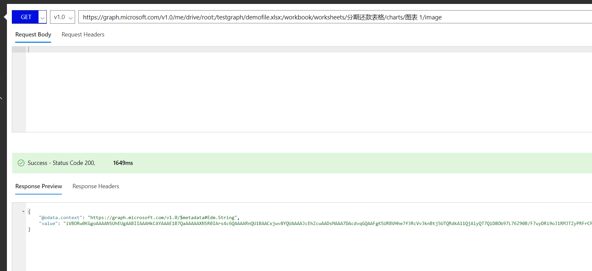

接口返回的结果是一串很长很长的字符串，你肯定是看不懂的。你要做的是将这个字符串复制出来，然后随便用一个文本编辑器，新建一个文件，然后填入如下的内容

```
</img>

```

接下来将这个保存为一个html文件，然后在浏览器中打开它。你是不是觉得下面这个图表似曾相识呢，恭喜你答对了，其实这个图表就是之前Excel文件中的那一个呀。

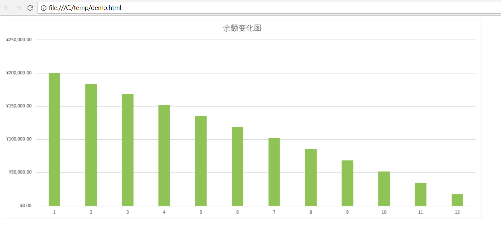

## 结语

我在很多场合都分享过Office 365 平台化的能力和开发场景，Microsoft Graph在其中起到了关键作用，而今天给大家展示的Excel API则将这一点表现的淋漓尽致，而且毫无疑问，我这里演示的只是一些皮毛，更多有意思的场景，还等待着你的发现呢。
