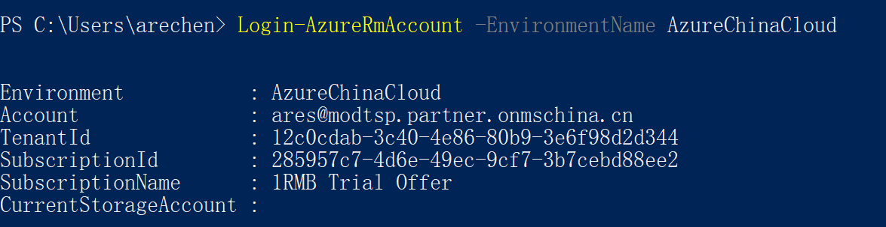

# 如何通过PowerShell获取Office 365 TenantID

>作者：陈希章 发表于2017年5月31日

## 安装Azure Powershell 模块

Installing the Azure PowerShell Service Management module
<https://docs.microsoft.com/en-us/powershell/azure/install-azure-ps?view=azuresmps-3.7.0>

## 使用Login-AzureRMAccount 命令查询Office 365 TenantID

如果是国际版，直接在PowerShell中输入Login-AzureRMAccount即可

如果是中国版，请输入 Login-AzureRmAccount -EnvironmentName AzureChinaCloud 

这个命令，会弹出一个对话框要求你输入用户凭据，正确地输入用户名和密码后，会显示如下的结果

