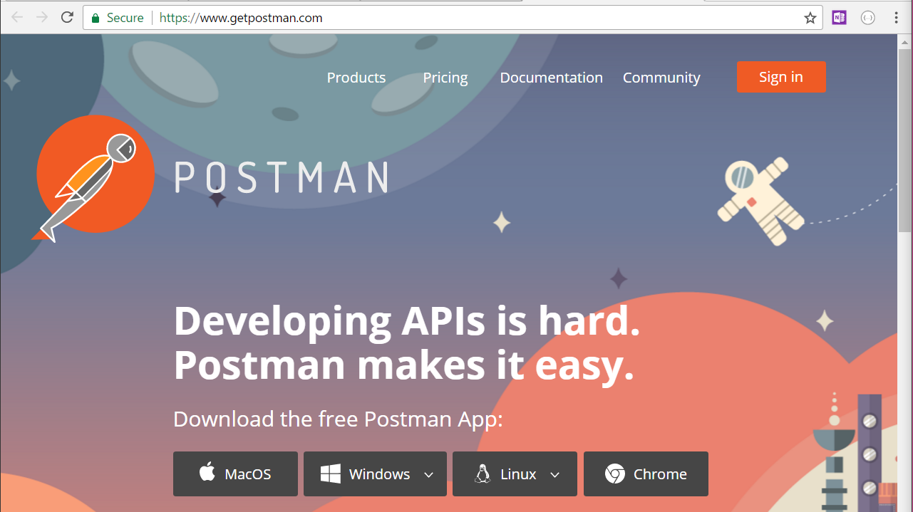
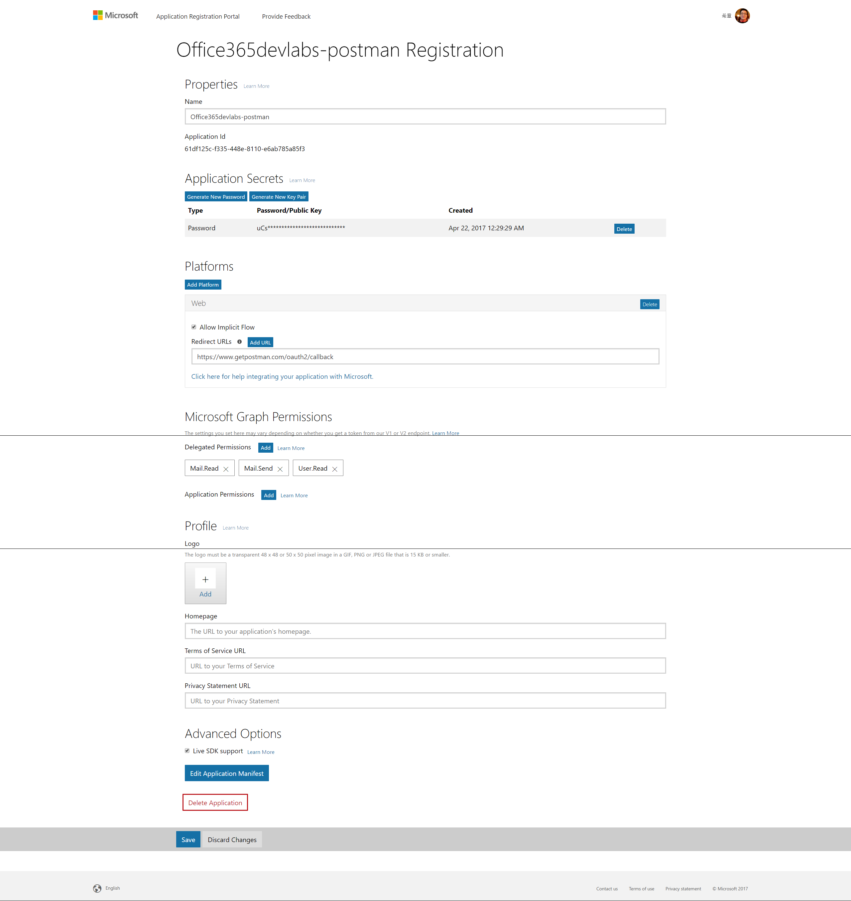
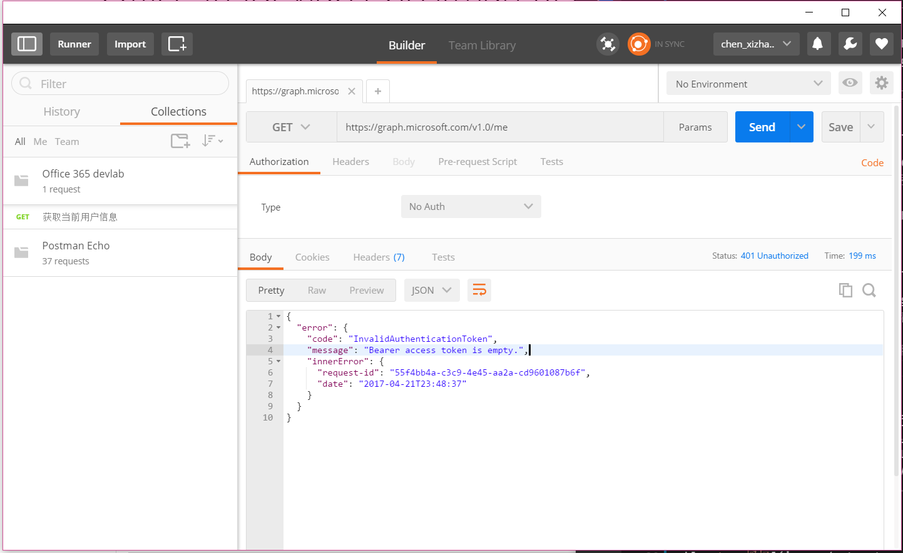
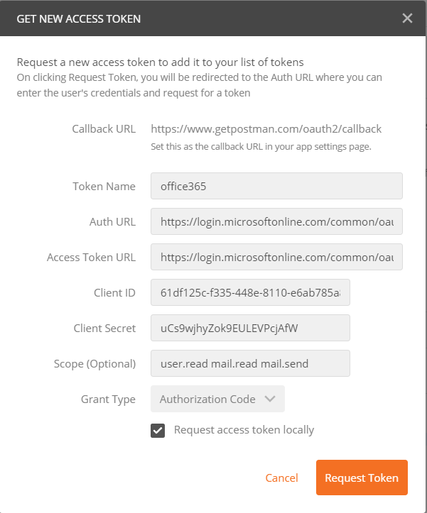
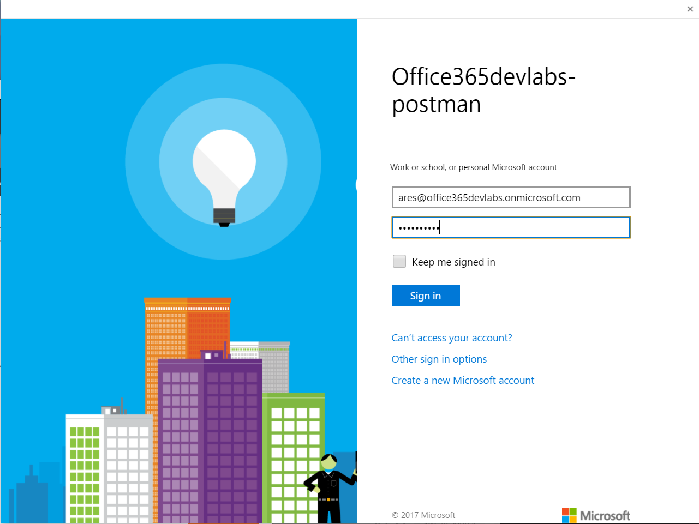
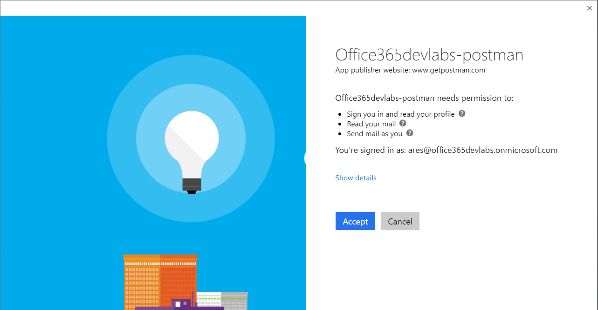
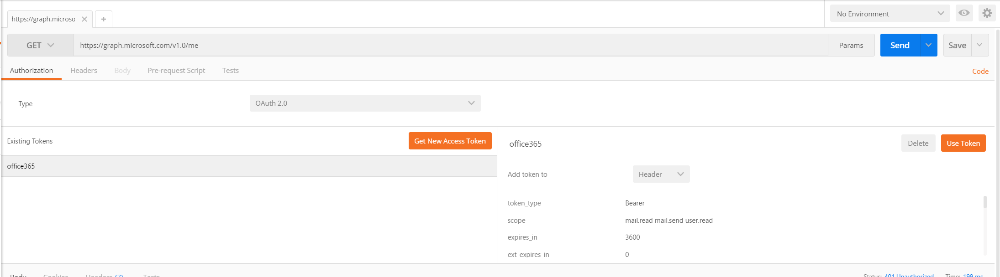
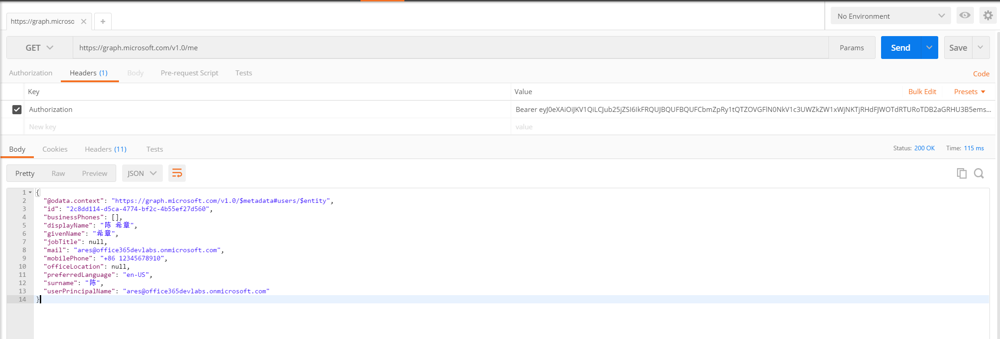
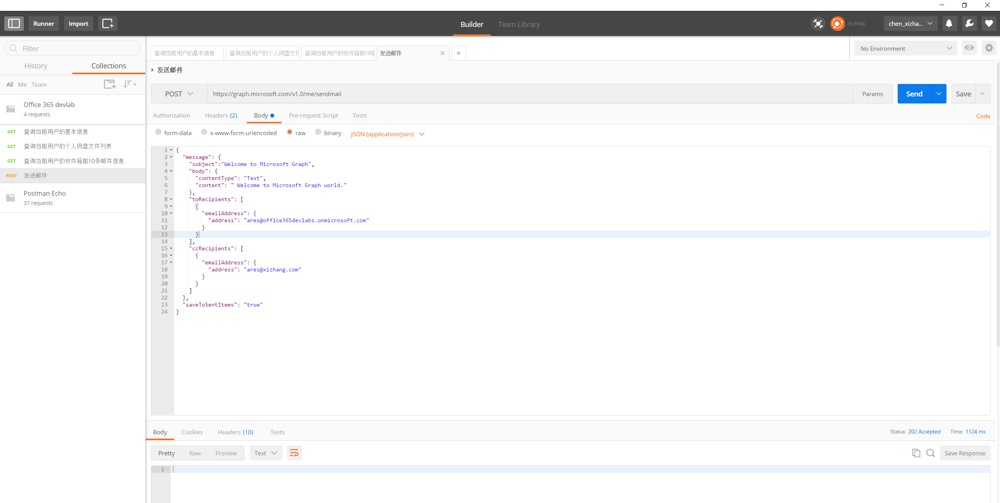
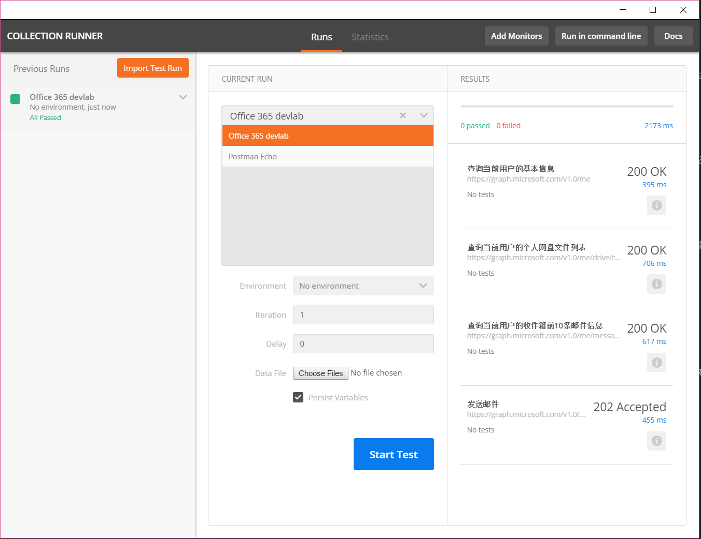

# 通过其他第三方工具体验Micrsooft Graph

[上一篇](graphexplorer.md)文章我介绍了如何利用官方提供的Graph 浏览器快速体验Microsoft Graph强大功能，这是极好的起点。官方的Graph浏览器力图用最简单的方式帮助您使用Microsoft Graph，为此也隐藏了很多细节。为了帮助大家更好地理解Microsoft Graph的工作原理，例如要使用Microsoft Graph需要进行应用改程序注册，OAuth的过程以及Token传递的方式等，我专门再写一篇，介绍如何通过其他第三方工具来体验Microsoft Graph。

我们可以在网络上找到很多进行REST API调用和测试的工具，这一篇我给大家演示的是一款叫POSTMAN的工具。它的官方主页在 <https://www.getpostman.com/>,提供了针对MacOS,Windows,Linux的版本，也提供了Chrome的插件，你可以按需下载。
> POSTMAN 有免费版和专业版，就本文的需求来说，免费版就够用了。



为了能通过POSTMAN来调用Microsoft Graph，我们必须按照[Microsoft Graph概述](microsoftgraphoverview.md)中介绍的三部曲，首先要注册一个应用程序。

## 注册应用程序

我会有专门的文章来讲解注册应用程序的细节，本文将演示一个注册好的应用程序，如果你不想自己注册，也可以用我的信息进行测试。



你可以通过Microsoft 账号登录<https://apps.dev.microsoft.com/#/>, 注册一个应用程序，需要提供名称，并且声称一个秘钥，然后制定对应的平台，申请必要的权限。

## 发起POSTMAN请求

打开POSTMAN，默认情况下，如果去调用Microsoft Graph，因为没有提供身份，会返回如下的错误信息



这很容易理解，我们接下来要做就是为POSTMAN添加OAuth的认证。选择上图中"Authorization"这个选项卡中的Type为“OAuth 2.0", 然后点击“Get New Access Token"按钮，在弹出的对话框中填写你注册好的应用程序信息。



如果你在此前的注册应用程序中遇到障碍，请直接使用我准备好的测试应用程序信息：

```
Auth URL: https://login.microsoftonline.com/common/oauth2/v2.0/authorize
Access Token URL: https://login.microsoftonline.com/common/oauth2/v2.0/token
ClinetID: 61df125c-f335-448e-8110-e6ab785a85f3
Client Secret: uCs9wjhyZok9EULEVPcjAfW
Scope: user.read mail.read mail.send

```

点击上图中的“Request Token”按钮，POSTMAN会弹出跳转到Microsoft Graph的认证页面，此时你可以输入Office 365的账号信息。



如果你输入了合法的账号信息，接下来应用程序将会请求你的授权



点击上图中的“Accept”按钮，正常情况下会关闭所有弹出的窗口，并且返回到POSTMAN的主界面，你现在就可以查看到当前申请得到的访问凭据(Access Token)了。

> 这里特别提一下，我发现有时候同样的操作却不能成功，可能受到一些网络方面的干扰因素吧，请大家遇到这种情况的话，耐心地重试一两次。



点击最右侧的“Use Token"按钮，可以将Access Token插入到当前的请求中去，注意观察“Headers”这个选项卡的变化 (Authorization:Bearer xxxxxxxxx)，然后点击“Send”按钮，我们就可以顺利地完成当前的Microsoft Graph调用了。

>请注意确保“Add token to” 这里选择“Header”



看起来不错吧？你是不是会说，这看起来也跟Graph 浏览器差别不大啊。是的，到目前为止，这都属于最基本的操作，接下来我介绍一下POSTMAN的一些亮点功能。

1. 保存请求
2. 对请求进行测试

## 保存请求
这是首先吸引我的功能，也是很自然的需求：如果能把上面的请求设置保存起来，那么下一次我就可以直接使用而不需要重复地去输入了。

点击上图中的最右侧的“Save”按钮，然后在弹出的对话框中输入Request Name等信息即可。


在保存请求的时候，我们还可以将其归类到一个集合（collection）中去。（如果你还没有创建集合，则可以选择创建一个新的集合）

我这里将几个常见的请求保存成了一个Office 365 devlab的集合，如下图所示 




## 对请求进行测试

POSTMAN还有一个较有意思的功能，就是支持对一个集合的请求进行测试。点击上图左上角的“Runner”，在弹出的窗口中选择一个保存好的collection，进行一些简单的参数设置后，点击“Start Test”按钮，它会依次发起集合中的请求，并且将返回结果一一显示。



> POSTMAN 还有命令行工具，可以便于脚本化进行测试，限于篇幅本文就不做展开了。

POSTMAN的专业版还有一些高级功能，例如团队协作之类的，有兴趣的朋友可以自行尝试。

## 结语
POSTMAN是一个不错的第三方工具，在同类的REST API 客户端工具中的优势在于图形化界面比较友好，而且对OAuth的强大支持，同时它还可以保存请求并且进行批量测试，这将为我们体验Micrsooft Graph打开一扇方便之门，并且也有助于更好地理解Microsoft Graph的工作原理。
