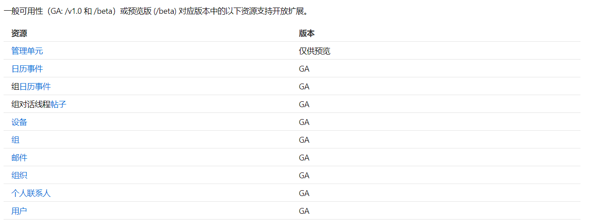
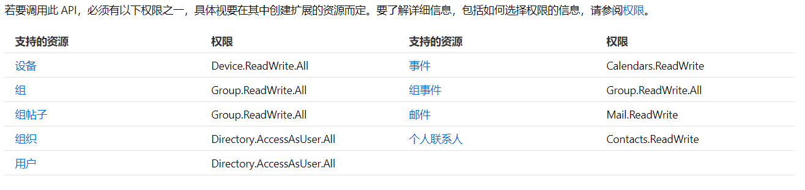
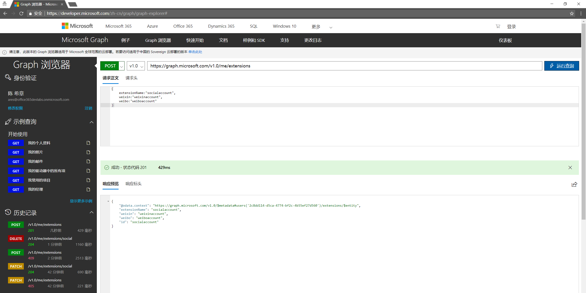
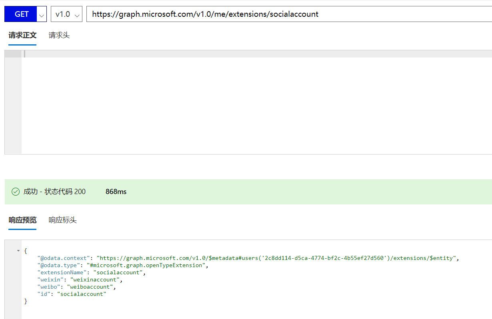
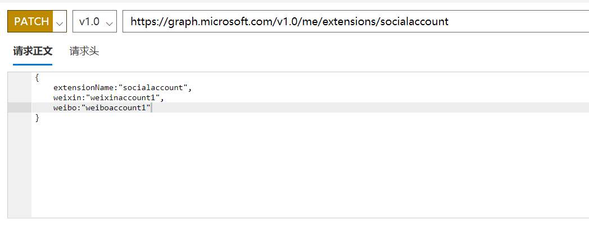
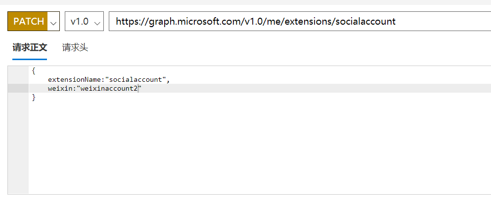
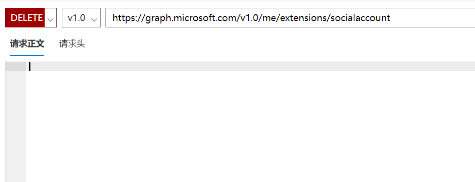
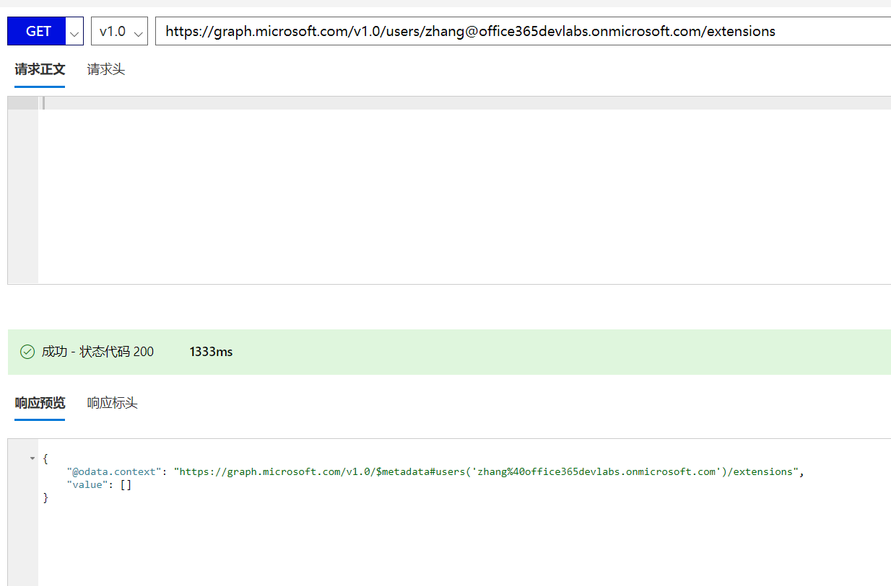
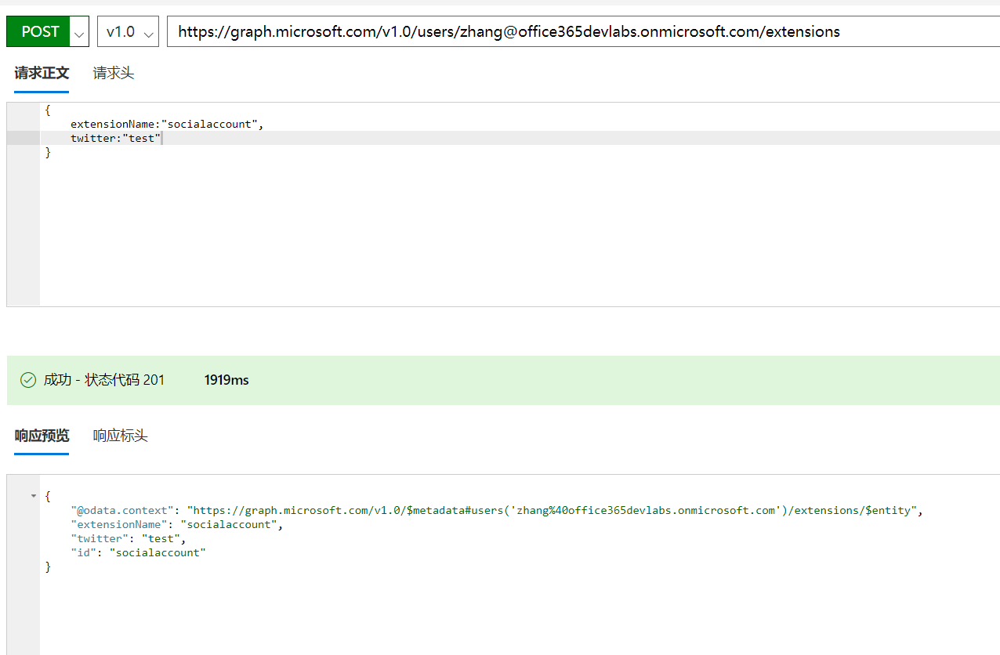

# 扩展Microsoft Graph数据结构（开放扩展）
> 作者：陈希章 发表于 2018年1月2日

## 前言

Microsoft Graph是一张拥有巨大价值的网络，它定义了包括Office 365在内的资源的实体及其关系，它的价值体现在，随着用户积累的数据越来越多，经过授权的应用程序可以在这些数据的基础上得到很多有价值的信息，并且帮助用户更好地完成工作。

Microsoft Graph也是Office 365从单纯的SaaS平台向PaaS平台（Office 365 as a Platform）发展的一个非常重要的基石。既然是一个平台，那么就自然会带来另外一个问题，如果我们有大量的应用是基于Microsoft Graph构建的，而这些应用或多或少是希望保存一些自定义数据的（例如用户的个性化信息），那么这些信息是保存在哪里比较合适？进一步来说，有没有可能在不同的应用之间共享数据呢？

Microsoft Graph通过两种方式来实现这个需求：应用程序可以将自定义数据存放在Graph里面（当然你无需知道具体怎么存)，这些数据会一直跟随着目标的对象（例如用户，组等）。这从一方面降低了应用开发的复杂性，也无需承担自行维护这些数据的风险和成本，同时又为在Graph中为不同应用实现数据共享提供了支持。

这两种方式是“开放扩展”和“架构扩展”，前者更加简单，后者则更加强大。下面我分别来展开说明。

## 开放扩展

关于开放扩展的官方文档，请参考 <https://developer.microsoft.com/zh-cn/graph/docs/api-reference/v1.0/resources/opentypeextension>，本文带领大家入门，如果想要详细了解各种对象如何自定义扩展，则请参考官方文档。目前下面的对象支持开放扩展。

如果需要调用这个接口，则需要确保授予如下的权限（这些权限是针对创建，更新，删除操作，如果是读取则会略低一些）：

下面我用实例介绍一下，如何为“用户对象”定义一个开放扩展，以便保存用户的“社交网络账号信息”。

首先，我们可以通过Post方法，为当前用户创建一个开放扩展（socialaccount），并且添加微信和微博的账号，如下图所示

然后就可以通过Get方法来读取这些属性了，如下图所示

如果要对属性进行修改，则试用PATCH方法，值得注意的是此时可以针对单个属性修改，例如

或者

最后，如果要删除这个开放式扩展，则试用DELETE方法即可。

看起来很方便吧，但需要注意的是，开放扩展是针对单个对象的，就好比上面的例子，我虽然给自己这个用户对象，扩展了一个socialaccount的属性集（里面有两个属性），但是其他用户并不会自动拥有这个扩展。

而且有意思的是，你可以给其他用户也定义开放扩展，但不要求数据格式一样。如下图，虽然我也是给 `zhang@office365devlabs.onmicrosoft.com` 这个用户定义了一个socialaccount的属性集，但我并没有为其提供微信和微博的账号信息，而是提供了twitter信息。

这种架构是允许的，究其根本原因，是因为开放扩展是针对单个对象的。这种设计带来了灵活性，但也会有一些潜在的问题，例如如果我不知道 `zhang@office365devlabs.onmicrosoft.com` 并没有定义微信的属性，然后去读取的话就可以会报错。

如果我们希望为某一类对象定义一个统一的扩展，就是让所有的对象实例都拥有一套统一的扩展属性集，则需要使用架构扩展。

## 结语

本文介绍了使用开放扩展的机制，在Microsoft Graph的资源上面进行数据扩展，以实现应用程序自身的数据保存。

我将在下一篇介绍另外一种扩展方式：架构扩展。