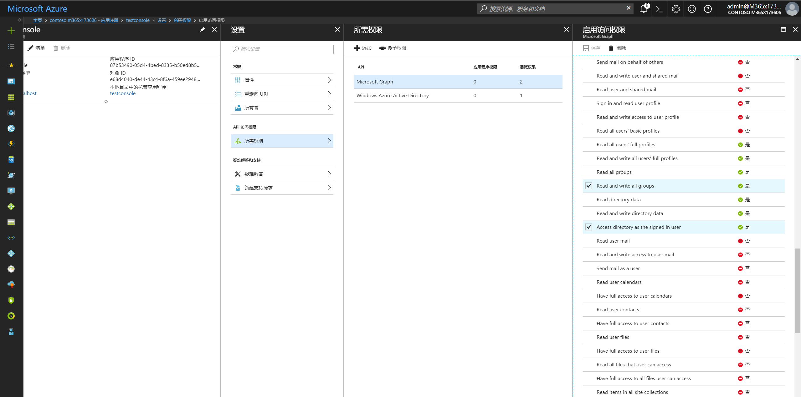
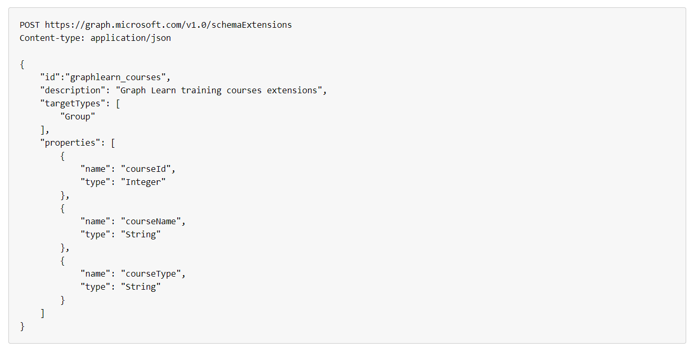
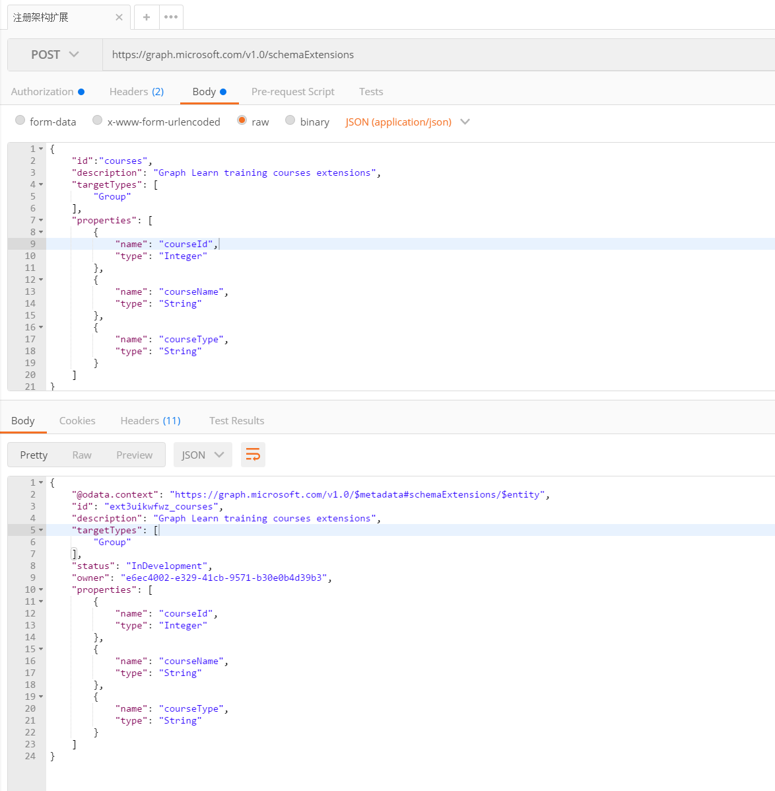
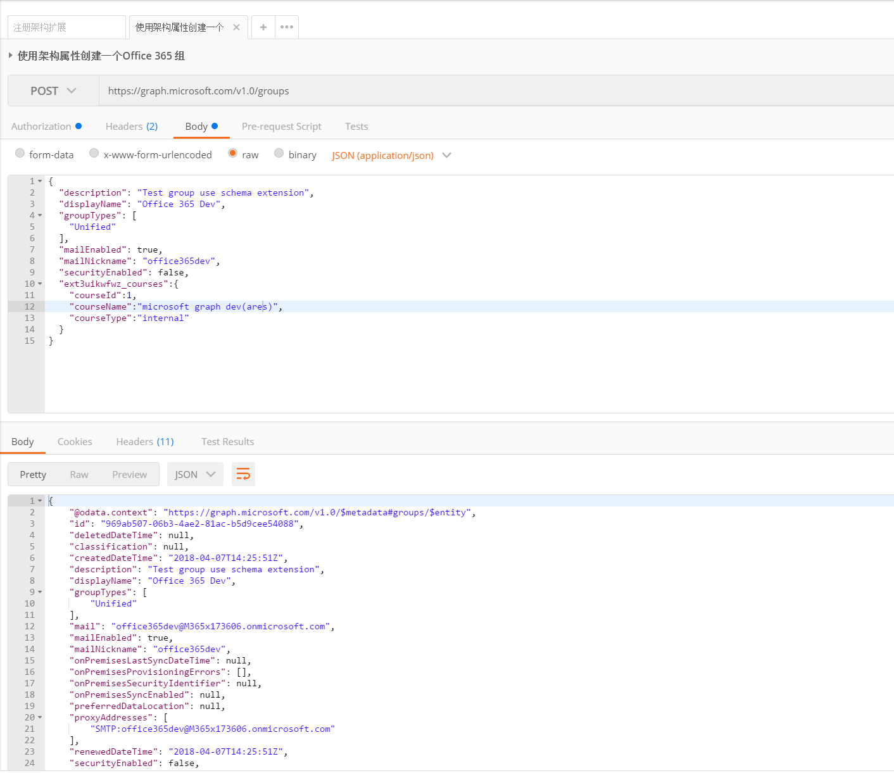
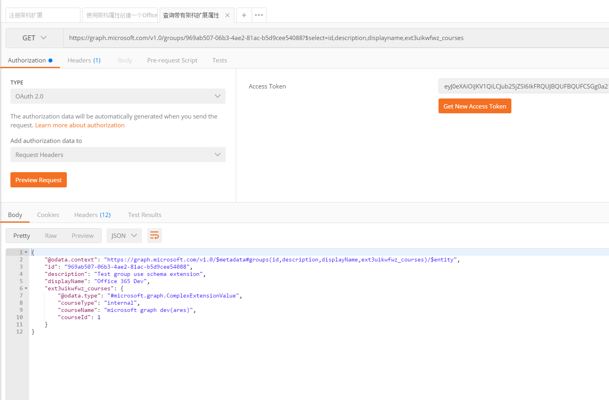

# 扩展Microsoft Graph数据结构 - 架构扩展
> 作者：陈希章 发表于 2018年4月7日

## 前言

此前我有一篇 [文章](graphextensions.md) 讲解了Microsoft Graph的一种数据扩展技术—— 开发扩展(Open Extensions)，它可以实现在支持的对象（例如用户，组等）上面附加任意的数据。但开放扩展的问题在于，它是基于某个具体对象的，你无法确定两个对象是否具有同样的扩展（即便属性名一样，但也可能其包含的数据完全不同）。如果我们需要对一类对象进行统一的扩展，例如给组（Group）这个类型添加几个特殊的属性，此时就可以用到`架构扩展`这个非常强大的技术。

关于架构扩展，官方的文档请参考 <https://developer.microsoft.com/en-us/graph/docs/concepts/extensibility_schema_groups>。

## 支持的类型

目前支持进行架构扩展的Microsoft Graph类型有如下几个

1. contact
1. device
1. event on a user or Office 365 group calendar
1. post of an Office 365 group
1. group
1. message
1. organization
1. user

## 权限要求

要注册架构扩展，必须使用Office 365的企业或学校账号管理员身份，而且必须申请 Directory.AccessAsUser.All 这个权限（仅支持委派权限）。目前不支持在Microsoft Graph Explorer中进行操作，所以本文为了演示方便，已经注册了一个Azure AD 应用程序，如下图所示

同时，由于Directory.AccessAsUser.All 这个权限是管理员权限，所以还必须执行“管理员确认（admin consent）”的过程，这个倒也不难，你可以在浏览器中访问如下的地址即可

https://login.microsoftonline.com/common/adminconsent?client_id=`87b53490-05d4-4bed-8335-b50ed8b56130`&state=`12345`&redirect_uri=`http://localhost`

## 注册架构扩展

注册架构扩展的命令其实很简单，如果你用REST API的话，参考下面的范例执行即可

这里的关键属性是id。目前支持两种定义id的方式，如果你的Office 365 租户中注册了自定义域名（例如 contoso.com），那么你可以用 `域名_扩展名` 这样的格式来定义id（上图的例子就是这样的），如果你没有自定义域名，你可以直接用 `扩展名` 这样的格式，例如 `myextension`。但为了进行区分，在你保存的时候，系统会自动地加上一个随机的前缀，它的格式是`ext+八位随机字符_扩展名`，例如`extsjar451r_myextension`。所以，前者要求略高一些，但对于后期使用更加方便一些；而后者因为id是随机产生的，所以在使用过程会复杂一些。你可以根据自己的实际情况选择。

下图是我在Postman中注册一个新的架构扩展的效果

## 使用架构扩展数据

我们已经拥有了一个新的架构扩展，接下来如何使用它呢？我同样用Postman来演示创建一个新的Group对象，请注意，我除了提供标准的属性外，还按照架构扩展的属性定义提供了额外的信息。

你可能会发现，返回的结果中并没有显示出来我们添加的扩展属性。如果需要查询这些额外的属性，你需要使用select关键字来指定返回值，如下图所示。

## 结语

这一篇文章通过一个实例演示了使用`架构扩展`的技术为Microsoft Graph 的数据结构进行扩展，它跟`开放扩展`不同的地方在于，它可以为一类对象统一进行扩展，而不是针对单个对象，灵活地搭配使用这两种技术，可以让你充分利用Microsoft Graph，并且为其注入更多的数据，为后续的集成提供更多的可能性。

