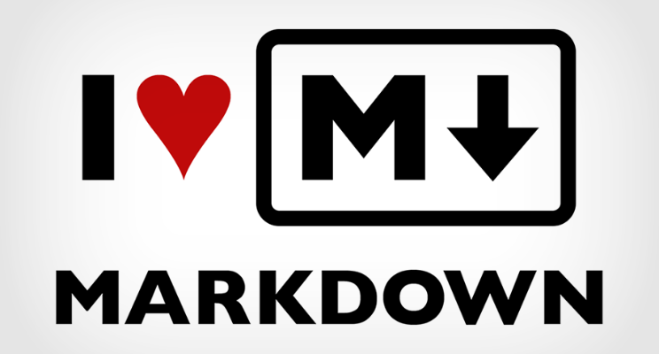
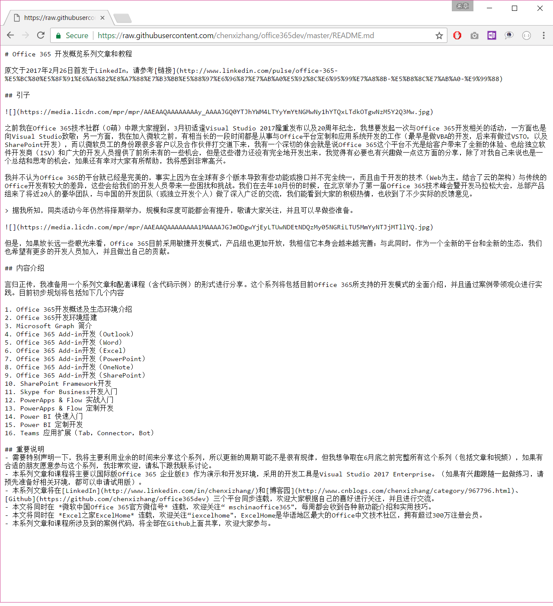
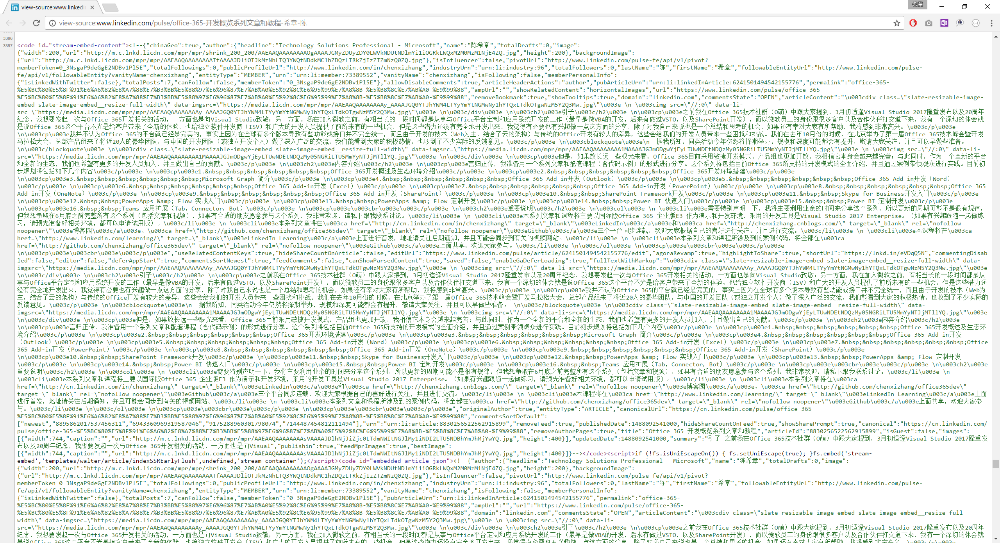
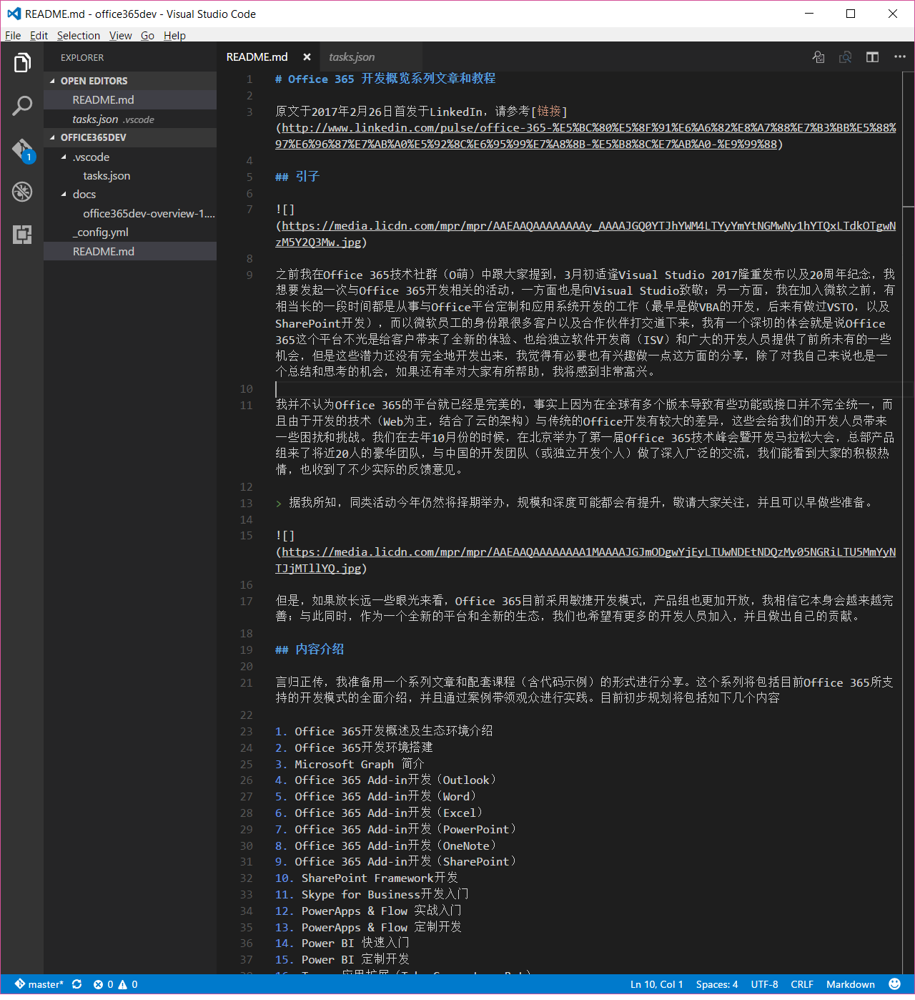

# 学习一点Markdown的基本知识
> 本文于2017年3月18日首发于LinkedIn，请参考[链接](http://www.linkedin.com/pulse/%E5%AD%A6%E4%B9%A0%E4%B8%80%E7%82%B9markdown%E7%9A%84%E5%9F%BA%E6%9C%AC%E7%9F%A5%E8%AF%86-%E5%B8%8C%E7%AB%A0-%E9%99%88?published=t)

这个世界的进步是由一些“懒”的人推动的。今天讲的这个Markdown，其实也是因为一批厌倦了HTML的各种标签的语法，并且希望用更加简单语法来编写HTML文档的程序员想出来的。

Markdown的愿景是： HTML文档应该长成什么样，就应该怎么编写。所以实际上他要解决的问题是所见即所得，用文本编写HTML文档的问题。这听起来有点夸张，或者对于没有用过的朋友来说，可能是很难理解的。那么，我们对照一下下面两张图。

下面这一张图，是用Markdown语法编辑的“Office 365开发概览系列文章和教程”。

如果同样的事情， 使用标准的HTML语法来编写，则可能是下面这个样子的。

Markdown并不是用来取代HTML的，事实上，它的后缀名为MD的文件并不能直接显示在浏览器中，而是需要经过特殊的解析，转换为最终的HTML才能显示。

但是，它解决了一个很大的问题，就是编写HTML页面的难度——我们可以不借助任何复杂的编辑器，使用记事本的方式，实现所见即所得的网页编写体验。

Markdown定义了一些自己特定的标签，来映射到HTML中的语义。但它的标签常用的加起来不超过10个，非常容易上手，以及使用。

如果你有兴趣阅读官方的说明，请参考 http://daringfireball.net/projects/markdown/syntax

但是，我建议你直接看一下中文的版本（下面的链接是我认为最好的一个入门材料），快速了解一下即可

http://wowubuntu.com/markdown/#list

有了这些概念之后，最后我给大家介绍几块常见的Markdown的编辑器。注意，我前面提到过了，其实编写Markdown并不需要特定的编辑器，直接用记事本就可以了（如果用Notepad++，还可以实现代码高亮等功能），如果我就是编写一个简单的文件，我用记事本就可以了。但如果我想编写很多文章（而且文章内容都比较多的话），而且我希望在本地可以进行预览，以及可以结合Github进行版本的管理，我更加倾向于使用Visual Studio Code这块跨平台的轻量级代码编辑器。

我正在撰写的一个系列文章，除了发布在LinkedIn上面外，将同步发布到Github和cnblogs上面，后者都是支持Markdown的，所以我在Visual Studio Code建立一个项目，看起来的效果像上图所示。

如果想要较为深入地学习在Visual Studio Code中使用Markdown，请参考 https://code.visualstudio.com/Docs/languages/markdown