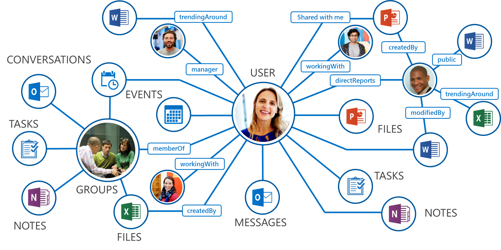
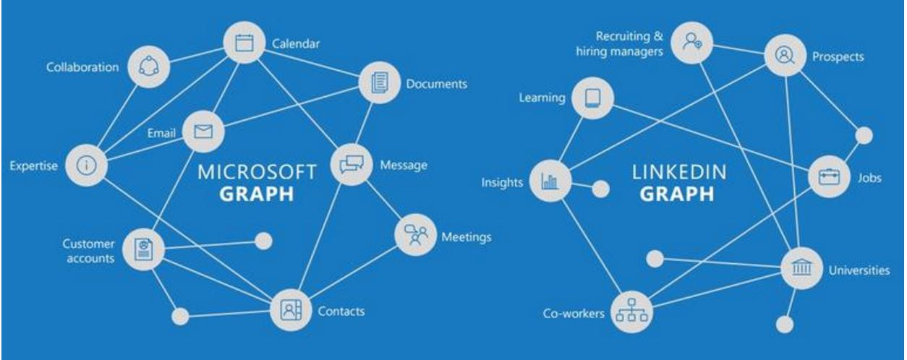
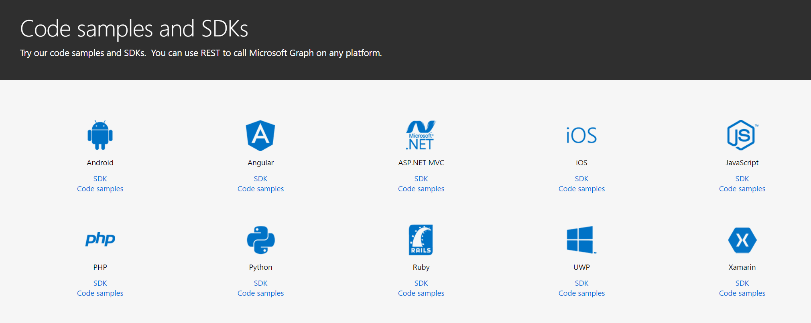
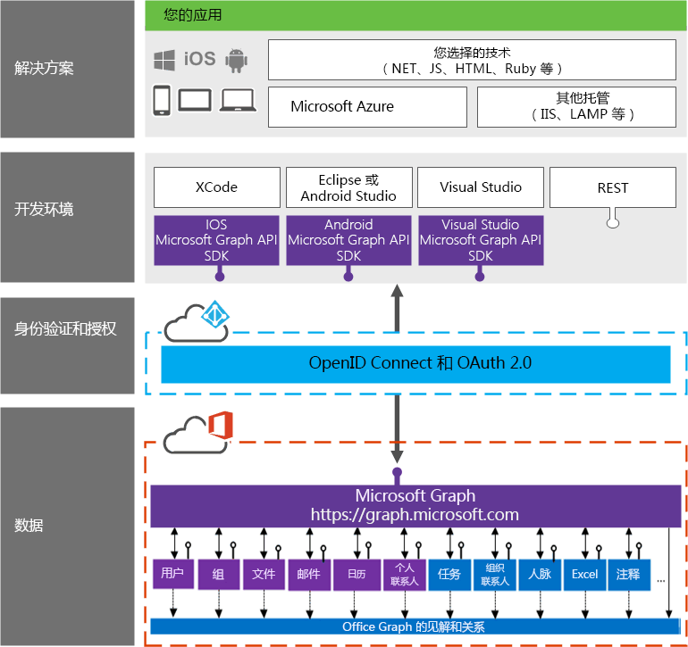

# Microsoft Graph 概述

这个[系列文章](../readme.md) 已经进行到了实质的阶段，继[上一篇](office365devenv.md)介绍了如何搭建Office 365开发环境之后，我会通过这篇文章给大家介绍一个非常重要的概念：Microsoft Graph。它之所以重要，首先是因为它是未来Office 365对外的统一接口（甚至可以说是未来微软的云服务的对外统一接口），其次，Microsoft Graph对于不少Office 365开发人员来说是一个需要先跨过的门槛，这个关过去了，后续进行针对性的开发（Office Add-in，SharePoint Add-in，Office 365 Connector等）才更加得心应手。

> Microsoft Graph的官方主页在https://developer.microsoft.com/zh-cn/graph/ 在这里也可以找到很多文章。

简单地说，Microsoft Graph是一套接口。它的名字经过了几次改变最终确定为Microsoft Graph，我想大致上是因为产品组确实将其定位于日后微软的云服务对外的统一接口层。Graph这个单词初看容易让人误会，但实际上学过算法的同学应该都知道这是指“图”的意思，而不是图片。

目前Microsoft Graph包含的实体主要有用户，文档，邮件，消息，日历，会议，联系人等等，而且每月都有新的功能在加入进来或者被改进。

> 目前Microsoft Graph对外的稳定版本是v1 .0，但同时还有一个在不断更新的beta版本。他们的访问地址略有不同，前者为https: //graph.microsoft.com /v1.0/{resource}?[query_parameters] 或者为 https://graph.microsoft.com/beta/{resource}?[query_parameters]

值得注意的是，前不久加入微软大家庭的LinkedIn也有一套所谓的LinkedIn Graph，而且在不久的将来应该会与Microsoft Graph有很好的整合，相信会很有意思。这里有[一篇文章](https://engineering.linkedin.com/blog/2016/10/building-the-linkedin-knowledge-graph)对其进行介绍，有兴趣可以移步进行了解。

Microsoft Graph是一套RESTful的接口，所以它的所有接口都是通过标准的http方法（GET, POST, PUT, DELETE）可以直接访问到, 而且还可以通过改变Url的参数来进行筛选、排序、分页等操作，它返回的数据是标准的JSON格式。这种特性决定了Microsoft Graph是跨开发平台支持的。目前官方提供的Code Sample和SDK就有如下的十种之多，但实际上，任何能发起Http请求并且能解析JSON数据的开发平台和语言都能调用Microsoft Graph。

RESTful接口带来了调用的便利性，但与此同时安全的重要性是不言而喻的。Microsoft Graph采用Azure AD作为身份验证的提供方，所有的服务请求在调用之前都必须要取得合法的授权。目前Azure AD支持互联网上最流行的OAuth身份验证方式。关于OAuth，我这里不想详细展开，还不太了解的朋友可以移步这里进行了解。

这里还需要展开一下讲解微软的身份账号系统。在很多企业内部，微软的AD（Active Directory，活动目录）使用相当广泛，它是企业资源的身份账号系统。由于历史的原因，微软在云端的身份账号系统（Azure AD），则一直有两套。一套是所谓的个人账号（也称为Microsoft Account），就是我们常见的hotmail.com，outlook.com这种，你也可以将你自己的邮箱地址注册为Microsoft Account。另外一套就是随着微软成功推出Azure和Office 365等公有云服务，给企业客户提供的工作账号（或学校账号），英文说法是叫Work or School Account。在我们当前讨论的Microsoft Graph开发的上下文中，我们将纯粹面向工作或学校账号的Azure AD 服务端点称为Azure AD 1.0（或者就简称为Azure AD）, 而将既支持个人账号也支持企业或学校账号的Azure AD 服务端点称为Azure AD 2.0。

那么怎么声明你的应用程序需要访问哪些Microsoft Graph资源并且得到认证呢？答案是，开发人员需要在Azure AD中对应用程序进行注册，并且申请权限。

下面这张图将有助于你理解Microsoft Graph的整体架构

