# Office 365 Connectors 的使用与自定义开发
> 作者：陈希章 发表于 2018年3月12日

## 前言

我相信很多人都看过《三国演义》，里面有很多引人入胜的故事和栩栩如生的人物，对我而言，曹操手下的一员猛将典韦实在让我印象深刻。例如，书中有一段描写典韦的作战经历：

>时西面又急，韦进当之，贼弓弩乱发，矢至如雨，韦不视，谓等人曰：“虏来十步，乃白之。”等人曰：“十步矣。”又曰：“五步乃白。”等人惧，疾言“虏至矣”！韦手持十余戟，大呼起，所抵无不应手倒者。布众退。

箭如雨下喊声四起，典韦以寡敌众，“贼至五步乃呼我”，如狼似虎，连吕布都要避其锋芒。我今天在写这篇文章时，又不由得联想起来这个让人血脉喷张的画面。Office 365 Connector正是一个有意思的类似场景，而且它也属于Office 365 开发四场场景之一，如下图所示：


它通常是在Office 365应用程序内部（目前支持Office 365 Group，Yammer和Microsoft Teams）中需要接收外部系统的一些通知消息时，能够以一种灵活的方式来连接起来。所以，它的中文名称就是“连接器”，换言之，当用户关注的某些业务系统（或者任何消息源)有一些新的状态，他可以自动地得到通知。

本文将包括如下的内容
1. 在Office 365 Group中使用Office 365 Connectors
1. 在Yammer中使用Office 365 Connectors
1. 在Microsoft Teams中使用Office 365 Connectors
1. 自定义Office 365 Connectors

## 在Office 365 Group中使用Office 365 Connectors

这是Office 365 Connectors最早的使用场景，用户可以自己在Outlook客户端，或者OWA中进行配置，并且通过邮件的方式得到通知。

>关于Office 365 Group的详细信息，请参考 <https://support.office.com/zh-cn/article/%E4%BA%86%E8%A7%A3%E6%9C%89%E5%85%B3-office-365-%E7%BB%84-b565caa1-5c40-40ef-9915-60fdb2d97fa2?ui=zh-CN&rs=zh-CN&ad=CN>

下图展示了在Outlook中添加连接器的界面：


> 图中的“连接线”翻译不准确，应该为“连接器”

下图展示了在OWA中添加连接器的界面：


目前内置提供了超过100个连接器，包括很多企业级应用平台，也包括了很多互联网应用。下面演示一个从Github上面获取通知的连接器配置和使用效果。


点击第一个“添加”按钮，然后在下图中配置你的Github账号（通常会弹出一个登陆框，请你输入用户名和密码）


在这个界面中选择你要关联的代码库（repositories），并且勾选想要用来接收通知的事件，然后点击“保存”即可。


你会在“连接测试组”中收到一个配置成功的邮件：


下面我可以尝试往这个代码库提交一次更新，我们可以很快在连接器测试组中看到一个推送的通知。


## 在Yammer中使用Office 365 Connectors

Yammer是Office 365中的一个企业级社交网络，你可以根据需要创建各种各样的群组（Yammer Group），讨论不同的话题。在Yammer群组中，你也可以通过在“组操作”中选择“添加或删除应用”这个操作，如下图所示 

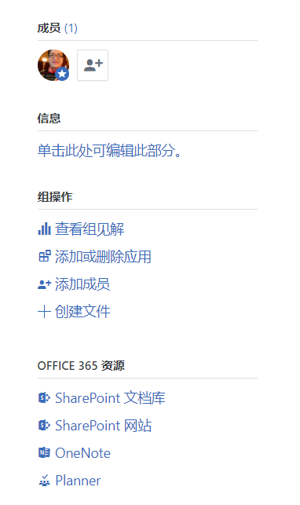

这里显示的连接器列表其实跟在Outlook里面看到的是一样的

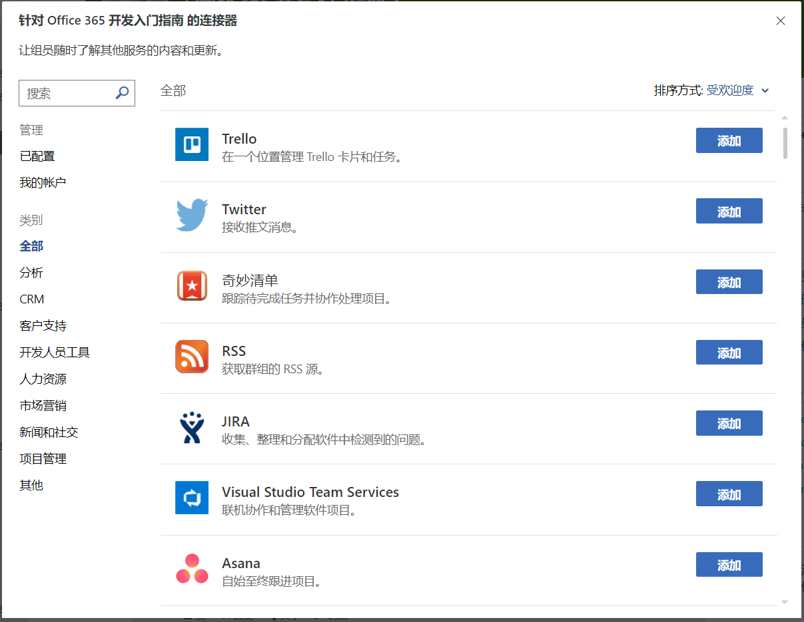

本例演示添加“RSS”这个连接器，例如我关注Office 产品组的更新博客，就可以通过下面的方式订阅他们的RSS feed

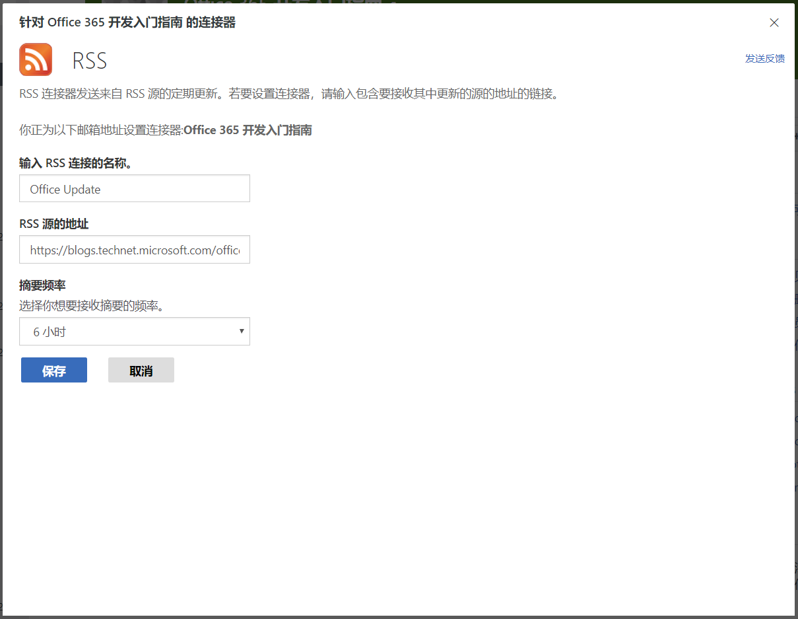

点击“保存”后，会在Yammer群组中看到一个通知

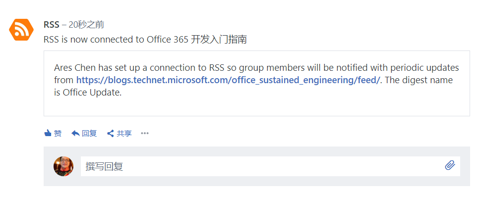

在设定的时间，RSS引擎会把博客链接发送到Yammer群组中来

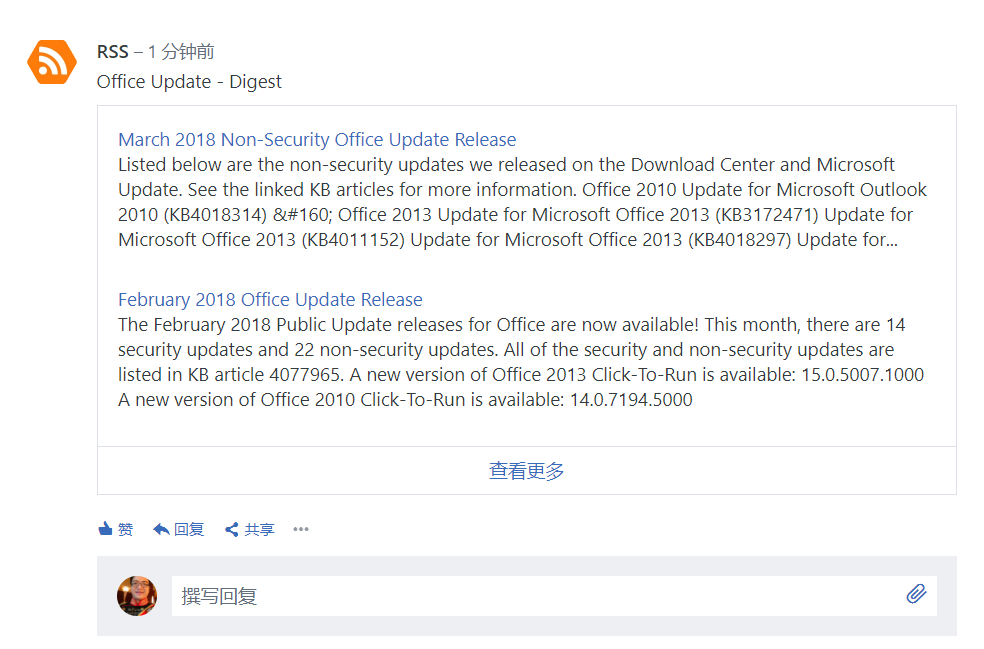

## 在Microsoft Teams中使用Office 365 Connectors

Microsoft Teams是Office 365 Connectors另外一个使用场景，它的用法略有不同：它是在频道中添加连接器的，一个团队可以有多个频道，一个频道有可以添加多个连接器，这样就带来了更加灵活的可能性。

选择某个团队的某个频道，在它右侧的“...”菜单中选择“连接器”，你可以看到跟之前很类似的一个界面

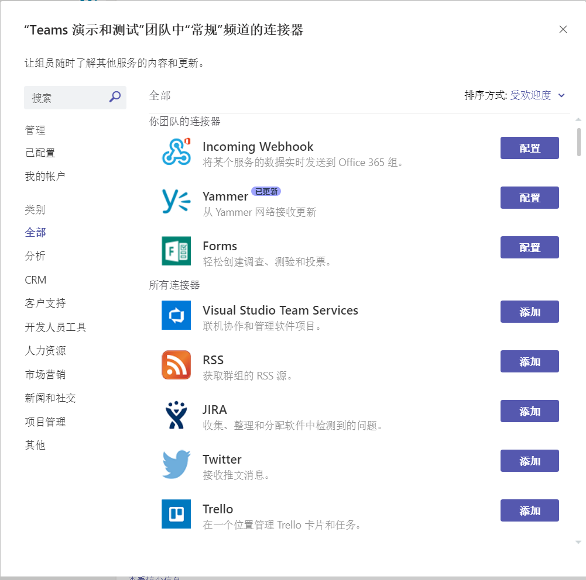

在本例中，我演示的是如何配置Yammer这个连接器以便在Teams中能收到Yammer讨论组的消息。

和Github类似，添加Yammer这个连接器后，要进行详细的配置，如下图所示

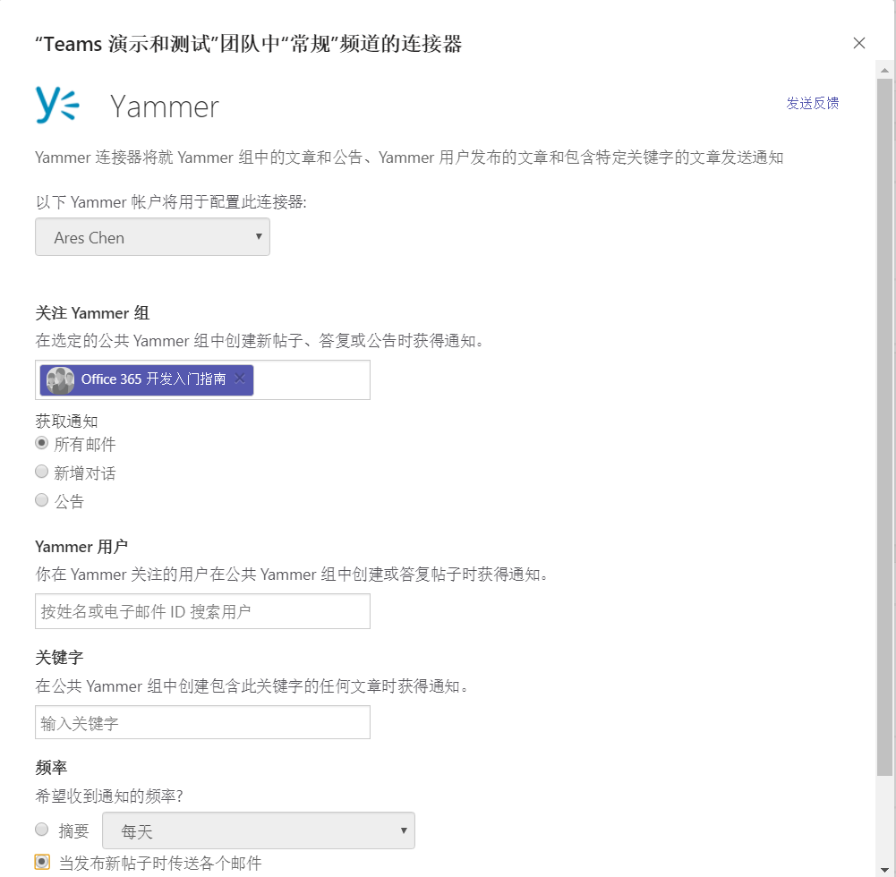

你可以设置要关注的组，事件类型，关注的用户和关键字，以及通知的频率等等，保存后，当Yammer组有状态更新时，在频道里面就可以收到通知：

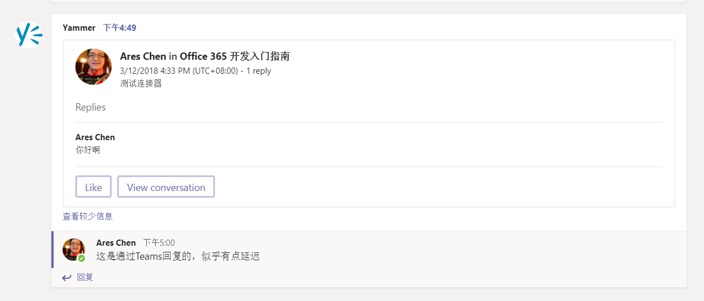

在这里可以直接点赞，或者回复，不过似乎这些还不能双向地同步到Yammer里面来。

## 自定义Office 365 Connectors

上面演示了使用Office 365 Connectors的场景（Outlook，Yammer，Microsoft Teams），我们都是使用目前内置的Connectors，那么如果我们自己有一个应用系统，也想通过这种方式进行连接（在必要的时候推送消息和更新动态），应该怎么来做呢？这方面，目前Office 365平台提供了三种机制。

首先，对于一些简单的场景，你可以直接使用“Incoming Webhook”这个内置的连接器来定义，如下图所示

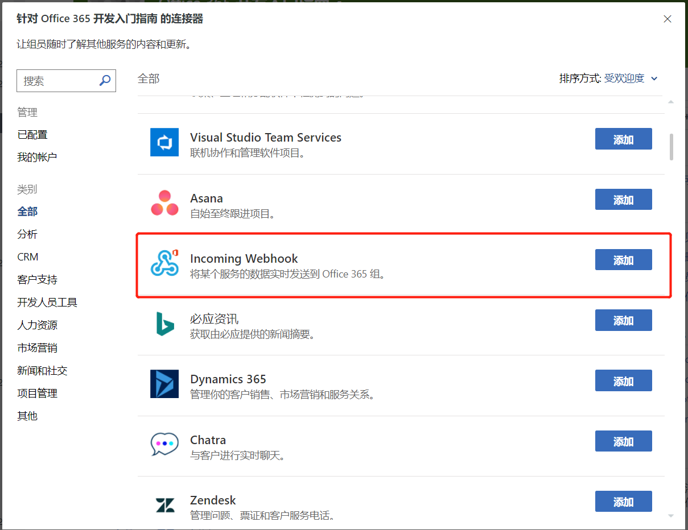

通常你只需要提供一个名称即可完成连接器的定义

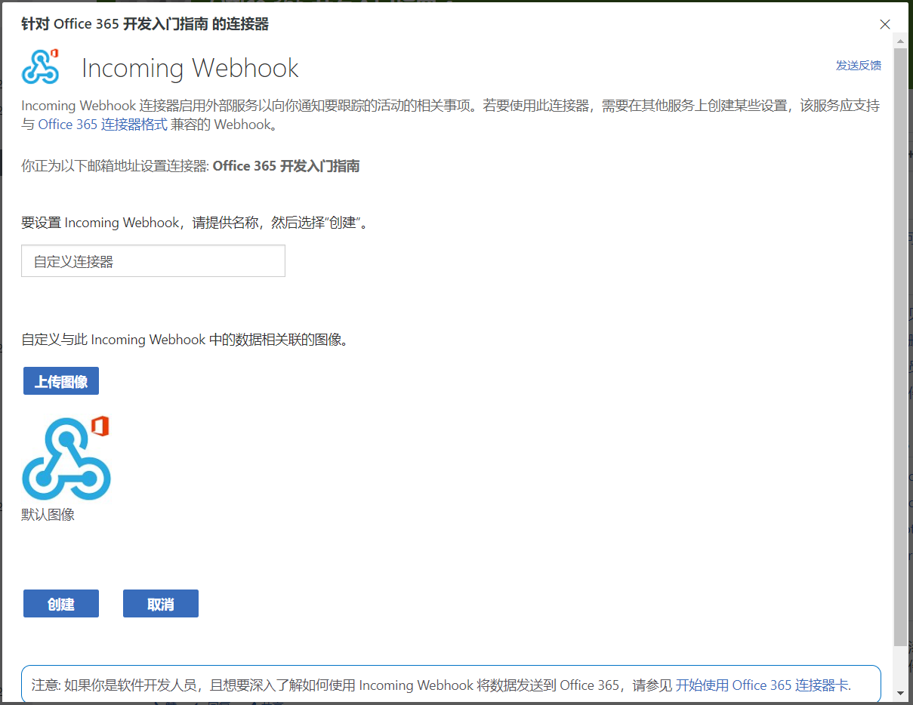

点击“创建”，会产生一个Url，这就是可以用来推送消息的地址了

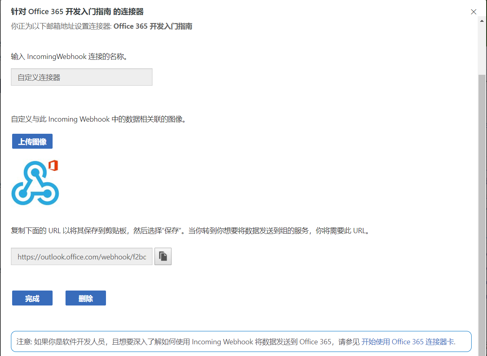

那么，如何使用这个自定义的连接器呢？很简单，我们只要在应用程序内部，通过Post的方法，给这个地址发送消息即可。通常的代码如下：

```
using System;
using System.Net.Http;

namespace connectorconsole
{
    class Program
    {
        static void Main(string[] args)
        {

            var client = new HttpClient();
            var request = new HttpRequestMessage(HttpMethod.Post,"https://outlook.office.com/webhook/f2bde2a5-8459-4acd-b92c-c55947422146@72f988bf-86f1-41af-91ab-2d7cd011db47/IncomingWebhook/9bc2989885fe475fa3d5578796f7dd05/f3b94dd3-20cc-49a3-98ce-b1287658e8cf");
            request.Content = new StringContent("{\"text\":\"通过程序推送的消息\"}");
            client.SendAsync(request);

            Console.Read();
        }
    }
}
```

运行这个小程序，就可以在目标应用中收到一个通知的消息，如下图所示

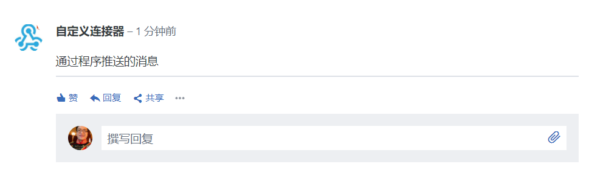

> 如果只是作为测试，你甚至都无需写代码，而是使用一些工具来发起请求，例如Fiddler,Postman,curl等，这里就不演示了。

以上这种场景特别适合于简单的环境，并不适合于大规模分发使用，因为这个地址是要用户来生成的，然后再告诉开发人员，而且这个地址每次生成都是不一样的。如果想要更好地解决这个问题，例如你可以做一个自己的连接器，让尽可能多的用户去使用它，那么是时候考虑真正地自定义一个连接器。

你需要使用Office 365账号登录 <https://outlook.office.com/connectors/publish> 来创建一个自定义的连接器，如下图所示

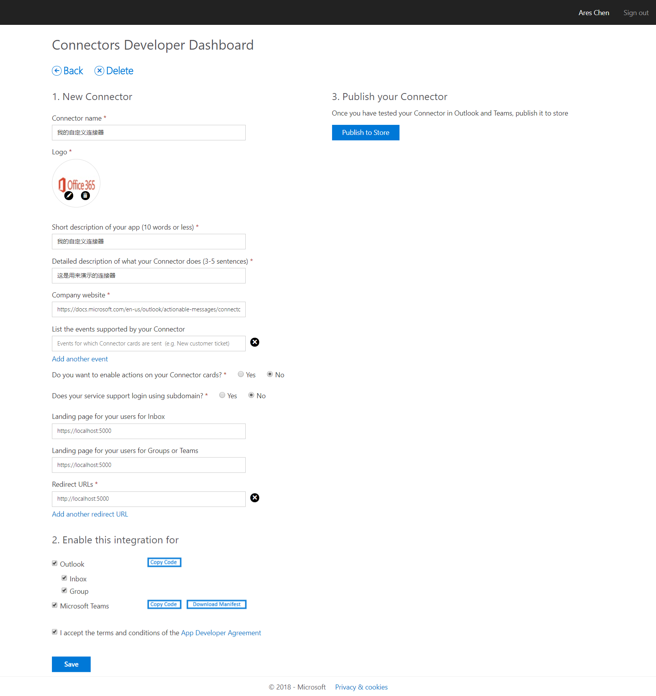

这个页面中的关键信息是Redirect Urls这个地址，然后你可以看到目前它仅支持Outlook和Microsoft Teams，暂时不支持Yammer。

点击“保存”后，接下来就可以进行测试了。值得说明的是，你需要准备一个用来响应用户请求的网站，例如本例我会用本地运行的一个站点做演示（http://localhost:5000)

我用了dotnet core创建了一个最简单的网站，用来响应用户的关联请求，并且将用户相关信息打印出来（真实场景下会将这些信息保存起来，用来推送消息）

```
using System;
using System.Collections.Generic;
using System.Linq;
using System.Threading.Tasks;
using Microsoft.AspNetCore.Builder;
using Microsoft.AspNetCore.Hosting;
using Microsoft.AspNetCore.Http;
using Microsoft.Extensions.DependencyInjection;
using System.Text;
using System.Net.Http;

namespace connectorhost
{
    public class Startup
    {
        // This method gets called by the runtime. Use this method to add services to the container.
        // For more information on how to configure your application, visit https://go.microsoft.com/fwlink/?LinkID=398940
        public void ConfigureServices(IServiceCollection services)
        {
        }

        // This method gets called by the runtime. Use this method to configure the HTTP request pipeline.
        public void Configure(IApplicationBuilder app, IHostingEnvironment env)
        {
            if (env.IsDevelopment())
            {
                app.UseDeveloperExceptionPage();
            }

            app.Run(async (context) =>
            {
                //打印出来用户关联信息
                var sb = new StringBuilder();
                foreach (var item in context.Request.Query)
                {
                    sb.AppendLine($"{item.Key}={item.Value}");
                }
                await context.Response.WriteAsync(sb.ToString());

                //推送一个欢迎消息
                var url = context.Request.Query["webhook_url"];
                var client = new HttpClient();
                var request = new HttpRequestMessage(HttpMethod.Post,url);
                request.Content = new StringContent("{\"text\":\"欢迎关联我的连接器，你将会收到很多消息推送\"}");
                await client.SendAsync(request);

            });
        }
    }
}


```
为了让用户可以关联我们开发的自定义连接器，你可以在注册连接器的页面上，点击"Copy code"，如下图所示

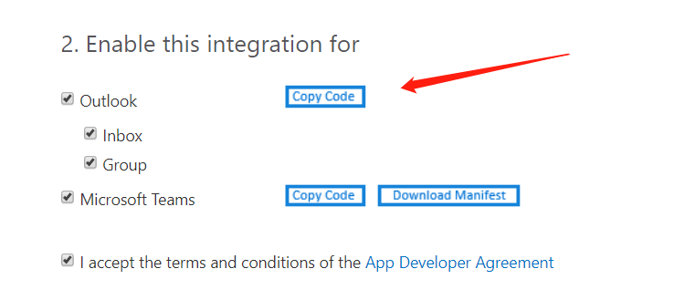

然后将复制得到的代码，保存为一个html文件，在浏览器中打开它的效果如下

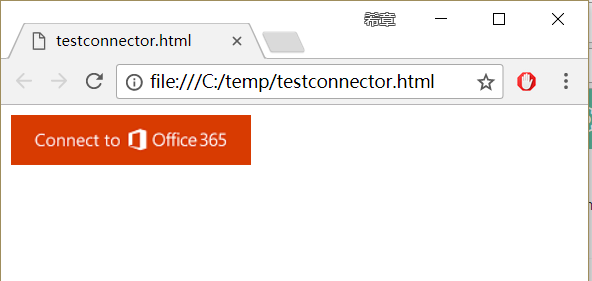

> 你可以将这段代码嵌入到任意网站中去

用户点击页面上这个“Connect to Office 365”的按钮后，会被要求登录Office 365，然后可以选择Outlook中的收件箱或者组来进行关联

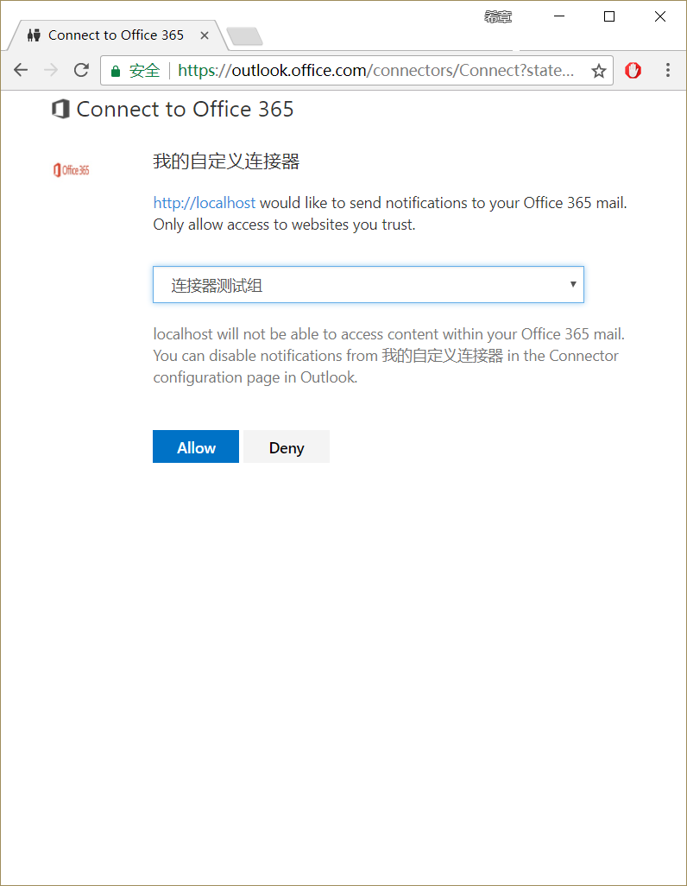

点击“Allow”后，Office 365后台做好必要的处理后，页面会被重定向到注册时提供的Redirect Urls（我演示的例子是 http://localhost:5000）

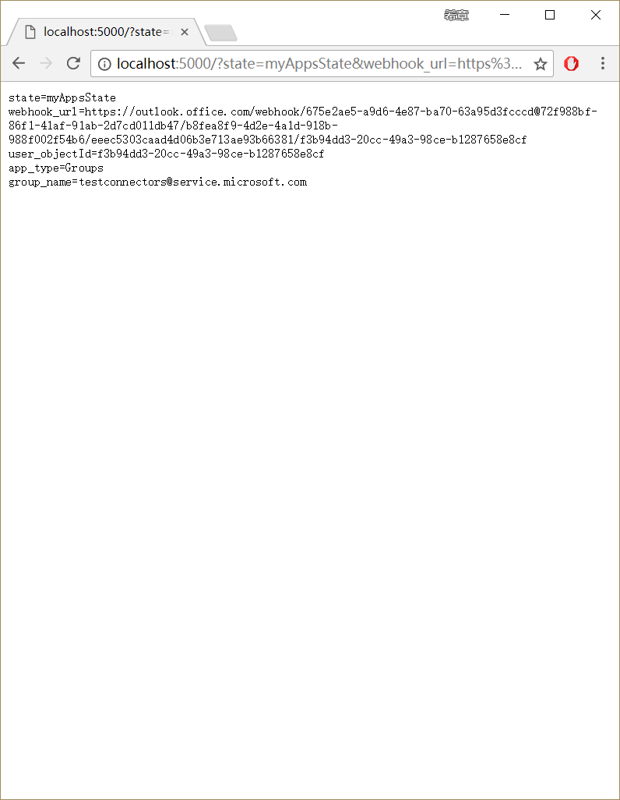

与此同时，在对应的组中，也立即收到了一个欢迎消息

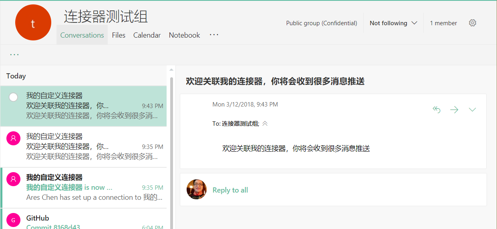

这样就完成了一个开发人员自定义连接器，用户自行关联连接器的流程。连接器的宿主应用程序，可以把用户的信息保存起来，然后再在必要的时候给用户推送消息。

最后，如果你希望将你的自定义连接器发布给全世界所有的Office 365用户去使用，则需要发布到微软的Office 365 Connectors商店中去，你可以在注册页面中点击“Publish to store”按钮

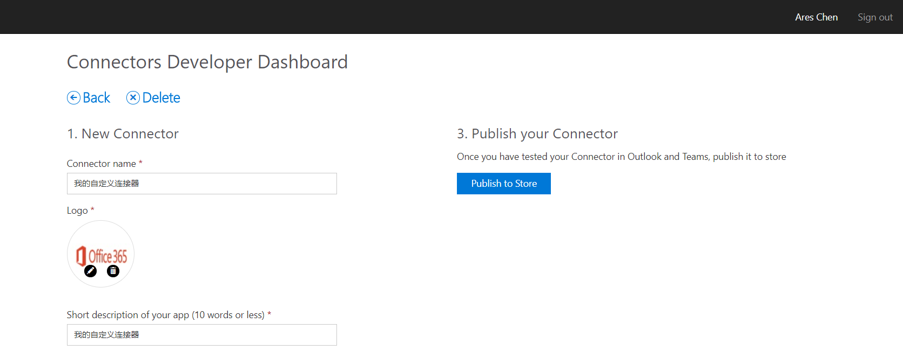

你按照需要填写信息，然后“submit”即可

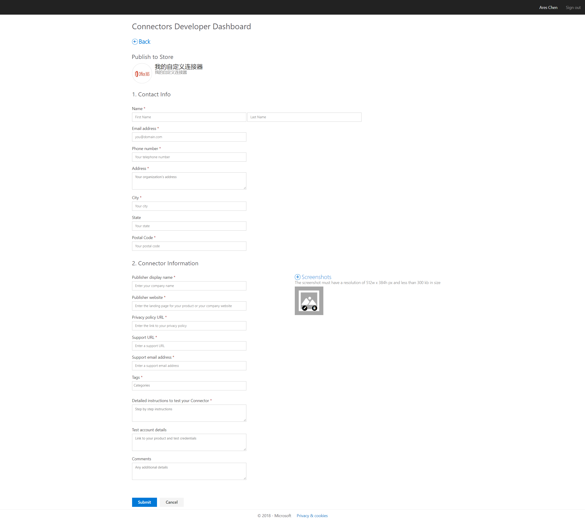


