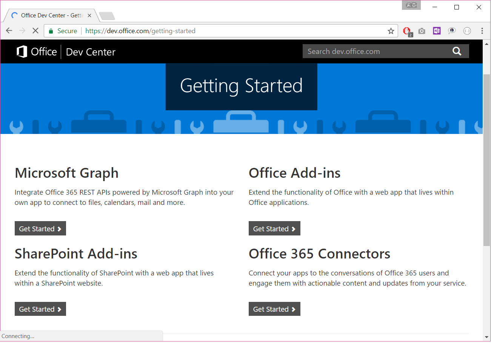
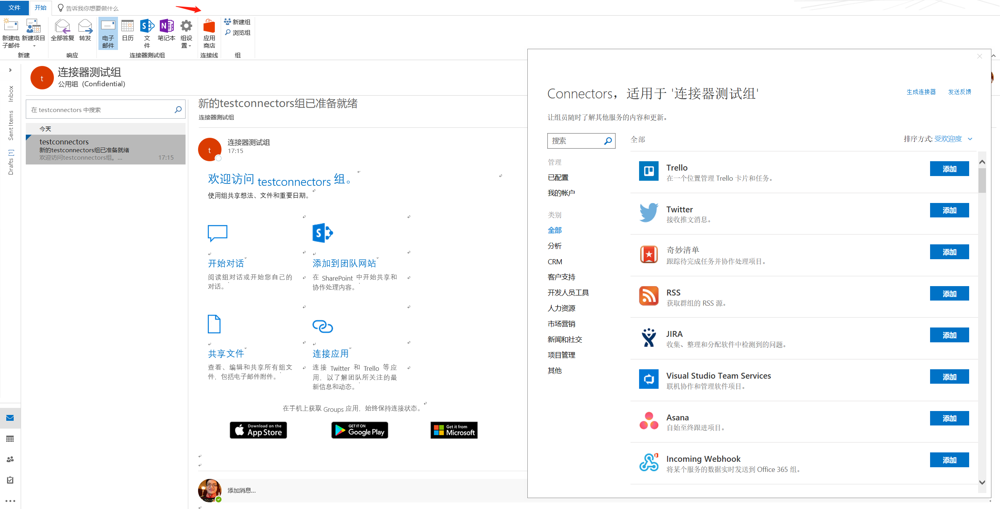
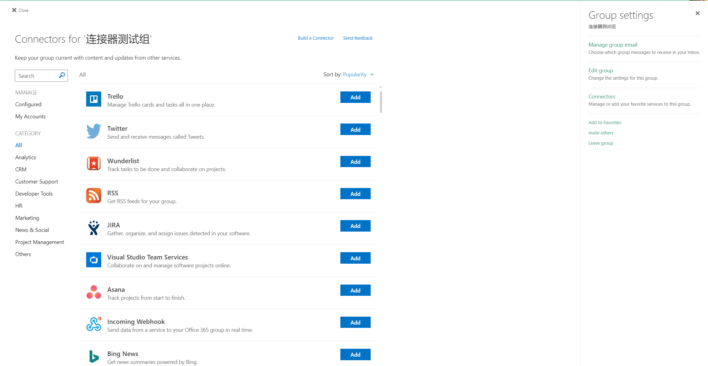
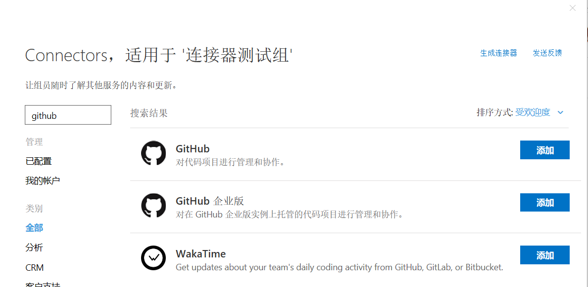
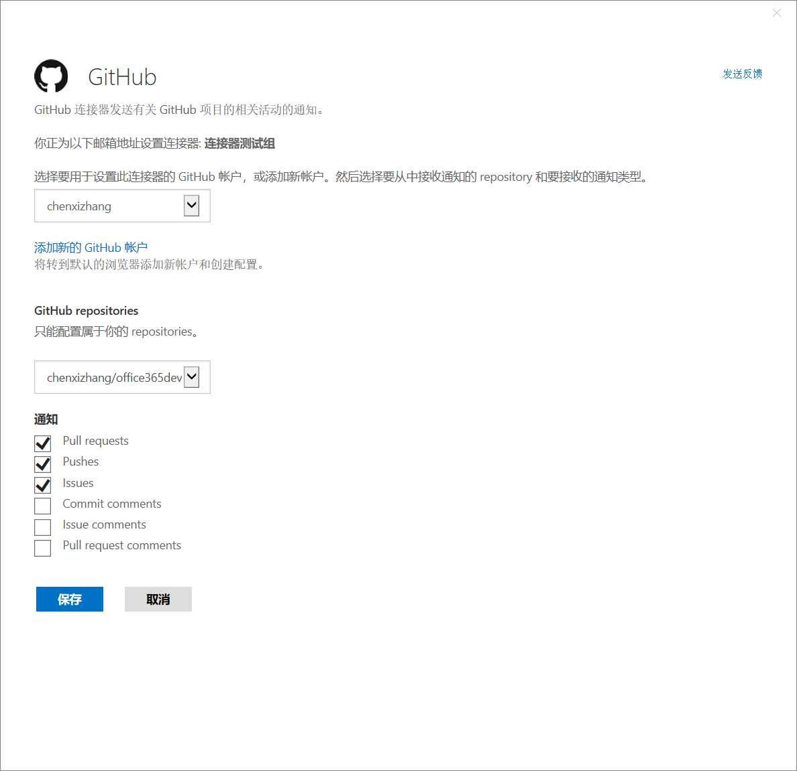
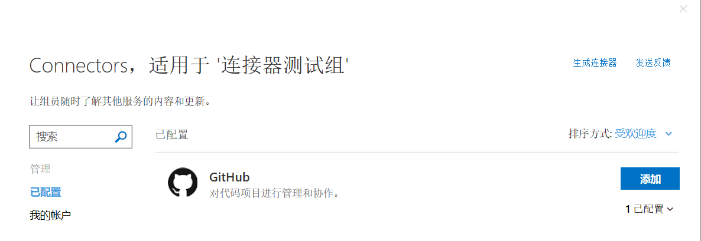
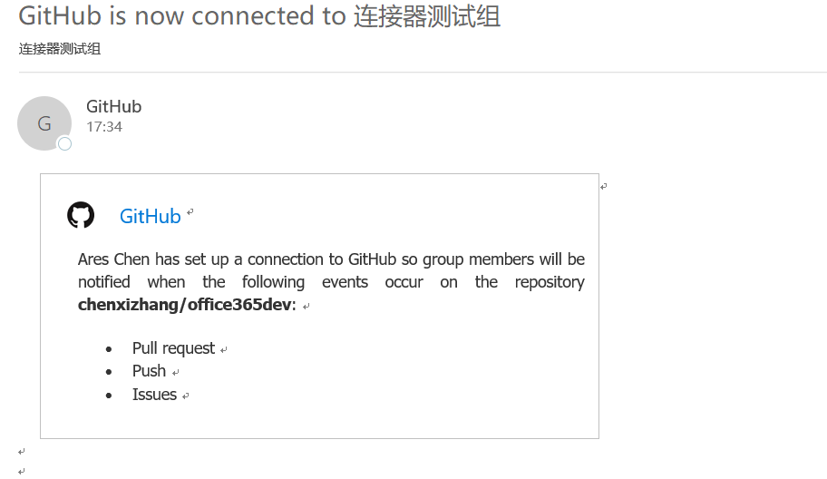
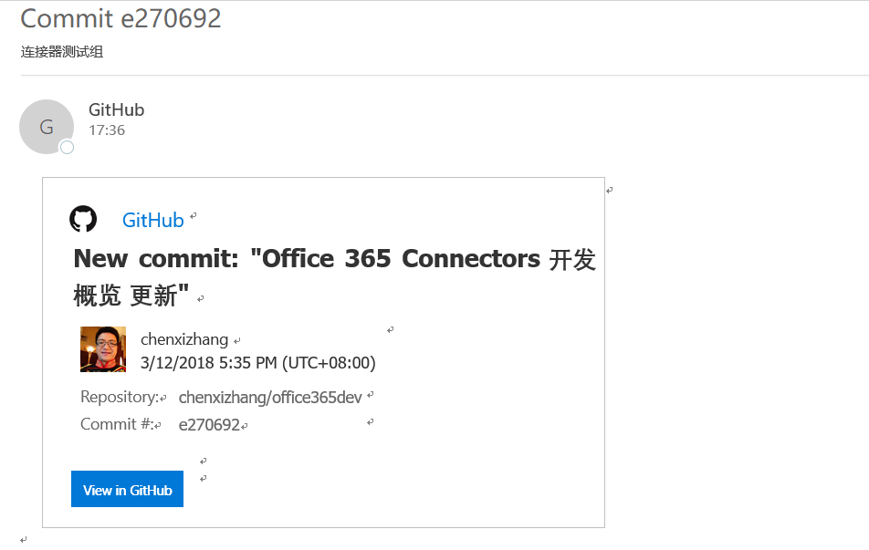

# Office 365 Connectors开发概览
> 作者：陈希章 发表于 2018年3月12日

## 前言

我相信很多人都看过《三国演义》，里面有很多栩栩如生的人物形象，对我而言，曹操手下的一员猛将典韦实在让人看得过瘾。书中有一段描写典韦的作战经历：

>时西面又急，韦进当之，贼弓弩乱发，矢至如雨，韦不视，谓等人曰：“虏来十步，乃白之。”等人曰：“十步矣。”又曰：“五步乃白。”等人惧，疾言“虏至矣”！韦手持十余戟，大呼起，所抵无不应手倒者。布众退。

箭如雨下的场面中，典韦以寡敌众，“贼至五步呼我”，连人中吕布都要避其锋芒。我今天在写这篇文章时，又不由得联想起来这个让人血脉喷张的画面。而Office 365 Connector就是Office 365的一个有意思的类似场景，它也属于我们经常说的Office 365 开发四场场景之一，如下图所示：

那么到底什么是Office 365 Connectors呢？他通常是在Office 365应用程序内部（目前支持Office 365 Group和Microsoft Teams）中需要接收外部系统的一些通知消息时，能够以一种灵活的方式来连接起来。所以，它的中文名称就是“连接器”，换言之，当用户关注的某些业务系统（或者任何消息源)有一些新的状态，他可以自动地得到通知。

本文将包括如下的内容
1. 在Office 365 Group中使用Office 365 Connector
1. 在Microsoft Teams中使用Office 365 Connector
1. 在Office 365 Connector中发送Actionable Message（操作卡片消息）
1. 自定义Office 365 Connector

## 在Office 365 Group中使用Office 365 Connectors

这是Office 365 Connectors最早的使用场景，用户可以自己在Outlook客户端，或者OWA中进行配置，并且通过邮件的方式得到通知。

>关于Office 365 Group的详细信息，请参考 <https://support.office.com/zh-cn/article/%E4%BA%86%E8%A7%A3%E6%9C%89%E5%85%B3-office-365-%E7%BB%84-b565caa1-5c40-40ef-9915-60fdb2d97fa2?ui=zh-CN&rs=zh-CN&ad=CN>

下图展示了在Outlook中添加连接器的界面：

> 图中的“连接线”翻译不准确，应该为“连接器”

下图展示了在OWA中添加连接器的界面：

目前内置提供了超过100个连接器，包括很多企业级应用平台，也包括了很多互联网应用。下面演示一个从Github上面获取通知的连接器配置和使用效果。

点击第一个“添加”按钮，然后在下图中配置你的Github账号（通常会弹出一个登陆框，请你输入用户名和密码）

在这个界面中选择你要关联的代码库（repositories），并且勾选想要用来接收通知的事件，然后点击“保存”即可。

你会在“连接测试组”中收到一个配置成功的邮件：

下面我可以尝试往这个代码库提交一次更新，我们可以很快在连接器测试组中看到一个推送的通知。

## 在Microsoft Teams中使用Office 365 Connectors

## 在Office 365 Connectors中发送Actionable Message（操作卡片消息）

## 自定义Office 365 Connectors

