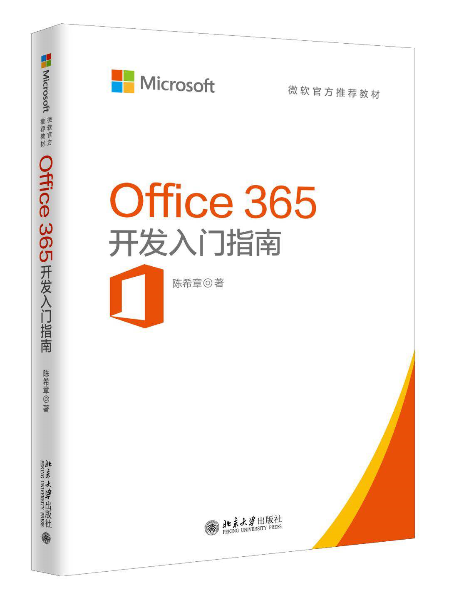

# 谈一谈在Office 365开发过程中能使用的开源框架及技术
> 作者：陈希章 发表于 2018年3月11日

## 前言

大家可能已经知道，我的《Office 365 开发入门指南》已经正式成书付印，并且将于下周六（3月17日）在北京的第三届Office 365 开发者大会上面首发，在今年的4月或者5月批量上市。这是第一本Office 365 开发的中文书籍，取材自我的这个系列文章，并且在整理过程中有较大的修订和内容调整。即便是在没有正式出版之前，其实已经有超过1000位读者通过在线方式进行了阅读，并且给了我不少反馈。

与此同时，我的这个系列文章还会继续更新。我今天就要跟大家分享一些在Office 365开发过程中能使用的开源框架及技术。这是我一直想写的一个主题。我虽然是有相当长时间的Windows平台、Office平台的开发经验，但这些年我密切关注到一些新的变化，就是微软不断地拥抱开源，一方面是把很多原先不公开的组件都开源了（你可能知道，现在微软是在Github上面贡献代码最多的，参与员工数最多的公司），另外，微软在设计平台的时候，就把支持开源平台作为一个必须的选项。

> 这个系列文章的访问地址是：<https://aka.ms/office365devguide> ，并且你也可以在Github上面看到所有的原始文件 <https://github.com/chenxizhang/office365dev>，从这个意义上说，我也是用开源的精神来坚持写作的。如果你希望和我取得联系，可以通过 office365devguide@xizhang.com 这个邮箱。

