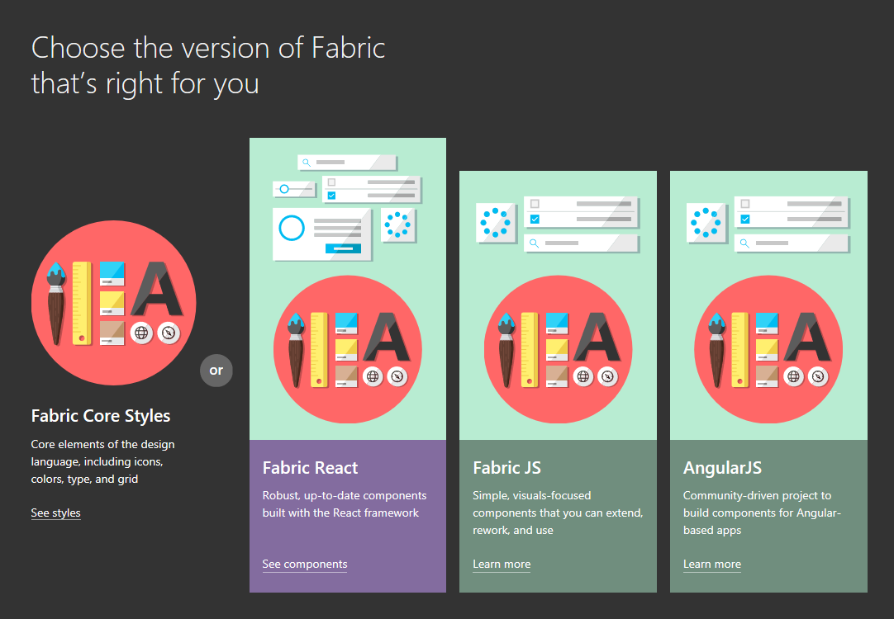
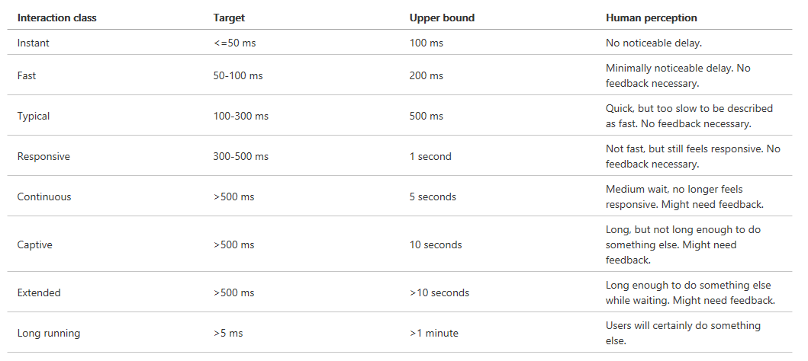

# Office Add-in 设计规范与最佳实践
> 作者：陈希章 发表于 2017年8月6日

## 引子

离[上一篇](vscodetoofficeaddin.md)Office Add-in的文章已经过去了一段时间，期间有去年Office 365 Asia Devday & Hackathon的二等奖获得者闫晓迪写了[Office365开发系列——开发一个全功能的Word Add-In ](http://www.cnblogs.com/yanxiaodi/p/7192280.html),另外我也写了两篇有关人工智能方面的文章 

1. [人工智能背景下的Office 365现状和发展趋势](officeandai.md)
1. [Office 365 机器人（Bot）开发入门](botframeworkquickstart.md)

我一直在思考怎么为大家讲解Office Add-in开发，一方面确实需要实例（所以我们需要更多的闫晓迪站出来），另一方面来说，我觉得从一开始就讲解一些设计规范和最佳实践可能对大家会有较大帮助。

当然，实际上我也没有非常丰富的Office Add-in开发经验，这方面还需要有时间和案例的积累。所以这一篇文章的主要内容都来自于官方的手册，我稍微做了一些整理，增加了少量我个人的建议。如果希望查看英文的版本，请访问：<https://dev.office.com/docs/add-ins/overview/add-in-development-best-practices>。

## 第一个规范：提供清晰的价值

这个原则之所以放在最前面，是因为它要回答“你为什么需要开发这个Office Add-in”的终极哲学性问题。

下面几个最佳实践是比较适合关注的

1. 在不增加中断的情况下，帮助用户更好地基于Office Add-in完成创作。
1. 为Offie 提供新的应用场景。
1. 为Offie 嵌入一些辅助服务。
1. 提高Office 的使用体验达到实现更好的生产力的目的。

我要补充的一两点我的理解：一个好的Office Add-in因为提供明确，并且尽量独特的价值 —— 不要贪大求全，而是因为专注于做好一件事情。同时，用户不应该被要求离开他当前所在的Office 环境，就能完成一些有意思的工作，并且与他本身在Office里面做的工作无缝地融合在一起。这个让我想起在[人工智能背景下的Office 365现状和发展趋势](officeandai.md) 中提到的Tap和Rsearcher这两项功能。

如果你希望将你的Add-in发布到Office Store，还有两个文档可能对你有用
1. 在发布之前，通过 [Office Store validation policies](https://dev.office.com/officestore/docs/validation-policies) 以及 [Office Add-in host and platform availability](https://dev.office.com/add-in-availability) 来确保你想要提供的Add-in所需要满足的一些策略。
1. 通过了解[Create effective Office Store listings](https://dev.office.com/officestore/docs/create-effective-office-store-listings)的一些细节，提高你的Office Add-in在Office Store能更好地被查找到，甚至被推荐。

## 第二个规范：打造引人入胜的首次使用体验

你永远无法改变留给别人的第一印象。这句话同样适合于Office Add-in开发的领域。下面的一些最佳实践或许能让你的Office Add-in给人留下深刻印象，并且愿意长期使用下去。

1. 在首页上面清晰地告诉（引导）用户如何使用这个Add-in，不要一上来就要求用户注册啦，登录啦，好好想一想你到底能为他们提供什么。
1. 如果你的Add-in需要绑定数据，尽可能在创建时提供范例数据作为参考。
1. 提供试用版。作为SaaS服务的一个基本理念，就是用户可以通过试用了解你的产品，并且决定是否要购买订阅。而即便是有接受订阅的高级版本，也建议保留一个免费的（但依然包含了有限功能的）版本。
1. 如果需要用户注册，应该尽可能简单，尽可能预先填好一些基本信息，并且避免邮件验证。
1. 如果有可能，应在应用中实现单点登陆的体验，尤其是对于现有Office 365用户而言，他们本身就是有身份的。
1. 在应用中应该尽量避免弹出窗口，如果无法避免，则应该让用户决定是否启用该功能。

虽然写了这么多条，但我总结起来可能就是一条：KISS原则用在这里是恰如其分的 —— Keep it simple, stupid —— 如果你让用户思考，你就输了。

## 第三个规范：使用Add-in Command

使用Add-in Command是非常常见的做法，它可以用来在Office 应用程序中添加Ribbon按钮，也可以在快捷菜单中增加子菜单。点击这些按钮或者子菜单，可以直接执行一段代码（通常是Javascript函数），也可以打开任务面板（Task Pane）以进一步操作。典型的Add-in Command效果图如下所示：

> 考虑到对触摸操作的支持，应该尽量减少对于快捷菜单的依赖。

下面还有一些具体的建议

1. 尽可能将Add-in Command通过添加组的方式合并到现有的Ribbon Tab（例如Insert，Review等）里面去，当然前提是你的功能，正好跟这些Ribbon Tab的含义是匹配的。
1. 如果不匹配，则尽可能放在Home这个Ribbon Tab，这样可以减少用户查找你的Add-in Command的难度。
1. 但是如果你的自定义Add-in Command有超过6个顶级Ribbon Button，那么就建议单独创建一个Ribbon Tab了。
1. 在命名上面，Ribbon组的名称应该尽可能跟你的Add-in一致。如果有多个组，那么每个组都应该有清晰的命名，让用户一眼就知道它的用途。
1. 不要添加多余的按钮。请考虑奥卡姆的简单有效原则——“如无必要，勿增实体”。

## 第四个规范：遵循界面设计原则

值得高兴的一件事情是，微软为开发人员专门提供了[Office UI Fabric](https://dev.office.com/fabric#/get-started)这一套UX 框架，你可以直接使用Fabric Core Style开展工作，它主要提供了CSS的支持（字体，图标，内置组件等），但也可以结合你熟悉的UI框架使用，例如React和AngularJS。

Office UI Fabric是一切界面问题的解药，与此同时下面还有一些可以参考的最佳实践

1. 确保你的Add-in的用户体验跟Office宿主程序一脉相承。
1. 如无必要，不要添加多余的元素。
1. 为1366*768的主流分辨率优化设计，尽量避免滚动条。
1. 不要使用未经授权的图像（或其他素材）。
1. 使用简单明了的语言。
1. 不要在Add-in做广告。
1. 考虑不同平台的适用性，包括鼠标、键盘和触摸体验。
    
    通过Context.touchEnabled 可以检测到当前是否运行在触摸的模式下。如果在触摸模式下，还有几条参考的建议

    * 请确保所有的界面元素都拥有合适的尺寸。
    * 不要依赖于右键菜单和鼠标悬停等机制进行工作。
    * 确保在横屏和竖屏的情况下都能正常工作。
    * 在真实的设备中进行测试（使用[Sideloading](https://dev.office.com/docs/add-ins/testing/sideload-an-office-add-in-on-ipad-and-mac.htm)技术）

1. 增加辅助访问功能。

## 第五个规范：将性能始终放在重要位置

以前我们当然也讲性能，但如今Office Web Add-in的话，这个就显得尤为重要了，你的Add-in可能会被成千上万的人使用，性能可能成为你的制胜法宝，反过来也可能葬送你所有的努力。

除了一直要将性能放在重要位置，从思想上很重视它之外，下面也有一些具体的建议

1. 确保Add-in加载时间在主要的网络环境下的加载时间不应该超过500毫秒。
1. 确保用户交互操作的时间不超过1秒。
1. 如果是长时间操作，请提供进度提示。
1. 对于公共资源（图片，CSS文件，脚本等）请考虑使用CDN技术加速，并且尽可能在一个位置（尽可能利用缓存的好处）。
1. 参考网站设计的一些基本规范。这个可以参考我几年前写的[优化网站设计的三十五条建议](http://www.cnblogs.com/chenxizhang/archive/2013/05/20/3088196.html)。