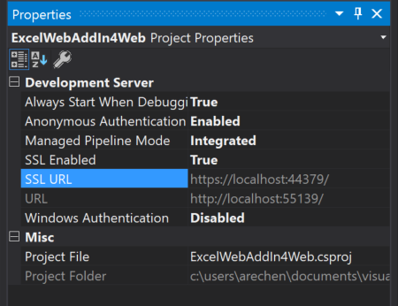
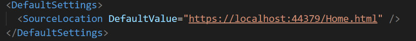
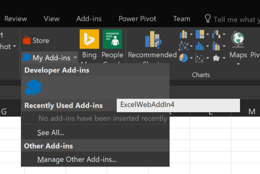

# 在Visual Studio 中开发Office Add-in
> 作者：陈希章 发表于2017年7月13日

“**Talk is cheap, show me the code**”，我们就用代码来说话吧。这一篇将给大家介绍如何开始Office Add-in的奇妙开发之旅。

[上一篇文章](officeaddins.md)已经提到过了，要进行Office Add-in的开发，你可以选择自己最喜欢的Web开发平台和工具。限于经验和精力，我这里展示的是用微软提供的Visual Studio系列工具进行开发。

Visual Studio这个宇宙第一的IDE伴随着我从对编程一无所知到靠编写代码为生，从入门到一直没有放弃。与此同时，Visual Studio 2005开始提供了对Office Add-in开发的内置支持。

当时的技术叫做VSTO——Visual Studio Tools for Office，其内在的机制是用托管代码封装了Office 的COM对象模型，我们在Visual Studio中编写C#或者VB.NET的代码，最终会编译成一个dll，打包成一个vsto的文件，部署到计算机的特定目录后，相应的Office客户端在启动的时候，就会加载这些vsto文件中定义好的add-in，并且执行其中的代码，或是自动执行某些功能（或者监听某个事件进行响应），或是在Ribbon中添加一些按钮，等待用户点击后执行某些操作。


每一代的Visual Studio都有对应的Office Add-in开发的更新。在最近的几个版本中，除了继续支持VSTO外，也一直提供了对于新一代Web Add-in的支持。


使用Visual Studio开发Office Add-in非常高效，因为有标准的项目模板，有向导式的工具，并且直接就支持一键式进行调试。我们下面就来体验一下吧。


> 由于不同的Office 客户端对于Add-in支持的功能会略有差异，所以基于你所选择的项目模板，你看到的向导界面可能也会略有不同

点击“Finish”按钮后，你应该会看到一个类似下面的项目结构


最左边的是manifest文件，中间是Web应用程序的首页 —— home.html，这两个部分是通过在manifest文件中的如下内容来是进行关联的

```
<DefaultSettings>
    <SourceLocation DefaultValue="~remoteAppUrl/Home.html" />
</DefaultSettings>
```
> 你一定会对~remoteAppUrl感到好奇，这是一个什么地址呢？这只是一个占位符，后续真正在调试或者部署的时候会替换成真正的地址。

关于manifest文件的具体规范，以及Web应用程序开发的细节，我还会在后续专门来写。现在就让我们不做任何的修改，直接运行起来看看效果吧。对，就是按F5键。


这个Add-in会在“Home”这个Tab里面增加一个Add-in Command—— “Show TaskPane”，点击这个按钮后，会在工作表的右侧出现一个任务面板，并且与此同时已经插入了一些范例数据到工作表上面。如果我们选中这些数据，同时在任务面板中点击“Highlight”的话，它会把这些数字中的最大值找出来，并且用颜色进行高亮显示。


那么到底发生了什么呢？以上面这个范例项目为例，在你按下F5键的时候，Visual Studio其实做了如下一系列的事情

1. 编译和生成 ExcelWebAddin4Web这个项目，并且在本地用IIS Express将其运行起来，在我的电脑上，它会在下面的地址运行 <https://localhost:44379/>，这是在项目属性中指定的。


1. 编译和生成 ExcelWebAddin4这个项目，并且用上面这个地址，替换到manifest文件中 ~remoteAppUrl。



与此同时，它会生成一个Book1.xlsx的文件用来做测试


1. Visual Studio启动Excel，加载Book1.xlsx，并且用开发模式，加载上面这个manifest文件，进而言之就是加载我们这个Web Addin



为什么我们会在“Home”这个Tab中看到那个自定义的按钮，是因为在Manifest文件中定义了如下的信息

```
<ExtensionPoint xsi:type="PrimaryCommandSurface">
  <!-- Use OfficeTab to extend an existing Tab. Use CustomTab to create a new tab. -->
  <OfficeTab id="TabHome">
    <!-- Ensure you provide a unique id for the group. Recommendation for any IDs is to namespace using your company name. -->
    <Group id="Contoso.Group1">
      <!-- Label for your group. resid must point to a ShortString resource. -->
      <Label resid="Contoso.Group1Label" />
      <!-- Icons. Required sizes 16,32,80, optional 20, 24, 40, 48, 64. Strongly recommended to provide all sizes for great UX. -->
      <!-- Use PNG icons. All URLs on the resources section must use HTTPS. -->
      <Icon>
        <bt:Image size="16" resid="Contoso.tpicon_16x16" />
        <bt:Image size="32" resid="Contoso.tpicon_32x32" />
        <bt:Image size="80" resid="Contoso.tpicon_80x80" />
      </Icon>

      <!-- Control. It can be of type "Button" or "Menu". -->
      <Control xsi:type="Button" id="Contoso.TaskpaneButton">
        <Label resid="Contoso.TaskpaneButton.Label" />
        <Supertip>
          <!-- ToolTip title. resid must point to a ShortString resource. -->
          <Title resid="Contoso.TaskpaneButton.Label" />
          <!-- ToolTip description. resid must point to a LongString resource. -->
          <Description resid="Contoso.TaskpaneButton.Tooltip" />
        </Supertip>
        <Icon>
          <bt:Image size="16" resid="Contoso.tpicon_16x16" />
          <bt:Image size="32" resid="Contoso.tpicon_32x32" />
          <bt:Image size="80" resid="Contoso.tpicon_80x80" />
        </Icon>

        <!-- This is what happens when the command is triggered (E.g. click on the Ribbon). Supported actions are ExecuteFunction or ShowTaskpane. -->
        <Action xsi:type="ShowTaskpane">
          <TaskpaneId>ButtonId1</TaskpaneId>
          <!-- Provide a URL resource id for the location that will be displayed on the task pane. -->
          <SourceLocation resid="Contoso.Taskpane.Url" />
        </Action>
      </Control>
    </Group>
  </OfficeTab>
</ExtensionPoint>
```
事实上，点击按钮就是显示出来那个TaskPane（任务面板）而已，唯一做了设置的就是指定了这个面板默认打开的Url地址. 这是通过在Resources中设定的。
```
<Resources>
  <bt:Images>
    <bt:Image id="Contoso.tpicon_16x16" DefaultValue="~remoteAppUrl/Images/Button16x16.png" />
    <bt:Image id="Contoso.tpicon_32x32" DefaultValue="~remoteAppUrl/Images/Button32x32.png" />
    <bt:Image id="Contoso.tpicon_80x80" DefaultValue="~remoteAppUrl/Images/Button80x80.png" />
  </bt:Images>
  <bt:Urls>
    <bt:Url id="Contoso.DesktopFunctionFile.Url" DefaultValue="~remoteAppUrl/Functions/FunctionFile.html" />
    <bt:Url id="Contoso.Taskpane.Url" DefaultValue="~remoteAppUrl/Home.html" />
    <bt:Url id="Contoso.GetStarted.LearnMoreUrl" DefaultValue="https://go.microsoft.com/fwlink/?LinkId=276812" />
  </bt:Urls>
  <!-- ShortStrings max characters==125. -->
  <bt:ShortStrings>
    <bt:String id="Contoso.TaskpaneButton.Label" DefaultValue="Show Taskpane" />
    <bt:String id="Contoso.Group1Label" DefaultValue="Commands Group" />
    <bt:String id="Contoso.GetStarted.Title" DefaultValue="Get started with your sample add-in!" />
  </bt:ShortStrings>
  <!-- LongStrings max characters==250. -->
  <bt:LongStrings>
    <bt:String id="Contoso.TaskpaneButton.Tooltip" DefaultValue="Click to Show a Taskpane" />
    <bt:String id="Contoso.GetStarted.Description" DefaultValue="Your sample add-in loaded succesfully. Go to the HOME tab and click the 'Show Taskpane' button to get started." />
  </bt:LongStrings>
</Resources>

```

也就是说，任务面板会默认加载Web应用程序的Home.html页面，而如果你打开这个文件，你会发现除了一些简单的布局设计之外，其核心部分的逻辑是写在了一个Home.js文件中的。这个js文件的核心代码是下面这一段，它做了一些基本的判断，然后加载了范例数据（loadSampleData），并且为页面上的一个编号为highlight-button的按钮绑定了一个事件（highlightHighestValue)。

```
Office.initialize = function (reason) {
    $(document).ready(function () {
        // Initialize the FabricUI notification mechanism and hide it
        var element = document.querySelector('.ms-MessageBanner');
        messageBanner = new fabric.MessageBanner(element);
        messageBanner.hideBanner();
            
        // If not using Excel 2016, use fallback logic.
        if (!Office.context.requirements.isSetSupported('ExcelApi', '1.1')) {
            $("#template-description").text("This sample will display the value of the cells that you have selected in the spreadsheet.");
            $('#button-text').text("Display!");
            $('#button-desc').text("Display the selection");

            $('#highlight-button').click(displaySelectedCells);
            return;
        }

        $("#template-description").text("This sample highlights the highest value from the cells you have selected in the spreadsheet.");
        $('#button-text').text("Highlight!");
        $('#button-desc').text("Highlights the largest number.");
                
        loadSampleData();

        // Add a click event handler for the highlight button.
        $('#highlight-button').click(hightlightHighestValue);
    });
};

```