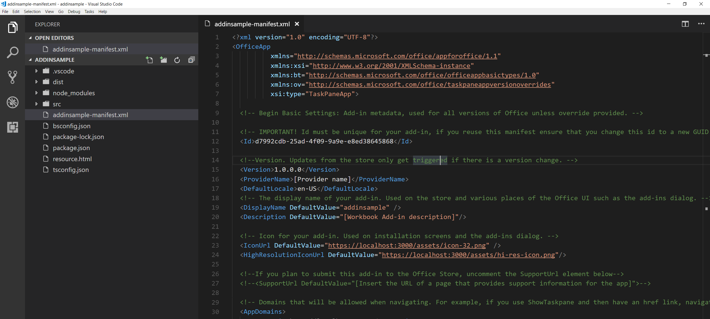
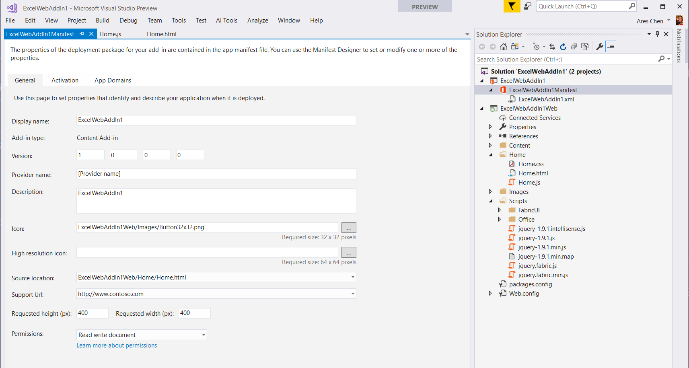
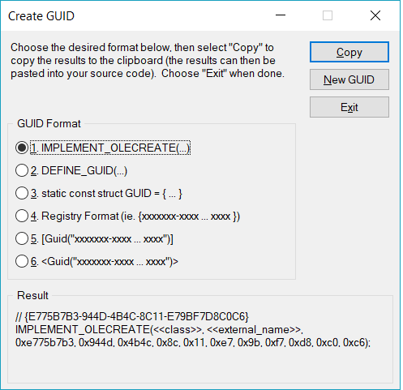

# 详解Office Add-in 清单文件
> 作者：陈希章 发表于2017年12月8日

## 前言
我们都知道，一个Office Add-in，最主要是由两个部分组成的：清单文件（manifest）和真正要用来执行的网站。


清单文件其实是一个标准的XML文件，它有固定的Schema。目前来说，最新版本的清单文件必须指定“http://schemas.microsoft.com/office/appforoffice/1.1”作为Schema，否则某些功能可能不能正常工作。当然，指定Schema这件事情你可能不太会需要手工去做，毕竟不管你是用Visual Studio的项目模板，还是用其他开发工具（例如Visual Studio Code），清单文件都是自动生成的，而且默认就已经指定了1.1这个版本。下面两篇文章介绍了如何在不同工具开始office Add-in的开发。

* [在Visual Studio 中开发Office Add-in](officeaddindev.md)
* [在Visual Studio Code中开发Office Add-in](vscodetoofficeaddin.md)

一个典型的清单文件看起来是下面这样的



在Visual Studio中，有时候会用可视化界面，取代纯文本的XML编辑界面，例如下面这样




> 平胸而论，Visual Studio 提供了对于清单文件的最佳编辑体验，因为它会自动根据Schema提供智能感知，甚至如你刚才看到的那样，它甚至提供了可视化界面，我爱死这个功能了。


下面我会从三个方面分别对清单文件进行详细介绍

1. 基本属性定义
1. 通过清单文件自定义Ribbon和快捷菜单
1. 通过清单文件是实现多语言支持

## 基本属性定义
清单文件中的根元素是OfficeApp，这里会指定几个namespace，但同时会有一个至关重要的属性：xsi:type，目前我们支持三种不同类型的Office Add-in，分别是

1. ContentApp，这是内容应用，主要是在Excel和PowerPoint中能用。通过这类Add-in，可以为宿主程序添加自定义的内容元素，例如一个自定义地图之类的。
1. TaskPaneApp，这是应用最广的类型。通过这类Add-in，可以为宿主程序添加自定义的功能，例如通过一个自定义菜单，执行某些操作。
1. MailApp，这是专用于Outlook的Add-in。

除此之外，OfficeApp这个根元素，还需要包含如下的基本元素
1. Id，唯一的编号（一个GUID）
1. Version，这个版本信息在你更新时可能需要修改
1. ProviderName，作者及公司信息
1. DefaultLocale，默认的语言，格式是类似于en-US这样的。我在下面还会介绍多语言支持的功能
1. DisplayName，显示名称
1. Description，描述
1. IconUrl，图标文件路径（32*32，PNG格式）
1. HighResolutionIconUrl，高清图片文件路径
1. SupportUrl，技术支持网址
1. AppDomains，如果你的应用中，需要导航到其他网站（不同域），则需要在这里定义。
1. Hosts，宿主形式。因为一个Add-in其实可以同时用于几个不同的宿主（例如Word，Excel等），所以这里可以定义多个Host。
    ```
    Document (Word)
    Database (Access)
    Mailbox (Outlook)
    Notebook (OneNote)
    Presentation (PowerPoint)
    Project (Project)
    Workbook (Excel)
    ```
1. DefaultSettings，默认设置，这里最关键的属性有SourceLocation，这个是用来指定Add-in加载时默认显示的页面。另外，不同的Add-in可能还会有一些自己的DefaultSettings，例如ContentApp的话，还可以设置RequestedWidth和RequestedHeight这两个属性，以确定自定义内容默认的尺寸。
1. Permissions，这是规定Add-in拥有的对于宿主和文档的访问权限，不同的Add-in有不同的Permission设置。
    ```
    ContentApp 和 TaskPaneApp

    <Permissions> [Restricted | ReadDocument | ReadAllDocument | WriteDocument | ReadWriteDocument]</Permissions>

    MailApp

    <Permissions>[Restricted | ReadItem | ReadWriteItem | ReadWriteMailbox]</Permissions>

    ```

值得一提的是，如果你用Visual Studio 项目模板生成的清单文件，你会发现IconUrl以及SourceLocation 等属性，会包含一个特定的地址 ~remoteurl，这个其实会在工具进行编译和发布时自动替换为你的网站的根地址。而在Visual Studio code等工具中，你可能需要精确地设置。


## 通过清单文件自定义Ribbon

作为TaskPaneApp，最常见的做法是在启动后位宿主程序添加一个工具栏按钮，然后用户点击按钮的话，执行某个操作（打开内容面板和执行某个Javascript函数）。我在这一节主要介绍的是自定义Ribbon的方式。

有意思的是，要定义工具栏和清单，在清单文件中，我们称之为VersionOverrides。一个最简单的Ribbon定义如下

```
<VersionOverrides xmlns="http://schemas.microsoft.com/office/taskpaneappversionoverrides" xsi:type="VersionOverridesV1_0">
    <Hosts>
      <Host xsi:type="Workbook">
        <DesktopFormFactor>
          <GetStarted>
            <Title resid="Contoso.GetStarted.Title"/>
            <LearnMoreUrl resid="Contoso.GetStarted.LearnMoreUrl"/>
          </GetStarted>
            <!--函数文件，是定义可以直接被调用的Javascript函数所在的位置-->
          <FunctionFile resid="Contoso.DesktopFunctionFile.Url" />

          <!-- 扩展定义 -->
          <ExtensionPoint xsi:type="PrimaryCommandSurface">
            <!-- 如果是扩展现有的Tab，使用 OfficeTab .如果是创建新的Tab，则使用 CustomTab -->
            <OfficeTab id="TabHome">
              <!-- 这个id必须唯一，可以结合公司的名称. -->
              <Group id="Contoso.Group1">
                <Label resid="Contoso.Group1Label" />
                <Icon>
                  <bt:Image size="16" resid="Contoso.tpicon_16x16" />
                  <bt:Image size="32" resid="Contoso.tpicon_32x32" />
                  <bt:Image size="80" resid="Contoso.tpicon_80x80" />
                </Icon>

                <Control xsi:type="Button" id="Contoso.TaskpaneButton">
                  <Label resid="Contoso.TaskpaneButton.Label" />
                  <Supertip>
                    <Title resid="Contoso.TaskpaneButton.Label" />
                    <Description resid="Contoso.TaskpaneButton.Tooltip" />
                  </Supertip>
                  <Icon>
                    <bt:Image size="16" resid="Contoso.tpicon_16x16" />
                    <bt:Image size="32" resid="Contoso.tpicon_32x32" />
                    <bt:Image size="80" resid="Contoso.tpicon_80x80" />
                  </Icon>

                  <!-- 下面这个方式是打开一个内容面板 -->
                  <Action xsi:type="ShowTaskpane">
                    <TaskpaneId>ButtonId1</TaskpaneId>
                    <SourceLocation resid="Contoso.Taskpane.Url" />
                  </Action>
                  <!-- 下面这个方式是执行一个Javascript函数-->
                  <Action xsi:type="ExecuteFunction">
                    <FunctionName>SubmitDataToServer</FunctionName>
                  </Action>
                </Control>
              </Group>
            </OfficeTab>
          </ExtensionPoint>
        </DesktopFormFactor>
      </Host>
    </Hosts>
    
    <!--目前规定所有的定义必须用资源的形式来做，避免重复定义 -->
    <Resources>
      <bt:Images>
        <bt:Image id="Contoso.tpicon_16x16" DefaultValue="~remoteAppUrl/Images/Button16x16.png" />
        <bt:Image id="Contoso.tpicon_32x32" DefaultValue="~remoteAppUrl/Images/Button32x32.png" />
        <bt:Image id="Contoso.tpicon_80x80" DefaultValue="~remoteAppUrl/Images/Button80x80.png" />
      </bt:Images>
      <bt:Urls>
        <bt:Url id="Contoso.DesktopFunctionFile.Url" DefaultValue="~remoteAppUrl/Functions/FunctionFile.html" />
        <bt:Url id="Contoso.Taskpane.Url" DefaultValue="~remoteAppUrl/Home.html" />
        <bt:Url id="Contoso.GetStarted.LearnMoreUrl" DefaultValue="https://go.microsoft.com/fwlink/?LinkId=276812" />
      </bt:Urls>
      <!-- ShortStrings 最长可以125. -->
      <bt:ShortStrings>
        <bt:String id="Contoso.TaskpaneButton.Label" DefaultValue="Show Taskpane" />
        <bt:String id="Contoso.Group1Label" DefaultValue="Commands Group" />
        <bt:String id="Contoso.GetStarted.Title" DefaultValue="Get started with your sample add-in!" />
      </bt:ShortStrings>
      <!-- LongStrings 最长可以250. -->
      <bt:LongStrings>
        <bt:String id="Contoso.TaskpaneButton.Tooltip" DefaultValue="Click to Show a Taskpane">
        </bt:String>
        <bt:String id="Contoso.GetStarted.Description" DefaultValue="Your sample add-in loaded succesfully. Go to the HOME tab and click the 'Show Taskpane' button to get started." />
      </bt:LongStrings>
    </Resources>
  </VersionOverrides>
```

## 通过清单文件自定义快捷菜单（Context Menu）

除了Office Ribbon的自定义之外，目前也支持通过清单文件对快捷菜单进行自定义，例如下面这个例子，是给单元格的快捷菜单增加一个按钮。这个按钮，同样可以有两种操作：打开一个内容面板，还是直接执行一个Javascript函数。

```
<ExtensionPoint xsi:type="ContextMenu">
    <OfficeMenu id="ContextMenuCell">
        <!-- Define a control that shows a task pane. -->
        <Control xsi:type="Button" id="Button2Id1">
            <Label resid="Contoso.TaskpaneButton.Label" />
            <Supertip>
                <Title resid="Contoso.TaskpaneButton.Label" />
                <Description resid="Contoso.TaskpaneButton.Tooltip" />
            </Supertip>
            <Icon>
                <bt:Image size="16" resid="Contoso.tpicon_16x16" />
                <bt:Image size="32" resid="Contoso.tpicon_32x32" />
                <bt:Image size="80" resid="Contoso.tpicon_80x80" />
            </Icon>
            <Action xsi:type="ShowTaskpane">
                <SourceLocation resid="Contoso.Taskpane.Url" />
            </Action>
        </Control>
    </OfficeMenu>
</ExtensionPoint>

```

> 关于在内容面板中开发以及自定义Javascript函数的开发，我会通过另外一个专题文章来讲解。


## 通过清单文件实现多语言支持

Office Web Add-in的愿景是希望开发人员一次编写，处处运行——不光是在不同设备都能体验一致地工作，而且在全球都能使用。那么问题来了？如何实现这样的美好愿望呢？这个问题同样分为两个方面：通过清单文件来无代码实现UI层面的多语言支持，以及在Javascript代码中根据当前的环境实现自定义多语言支持。

后者相对简单，而且更多的是依赖于开发人员的自定义实现，这里列出来两个非常重要的属性：

* Office.context.displayLanguage，这个属性能获取到当前Office宿主程序的显示语言。代码范例如下
    ```
    function sayHelloWithDisplayLanguage() {
        var myLanguage = Office.context.displayLanguage;
        switch (myLanguage) {
            case 'en-US':
                write('Hello!');
                break;
            case 'fr-FR':
                write('Bonjour!');
                break;
        }
    }

    // Function that writes to a div with id='message' on the page.
    function write(message) {
        document.getElementById('message').innerText += message; 
    }
    ```
* Office.context.contentLanguage，这个属性我觉得很酷，它是能检测当前文档内容的语言，例如是一篇中文的Word文档，还是一个英文的Excel表格。
    ```
    function sayHelloWithContentLanguage() {
        var myLanguage = Office.context.contentLanguage;
        switch (myLanguage) {
            case 'en-US':
                write('Hello!');
                break;
            case 'fr-FR':
                write('Bonjour!');
                break;
        }
    }

    // Function that writes to a div with id='message' on the page.
    function write(message) {
        document.getElementById('message').innerText += message; 
    }
    ``` 

接下来要看一下的是在清单文件中如果定义一些UI层面的多语言支持。目前有如下的属性是支持多语言的。

1. Description，这是Add-in的描述，定义方式如下
    ```
    <Description DefaultValue="ExcelWebAddIn2">
        <Override Locale="zh-CN" Value="我的插件描述说明......"/>
    </Description>
    ```
1. DisplayName，这是Add-in的显示名称，定义方式如下
    ```
    <DisplayName DefaultValue="ExcelWebAddIn2">
        <Override Locale="zh-CN" Value="我的第二个插件"/>
    </DisplayName>
    ```
1. IconUrl，这是Add-in的图标
    ```
    <IconUrl DefaultValue="~remoteAppUrl/Images/Button32x32.png">
        <Override Locale="zh-CN" Value="~remoteAppUrl/Images/zh-Button32x32.png"/>
    </IconUrl>
    ```
1. HighResolutionIconUrl，这是Add-in的高清图标，定义方式如下
    ```
    <HighResolutionIconUrl DefaultValue="~remoteAppUrl/Images/Button32x32.png">
        <Override Locale="zh-CN" Value="~remoteAppUrl/Images/zh-Button32x32.png"/>
    </IconUrl>
    ```
1. Resources，所有针对界面扩展（例如工具栏或者快捷菜单的按钮相关的文字，路径，图片等），定义方式大多如下
    ```
    <bt:String id="Contoso.TaskpaneButton.Tooltip" DefaultValue="Click to Show a Taskpane">
        <bt:Override Locale="zh-CN" Value="显示一个内容面板"/>
    </bt:String>
    ```
1. SourceLocation
    ```
        <SourceLocation DefaultValue="~remoteAppUrl/Home.html">
        <Override Locale="zh-CN" Value="~remoteAppUrl/zh-Home.html"/>
        </SourceLocation>
    ```

关于所有目前支持的语言列表，请参考

| Language Culture Name | Display Name                  | Culture Code | ISO 639x Value |
|-----------------------|-------------------------------|--------------|----------------|
| af-ZA                 | Afrikaans - South Africa      | 0x0436       | AFK            |
| sq-AL                 | Albanian - Albania            | 0x041C       | SQI            |
| ar-DZ                 | Arabic - Algeria              | 0x1401       | ARG            |
| ar-BH                 | Arabic - Bahrain              | 0x3C01       | ARH            |
| ar-EG                 | Arabic - Egypt                | 0x0C01       | ARE            |
| ar-IQ                 | Arabic - Iraq                 | 0x0801       | ARI            |
| ar-JO                 | Arabic - Jordan               | 0x2C01       | ARJ            |
| ar-KW                 | Arabic - Kuwait               | 0x3401       | ARK            |
| ar-LB                 | Arabic - Lebanon              | 0x3001       | ARB            |
| ar-LY                 | Arabic - Libya                | 0x1001       | ARL            |
| ar-MA                 | Arabic - Morocco              | 0x1801       | ARM            |
| ar-OM                 | Arabic - Oman                 | 0x2001       | ARO            |
| ar-QA                 | Arabic - Qatar                | 0x4001       | ARQ            |
| ar-SA                 | Arabic - Saudi Arabia         | 0x0401       | ARA            |
| ar-SY                 | Arabic - Syria                | 0x2801       | ARS            |
| ar-TN                 | Arabic - Tunisia              | 0x1C01       | ART            |
| ar-AE                 | Arabic - United Arab Emirates | 0x3801       | ARU            |
| ar-YE                 | Arabic - Yemen                | 0x2401       | ARY            |
| hy-AM                 | Armenian - Armenia            | 0x042B       |                |
| Cy-az-AZ              | Azeri (Cyrillic) - Azerbaijan | 0x082C       |                |
| Lt-az-AZ              | Azeri (Latin) - Azerbaijan    | 0x042C       |                |
| eu-ES                 | Basque - Basque               | 0x042D       | EUQ            |
| be-BY                 | Belarusian - Belarus          | 0x0423       | BEL            |
| bg-BG                 | Bulgarian - Bulgaria          | 0x0402       | BGR            |
| ca-ES                 | Catalan - Catalan             | 0x0403       | CAT            |
| zh-CN                 | Chinese - China               | 0x0804       | CHS            |
| zh-HK                 | Chinese - Hong Kong SAR       | 0x0C04       | ZHH            |
| zh-MO                 | Chinese - Macau SAR           | 0x1404       |                |
| zh-SG                 | Chinese - Singapore           | 0x1004       | ZHI            |
| zh-TW                 | Chinese - Taiwan              | 0x0404       | CHT            |
| zh-CHS                | Chinese (Simplified)          | 0x0004       |                |
| zh-CHT                | Chinese (Traditional)         | 0x7C04       |                |
| hr-HR                 | Croatian - Croatia            | 0x041A       | HRV            |
| cs-CZ                 | Czech - Czech Republic        | 0x0405       | CSY            |
| da-DK                 | Danish - Denmark              | 0x0406       | DAN            |
| div-MV                | Dhivehi - Maldives            | 0x0465       |                |
| nl-BE                 | Dutch - Belgium               | 0x0813       | NLB            |
| nl-NL                 | Dutch - The Netherlands       | 0x0413       |                |
| en-AU                 | English - Australia           | 0x0C09       | ENA            |
| en-BZ                 | English - Belize              | 0x2809       | ENL            |
| en-CA                 | English - Canada              | 0x1009       | ENC            |
| en-CB                 | English - Caribbean           | 0x2409       |                |
| en-IE                 | English - Ireland             | 0x1809       | ENI            |
| en-JM                 | English - Jamaica             | 0x2009       | ENJ            |
| en-NZ                 | English - New Zealand         | 0x1409       | ENZ            |
| en-PH                 | English - Philippines         | 0x3409       |                |
| en-ZA                 | English - South Africa        | 0x1C09       | ENS            |
| en-TT                 | English - Trinidad and Tobago | 0x2C09       | ENT            |
| en-GB                 | English - United Kingdom      | 0x0809       | ENG            |
| en-US                 | English - United States       | 0x0409       | ENU            |
| en-ZW                 | English - Zimbabwe            | 0x3009       |                |
| et-EE                 | Estonian - Estonia            | 0x0425       | ETI            |
| fo-FO                 | Faroese - Faroe Islands       | 0x0438       | FOS            |
| fa-IR                 | Farsi - Iran                  | 0x0429       | FAR            |
| fi-FI                 | Finnish - Finland             | 0x040B       | FIN            |
| fr-BE                 | French - Belgium              | 0x080C       | FRB            |
| fr-CA                 | French - Canada               | 0x0C0C       | FRC            |
| fr-FR                 | French - France               | 0x040C       |                |
| fr-LU                 | French - Luxembourg           | 0x140C       | FRL            |
| fr-MC                 | French - Monaco               | 0x180C       |                |
| fr-CH                 | French - Switzerland          | 0x100C       | FRS            |
| gl-ES                 | Galician - Galician           | 0x0456       |                |
| ka-GE                 | Georgian - Georgia            | 0x0437       |                |
| de-AT                 | German - Austria              | 0x0C07       | DEA            |
| de-DE                 | German - Germany              | 0x0407       |                |
| de-LI                 | German - Liechtenstein        | 0x1407       | DEC            |
| de-LU                 | German - Luxembourg           | 0x1007       | DEL            |
| de-CH                 | German - Switzerland          | 0x0807       | DES            |
| el-GR                 | Greek - Greece                | 0x0408       | ELL            |
| gu-IN                 | Gujarati - India              | 0x0447       |                |
| he-IL                 | Hebrew - Israel               | 0x040D       | HEB            |
| hi-IN                 | Hindi - India                 | 0x0439       | HIN            |
| hu-HU                 | Hungarian - Hungary           | 0x040E       | HUN            |
| is-IS                 | Icelandic - Iceland           | 0x040F       | ISL            |
| id-ID                 | Indonesian - Indonesia        | 0x0421       |                |
| it-IT                 | Italian - Italy               | 0x0410       |                |
| it-CH                 | Italian - Switzerland         | 0x0810       | ITS            |
| ja-JP                 | Japanese - Japan              | 0x0411       | JPN            |
| kn-IN                 | Kannada - India               | 0x044B       |                |
| kk-KZ                 | Kazakh - Kazakhstan           | 0x043F       |                |
| kok-IN                | Konkani - India               | 0x0457       |                |
| ko-KR                 | Korean - Korea                | 0x0412       | KOR            |
| ky-KZ                 | Kyrgyz - Kazakhstan           | 0x0440       |                |
| lv-LV                 | Latvian - Latvia              | 0x0426       | LVI            |
| lt-LT                 | Lithuanian - Lithuania        | 0x0427       | LTH            |
| mk-MK                 | Macedonian (FYROM)            | 0x042F       | MKD            |
| ms-BN                 | Malay - Brunei                | 0x083E       |                |
| ms-MY                 | Malay - Malaysia              | 0x043E       |                |
| mr-IN                 | Marathi - India               | 0x044E       |                |
| mn-MN                 | Mongolian - Mongolia          | 0x0450       |                |
| nb-NO                 | Norwegian (Bokm?l) - Norway   | 0x0414       |                |
| nn-NO                 | Norwegian (Nynorsk) - Norway  | 0x0814       |                |
| pl-PL                 | Polish - Poland               | 0x0415       | PLK            |
| pt-BR                 | Portuguese - Brazil           | 0x0416       | PTB            |
| pt-PT                 | Portuguese - Portugal         | 0x0816       |                |
| pa-IN                 | Punjabi - India               | 0x0446       |                |
| ro-RO                 | Romanian - Romania            | 0x0418       | ROM            |
| ru-RU                 | Russian - Russia              | 0x0419       | RUS            |
| sa-IN                 | Sanskrit - India              | 0x044F       |                |
| Cy-sr-SP              | Serbian (Cyrillic) - Serbia   | 0x0C1A       |                |
| Lt-sr-SP              | Serbian (Latin) - Serbia      | 0x081A       |                |
| sk-SK                 | Slovak - Slovakia             | 0x041B       | SKY            |
| sl-SI                 | Slovenian - Slovenia          | 0x0424       | SLV            |
| es-AR                 | Spanish - Argentina           | 0x2C0A       | ESS            |
| es-BO                 | Spanish - Bolivia             | 0x400A       | ESB            |
| es-CL                 | Spanish - Chile               | 0x340A       | ESL            |
| es-CO                 | Spanish - Colombia            | 0x240A       | ESO            |
| es-CR                 | Spanish - Costa Rica          | 0x140A       | ESC            |
| es-DO                 | Spanish - Dominican Republic  | 0x1C0A       | ESD            |
| es-EC                 | Spanish - Ecuador             | 0x300A       | ESF            |
| es-SV                 | Spanish - El Salvador         | 0x440A       | ESE            |
| es-GT                 | Spanish - Guatemala           | 0x100A       | ESG            |
| es-HN                 | Spanish - Honduras            | 0x480A       | ESH            |
| es-MX                 | Spanish - Mexico              | 0x080A       | ESM            |
| es-NI                 | Spanish - Nicaragua           | 0x4C0A       | ESI            |
| es-PA                 | Spanish - Panama              | 0x180A       | ESA            |
| es-PY                 | Spanish - Paraguay            | 0x3C0A       | ESZ            |
| es-PE                 | Spanish - Peru                | 0x280A       | ESR            |
| es-PR                 | Spanish - Puerto Rico         | 0x500A       | ES             |
| es-ES                 | Spanish - Spain               | 0x0C0A       |                |
| es-UY                 | Spanish - Uruguay             | 0x380A       | ESY            |
| es-VE                 | Spanish - Venezuela           | 0x200A       | ESV            |
| sw-KE                 | Swahili - Kenya               | 0x0441       |                |
| sv-FI                 | Swedish - Finland             | 0x081D       | SVF            |
| sv-SE                 | Swedish - Sweden              | 0x041D       |                |
| syr-SY                | Syriac - Syria                | 0x045A       |                |
| ta-IN                 | Tamil - India                 | 0x0449       |                |
| tt-RU                 | Tatar - Russia                | 0x0444       |                |
| te-IN                 | Telugu - India                | 0x044A       |                |
| th-TH                 | Thai - Thailand               | 0x041E       | THA            |
| tr-TR                 | Turkish - Turkey              | 0x041F       | TRK            |
| uk-UA                 | Ukrainian - Ukraine           | 0x0422       | UKR            |
| ur-PK                 | Urdu - Pakistan               | 0x0420       | URD            |
| Cy-uz-UZ              | Uzbek (Cyrillic) - Uzbekistan | 0x0843       |                |
| Lt-uz-UZ              | Uzbek (Latin) - Uzbekistan    | 0x0443       |                |
| vi-VN                 | Vietnamese - Vietnam          | 0x042A       | VIT            |

> 关于Office Add-in的本地化支持，官方文档在 <https://docs.microsoft.com/en-us/office/dev/add-ins/develop/localization>。


## 其他注意事项

1. 确保add-in ID是唯一的，这是一个GUID。如果使用Visual Studio开发的话，可以在工具菜单中，找到Create GUID的一个小工具，但也可以通过其他一些方式生成。
    
1. 所有的Url都必须是https的。
1. 所有的图片（例如用在命令按钮上面的图片），都必须是允许缓存，也就是说服务器不能在Header里面添加on-cache/no-store 这样的值。
1. 如果add-in需要发布到Office Store，则必须提供SupportUrl这个属性。
