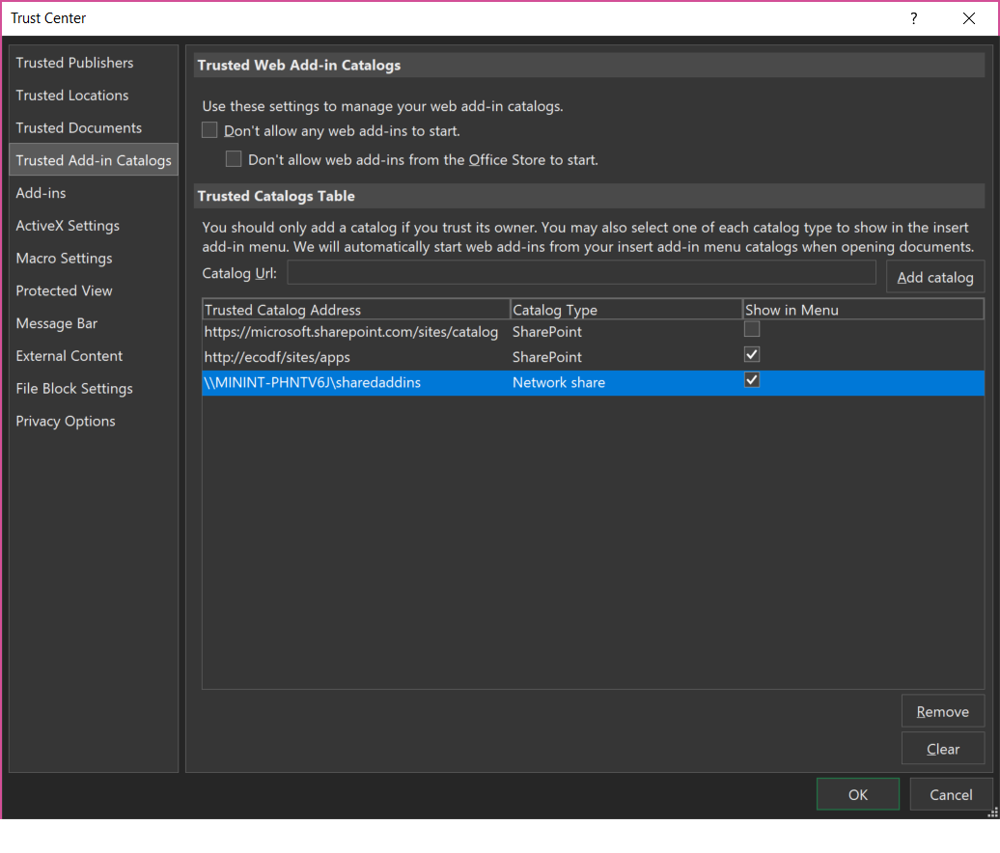
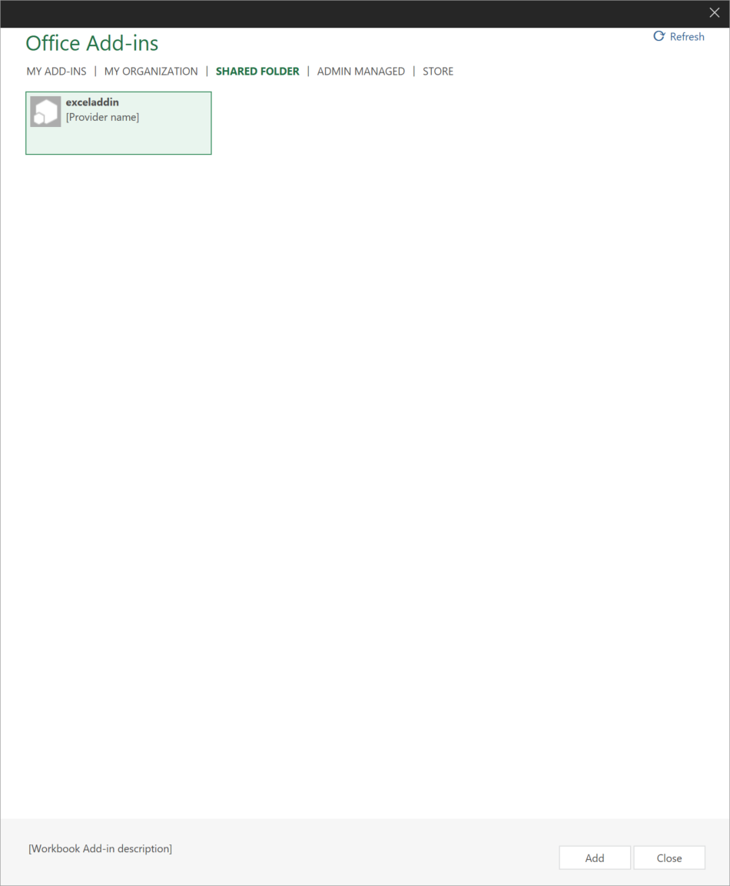
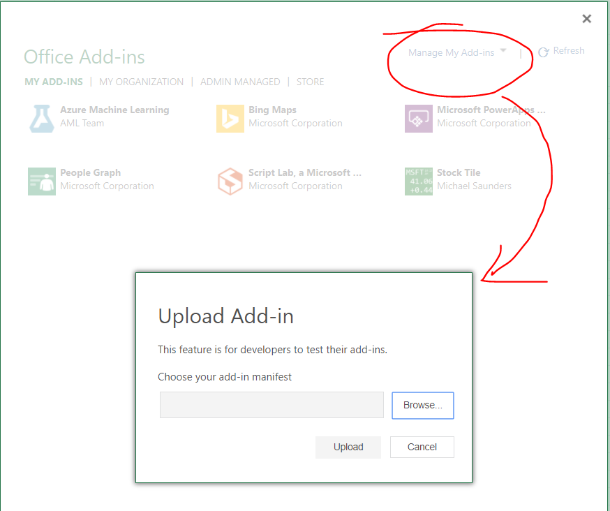
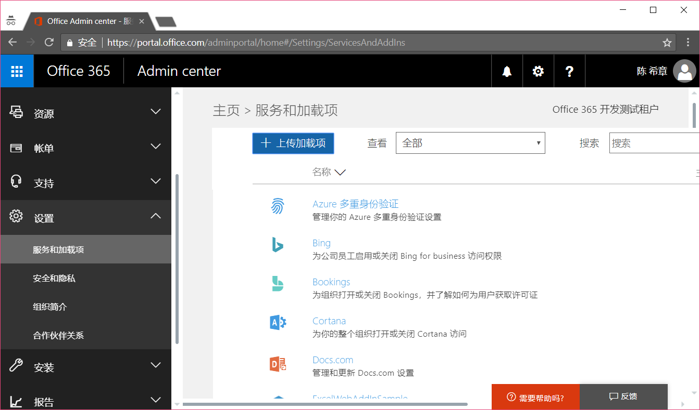
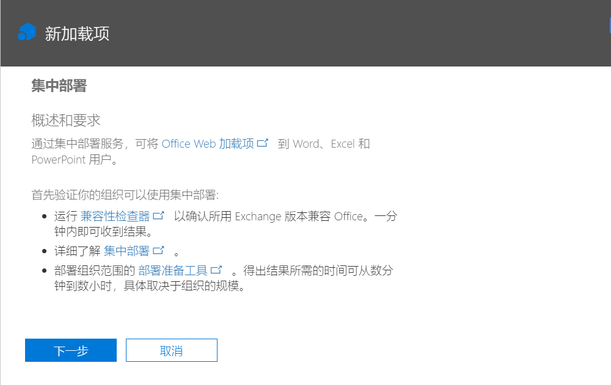
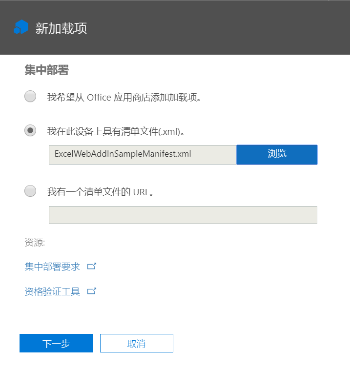
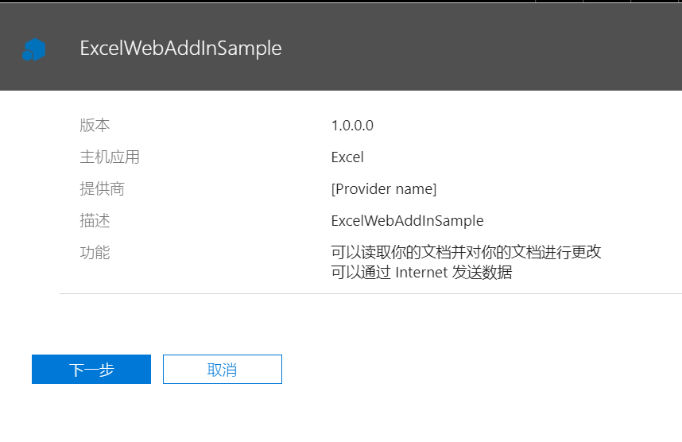
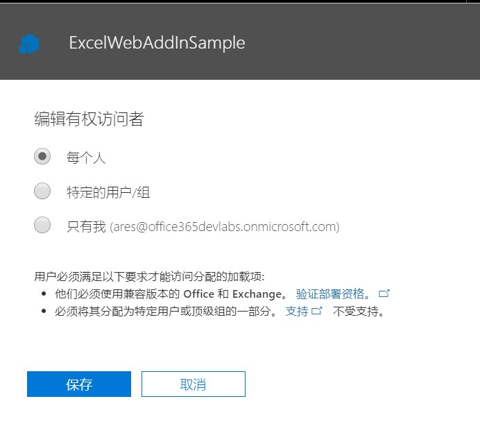
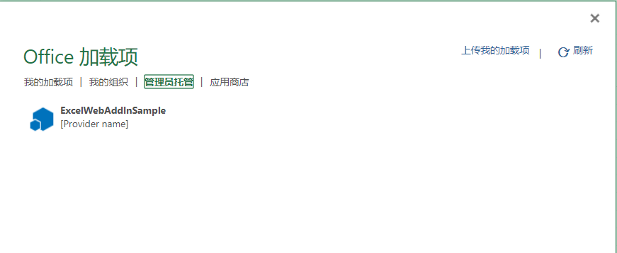
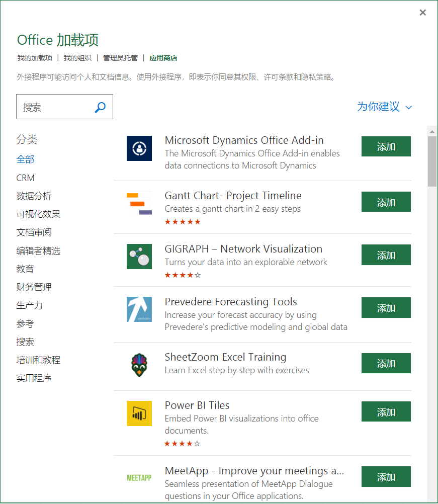

# 在企业和应用市场发布Office Add-in
> 作者：陈希章 发表于 2017年12月20日

我已经写了很多关于Office Add-in的内容，而且我相信你已经尝试过创建一两个Add-in了吧。作为一个开发人员，你有多种方式在自己的机器上使用你的作品，例如

1. 如果你是用Visual Studio开发，这是最简单的，你直接按F5就可以了
1. 你可以将manifest文件（其实就是一个XML文件）保存到一个共享目录，然后通过在Office客户端中，添加这个共享目录作为信任位置，然后然后将这个目录加入到Office客户端的信任位置中去，然后在插入菜单中能找到这个Add-in。关于这个操作，如果不清楚，可以参考 [这篇文章](vscodetoofficeaddin.md)

    

    > 如你所见，这里还可以设置其他一些catalog的路径，包括SharePoint站点。这个会在后续进行介绍。

    完成上述步骤后，你就可以在插入add-in的窗口中看到相关的add-in了

    

1. 在Office Online里面，直接上传这个manifest文件，也可以实现跟第二种场景的效果。

    

而本文主要讨论的是如何去分发你的开发成果。例如你要给同事去试用，他们该怎么去安装呢？当然，他们可以按照的第二种和第三种的做法，但如果要大面积部署的话，你需要了解如何在企业中部署你的应用。值得高兴的是，现在Office 365的管理中心直接提供了这样的功能，称之为“集中部署”。你需要以全局管理员的身份登陆到Office 365管理中心，然后选择左侧导航中的“设置”=》“服务和加载项”菜单

点击“上传加载项”

在接下来的界面中，管理员将拥有三种选项。本例而言，我们选择第二种方式。

点击“下一步”

接下来可以设定这个Add-in的可见范围

完成这样的操作后，你可以在“管理员托管”这个分类中找到这些集中部署的Add-in，如下图所示

> 我这里给大家准备了一个范例的Add-in的清单文件，你可以直接用它来做练习。该文件可以通过这里下载 [ExcelWebAddinSample](assets/ExcelWebAddInSampleManifest.xml)

当然，你还可以将应用发布到Office Store（应用商店）中，这样全球的Office 365 用户都可以通过一个统一的位置安装和使用你的应用。

发布到Office应用商店的细节，我不准备在这个文章中展开细节，请参考官方文档 <https://docs.microsoft.com/en-us/office/dev/add-ins/publish/publish>，大体上，有如下的几个步骤

- 你需要有一个Office 开发者账号，目前是免费申请的
- 你的应用在发布之前，应该通过一个工具进行检查
- 提交给商店后，会由微软的团队负责审核，这个需要一定的时间，而且并不能确保每个人的申请都会被接受

> 请注意，因为众所周知的原因，Office Store将会有至少会有两个版本，[国际版](https://store.office.com)和中国版。中国版将有望在2018年落地。
