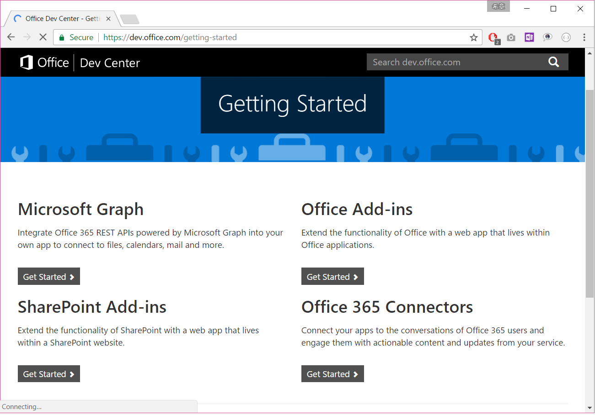
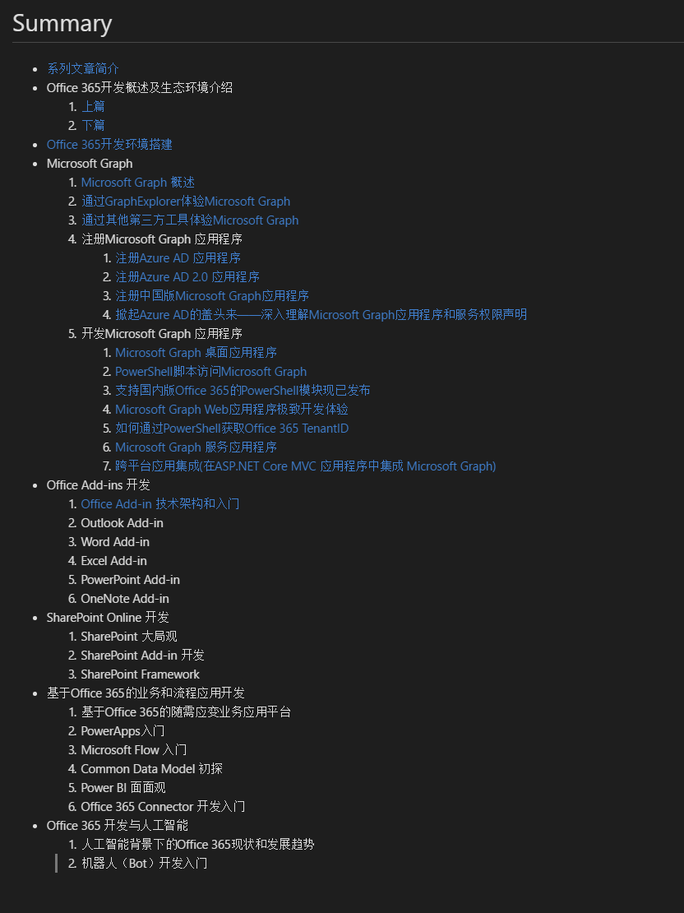
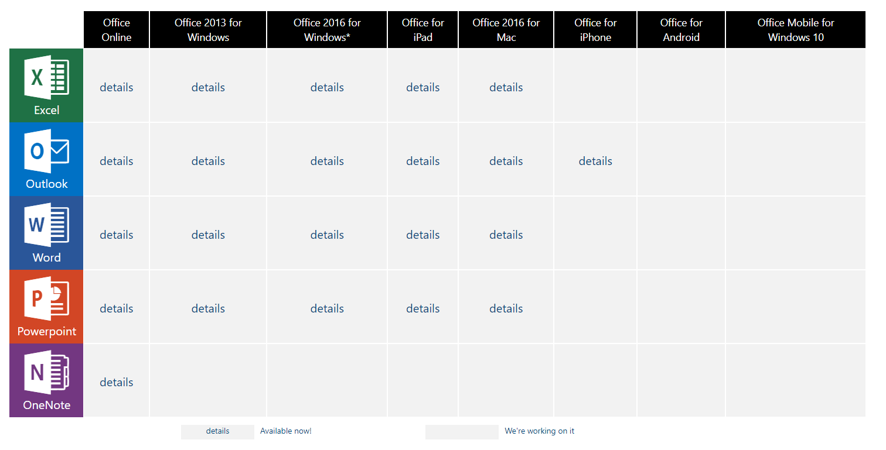

# Office Add-in 架构和入门
> 作者：陈希章 发表于2017年7月12日

## 引子

从2月26日开始写这个Office 365开发概览系列文章—— <https://aka.ms/office365devguide>，到现在已经有17篇文章。此前的这个阶段，我将主要的精力集中在Microsoft Graph的介绍和实例演示，有很多细节的研究，尤其是针对Office 365两个版本（国际版和国内版），Azure AD的两个版本（v1.0和v2.0）都有针对性的比较。Microsoft Graph 显然值得我花那么多时间，而且还有很多值得深入探究的地方，但是现在是时候将镜头拉回来看看Office 365开发的全貌以及其他有意思的方向了。

不忘初心，方得始终。以下最新版本的目录，请大家参考，这个系列文章将完整覆盖但不仅限于上面提到的Office 365开发四大方向。

## Office Add-in 开发概述

Microsoft Graph可以让你的业务系统很容易地和Office 365 **集成** 起来，立即利用Office 365的强大服务增强业务应用能力。而Office Add-in则是面向所有的Office 365 & Office 开发人员的盛宴，它用来**扩展**Office 365 & Office的能力，用中国话讲就是“插件”。只要你愿意，你随时可以为自己及周围的同事定制一些有意思的功能，它们在本机的客户端（PC & Mac）和云端的在线版本（Office Online）、手机的App里面都能运行，并且得到一致性的体验。进一步地说，你还可以将这个插件发布到Office Store中去，全世界数以十亿计的Office 365 & Office用户都可以使用你的杰作。

所以，总结起来说，Office Add-in的开发有如下的特点
1. 面向Office 365的订阅用户，也面向Office 2013或2016的本地用户。但后者可能在某些细节功能上面略有差异。
1. Office Add-in的开发采用了全新的技术架构（Web Add-in，后续会专门介绍），其主要目的在于想要实现"**一次编写，处处运行**"。
1. Office Add-in拥有一个成熟的生态环境，有庞大的用户群体（不完全统计，地球上1/7的人们在使用Office），有[Office Store](https://store.office.com/en-us/appshome.aspx?ui=en-US&rs=en-US&ad=US)，也有配套的[技术社区](https://techcommunity.microsoft.com/)

截至现在，Office Add-in支持的运行平台和可扩展的应用如下图所示

> 这个范围可能会随着时间推移发生变化，请关注 <https://dev.office.com/add-in-availability>

## Web Add-in 技术架构

毫无疑问，Office 的扩展开发拥有悠久的历史，也拥有包括我在内的很多忠实的粉丝。关于这段历史及其演化，我有两篇专门的文章介绍，有兴趣请参考

1. [Office 365开发概述及生态环境介绍（一）](https://chenxizhang.gitbooks.io/office365devguide/content/docs/office365dev-overview-1.html)
1. [Office 365开发概述及生态环境介绍（二）](https://chenxizhang.gitbooks.io/office365devguide/content/docs/office365dev-overview-2.html)

相比较之前的VBA（Visual Basic for Application）和VSTO（Visual Studio Tools for Office）开发，我们将这一代的Office Add-in开发技术称为“Web Add-in”，顾名思义，就是使用最普遍的Web技术来进行Office Add-in的开发。实事求是地说，这一方面降低了技术的门槛，因为如果你已经有Web的开发经验，你将很容易地上手，无需特别学习。反过来说，这也增加了技术的门槛，对于一些早期的Office 插件开发者来说，这是一个不太熟悉的领域，要学的新东西不少，可能会增加大家的转换成本。无论如何，Web Add-in是一个有益的补充（使用它并不意味着要抛弃此前的VBA和VSTO），也是跨平台尤其是移动化的需要

## 在Visual Studio 中开发Office Add-in

## 在Visual Studio Code中开发Office Add-in

## 本地部署和调试

## Office Add-in的DevOps实践

## 发布到Office 365 App Catalog

## 发布到Office Store

## 结语