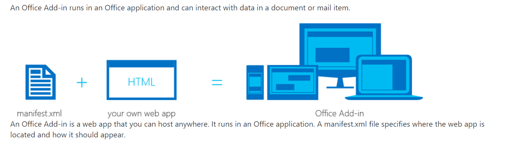
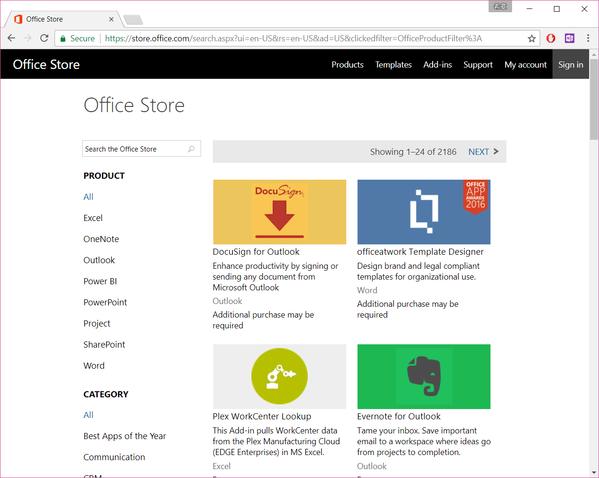
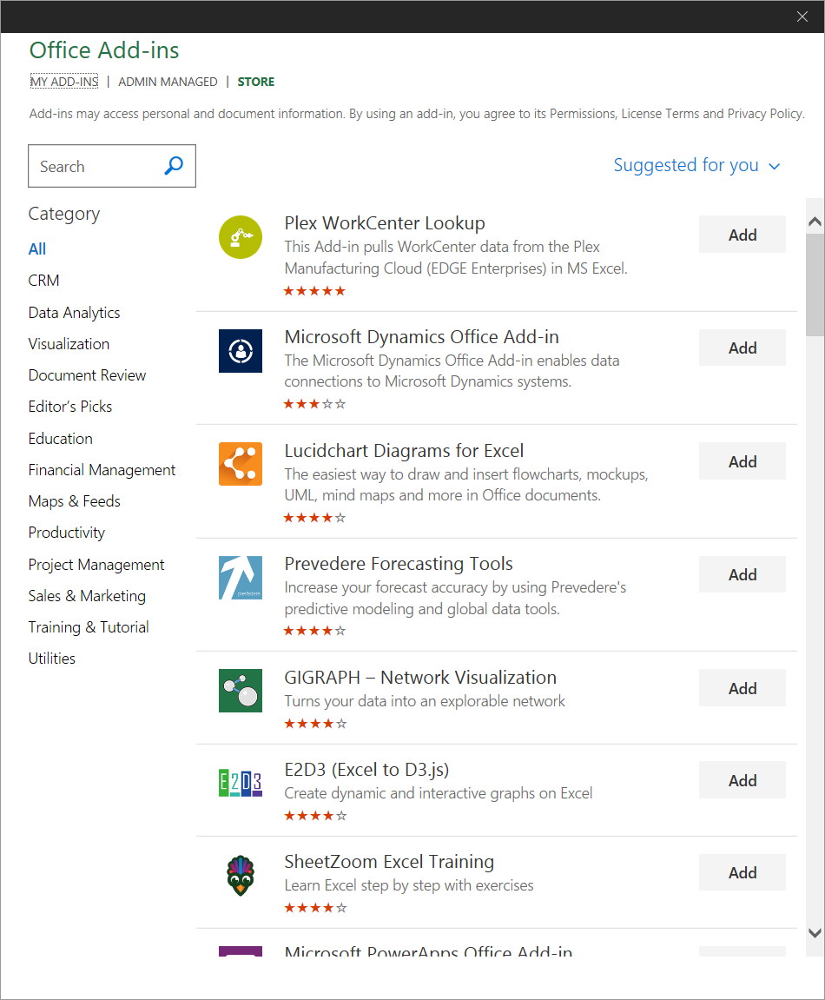
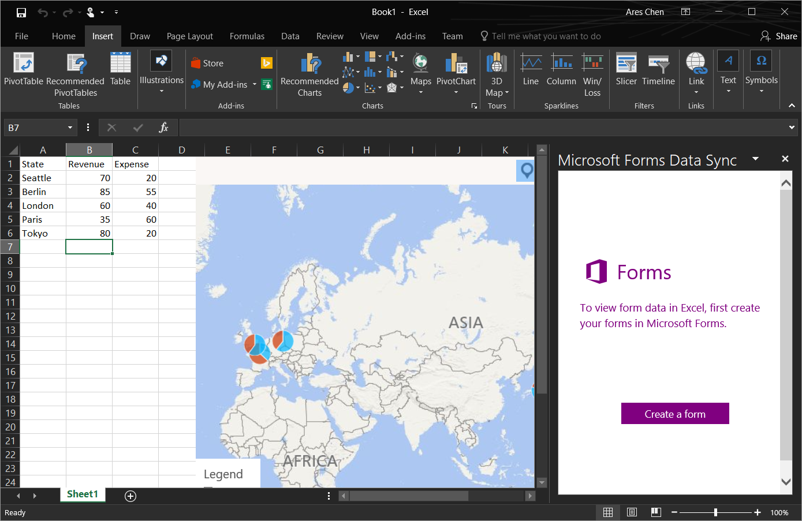

# Office Add-in 架构和入门
> 作者：陈希章 发表于2017年7月12日

## 前言

从2月26日开始写这个Office 365开发概览系列文章—— <https://aka.ms/office365devguide>，到现在已经有17篇文章。此前的这个阶段，我将主要的精力集中在Microsoft Graph的介绍和实例演示，有很多细节的研究，尤其是针对Office 365两个版本（国际版和国内版），Azure AD的两个版本（v1.0和v2.0）都有针对性的比较。

Microsoft Graph 显然值得我花那么多时间，而且还有很多值得深入探究的地方，但是现在是时候将镜头拉回来看看Office 365开发的全貌以及其他有意思的方向了。

不忘初心，方得始终。以下最新版本的目录，请大家参考，这个系列文章将完整覆盖但不仅限于上面提到的Office 365开发四大方向。

## Office Add-in 开发概述

Microsoft Graph可以让你的业务系统很容易地和Office 365 **集成** 起来，立即利用Office 365的强大服务增强业务应用能力。而Office Add-in则是面向所有的Office 365 & Office 开发人员的盛宴，它用来**扩展**Office 365 & Office的能力，用中国话讲就是“插件”。只要你愿意，你随时可以为自己及周围的同事定制一些有意思的功能，它们在本机的客户端（PC & Mac）和云端的在线版本（Office Online）、手机的App里面都能运行，并且得到一致性的体验。进一步地说，你还可以将这个插件发布到Office Store中去，全世界数以十亿计的Office 365 & Office用户都可以使用你的杰作。

所以，总结起来说，Office Add-in的开发有如下的特点
1. 面向Office 365的订阅用户，也面向Office 2013或2016的本地用户。但后者可能在某些细节功能上面略有差异。
1. Office Add-in的开发采用了全新的技术架构（Web Add-in，后续会专门介绍），其主要目的在于想要实现"**一次编写，处处运行**"。
1. Office Add-in拥有一个成熟的生态环境，有庞大的用户群体（不完全统计，地球上1/7的人们在使用Office），有[Office Store](https://store.office.com/en-us/appshome.aspx?ui=en-US&rs=en-US&ad=US)，也有配套的[技术社区](https://techcommunity.microsoft.com/)

截至现在，Office Add-in支持的运行平台和可扩展的应用如下图所示

> 这个范围可能会随着时间推移发生变化，请关注 <https://dev.office.com/add-in-availability>

## Web Add-in 技术架构

毫无疑问，Office 的扩展开发拥有悠久的历史，也拥有包括我在内的很多忠实的粉丝。关于这段历史及其演化，我有两篇专门的文章介绍，有兴趣请参考

1. [Office 365开发概述及生态环境介绍（一）](https://chenxizhang.gitbooks.io/office365devguide/content/docs/office365dev-overview-1.html)
1. [Office 365开发概述及生态环境介绍（二）](https://chenxizhang.gitbooks.io/office365devguide/content/docs/office365dev-overview-2.html)

相比较之前的VBA（Visual Basic for Application）和VSTO（Visual Studio Tools for Office）开发，我们将这一代的Office Add-in开发技术称为“Web Add-in”，顾名思义，就是使用最普遍的Web技术来进行Office Add-in的开发。

实事求是地说，这一方面降低了技术的门槛，因为如果你已经有Web的开发经验，你将很容易地上手，无需特别学习。反过来说，这也增加了技术的门槛，对于一些早期的Office 插件开发者来说，这是一个不太熟悉的领域，要学的新东西不少，可能会增加大家的转换成本。无论如何，Web Add-in是一个有益的补充（使用它并不意味着要抛弃此前的VBA和VSTO），也是跨平台尤其是移动化的需要。

从技术的角度来看，Web Add-in确实跟早期有较大差异。下图可以看出来，Web Add-in是由两个部分组成的，首先是用来声明Add-in的manifest文件，这是一个标准的XML文件，其次是一个标准的Web应用程序。所有的功能都是在Web应用程序中实现的，对于具体用什么技术来实现没有要求，其核心是会调用到Office.js这个脚本文件完成与Office 应用程序的交互。采用这种结构，则有利于开发和部署的分离。通常来说，我们开发好的Web应用可以部署到任意地方，而给到Office 管理员或者用户的，只是那个manifest文件即可。

> Office.js 是对Office应用程序对象模型的封装。它还在不断地完善，但与VBA和VSTO拥有的完整COM对象模型还是会略有差异。有兴趣请关注 <https://dev.office.com/reference/add-ins/javascript-api-for-office>

所以，如果要谈Web Add-in的技术架构，你需要了解几个方面
1. 掌握一门Web应用开发技术（不管是微软的ASP.NET，或者ASP.NET Core，还是PHP,NodeJS,Python等，都是可以的）
1. 掌握Web应用程序的托管技术（你可以部署在自己的托管服务器上面，也可以部署在微软的Azure App Service里面）
1. 了解如何将manifest文件分发给用户（你可以将文件给用户，也可以集中在Office 365中部署，也可以发布到Office Store）

值得注意的是，Web Add-in对于运行的环境也有一定的要求，请参考 <https://dev.office.com/docs/add-ins/overview/requirements-for-running-office-add-ins>，我这里特别指出是浏览器兼容性。
1. 如果是在Windows上运行，那么必须至少安装IE 11，哪怕不是将其设置为默认浏览器。
1. 不管是在Windows 还是 MacOS上面，只接受五种浏览器设置为默认浏览器：IE 11(或更高版本)，最新版本的Microsoft Edge, Chrome, Firefox， Safari。

## Office Add-in 能做什么

那么，Office Add-in到底能做什么呢？它能做两部分事情

1. 为 Office 客户端添加新的功能。例如点击某个工具栏按钮后，调用外部的服务来处理文档或者邮件之类的。这种插件，通常会注册一些命令（Add-in command)，关联到Office Ribbon区域中，当用户点击后，要么就直接根据当前上下文（Office Context）进行操作，更为常见的是会打开一个任务面板（Task Pane），提供一个界面，让用户可以进一步根据需要操作。
1. 为 Office 文档添加新的内容。这个主要指的是在Excel和PowerPoint中，可以为文档插入一些特殊的对象，例如地图，图表和可视化元素等。

还有一些技术细节你可能有兴趣了解
1. 创建自定义的Ribbon按钮和选项卡来扩展Office原生的界面
1. 使用HTML和Javascript的技术创建交互界面和逻辑
1. 可以搭配业界流行的Javacript框架（包括jQuery,Angular,TypeScript）使用，简化开发
1. 使用HTTP和AJAX的技术调用外部服务
1. 可以运行服务器代码和逻辑，如果使用ASP.NET和PHP等技术的话

## Office Add-in 一瞥

截至目前，在Office Store里面有2186个不同类型的Office Add-in

>请注意，上面截图是国际版Office Store。句我得到的信息，今年的晚些时候，国内版的Office Store将很快跟我们见面。

在每个不同的Office应用程序中，通过在“插入”选项卡中选择“Add-ins”这个分组中的“Store”按钮，可以查看到与该应用程序直接相关的所有Add-in

下图我展示了几个在Excel运行的Add-in效果

## 结语

Office 365 不仅仅是无可争议的高效办公第一选择，而且秉持一贯以来的优良传统，它是一个很开放的可扩展平台。除了继续支持VBA和VSTO的扩展方式，新一代Web Add-in 将全面实现“一次编写，处处运行”的目标，发挥你的创意，定制专属的功能，可以在台式机、网页、平板、手机中得到一致性的使用体验，并且还可以与全世界的数以十亿计的Office 365用户分享。