# 人工智能背景下的Office 365现状和发展趋势
> 作者：陈希章 发表于 2017年7月31日

## 引子

谈论人工智能是让人兴奋的，因为它具有让人兴奋的两大特征 —— 每个人都似乎知道一点并且以知道一点为荣，但又好像没多少人能真正讲的明白。毫无疑问，我也系仅仅是知道一点点，这一篇文章试图想通过比较接地气的方式给一部分人讲明白。这还得说要感谢这样一个时代，换做是几年前我是绝不敢造次的 —— 那时虽然人工智能也并不稀奇，但大抵都是王谢堂前的燕儿，而如今随着技术的发展，人工智能不再高不可攀，变得和我们日常工作生活密切相关、看得见摸的着了。

人工智能已经从一个概念，到原型实践，到现在的产业化，甚至前不久国务院还专门印发了“[新一代人工智能发展规划](http://www.gov.cn/zhengce/content/2017-07/20/content_5211996.htm)”，所以从这个意义上说，我写这篇文章不仅恰逢其时，并且在政治上非常正确了。

> 和很多"突然"成为热点的技术一样，人工智能在坊间也流传着一些真假难辨的传奇故事，例如下面这一则：

    客户：我想做一个人工智能项目，你给我做个方案吧？
    销售：做人工智能干啥？我看现在也不太成熟，不如做个大数据项目先吧。
    客户：我也不懂它能干啥，我手头有3000万的预算还没有用完。
    销售：哎呀，你怎么不早说呢？那我们就来做一个3000万的人工智能项目吧。

## 微软人工智能，增强人类智慧

人工智能到底是指什么？下面先来看一段维基百科的[定义](https://zh.wikipedia.org/zh-hans/%E4%BA%BA%E5%B7%A5%E6%99%BA%E8%83%BD)

> 人工智能的定义可以分为两部分，即“人工”和“智能”。“人工”比较好理解，争议性也不大。有时我们会要考虑什么是人力所能及制造的，或者人自身的智能程度有没有高到可以创造人工智能的地步，等等。但总括来说，“人工系统”就是通常意义下的人工系统。
关于什么是“智能”，就问题多多了。这涉及到其它诸如意识（consciousness）、自我（self）、心灵（mind），包括无意识的精神（unconscious mind）等等问题。人唯一了解的智能是人本身的智能，这是普遍认同的观点。但是我们对我们自身智能的理解都非常有限，对构成人的智能必要元素的了解也很有限，所以就很难定义什么是“人工”制造的“智能”了。因此人工智能的研究往往涉及对人智能本身的研究。其它关于动物或其它人造系统的智能也普遍被认为是人工智能相关的研究课题。
人工智慧目前在计算机领域内，得到了愈加广泛的发挥。并在机器人、经济政治决策、控制系统、仿真系统中得到应用。

这是一个透过现象看本质的定义，但并不是那么好理解。反过来，如果我们从本质出发看现象，也就是用大白话来说 :人工智能的核心是算法，基础是数据，表现形式为机器人或类机器人应用程序。有趣的是，算法会越来越复杂，属于真正的高科技领域；而应用程序这一端则会越来越简单，以后也许中小学生都能做自己的机器人程序。

微软在人工智能这个领域一直在投入研究资源，并且在2016年9月份专门成立了“微软人工智能与研究事业部”，由微软全球执行副总裁、技术与研发部门主管沈向洋博士领导。与此同时，微软与其他4家科技巨头亚马逊、谷歌、Facebook和IBM还共同成立了AI联盟，用以推动公众对人工智能技术的理解。

微软人工智能的目的是增强人类智慧，在今年的[Build大会](https://blogs.microsoft.com/blog/2017/05/10/microsoft-build-2017-microsoft-ai-amplify-human-ingenuity/#sm.0000pp7q6tmuke8uvy11u462jmkcy) 上，沈向洋博士用更加清晰和具体的行动计划诠释了这一点。

微软将通过如下两个方面来实现这一目标

1. **Bringing AI to every developer** —— With Microsoft Cognitive Services, developers can build apps that recognize gestures, translate text in multiple languages, deconstruct video for quicker search, editing and real-time captioning, and even customize data to recognize images in categories most important to customers.
1. **Redefining Microsoft with AI** —— We are infusing AI into every product and service we offer, from Xbox to Windows, from Bing to Office.

而如果想进一步了解这方面的细节，我强烈推荐大家阅读微软亚洲研究院院长洪小文博士在“二十一世纪的计算”学术研讨会所做的报告[《Co-Evolution of Artificial Intelligence and Human Intelligence —— 人工智能和人类智能的 “共进化”》](https://www.leiphone.com/news/201611/jVCnhaDqAUnU5kt7.html?viewType=weixin)，这个报告非常具体、生动地给我们展示了人工智能的三个能力（视觉识别，自然语言理解，数据分析）和智能的四个阶段（功能，智能，智力，智慧）。

## 微软人工智能总体框架和战略

通过下面一张图可以全面了解微软的人工智能总体框架和战略：智能来自于数据，服务于决策。

如果再用大家更加喜闻乐见的产品或服务来介绍，则可以分为下面四个方面

1. 大多数人看到人工智能的威力，都是从一些数字化助手开始的。微软目前有严肃活泼的私人工作助理**小娜（cortana）**，也有集智慧和美貌于一身的**小冰**，以及辅助学习英语的**小英**。有关小娜的详细介绍，请参考 <https://www.microsoft.com/zh-cn/windows/Cortana>。

1. 数字化助手毕竟是有限的几个，更加广阔的场景则会出现在应用程序这个大类别中，这也是前面提到的“Redefining Microsoft with AI”的具体体现。**Windows**，**Office 365**等核心应用程序都将极大地增强智慧水平，以便更好地帮助用户聪明地工作和生活。有关Office 365的基本情况，请参考 <https://products.office.com/zh-CN/>。

1. 而不管是数字化助手，还是微软的应用程序，他们的人工智能的能力都来自于目前已经初具规模的**微软认知服务**，它基本囊括了听说读写看的常规能力，以及一部分理解能力。（这些在我们看来还是属于常识层面的，也就是洪小文博士提到的具备功能，和一点点智慧的层次）。但是，这是一个很好的起点，更重要的是，广大的开发人员可以站在微软的肩膀上，结合自己的业务需求，开发自己的人工智能应用。这是“Bringing AI to every developer”的承诺和输出。有关认知服务的详细介绍，请参考 <https://azure.microsoft.com/zh-cn/services/cognitive-services/>。

1. 最后，使用**微软智能云（Azure）**，不管是与物联网结合的IoT套件，还是大数据量的存储和处理，以及应用开发和运营一体化等，可以为你的人工智能应用提供可靠、强大的支撑。了解Azure的基本情况，请参考 <https://www.azure.com> 和 <https://www.azure.cn> 。

## Office 365已经具有的AI能力

接下来给大家介绍的是，Office 365目前已经具备的人工智能（AI）能力。Office 365在全球范围内目前每月活跃用户超过1亿，在数字化转型的时代，无论是对于客户及用户而言，还是对于微软来说，都是极为重要的一个生产力服务平台。沈向洋博士在履新不久接受专访时提到，微软的人工智能部门将投入大量的资源，在近一两年内会为Office 365的智慧水平提升到一个新的级别。而在近半年多来，我们已经看到Office 365的很多创新功能，并且有理由相信这仅仅是一个开始。

1. **Cortana with Office 365**
    
    前面已经提到Cortana 是 Windows 10 设备上的个人助理。Windows 10 中的 Cortana 非常适合你快速查看日程安排，了解你的第一个会议的时间和地点，大致了解适当的差旅时间或甚至从你的日历中获取更新以了解未来的行程。Cortana 在连接到 Office 365 时更加出色，其能力得到增强，可帮助你准备会议、了解与你共事的人员并提醒你接下来要去的地方，以防你迟到。详情请见 <https://support.office.com/zh-cn/article/Cortana-integration-with-Office-365-7257cb50-0d5c-4f7a-ac2e-9fe5d13bb5cb> 和 <https://docs.microsoft.com/zh-cn/windows/configuration/cortana-at-work/cortana-at-work-o365>

    

    管理员可以在Office 365管理中心控制是否允许Cortana访问组织中用户的数据
    

    而最终还需要得到用户的授权才可以完成Cortana的连接，充分保证用户的隐私
    

    Cortana目前不光是在桌面的Windows 10中运行，据我所知，它还在深度整合在其他一些设备中，例如无人驾驶的控制台中。我虽然不太了解无人驾驶技术，但在这样一个全新的现代办公空间中，有Cortana，有Office 365，你工作相关的信息都可以一览无余，随时得到反馈，并且通过全新的对话式掌控一切，想一想都是很美的事情吧。这是已经实现的案例，如果有兴趣的话，请参考宝马汽车的故事 <http://www.bmwblog.com/2017/01/05/microsoft-cortana-coming-bmw-cars/>

    

1. **Tell me** —— 重新定义Office应用交互方式
    
    这是一个看起来不太起眼的小功能，但我觉得未来可能影响深远，因为它也代表了Office应用程序一种新的交互方式。我们都知道Office应用程序（Word，Excel，PowerPoint等）的功能非常强大，这个当然是好事情，但另外一方面来看，也确实造成用户一定的学习成本 —— 怎么样让用户找到他想要的功能呢？在Office 2003及以前的版本，用户的界面是一级一级的菜单；而从Office 2007开始，产品组设计了全新的Modern UI（Ribbon），将易用性提高了一个级别。但这种做法的局限性仍然是存在的，因为屏幕的尺寸总是有限的。

    现在，Office 365用户使用这些最新版的Office客户端应用程序的时候，将拥有一个全新的体验，你再也不需要记住你所要的功能在哪个菜单下面，或者那个Tab里面，取而代之的是你可以在一个固定的位置，用自然语言查找所需要的功能。你只需按下ALT+Q 这个快捷键，然后输入想要做的事情，Office 应用程序会聪明地知道你的想法，并且告诉你用什么功能来实现。

    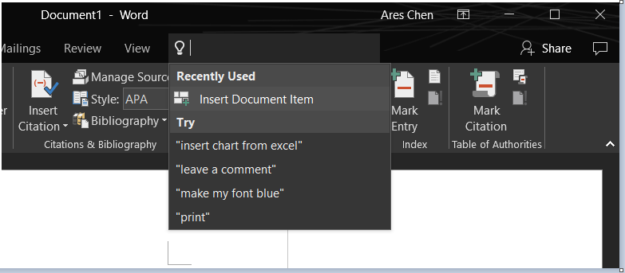

    目前这个功能支持文字输入，但其实如果设备支持的话，用户完全可以用语音来发出指令即可快速找到自己想要的功能，甚至完成后续的操作。这个功能的关键在于自然语言的理解能力。从我作为一个开发人员角度来看，如果这个接口能开放出来，让开发人员可以进行扩展，那将是一个革命性的进步。我相信我可以活着见到这个时刻的到来。

1. **Word** —— Editor, Tap，Research，Smart Lookup

    毫无疑问，Word是世界上最好的字处理软件之一。尽管如此，我们还在不断地创新。最新版本的Word编辑器具有非常智能的特性，可以在你写作的时候提供及时反馈，纠正拼写错误是最基本的，它甚至可以帮助你提供更好的书写建议。

    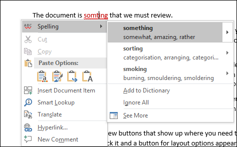
    
    在2016年10月份，Office 365用户拥有一个全新的功能—— Tap（Insert Document Item），它允许在不离开Word的情况下查找本地文件夹、个人网盘，团队工作区中的文档内容，并且可以按需将一些感兴趣的片段插入到文档中来。关于这项功能的详细说明，请参考 <https://support.office.com/en-us/article/Find-and-use-the-content-you-need-when-you-need-without-leaving-Word-860118fc-1f61-41f6-922f-40084a284658?ui=en-US&rs=en-US&ad=US>

    >这个功能不是Word独有的，Office 365用户在使用Outlook编写邮件的时候，也可以拥有同样的全新体验。
    
    Tap这个功能可以通过如下的菜单访问到

    

    然后可以在下面的面板中进行搜索

    

    另外一个很有用的功能（Researcher），一看名字就知道是研究人员的最爱。它可以在你撰写研究材料的时候，在不离开Word的情况下，在线搜索网络上面公开可以被引用的资源(由Bing提供学术搜索支持），然后将其片段插入到当前文档中，并自动生成引用等信息。关于这项功能的详细信息，请参见 <https://support.office.com/en-us/article/Research-for-your-paper-easily-within-Word-1728f286-8702-4d72-8169-ab7677ca0e1f>

    你可以在References这个Tab中找到该功能

    

    它的基本使用效果如下

    

    Smart Lookup则是另外一项基于Bing提供的搜索服务,相比较Researcher而言，它提供的见解会更加广。

    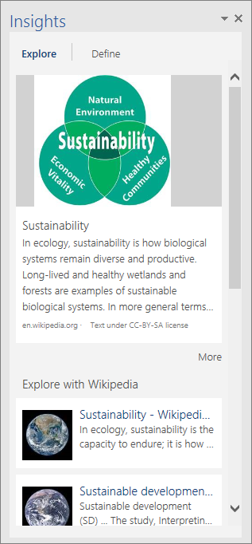

1. **Excel** —— PowerMap，PowerPivot，PowerView系列工具
    
    Excel作为一个专业的数据及分析工具，它在商业智能——Business Intelligence（BI）有颇多建树，但目前在人工智能——Artificial Intelligence（AI）方面的应用还不太多。
    
    > Smart Lookup和Tell me这两项是属于通用功能,在Excel中也能使用。

    请关注Excel的BI系列工具

    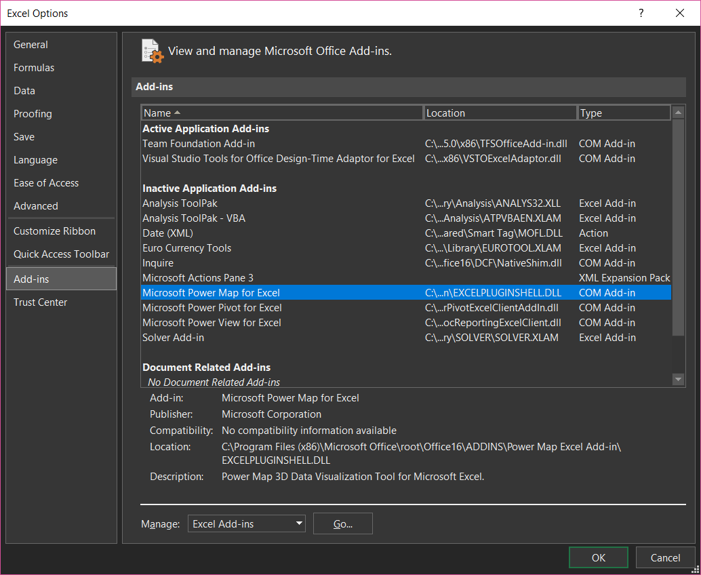

    PowerMap是一个3D 的图形化展示工具，可以基于多种不同的数据源进行呈现

    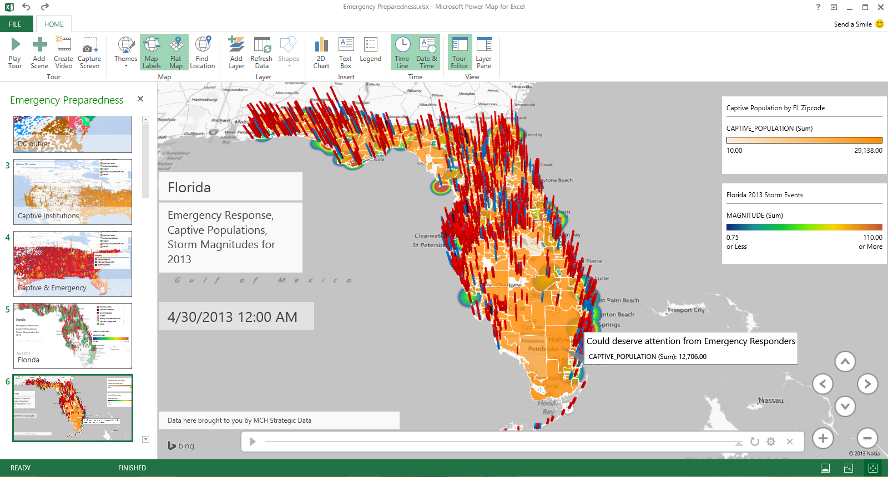

1. **PowerPoint** —— Zoom，Morph，Designer，Translator

    和很多人一样，我的日常工作已经跟PowerPoint离不开了，但我一直以来也只能算是PowerPoint的初级用户，自认为并不擅长制作既有Power又有Point的材料，而且作为一个理工男很难看到这方面能有所改善的迹象。谢天谢地，我终于等来了PowerPoint的这一代产品，它的四个新功能我都很喜欢，甚至可以说是爱不释手了。

    Zoom（中文翻译为缩放），可以快速帮助我们建立PowerPoint的骨架，并且可以自动实现转场效果。典型情况来说，我们的一个演示文稿通常都应该有一个大纲，每个大纲的题目又对应了几个细节展开的页面，而每切换到一个大纲题目的时候，为了给观众知道当前所处的位置，我们通常会复制大纲页面，然后手工地做一个转场。这并不难，但比较繁琐。现在有了Zoom，一切都会简单。

    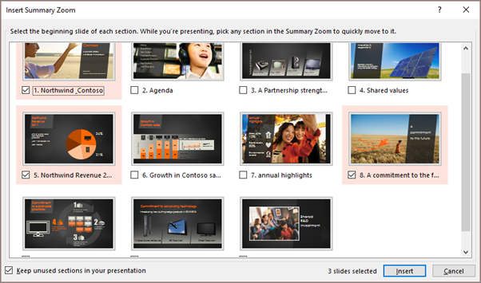

    Zoom 的详细介绍请参见<https://support.office.com/en-us/article/Use-Zoom-for-PowerPoint-to-bring-your-presentation-to-life-9d6c58cd-2125-4d29-86b1-0097c7dc47d7?ui=en-US&rs=en-US&ad=US>, 这里还有中文介绍 <http://mp.weixin.qq.com/s?__biz=MzAwNzA3NjAzNw==&mid=303874520&idx=1&sn=ed7d11854ec75380ca540d18e397753b&scene=19#wechat_redirect>

    Zoom解决的是整个演示文档的纲举目张的问题，而Morph（中文翻译为变体）则是专注于页面之间的平滑切换，通过一两次点击就可以实现以往我们可能要用专业级软件才能实现的动画转场效果，让你的演示文档不再枯燥乏味。

    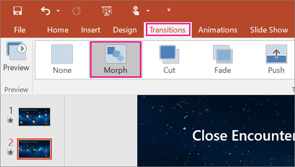
    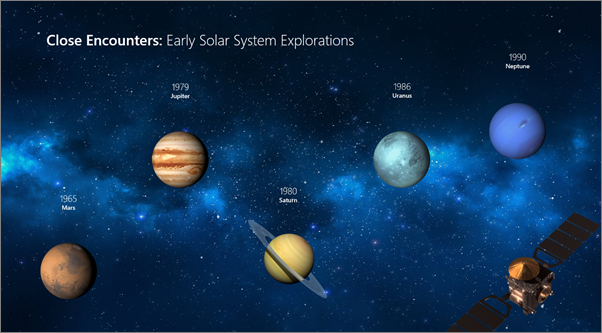

    Morph 的详细介绍请参见 <https://support.office.com/en-us/article/Use-the-Morph-transition-in-PowerPoint-8dd1c7b2-b935-44f5-a74c-741d8d9244ea?ui=en-US&rs=en-US&ad=US> 

    接下来的Designer（中文翻译为设计器）则更进一步，它可以根据页面内容（如文字，图片等）自动给出多种设计建议，用户要做的只是选择其中一条建议即可。我必须承认，自动用了这个Designer的功能后，我再也不怕做演示文稿了，我只需要专注于要展现的内容即可，至于展现形式它会帮我搞定，而且我发现用了它之后，我的演示文档的体积也能大幅减小（相比较之前用一些模板的情况），至于这是为什么，我也做了一些研究，后续再找个机会单独分享。

    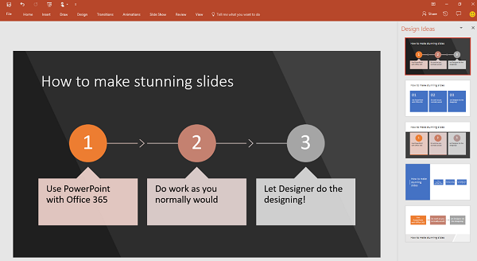

    Designer的详细介绍请参见<https://support.office.com/en-us/article/About-PowerPoint-Designer-53c77d7b-dc40-45c2-b684-81415eac0617?ui=en-US&rs=en-US&ad=US>

    好，用了Zoom，Morph，Designer，我担保你做出来的演示文稿水准可以上一个明显的台阶，但接下来的问题是如何交付出去，也就是说最后一公里的问题。我曾经真的遇到这样的情况，我精心准备的一份材料（当然是用中文写的），因为要给不同的客户去讲，所以就需要做多个语言版本，这个翻译工作很费时间，这么多个版本的材料也很难维护，甚至针对不同客户的讲解都需要请到不同的同事去讲。当然，世界是多姿多彩的，这本身很好，但这个要为不同语言准备不同的材料的状况有望得到彻底的改变，因为我们现在有专门用于PowerPoint的翻译利器 —— Presentation Translator。你可能不会想到，这居然是微软的一个内部车库项目的成果，不过没关系的，尽情享用它就好了。

    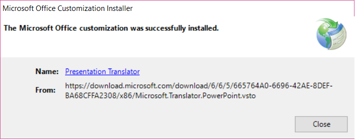
    
    下面一个例子就是演讲者用英语，自动显示法语的字幕

    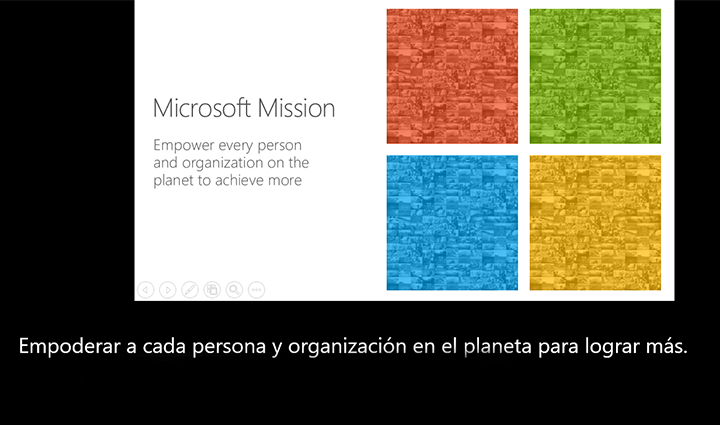
    
    Presentation Translator 的详细介绍请参见 <https://translator.microsoft.com/help/presentation-translator/>

1. **Outlook** —— focus Inbox、Tap

    邮件是现代生活的一个基石，时至今日它也成为商业活动所必不可少的一部分，全球每分钟发送的邮件都数以亿计。这样就会带来另外一个问题：邮件过多很可能会造成我们的工作受到干扰，而不是得到帮助，而如果你不幸遭受了垃圾邮件的攻击，那其中的痛苦是一定会让你记忆深刻的。（当然，如果使用Office 365的邮件服务，你将基本与垃圾邮件无缘）。

    应对邮件过多的挑战，虽然有一定的方法，例如我在2008年就写过这方面的文章，提到过[3D筛选法](http://www.cnblogs.com/chenxizhang/archive/2008/10/07/1305456.html). 但这里面的关键还是要知道哪些邮件是重点关心的，而另外一些则可以在空闲时间再翻看。

    Office 365用户使用最新的Outlook，它会使用一定的算法自动地帮助你将邮件分为两类，一类是重要的，一类是普通的。这个功能就叫Focus Inbox（重点邮箱）。当然，除了内置的算法，你可以手动地通过一些行为告诉Outlook哪些是你所认为的重要邮件。

    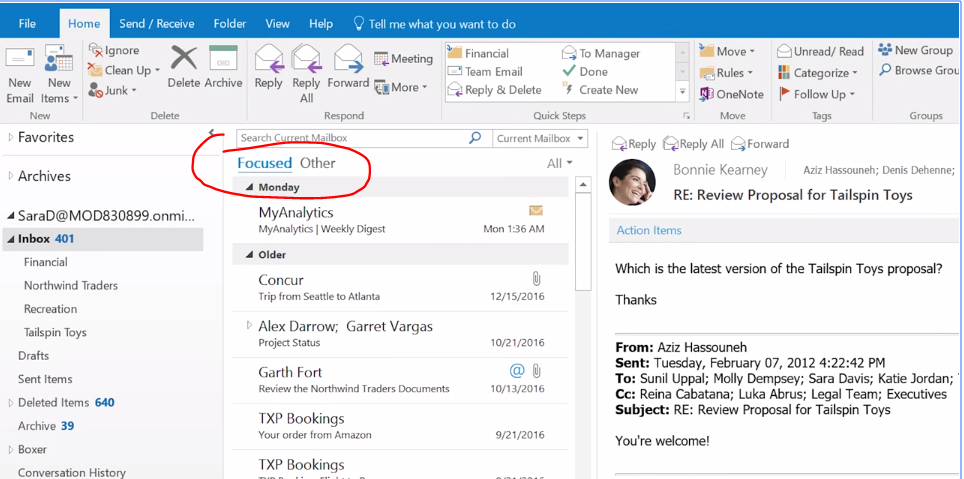

    关于重点邮箱的原则和更多信息，请参考 <https://support.office.com/zh-cn/article/Outlook-%E7%9A%84%E9%87%8D%E7%82%B9%E6%94%B6%E4%BB%B6%E7%AE%B1-f445ad7f-02f4-4294-a82e-71d8964e3978?ui=zh-CN&rs=zh-CN&ad=CN>

    关于Outlook中的Tap（Insert Document Item）的功能，此前在Word的那个小节已经介绍。你可以通过下图管中窥豹。

    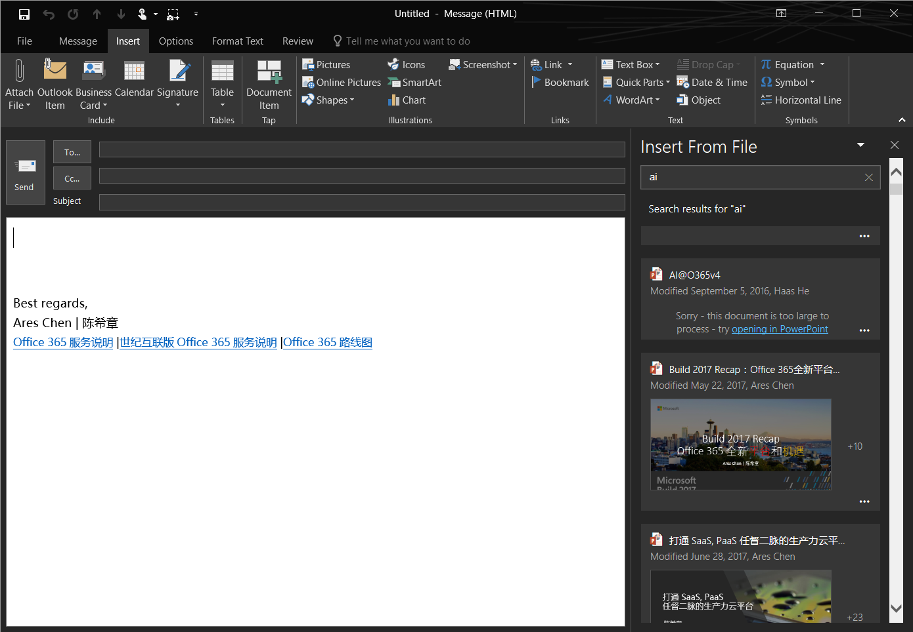

1. **Delve** —— My Analytics, Workplace Analytics，Discovery 

    Delve是Office 365用户专享的一个服务，而且目前只有云端的版本。你可以通过 <https://delve.office.com> 直接访问到该项服务，或者也可以通过Delve 的移动App进行操作。

    Delve 为你显示 Office 365 中的个性化内容（OneDrive for Business、SharePoint、Exchange 和 Yammer 等）。Delve 基于 Microsoft Graph 实现，能根据正在处理的工作以及与你合作的人员为你显示信息，并始终保持已具有的权限。

    

    关于Delve的入门介绍，请参见<https://support.office.com/zh-cn/article/%e4%bb%80%e4%b9%88%e6%98%af-Office-Delve%ef%bc%9f-1315665a-c6af-4409-a28d-49f8916878ca?ui=zh-CN&rs=zh-CN&ad=CN>

    关于如何在组织内部启用 Delve 以及了解Delve如何使用你的数据 ，请参见 <https://support.office.com/zh-cn/article/%E9%9D%A2%E5%90%91-Office-365-%E7%AE%A1%E7%90%86%E5%91%98%E7%9A%84-Office-Delve-54f87a42-15a4-44b4-9df0-d36287d9531b>

    Delve不仅仅了解你及周围的同事所做的事情（在得到你的许可的情况下），还能为你提供基于你的工作的数字化分析，乃至为团队或者整个组织提供生产力方面的统计分析，帮助我们更好地了解时间到底去哪了。

    MyAnalytics帮助您了解如何进行通信和花费在工作时间。设置您自己的目标，并让MyAnalytics度量进度。

    大部分什么看，如会议或时间某人对您的电子邮件答复中所花费的时间量，取决于您已经可以找到你的邮箱和日历中的数据。MyAnalytics只需执行放在一起的工作。信息提供了您可采取操作的见解。

    你看到的某些信息基于其他同你一样已打开 MyAnalytics 的人员正在做的事。例如，组织中人员花费在会议上的平均时间，或者组内成员阅读你的电子邮件的及时程度。隐私对我们而言非常重要，而 MyAnalytics 只显示满足最小大小的组的相关信息，并且为了保护用户隐私，不按姓名标识用户。

    

    MyAnalytics 还有一个[Outlook插件](https://support.office.com/zh-cn/article/Microsoft-MyAnalytics-Outlook-%e5%8a%a0%e8%bd%bd%e9%a1%b9-e305ae2d-6f16-4688-b2b0-487c4c2d067b?ui=zh-CN&rs=zh-CN&ad=CN)可供使用

    

    今年7月份正式推出的Workplace Analytics则为管理者提供了全新的方式了解团队和组织的工作效率，为改善工作环境提供见解。详情请参考 <https://blogs.office.com/en-us/2017/07/05/transform-your-organization-with-microsoft-workplace-analytics/>。

    

    > Delve目前暂时还没有出现在Office 365的国内版本中

1. **Skype for Business** —— EDI（Enterprise Deep Intelligence）

    Skype for Business是Office 365中的沟通套件，它提供了一对一的对话（支持文字，语音，视频等多种形式），以及高清音视频会议，以及现代化的PBX解决方案。EDI（Enterprise Deep Intelligence）这个2015年开始的研究项目，其主要目的是以简单聪明地解决“预定会议室”这件事情为入口，进行企业级别深度智慧应用及其研究。

    关于EDI的详细介绍，请参见 <https://www.microsoft.com/en-us/research/project/enterprise-deep-intelligence/>

    

    经过近两年的发展，EDI目前已经包括了多项功能，预定会议是我最常用的功能，除此之外还比较喜欢第四项功能

    

    目前这个项目的成果已经在微软公司内部推广使用，并且在少量的客户中进行了部署（由微软企业服务部提供服务）。从形式上来说，EDI其实就是一个机器人，而它后台使用的技术，很有可能就是认知服务早期的版本。只不过，当时还不叫认知服务吧。

1. **Microsoft Teams & Skype for Business** —— Bot

    我需要隆重给大家介绍Office 365家族中的新成员——Microsoft Teams。它是一款全新的以聊天为基础的协作沟通工具，整合了Office 365的很多服务，并且作为Office 365的一站式前端应用为用户提供了聊天，团队和项目协作，会议等功能。

    不仅如此，Microsoft Teams为Office 365引入了机器人（Bot）的应用场景，事实上，它的帮助系统就是通过一个机器人—— T-bot—— 来实现的

    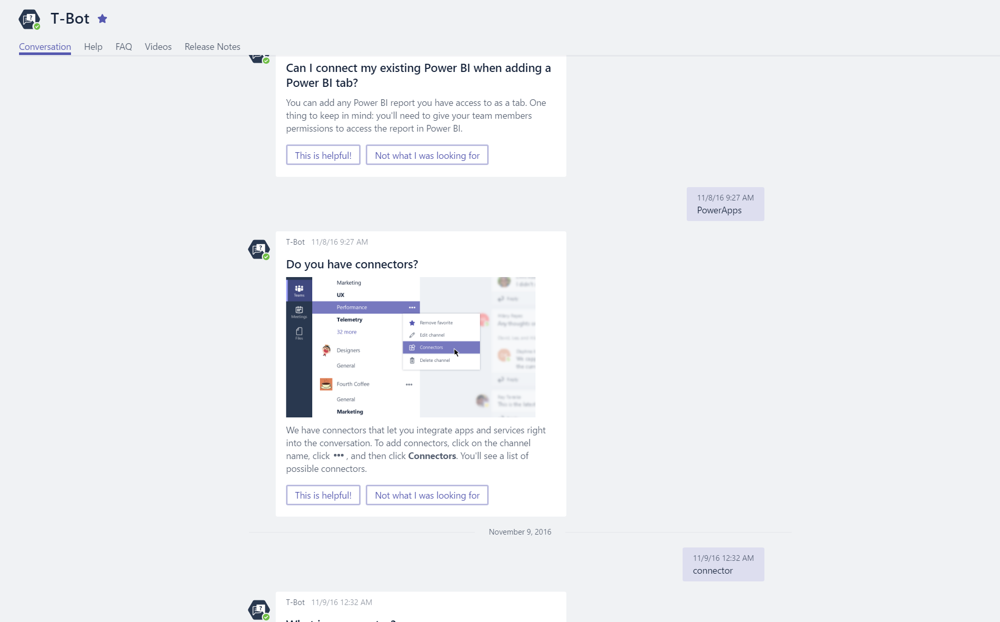
    
    同时Microsoft Teams支持用户自定义机器人，目前在官方的市场中，已经有超过30个功能各异的机器人供用户选用。

    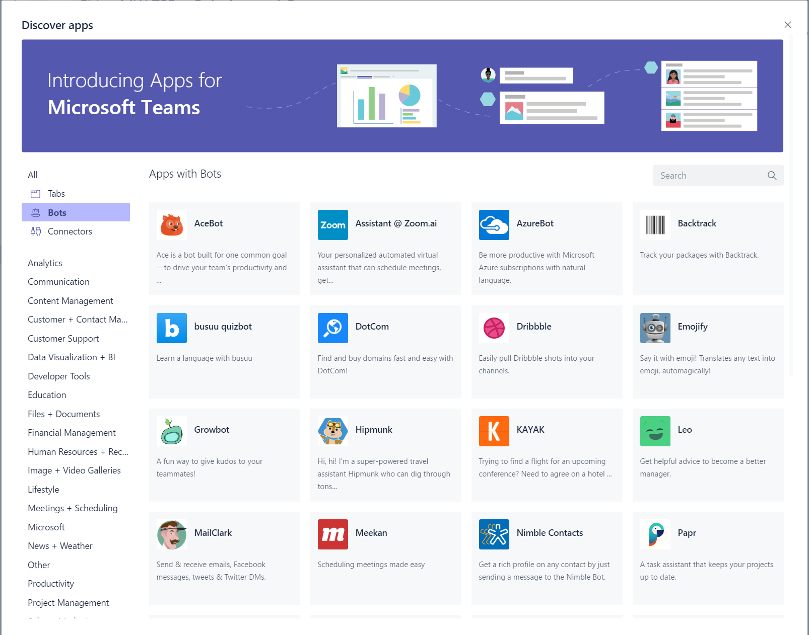

    这些机器人虽然功能各异，但都是基于微软的Bot Framework开发出来的。关于如何定制Bot，以及如何跟Microsoft Teams整合起来，我有一篇专门的文章介绍，请参考 [Office 365 机器人（Bot）开发入门](https://chenxizhang.gitbooks.io/office365devguide/content/docs/botframeworkquickstart.html)。

    而在Skype for Business这个方面，前面提到了EDI这个机器人服务，事实上它也支持和Microsoft Teams的这种Bot的集成，或者换句话说，因为有了Bot Framework，现在开发一个机器人已经变得相对比较容易了。

1. **Microsoft Pix, Office Lens**

    Microsoft Pix是一款聪明的拍照应用，你可以用手机拍出专业级别的照片，例如智能防抖，人像跟随，实时照片等。
    它大量用到了认知服务中的计算机视觉的服务，在这个领域一直被模仿，从未被超越。

    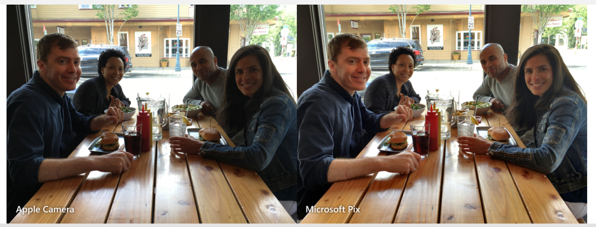

    Microsoft Pix目前只有iPhoned版本，关于它详细信息，请参考 <https://www.microsoft.com/en-us/research/product/microsoftpix/>

    Office Lens则是另外一款免费的移动应用，它非常适合从白板、菜单、符号、手写备忘录或任何具有大量文本的地方捕获笔记和信息。你无需记笔记、依赖模糊图片，也不必担心将笔记放错位置。它也是捕获草图、绘图、公式甚至是无文本图片的最佳选择。它还可以和Office 365实现无缝的整合，例如一键保存到OneDrive等等。

    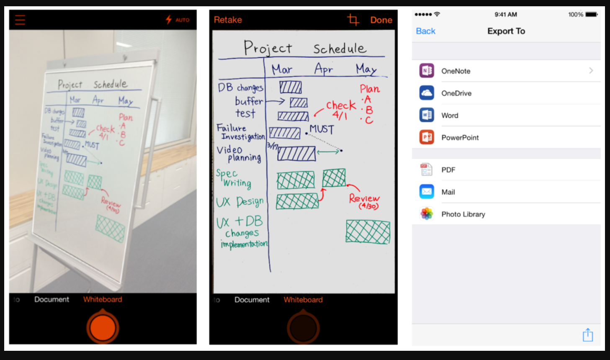

    Office Lens如此有用并且有趣，以至于现在这个功能甚至已经整合到OneNote的App里面，现在用OneNote创建笔记的时候，可以通过调用Office Lens进行拍照，实现上述功能。

## 基于Office 365的人工智能发展方向与机遇

前面我用了大量的篇幅给大家介绍了Office 365已经具有的人工智能能力，这只是一个开始，未来会怎么样呢？老实讲，我也没有明确的答案，但我看到三个方向的发展趋势，给大家参考

1. 通过 **Microsoft Graph** 驱动Office 365向PaaS的演化

    我们都知道人工智能的基础是数据，Office 365有大量的数据（当然这些数据及其隐私都归用户自己所有），下一个阶段的发展在于从SaaS（Software as a service）向PaaS（Platform as a service）的延伸。客户的组织、或者用户自己可以基于微软提供的服务接口（Microsoft Graph）实现对这些数据的再次利用，尤其是与业务应用整合。

    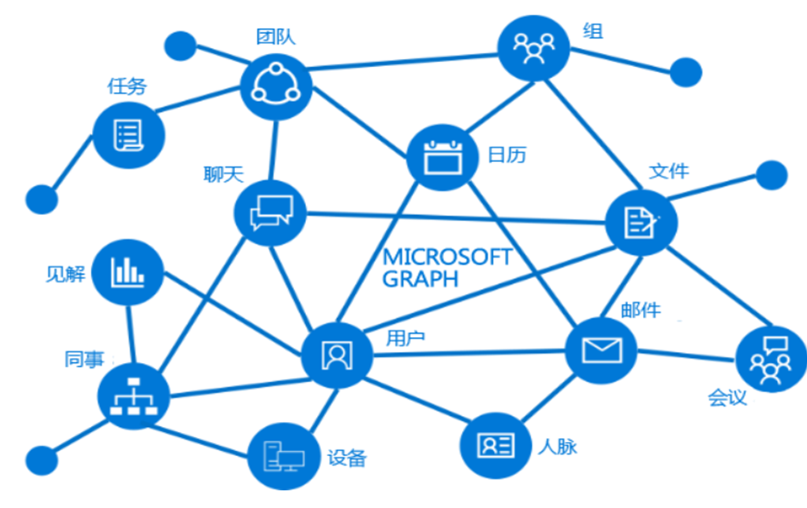

    关于Microsoft Graph的更多细节，请参考 <https://developer.microsoft.com/zh-cn/graph/docs/concepts/overview>, 我的这个系列文章也花了相当多的篇幅介绍Microsoft Graph，请参考 <https://aka.ms/office365devguide> 。

1. 利用**认知服务**增强Office 365能力，尤其是在提供见解方面

    反过来说，开发者可以利用认知服务提供的能力，扩展Office 365的能力（以Office Add-in的形式），为其实现更多人工智能的应用。

    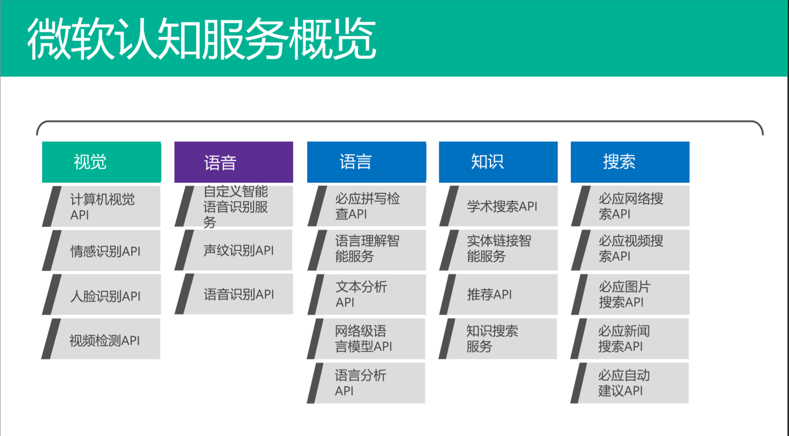

    关于认知服务的详细信息，请参考<https://azure.microsoft.com/zh-cn/services/cognitive-services/>

1. 基于对话的**机器人框架**将深度影响未来人们进行办公的方式

    不管是Microsoft Graph集成应用，还是Office add-in的扩展开发，现在的时代已经跟以前完全不一样了。基于对话的机器人框架（Microsoft Bot Framework）是一种全新的用户交互形式，这种CUI的方式会作为GUI和NUI的有益补充，为用户提供更加边界的交互体验。

    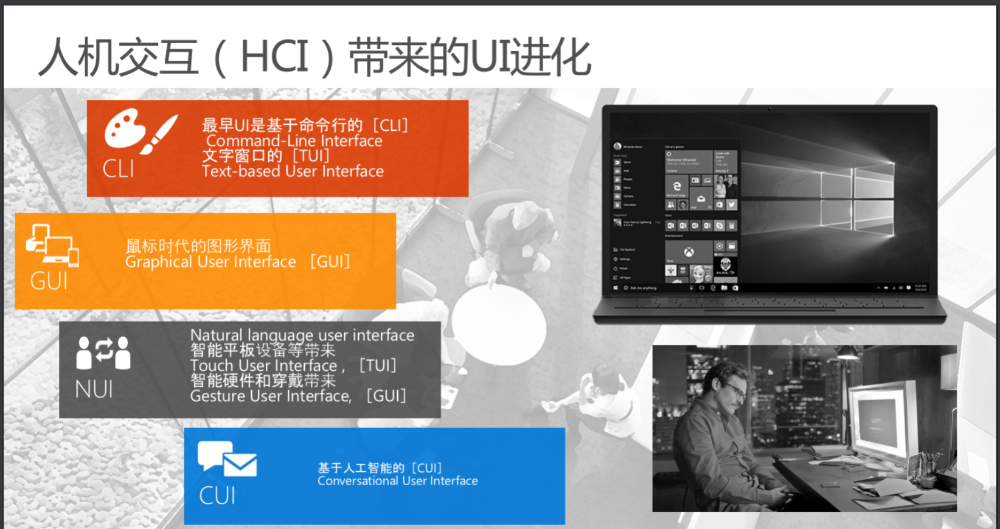

    Microsoft Bot Framework是微软提供的一整套工具和服务的集合，它的访问地址是 https://dev.botframework.com 

    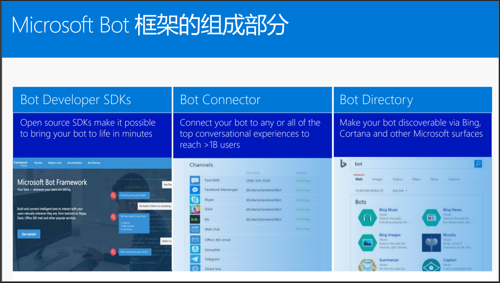

    关于Bot的开发，此前我有一篇专门的文章，请参考 <https://chenxizhang.gitbooks.io/office365devguide/content/docs/botframeworkquickstart.html>

