# 人工智能背景下的Office 365现状和发展趋势
> 作者：陈希章 发表于 2017年7月30日

## 引子

谈论人工智能是让人兴奋的话题，因为它具有让人兴奋的两大特征 —— 每个人都似乎知道一点并且以知道一点为荣，但又好像没多少人能真正讲的明白。毫无疑问，我也只是知道一点点，这一篇文章也只是试图想通过比较接地气的方式给一部分人讲明白。这还得说要感谢这样一个时代，换做是几年前我是绝不敢造次的，那时虽然人工智能并不稀奇，但大抵都是王谢堂前的燕儿，而如今随着技术的发展，人工智能不再高不可攀，而是和我们日常工作生活密切相关、看得见摸的着了。

人工智能已经从一个概念，到原型实践，到现在的产业化，甚至前不久国务院还专门印发了“[新一代人工智能发展规划](http://www.gov.cn/zhengce/content/2017-07/20/content_5211996.htm)”，所以从这个意义上说，我写这篇文章不仅恰逢其时，并且在政治上非常正确了。

> 和很多"突然"成为热点的技术一样，人工智能在坊间也流传着一些真假难辨的传奇故事，例如下面这一则：

    客户：我想做一个人工智能项目，你给我做个方案吧？
    销售：做人工智能干啥？我看现在也还不太成熟，不如做个大数据项目先吧。
    客户：我也不懂它能干啥，我手头有3000万的预算还没有用完。
    销售：哎呀，你怎么不早说呢？那我们就来做一个3000万的人工智能项目吧。

## 微软人工智能，增强人类智慧

人工智能到底是指什么？下面先来看一段维基百科的[定义](https://zh.wikipedia.org/zh-hans/%E4%BA%BA%E5%B7%A5%E6%99%BA%E8%83%BD)

> 人工智能的定义可以分为两部分，即“人工”和“智能”。“人工”比较好理解，争议性也不大。有时我们会要考虑什么是人力所能及制造的，或者人自身的智能程度有没有高到可以创造人工智能的地步，等等。但总括来说，“人工系统”就是通常意义下的人工系统。
关于什么是“智能”，就问题多多了。这涉及到其它诸如意识（consciousness）、自我（self）、心灵（mind），包括无意识的精神（unconscious mind）等等问题。人唯一了解的智能是人本身的智能，这是普遍认同的观点。但是我们对我们自身智能的理解都非常有限，对构成人的智能必要元素的了解也很有限，所以就很难定义什么是“人工”制造的“智能”了。因此人工智能的研究往往涉及对人智能本身的研究。其它关于动物或其它人造系统的智能也普遍被认为是人工智能相关的研究课题。
人工智慧目前在计算机领域内，得到了愈加广泛的发挥。并在机器人、经济政治决策、控制系统、仿真系统中得到应用。

这是一个透过现象看本质的定义，但并不是那么好理解。反过来，如果我们从本质出发看现象，也就是用大白话来说，人工智能的核心是算法，基础是数据，表现形式为机器人或类机器人应用程序。有趣的是，算法会越来越复杂，属于真正的高科技领域；而应用程序这一端则会越来越简单，以后也许中小学生都能做自己的机器人程序。

微软在人工智能这个领域一直在投入研究资源，并且在2016年9月份专门成立了“微软人工智能与研究事业部”，由微软全球执行副总裁、技术与研发部门主管沈向洋博士领导。与此同时，微软与其他4家科技巨头亚马逊、谷歌、Facebook和IBM还共同成立了AI联盟，用以推动公众对人工智能技术的理解。

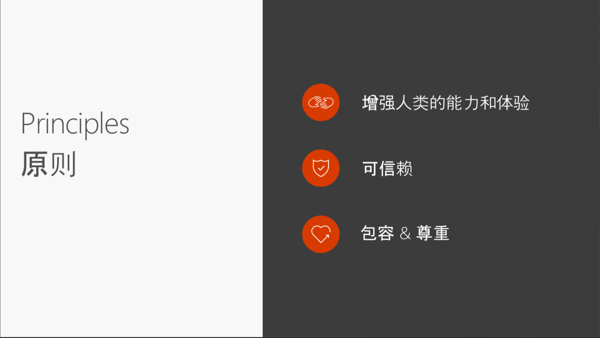

微软人工智能的目的是增强人类智慧，在今年的[Build大会](https://blogs.microsoft.com/blog/2017/05/10/microsoft-build-2017-microsoft-ai-amplify-human-ingenuity/#sm.0000pp7q6tmuke8uvy11u462jmkcy) 上，沈向洋博士用更加清晰和具体的行动计划诠释了这一点。

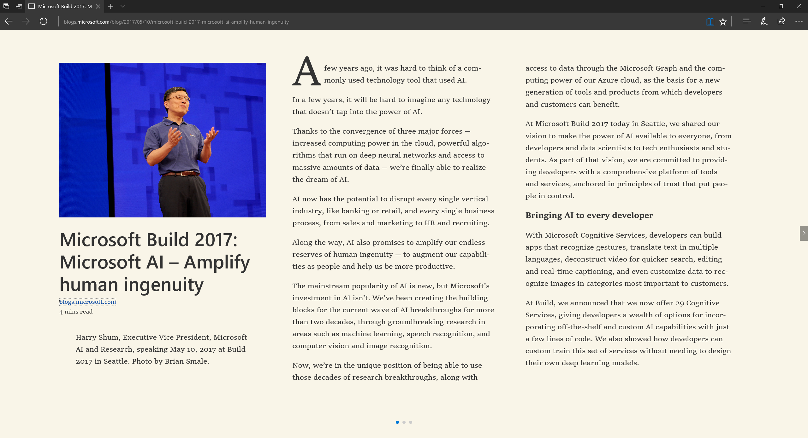

微软将通过如下两个方面来实现这一目标

1. **Bringing AI to every developer** —— With Microsoft Cognitive Services, developers can build apps that recognize gestures, translate text in multiple languages, deconstruct video for quicker search, editing and real-time captioning, and even customize data to recognize images in categories most important to customers.
1. **Redefining Microsoft with AI** —— We are infusing AI into every product and service we offer, from Xbox to Windows, from Bing to Office.

而如果想进一步了解这方面的细节，我强烈推荐大家阅读微软亚洲研究院院长洪小文博士在“二十一世纪的计算”学术研讨会所做的报告[《Co-Evolution of Artificial Intelligence and Human Intelligence —— 人工智能和人类智能的 “共进化”》](https://www.leiphone.com/news/201611/jVCnhaDqAUnU5kt7.html?viewType=weixin)，这个报告非常具体、生动地给我们展示了人工智能的三个能力（视觉识别，自然语言理解，数据分析）和智能的四个阶段（功能，智能，智力，智慧）。
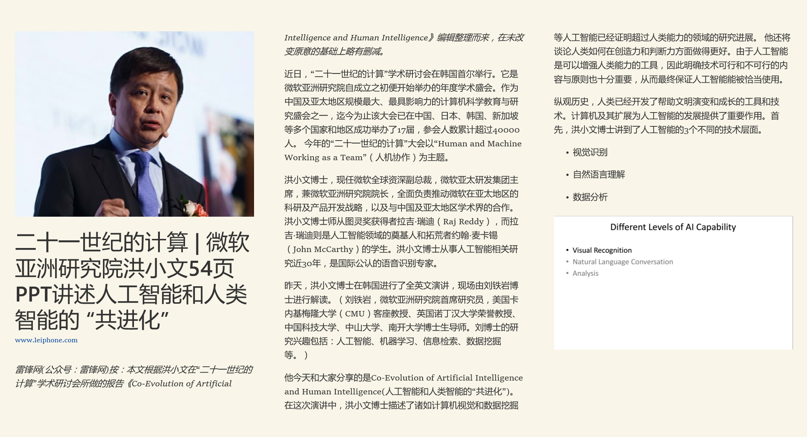

## 微软人工智能总体框架和战略

通过下面一张图可以全面了解微软的人工智能总体框架和战略：智能来自于数据，服务于决策。

如果再用大家更加喜闻乐见的产品或服务来介绍，则可以分为下面四个方面

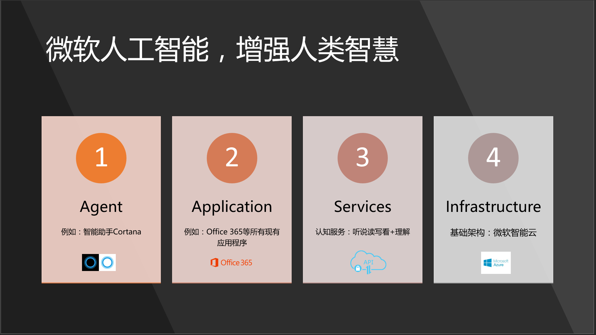

1. 大多数人看到人工智能的威力，都是从一些数字化助手开始的。微软目前有严肃活泼的私人工作助理**小娜（cortana）**，也有集智慧和美貌于一身的**小冰**，以及辅助学习英语的**小英**。有关小娜的详细介绍，请参考 <https://www.microsoft.com/zh-cn/windows/Cortana>。

1. 数字化助手毕竟是有限的几个，更加广阔的场景则会出现在应用程序这个大类别中，这也是前面提到的“Redefining Microsoft with AI”的具体体现。**Windows**，**Office 365**等核心应用程序都将极大地增强智慧水平，一边更好地帮助用户聪明地工作和生活。有关Office 365的基本情况，请参考 <https://products.office.com/zh-CN/>。

1. 而不管是数字化助手，还是微软的应用程序，他们的人工智能的能力都来自于目前已经初具规模的**微软认知服务**，它基本囊括了听说读写看的常规能力，以及一部分理解能力。（这些在我们看来还是属于常识层面的，也就是洪小文博士提到的具备功能，和一点点智慧的层次）。但是，这是一个很好的起点，更重要的是，广大的开发人员可以站在微软的肩膀上，结合自己的业务需求，开发自己的人工智能应用。这是“Bringing AI to every developer”的承诺和输出。有关认知服务的详细介绍，请参考 <https://azure.microsoft.com/zh-cn/services/cognitive-services/>。

1. 最后，使用**微软智能云（Azure）**，不管是与物联网结合的IoT套件，还是大数据量的存储和处理，以及应用开发和运营一体化等，可以为你的人工智能应用提供可靠、强大的支撑。了解Azure的基本情况，请参考 <https://www.azure.com> 和 <https://www.azure.cn> 。

## Office 365已经具有的AI能力

接下来给大家介绍的是，Office 365目前已经具备的人工智能（AI）能力。Office 365在全球范围内目前每月活跃用户超过1亿，在数字化转型的时代，无论是对于客户及用户而言，还是对于微软来说，都是极为重要的一个生产力服务平台。沈向洋博士在履新不久接受专访时提到，微软的人工智能部门将投入大量的资源，在近一两年内会为Office 365的智慧水平提升到一个新的级别。而在近半年多来，我们已经看到Office 365的很多创新功能，并且有理由相信这仅仅是一个开始。

1. **Cortana with Office 365**
    
    前面已经提到Cortana 是 Windows 10 设备上的个人助理。Windows 10 中的 Cortana 非常适合你快速查看日程安排，了解你的第一个会议的时间和地点，大致了解适当的差旅时间或甚至从你的日历中获取更新以了解未来的行程。Cortana 在连接到 Office 365 时更加出色，其能力得到增强，可帮助你准备会议、了解与你共事的人员并提醒你接下来要去的地方，以防你迟到。详情请见 <https://support.office.com/zh-cn/article/Cortana-integration-with-Office-365-7257cb50-0d5c-4f7a-ac2e-9fe5d13bb5cb> 和 <https://docs.microsoft.com/zh-cn/windows/configuration/cortana-at-work/cortana-at-work-o365>

    

    管理员可以在Office 365管理中心控制是否允许Cortana访问组织中用户的数据
    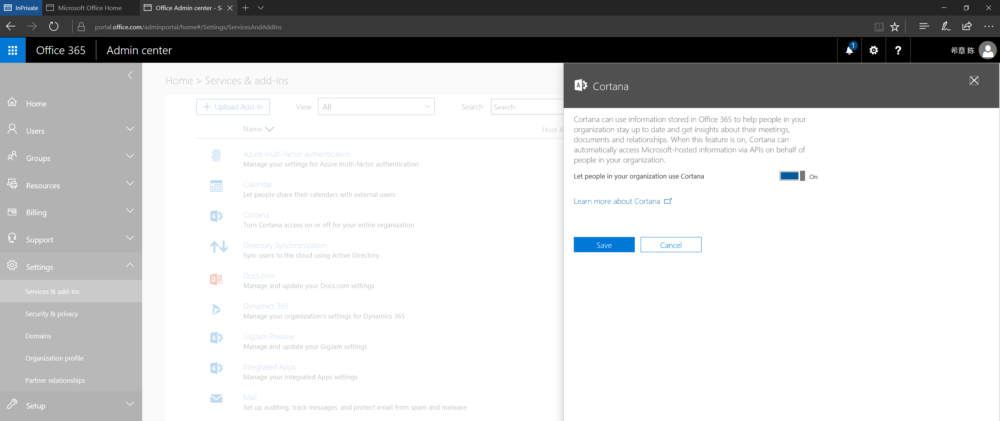

    而最终还需要得到用户的授权才可以完成Cortana的连接，充分保证用户的隐私
    

    Cortana目前不光是在桌面的Windows 10中运行，据我所知，它还在深度整合在其他一些设备中，例如无人驾驶的控制台中。我虽然不太了解无人驾驶技术，但在这样一个全新的现代办公空间中，有Cortana，有Office 365，你工作相关的信息都可以一览无余，随时得到反馈，并且通过全新的对话式掌控一切，想一想都是很美的事情吧。这是已经实现的案例，如果有兴趣的话，请参考宝马汽车的故事 <http://www.bmwblog.com/2017/01/05/microsoft-cortana-coming-bmw-cars/>

    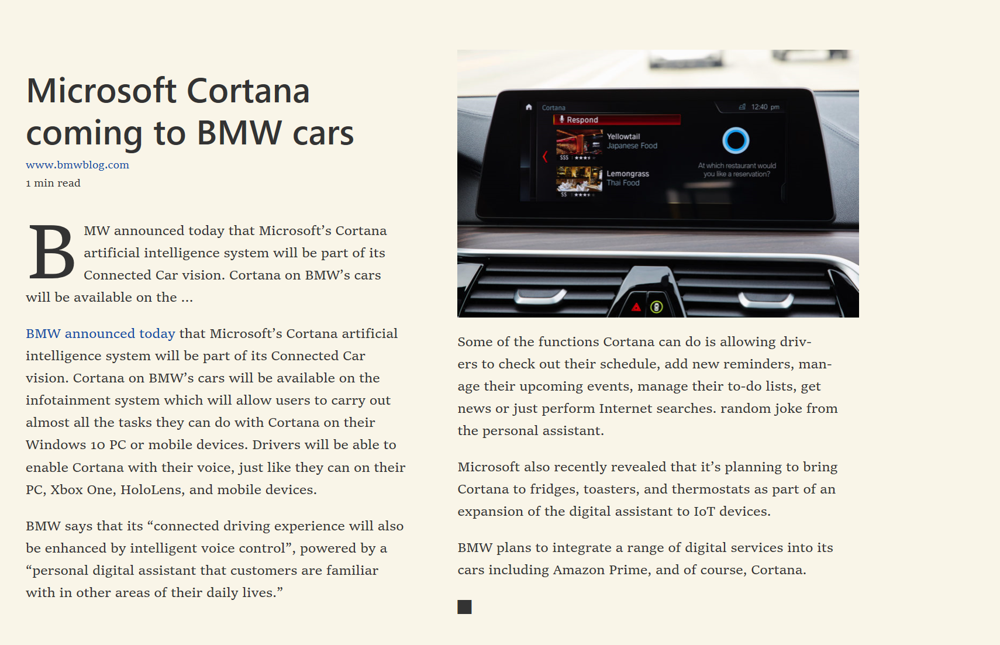

1. **Word** —— Tap，Research

    毫无疑问，Word是世界上最好的字处理软件之一。尽管如此，我们还在不断地创新。在2016年10月份，Office 365用户拥有一个全新的功能—— Tap（Insert Document Item），它允许在不离开Word的情况下查找本地文件夹、个人网盘，团队工作区中的文档内容，并且可以按需将一些感兴趣的片段插入到文档中来。关于这项功能的详细说明，请参考 <https://support.office.com/en-us/article/Find-and-use-the-content-you-need-when-you-need-without-leaving-Word-860118fc-1f61-41f6-922f-40084a284658?ui=en-US&rs=en-US&ad=US>

    >这个功能不是Word独有的，Office 365用户在使用Outlook编写邮件的时候，也可以拥有同样的全新体验。
    
    Tap这个功能可以通过如下的菜单访问到

    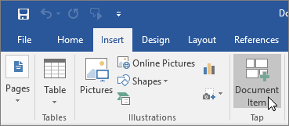

    然后可以在下面的面板中进行搜索

    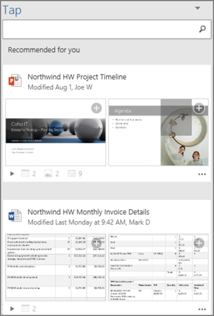

    另外一个很有用的功能（Researcher），一看名字就知道是研究人员的最爱。它可以在你撰写研究材料的时候，在不离开Word的情况下，在线搜索网络上面公开可以被引用的资源(由Bing提供支持），然后将其片段插入到当前文档中，并自动生成引用等信息。关于这项功能的详细信息，请参见 <https://support.office.com/en-us/article/Research-for-your-paper-easily-within-Word-1728f286-8702-4d72-8169-ab7677ca0e1f>

    你可以在References这个Tab中找到该功能

    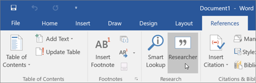

    它的基本使用效果如下

    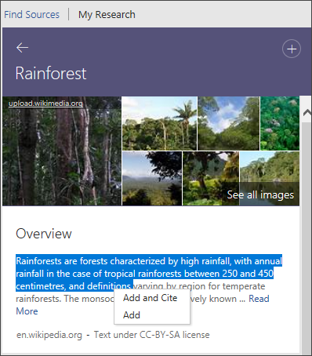

    在Word中列出的这两个功能（Tap和Researcher），看起来都是跟查找信息有关，难道这也是人工智能技术吗？这当然是，搜索本身就是一个典型的人工智能的应用场景。在微软的认知服务体系中，就有专门的搜索服务。

1. **Excel**

1. **PowerPoint** —— Zoom，Morph，Designer，Translator

    和很多人一样，我的日常工作已经跟PowerPoint离不开了，但我一直以来也只能算是PowerPoint的初级用户，自认为并不擅长制作既有Power又有Point的材料。

    Zoom 的详细介绍请参见<https://support.office.com/en-us/article/Use-Zoom-for-PowerPoint-to-bring-your-presentation-to-life-9d6c58cd-2125-4d29-86b1-0097c7dc47d7?ui=en-US&rs=en-US&ad=US>, 这里还有中文介绍 <http://mp.weixin.qq.com/s?__biz=MzAwNzA3NjAzNw==&mid=303874520&idx=1&sn=ed7d11854ec75380ca540d18e397753b&scene=19#wechat_redirect>

    Morph 的详细介绍请参见 <https://support.office.com/en-us/article/Use-the-Morph-transition-in-PowerPoint-8dd1c7b2-b935-44f5-a74c-741d8d9244ea?ui=en-US&rs=en-US&ad=US> 

    Designer的详细介绍请参见<https://support.office.com/en-us/article/About-PowerPoint-Designer-53c77d7b-dc40-45c2-b684-81415eac0617?ui=en-US&rs=en-US&ad=US>

    Translator的详细介绍请参见 <https://translator.microsoft.com/help/presentation-translator/>

1. **Outlook** —— focus Inbox、Tap

    关于Outlook中的Tap（Insert Document Item）的功能，此前在Word的那个小节已经介绍。

1. **Delve** —— My Analytics, Workplace Analytics，Discovery 

    Delve是Office 365用户专享的一个服务，而且目前只有云端的版本。你可以通过 <https://delve.office.com> 直接访问到该项服务，或者也可以通过Delve 的移动App进行操作。

    Delve 为你显示 Office 365 中的个性化内容（OneDrive for Business、SharePoint、Exchange 和 Yammer 等）。Delve 基于 Microsoft Graph 实现，能根据正在处理的工作以及与你合作的人员为你显示信息，并始终保持已具有的权限。

    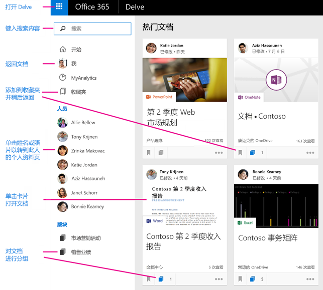

    关于Delve的入门介绍，请参见<https://support.office.com/zh-cn/article/%e4%bb%80%e4%b9%88%e6%98%af-Office-Delve%ef%bc%9f-1315665a-c6af-4409-a28d-49f8916878ca?ui=zh-CN&rs=zh-CN&ad=CN>

    关于如何在组织内部启用 Delve 以及了解Delve如何使用你的数据 ，请参见 <https://support.office.com/zh-cn/article/%E9%9D%A2%E5%90%91-Office-365-%E7%AE%A1%E7%90%86%E5%91%98%E7%9A%84-Office-Delve-54f87a42-15a4-44b4-9df0-d36287d9531b>

    Delve不仅仅了解你及周围的同事所做的事情（在得到你的许可的情况下），还能为你提供基于你的工作的数字化分析，乃至为团队或者整个组织提供生产力方面的统计分析，帮助我们更好地了解时间到底去哪了。

    MyAnalytics帮助您了解如何进行通信和花费在工作时间。设置您自己的目标，并让MyAnalytics度量进度。

    大部分什么看，如会议或时间某人对您的电子邮件答复中所花费的时间量，取决于您已经可以找到你的邮箱和日历中的数据。MyAnalytics只需执行放在一起的工作。信息提供了您可采取操作的见解。

    你看到的某些信息基于其他同你一样已打开 MyAnalytics 的人员正在做的事。例如，组织中人员花费在会议上的平均时间，或者组内成员阅读你的电子邮件的及时程度。隐私对我们而言非常重要，而 MyAnalytics 只显示满足最小大小的组的相关信息，并且为了保护用户隐私，不按姓名标识用户。

    

    MyAnalytics 还有一个[Outlook插件](https://support.office.com/zh-cn/article/Microsoft-MyAnalytics-Outlook-%e5%8a%a0%e8%bd%bd%e9%a1%b9-e305ae2d-6f16-4688-b2b0-487c4c2d067b?ui=zh-CN&rs=zh-CN&ad=CN)可供使用

    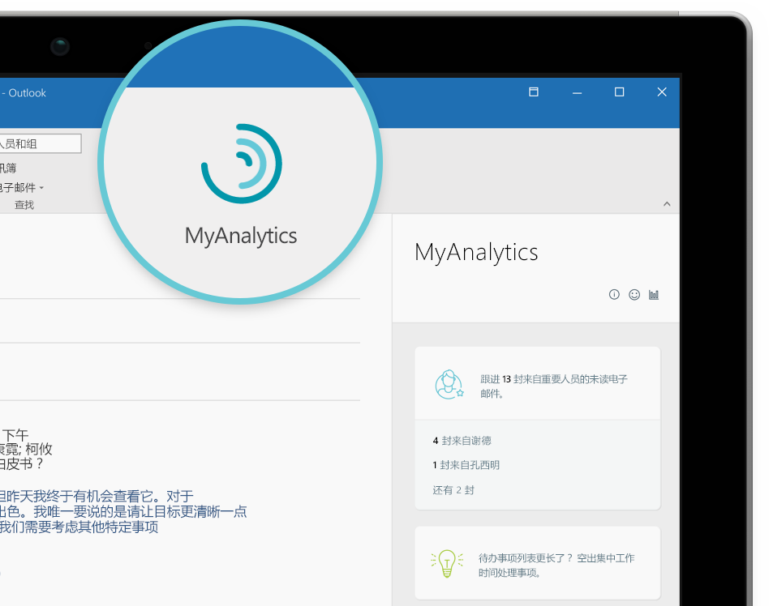

    今年7月份正式推出的Workplace Analytics则为管理者提供了全新的方式了解团队和组织的工作效率，为改善工作环境提供见解。详情请参考 <https://blogs.office.com/en-us/2017/07/05/transform-your-organization-with-microsoft-workplace-analytics/>。

    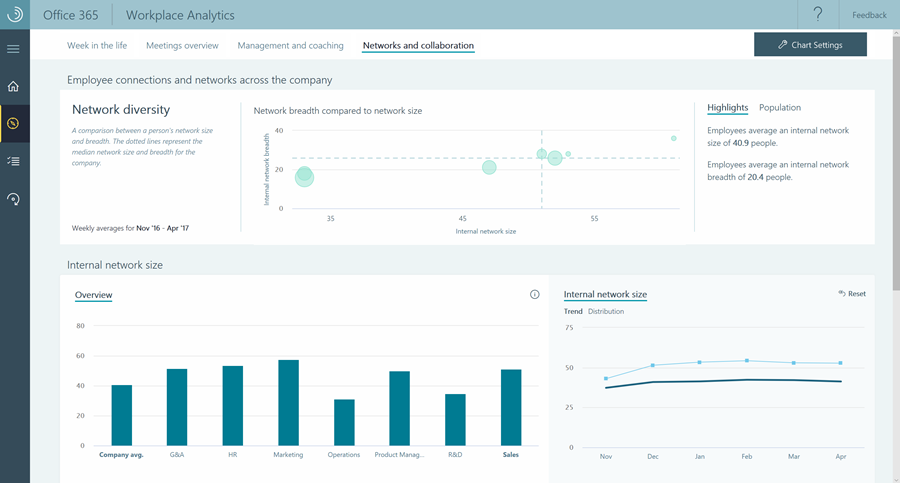

    > Delve目前暂时还没有出现在Office 365的国内版本中

1. **Skype for Business** —— EDI（Enterprise Deep Intelligence）

    Skype for Business是Office 365中的沟通套件，它提供了一对一的对话（支持文字，语音，视频等多种形式），以及高清音视频会议，以及现代化的PBX解决方案。EDI（Enterprise Deep Intelligence）这个2015年开始的研究项目，其主要目的是以简单聪明地解决“预定会议室”这件事情为入口，进行企业级别深度智慧应用及其研究。

    关于EDI的详细介绍，请参见 <https://www.microsoft.com/en-us/research/project/enterprise-deep-intelligence/>

    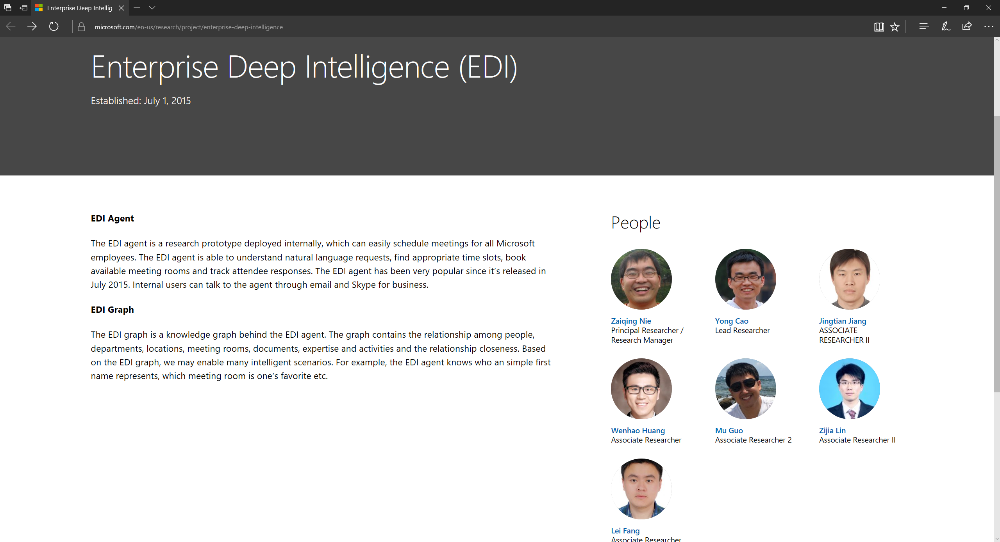

    经过近两年的发展，EDI目前已经包括了多项功能，预定会议是我最常用的功能，除此之外还比较喜欢第四项功能

    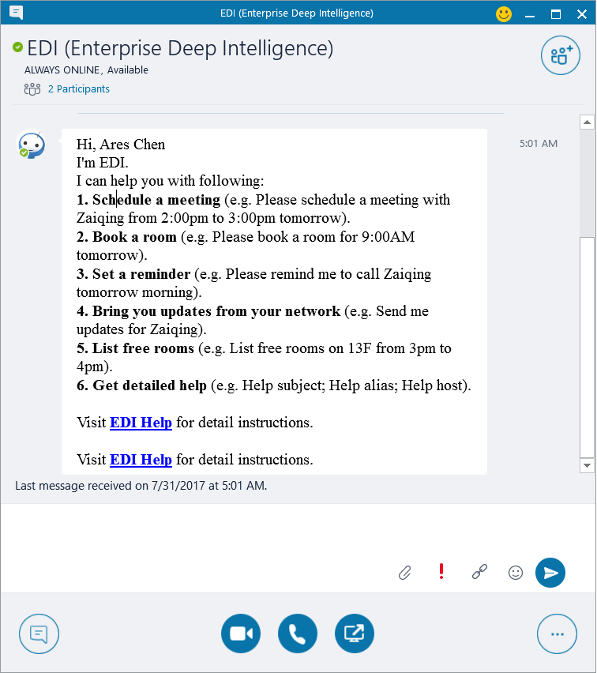

    目前这个项目的成果已经在微软公司内部推广使用，并且在少量的客户中进行了部署（由微软企业服务部提供服务）。从形式上来说，EDI其实就是一个机器人，而它后台使用的技术，很有可能就是认知服务早期的版本。只不过，当时还不叫认知服务吧。

1. **Teams & Skype for Business** —— Bot

    

1. **Microsoft Pix, Office Lens**

## 基于Office 365的AI发展方向与机遇