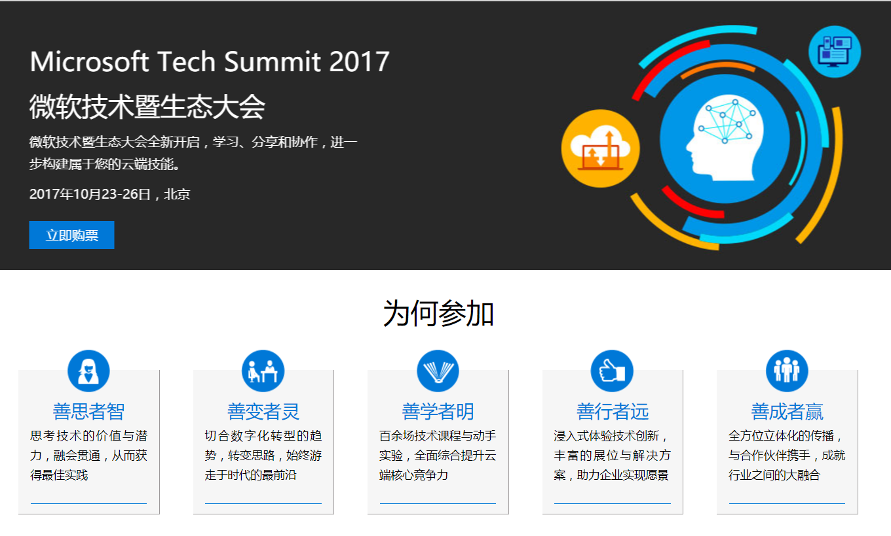
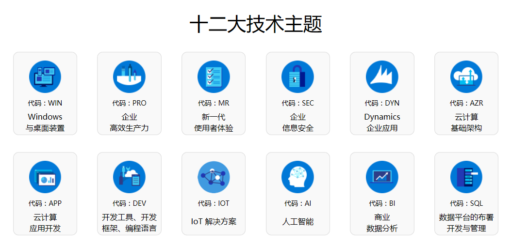
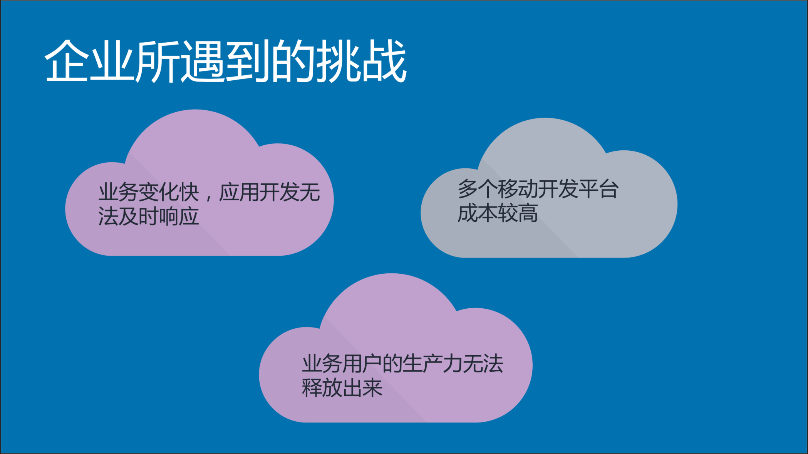
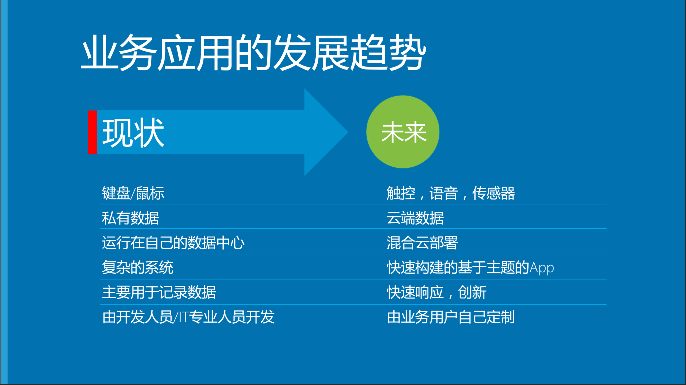
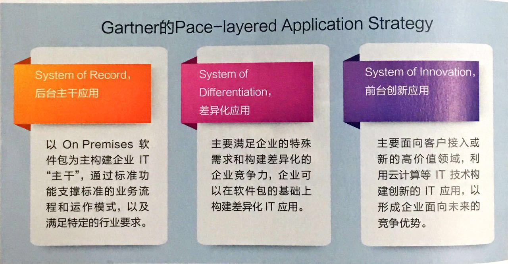
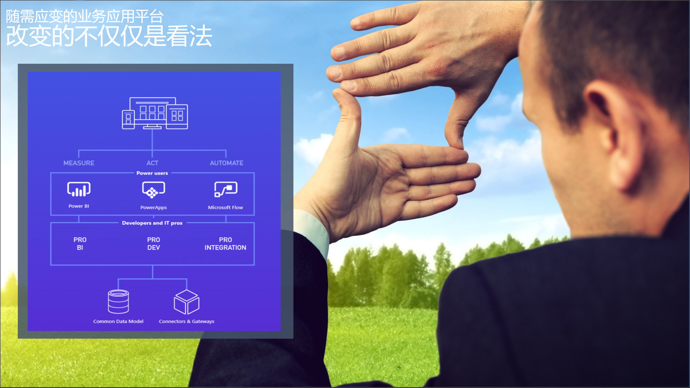
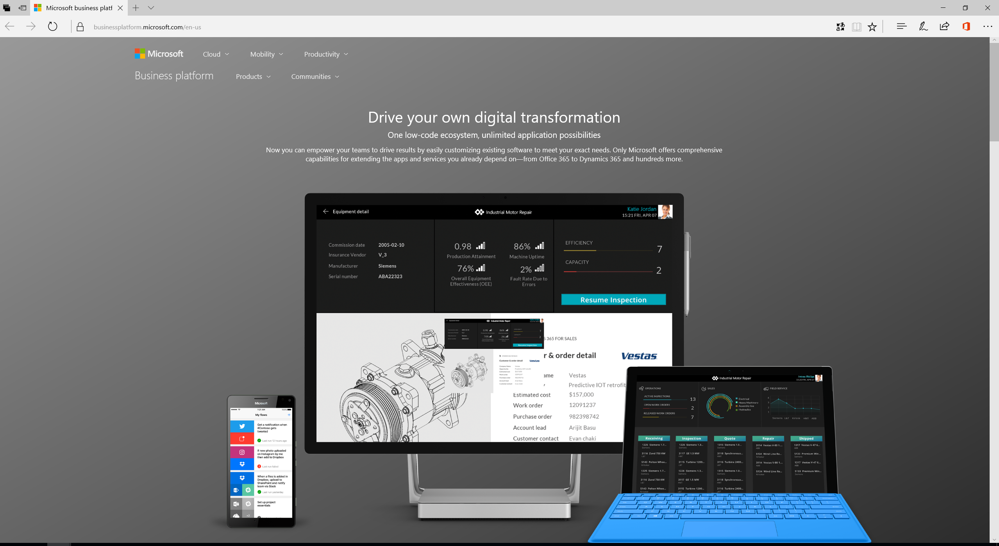

# 基于Office 365的随需应变业务应用平台

> 作者：陈希章 发表于 2017年9月7日

这是我去年10月底在微软技术大会（Microsoft Iglite 2016) 上面的演讲主题，承蒙大家抬爱，也沾了前一场明星讲师的光，我记得会场几乎是满座。观众中既有IT部门的技术人员，也有业务部门的用户，也有少量的开发人员，这正好契合了这个主题想要表达的意思：在业务需求的变化日趋频繁的当下，这三类用户的参与，并且借助合适的技术及平台（例如微软的Office 365），可以构建随需应变的业务应用平台。

顺便预告一下，本年度的微软技术暨生态大会（[Microsoft Tech Summit](https://www.microsoft.com/china/techsummit/2017/)）将于2017年10月23日在国家会议中心举办，本届大会将全面呈现微软平台的最新技术，尤其是在人工智能方面的重要创新，我将在大会上分享随需应变业务应用平台2.0解决方案，在延续去年话题的同时添加了Microsoft Teams以及Bot Framework整合的内容，敬请关注。

更多内容请关注 <https://www.microsoft.com/china/techsummit/2017/>

言归正传，我将利用6篇文章来给大家阐述如何基于微软的Office 365构建随需应变的业务应用平台，这一篇文章是一个概要，我将给大家介绍一些基本概念，演示主要的流程和效果。

我们先来看一看企业业务应用平台的现状、需求和挑战。业务的需求通常来自于客户的反馈和市场的需要，业务部门会发现及捕捉到这些变化，快速响应的企业能赢得更多的业务和机会。这是一个基本常识，但是越来越多的企业会遇到如下的三个挑战

这三个挑战相互联系，甚至互为因果。由于以往业务应用开发过分依赖专业性技术，带来的问题就是周期长，成本高，而业务用户很多时候都是在干等着，无法及时地应对市场和客户的需求；与此同时因为只有少部分人才能从事这类工作，大量的业务用户的能力其实是被闲置了，这将带来企业的整体效能下降。业务移动化是一个趋势，但由于多平台都需要单独开发和维护，这又进一步加剧了前面两个问题的严重性。

那么，有什么办法可以解开这个结呢？我们不妨来先看一下业务应用的发展趋势

我必须说明一点的是，企业的业务应用是分层的。早在2011年Gartner就提出了企业业务应用的三层模型 

应该说作为业务主干应用系统这一层，大部分企业都已经建设完毕，这些都是比较标准的、也相对比较复杂的系统。我们今天要谈论的业务应用，更多是偏向前台创新应用和差异化应用。而所谓的随需应变，就是让更多的业务人员拥有构建面向主题的业务应用的能力，并且能随时根据捕捉到的信息进行调整，以达到快速响应变化的目标。

那么，从微软的角度来看，我们提供了什么样的解决方案能实现这样的目标呢？在Office 365的平台上，目前已经内置了很多强大的服务，例如我们耳熟能详的邮件服务，在线协作平台，视频会议平台等等，同时我们针对业务应用也提供了创新性的服务，例如Power Apps可以快速根据数据源（最简单的做法是基于SharePoint的列表）构建跨平台移动业务应用，用于收集并且处理数据；Microsoft Flow可以在异构系统之间建立业务流程；Power BI则提出了全新的数据呈现技术，彻底改变我们与数据交互的方式，洞察先机，而这些见解又可以引导用户回到Power Apps里面进行操作，或者触发某个Microsoft Flow的流程进行响应。这是一个不断迭代的过程，或者也可以称之为闭环，这也是随需应变的最核心的理念。

关于微软的商业应用平台，敬请关注微软的官方网站了解更多 <https://businessplatform.microsoft.com/en-us/>

接下来的几天内，我将用一个实际案例给大家展示一个典型的业务应用开发的流程，我相信这代表着未来，更加让人高兴的是，这已经是看得见摸得着的能力了。