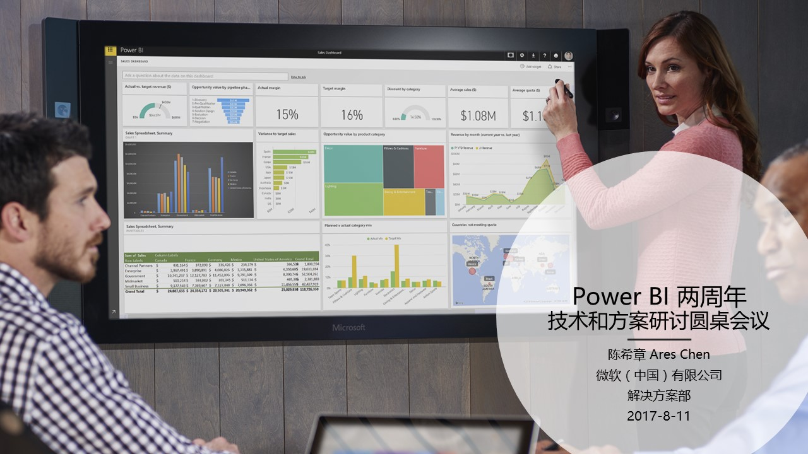
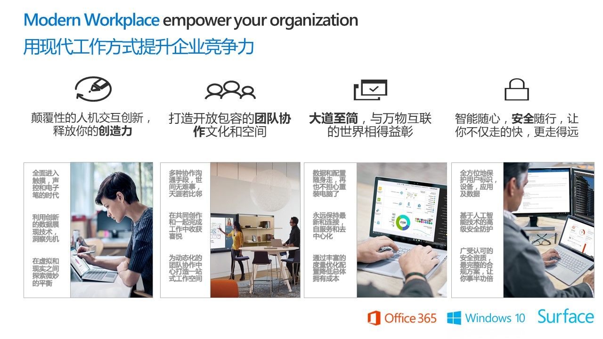
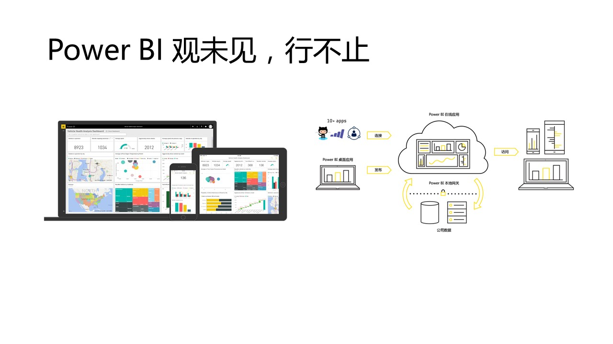
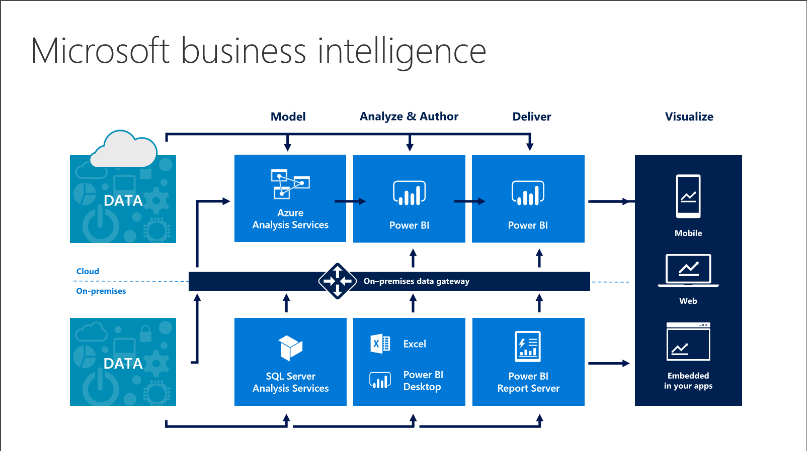
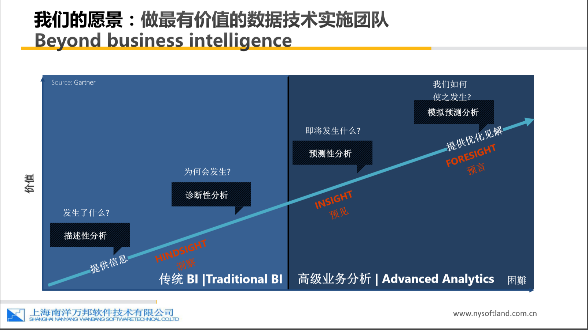
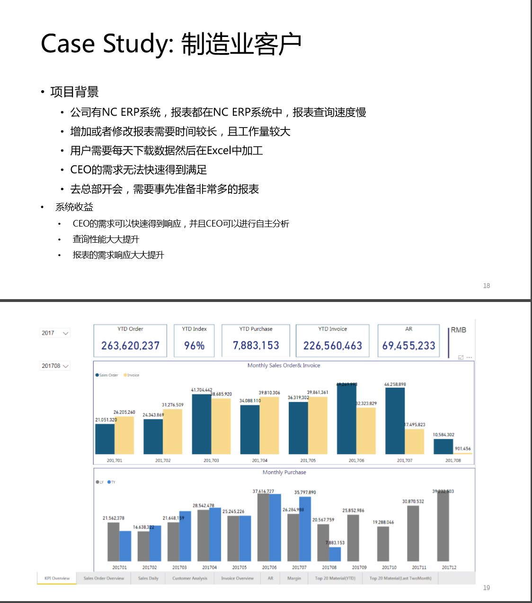
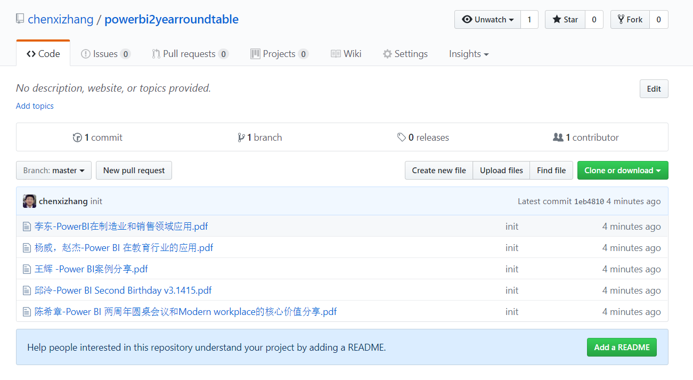

# 观未见，行不止 —— Power BI 两周年技术和方案交流圆桌会议纪实

> 作者：陈希章 发表于 2017年8月13日

2017年8月11日下午两点，Power BI 两周年技术和方案交流圆桌会议如期举行。线上和线下约有100位朋友参加了由我组织和主持的本次活动，在两个小时的会议中我也很荣幸邀请到了Power BI产品技术专家，典型客户和合作伙伴做精彩分享，在活动的最后，还有热烈的互动讨论环节。

## 谈一谈现代工作方式将如何帮助企业提高竞争力

前不久我专门谈了谈 AI（Artifical Intelligence——[人工智能](officeandai.md)），很高兴今天又可以来谈谈BI的话题。Business Intelligence（BI）——商业智能其实不是一个新话题了，从SQL Server 97 第一次提出多维数据集（OLAP和Cube）的概念，到后来的百花齐放，逐渐形成了从数据整合和清洗，到数据建模和分析，以及最后的报表展现这样一种三个阶段的标准做法，相当一段时间以来，我们甚至认为这个领域的经验已经固化，谈不上什么创新了。那么，今天我们要谈的这个已经两周岁的Power BI到底Power（厉害）在哪里呢？

我相信不同的人会对Power BI有不同的见解，而在我看来，Power BI不仅仅是微软商业智能解决方案的重要版图和创新成果，它更是现代工作方式的一种具体体现 —— 利用创新的数据展现技术洞察先机 —— 它是我们能保持创造力的一个非常重要的因素。

Power BI 是一组看得见摸得着的先进工具和服务，它包括云端服务，客户端设计器，移动应用，以及和企业内部数据整合的网关组件在内的四大核心组件，同时使用开放式的架构支持第三方应用的整合。基于Power BI提供的服务，不同的用户（数据创作者、数据建模专家、报表设计师、管理员）可以各司其职并协同工作，并且都能得到绝佳的创新体验。这些体验包括但不仅限于多数据源建模支持、本地计算、跨设备和平台体验、自然语言查询、自动产生见解、实时数据分析、与Cortana的整合、从Excel发布等等。其中，自然语言查询和自动产生见解、与Cortana整合这三块已经是使用到了微软人工智能(AI)的研究成果 —— 得益于AI所提供的创新动力，将是Power BI区别于其他产品的一个重要分水岭。

如果仅仅把Power BI当作一组工具和服务，我个人觉得并不足以体现它的先进性。我自己是第一时间就使用了Power BI，到后来爱不释手，在平时的工作中经常会使用它。我认为Power BI还有两个层面的意义，分享给大家参考一下。

1. Power BI 给我们带来了一种对数据充满好奇的思考问题的方式。

    经验是好东西，至少在它成为制约我们创新的阻力之前是这样。正如认识世界的过程本质上是一个不断参与和体验的过程一样，Power BI给我们带来的是一种渐进式、交互性的分析体验。你在Power BI Desktop中导入数据并且进行建模和分析，你会有丰富多样的选择性和组合，而不是一种或者固定的几种，往往是做着做着会蹦出来一些新的做法。而如果你以为说将Desktop做好的报表发布到Power BI Service就完事了，那就大错特错了。实际上，这可能是Power BI 的整个创作的过程的10%，这只是一个开始而已。大量的创作是在报表基础上，通过你的视角（通常是管理层或业务部门用户）去产生见解，并且形成独特的视图（Dashboard），与此同时，通过分享还能获得其他同事的反馈。

    到底是先进的技术引发了我们的好奇，还是我们自身的好奇心驱使我们发现这些技术所蕴含的价值？放在今天这个Power BI的话题上来看，我倾向于同意这样的观点：我们成就了彼此。

1. Power BI 真正赋予我们理解数据的能力，因此我们将获得前所未有的信心。

    数据分析行业有一句经典名言：“如果不能用数据表示我们所知的，那么我们对它所知不多；如果对它所知不多，又怎样控制它；如果我们不能控制它，那就只有靠运气了”。人类对于很多事情的恐惧源自于其不确定性，所以说，二十一世纪什么最珍贵？信心！

    那么信心是从哪里来的呢？消除不确定性是一个对症的药方，而这，我想多半应该来自于你对所面临问题能够充分了解的能力吧。Power BI真正将商业智能的能力赋予每一个人，而不是特定的几个人，不需要去读几年数据挖掘的专业课程，而只要会基本的数据操作即可。同时由于它可以通过不同的设备随时随地访问到，所有的业务视角，可以通过交互式的体验实时地展开，我们再也不需要为了做一个汇报而将一大堆报表打印出来了。

    当然，不确定性仍然是世界的主流特征，你不能期待完全的确定性。此时，保持好奇就是一个很好的态度了。

## 圆桌会议嘉宾精彩分享

本次会议邀请到了Power BI产品技术专家，以及来自于典型客户和合作伙伴的精彩分享。这里简要地做一个总结，他们的演讲材料可以在下一节的链接中下载到。

**微软（中国）有限公司数据平台技术顾问 邱泠**，拥有丰富的大型数据库设计及其分析建模的经验，他是Power BI中国版落地和推广的重要参与者。他为本次活动带来的演讲内容包括

1. Power BI的两周年发展过程，最新创新成果
1. Power BI的用户主导的创新文化
1. Power BI的多种部署模式和微软商业智能组合
1. Power BI的生态环境及给合作伙伴的机会

**天津市滨海新区汉沽九中教师 杨威 & 赵杰**，作为微软教育大使，将Office 365及Power BI 在教学中进行创 新实践和常态化使用，在业界享有盛誉。他们为本次活动带来的课题是“利用Power BI构建成绩分析系统”。

**上海南洋万邦软件技术有限公司的商业智能事业部系统架构师  李东**，微软数据库方面的MCT、 MSDBA，Oracle的OCP，拥有五年微软平台BI实施项目， 服务的客户涵盖制造业、销 售业、快消、研发设计领域。他为本次活动带来了几个真实的客户案例分享，李老师尤其提到了在不同的几种分析模式之间如何根据实际需要进行选择的问题。

**菲斯科（上海）软件 有限公司技术总监 王辉**，作为中国区最早一批SQL Server MVP，拥有大量客户商业智能项目实战经验并曾担任过多家公司的高级技术职位。王辉老师用他富有亲和力的演讲和真实的客户案例，并且有大量演示，让与会者都大呼过瘾，受益匪浅。

## 圆桌会议所有的演讲材料

这些材料我已经统一发布到Github，如果有需要，请访问<https://github.com/chenxizhang/powerbi2yearroundtable> 进行查看和下载。

关于本次活动的答疑，以及Power BI的一些其他问题，如果有需要的朋友，也可以继续通过这个渠道和我取得联系和交流。前提是，你会用Github哦。

## 圆桌会议中的有奖问答和互动问题摘要

1. Power BI 国际版发布的准确日期是哪一天？

    回答：2015-7-24

1. Power BI Pro账号能支持的数据刷新时间最短是多少？

    回答：一小时。相对应的，Power BI Free账号也能实现每天一次的数据刷新。

1. Power BI中用于提供对企业内部数据源进行整合的组件是什么？

    回答：Gateway（网关），它分为两种，一种是用于个人用户的Personal Gateway，一种是用于生产用途的Enterprise Gateway。

1. Power BI有哪几种授权模式？

    回答：Power BI有完全基于SaaS的订阅模式，也有和本地SQL Server相结合的On-Premises模式，同时还有基于Azure的按照用量付费的模式。

1. Power BI Report Server支持SQL Server 2016吗？

    回答：支持. 但最好的支持版本是在SQL Server 2017.

1. Power BI 是否支持3D 的视图展示？

    回答：Power BI的部分Visual组件已经支持3D。例如这个例子<https://azurewebsiteexperience.azurewebsites.net/>.另外，Excel中的Power Map有3D的版本，而且可以自动录制视频，嵌入到PowerPoint中。

1. 一个企业使用一个Power BI Enterprise Gateway还是建议根据不同的Reporting情况分多个Gateway？

    回答：由于一个Gateway可以定义多个数据源，目前比较常见的做法是只部署一个Gateway。这样在管理上面会更加简单。Power BI Gateway本身不需要授权，只要有Power BI Pro的账号就可以使用。

1. Power BI 可以和Splunk等第三方程序进行集成吗?

    回答：Splunk也是和数据分析有关的东西。 理论上，数据能连，就能整合。

1. Power BI 导入数据，可以直接导入，还是需要ODBC等？

    回答：Power BI 内置了超过100种数据源导入，不依赖ODBC。但是Power BI 也提供了对ODBC，OLEDB等方式的支持，以便对于一些没有在支持列表的数据源进行访问。

1. Power BI 作为SaaS服务未来会 有计划落到Azure Stack吗？

    回答：目前没有这方面的信息。

1. 我是菜鸟，推荐一下入门方式呢？

    回答：请关注官方网站的文档和向导式培训课程：<https://powerbi.microsoft.com/zh-cn/guided-learning/>