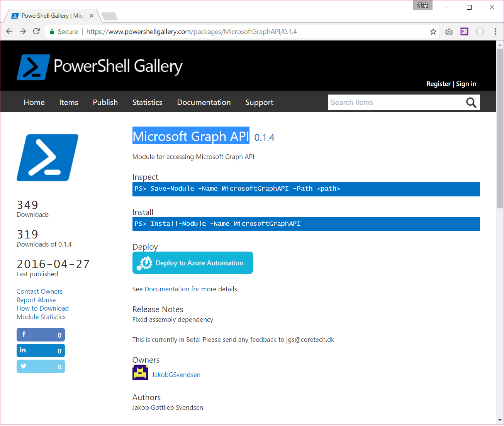
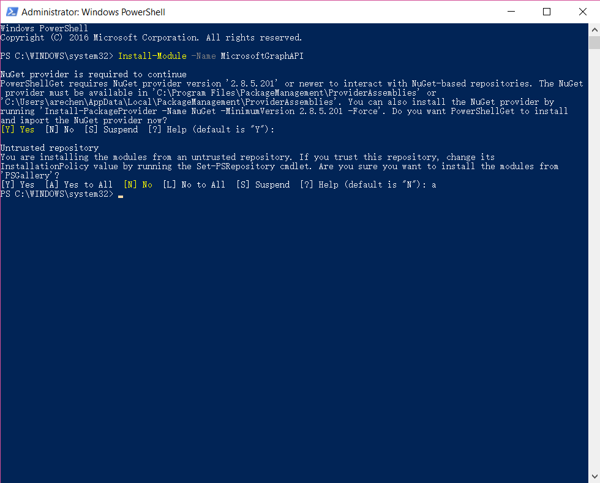
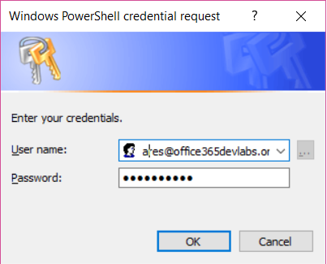
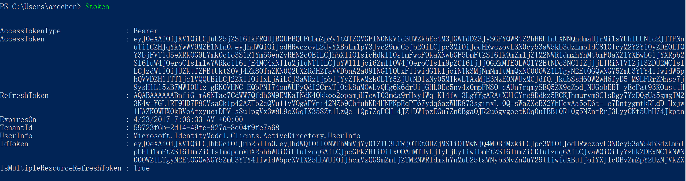
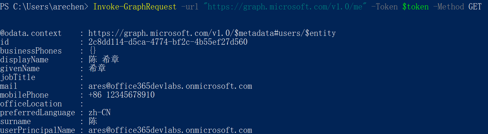
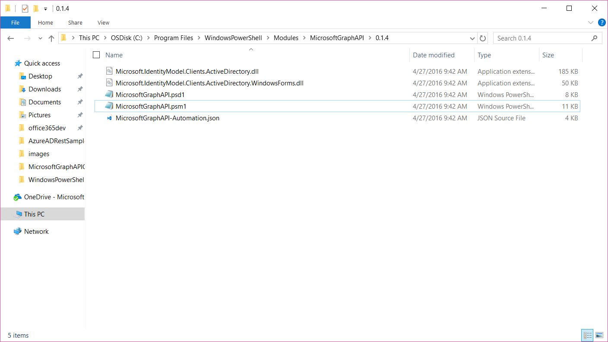

# 在PowerShell脚本中集成Microsoft Graph
> 作者：陈希章 发表于2017年4月23日

我旗帜鲜明地表态，我很喜欢PowerShell，相比较于此前的Cmd Shell，它有一些重大的创新，例如基于.NET的类型系统，以及管道、模块的概念等等。那么，PowerShell是否可以愉快地跟Microsoft Graph搭配工作，为我们的IT管理员或者开发人员提供一种利用脚本就可以对Office 365进行运维和集成呢？

>PowerShell一直可以管理Office 365，但那是通过比较传统的方式，就是Office 365提供了一些特定的Cmdlet，通常是给管理员用的，而且每个服务都可能有一套自己的Cmdlet，有兴趣的朋友可以参考<http://powershell.office.com/>。今天介绍的这个与Microsoft Graph的集成，是一种全新的视角。

言归正传，要在PowerShell脚本中访问Microsoft Graph，当然首先也得注册应用程序，这个我已经用了几篇文章详细介绍过了，这里不再赘述。其次，就是要面临认证和授权的问题，最后才是对Microsoft Graph资源的调用。
> 这个三部曲，看起来最后一步是重点，但其实很多朋友是被卡在第一步和第二步。请仔细阅读我此前的文章。

## 准备环境

本文将直接使用[上一篇](desktopapplication.md)中已经注册好的应用程序，它的信息如下
```
AppId ：45aa2ecc-5e57-4c91-86c1-b93064800c39
RedirectUrl ：https://login.microsoftonline.com/common/oauth2/nativeclient
```

接下来我们就着手来做认证和授权了。我坚持我的观点，不想自己去发起和解析OAuth，所以我推荐给大家一个能直接用的PowerShell模块。它虽然不是官方提供的，但经过我的测试使用我发现还是挺方便的。
 
Microsoft Graph API
<https://www.powershellgallery.com/packages/MicrosoftGraphAPI/0.1.4>



>值得注意的是，它的最后更新时间是2016年4月27日。

## 安装Microsoft Graph API 模块
这个模块需要在本地安装才能执行，请用管理员身份打开PowerShell，然后执行如下的命令 Install-Module -Name MicrosoftGraphAPI


>执行Install-Module的前提条件是当前操作系统需要有一个PowerShellGet的模块，所以要求运行环境是Windows 10，关于这个的说明，有兴趣可以参考 <https://www.powershellgallery.com/>

安装成功后，可以通过Get-Command -Module MicrosoftGraphAPI 获得这个模块为当前环境安装的命令，并且通过Get-Help xxxxx 快速了解这些命令的用法


## 通过Get-GraphAuthToken认证和授权
安装好了Microsoft Graph API这个模块，我们可以通过下面这样的命令去进行用户身份的认证和授权
$token=Get-GraphAuthToken -AADTenant "office365devlabs.onmicrosoft.com" -ClientId "45aa2ecc-5e57-4c91-86c1-b93064800c39" -RedirectUri "https://login.microsoftonline.com/common/oauth2/nativeclient" -Credential (Get-Credential)



请注意，我们这里调用的是PowerShell自带的一个获取用户凭据的对话框来得到用户信息，然后API会将这些信息提交给Microsoft Graph，并且得到AccessToken给PowerShell。



## 通过Invoke-GraphRequest执行Microsoft Graph查询
这是一个通用的方法，它可以用来执行所有的Microsfot Graph操作，包括查询数据，增加、更新、删除数据等。下面演示一个最简单的查询，用来获取当前用户的基本信息
Invoke-GraphRequest -url "https://graph.microsoft.com/v1.0/me" -Token $token -Method GET



看起来还不错，有觉悟的同学一定会发现，以上的命令访问的都是国际版Office 365。那么，中国版的Office 365是否也可以同样操作呢？很抱歉，**目前来说这个API是不支持中国版的Office 365的**。

这就给我们提了一个好问题，我们能不能自己写一个适合于中国版Office 365的Microsoft Graph API呢？为什么不呢？

结合[上一篇](desktopapplication.md)演示的访问中国版Office 365的代码，有兴趣的同学可以自行研究一下怎么在现有的这个API基础上进行修改实现



>如果有实现出来，并且自告奋勇地分享在PSGallery中，我请喝咖啡 :)