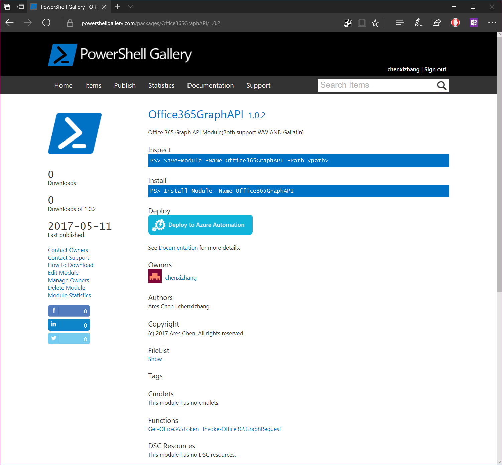
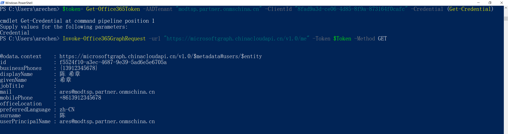

# 支持国内版Office 365的PowerShell模块现已发布
> 作者：陈希章 发表于2017年5月12日

[上一篇](powershell-application.md)文章我详细介绍了如何在PowerShell中访问到Office 365的Graph API，在文章结尾处我留了一个问题，希望有朋友可以根据那个思路，尝试开发和设计一个可以直接用于国内版Office 365的PowerShell模块。虽然到目前为止我还木有收到有人踊跃反馈，但这段时间我已经依葫芦画瓢做了一个自己的版本，并且发布到了PowerShell Gallery，如果有兴趣的朋友，可以直接使用。

因为这是一个标准的模块，所以使用方式跟其他的模块是一样的，目前我为该模块做的设计是：优先支持国内版Office 365（Gallatin），并且提供了最简化的参数调用方式。

安装完这个模块后，可以在你的PowerShell脚本中像下面这样使用它

尽情享用吧，如果有什么使用上面的问题，欢迎给我反馈。