# 再谈 SharePoint 大局观
> 作者：陈希章 发表于 2017年12月21日

## 前言

我对SharePoint这个产品很有感情，因为曾经有相当长一段时间，在很多个夜深人静、月黑风高的晚上，我都是在和它形影不离，在一个一个项目实践中相爱相杀。今天这个产品早已经不是我最初认识它的模样，但历经这么长时间的发展变迁，我觉得现在是在一个非常好的发展轨道上面。

SharePoint平台过去是、现在也仍然是企业级协作和内容管理的领导者，在全球拥有数以亿计的用户。我曾经写过超过140篇与SharePoint及其开发相关的技术文章，如果有兴趣可以参考 [SharePoint Server及其开发早期系列文章](http://www.cnblogs.com/chenxizhang/category/136065.html)。这些文章大多基于SharePoint Server 2007和2010这两个版本，现在虽然SharePoint Online已经成为了大势所趋，但是其间的一些基本原理还是相通的。而如果你还在使用本地的SharePoint Server，则大部分知识都还是可以复用的。

一千人心中有一千个SharePoint的印象，这一点不奇怪。我在2011年专门写过一篇文章—— [我们该用怎么样的系统思维来了解SharePoint及其价值](http://www.cnblogs.com/chenxizhang/archive/2011/11/20/2256344.html)，希望带领大家从四个维度来看待SharePoint：

1. 基础技术架构人员的角度
1. 系统运维和管理人员的角度
1. 开发人员的角度
1. 最终用户的角度

那么，在今天这样一个风起云涌的新的时代，SharePoint的发展具有哪些趋势，有哪些有意思的新的方向，对于以上四个维度的人员有哪些新的机会呢？本文准备从五个方面来展开

1. SharePoint 向云迁移的趋势和规律
1. SharePoint Server 和 SharePoint Online的分工
1. SharePoint & OneDrive for Business的分工
1. SharePoint 在用户体验方面的改进
1. 开发模式的变化

## SharePoint 向云迁移的趋势和规律

2010年10月，微软对外宣布了Office 365这个计划，并在2011年6月正式在全球推出商用。时至今日，Office 365仍然保留了当年那个四大核心组件的架构（Office & Office Online + Exchange Online + SharePoint Online + Lync Online），只不过在一直不断地完善了很多细节（几乎每月都有大量的更新）。

而从去年开始，核心架构也在做出创新性的一些调整，有一些大家可能已经看到了（例如Teams等新服务的推出），更多的还没有对外公布，但有望在一个新的层次上提升和改进Office 365的能力。据不完全统计的数据，目前全球的Office 365月活用户超过1.2亿。

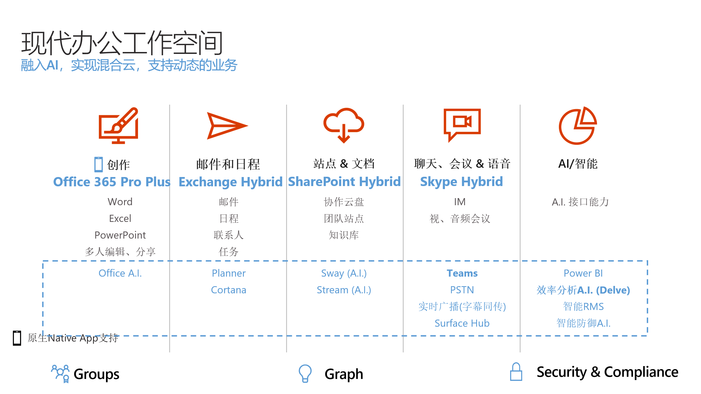

业界普遍认为，SharePoint Server 2013这个版本是向云而生的一个版本，其中最显著的一个特点是它推出了全新的App开发模型（虽然并不是很成功），以便用来取代掉原先的那种相对较为重型的服务器短扩展开发模型。SharePoint Online 作为一个多租户的平台，它的开发模式与本地有很大的不同，所以它的开发模式就是沿用了SharePoint 2013的这个设计。

有大量的客户在做SharePoint向云端迁移的方案与实践，这是一个必然的趋势。拿微软自己来说，我们可能是全球使用SharePoint最为广泛的公司之一了，截止到2012年，全公司在三个主要的数据中心，将近250台服务器上面承载了一百多万个网站（包括团队网站，工具网站，个人网站等），数据量大约有36TB。

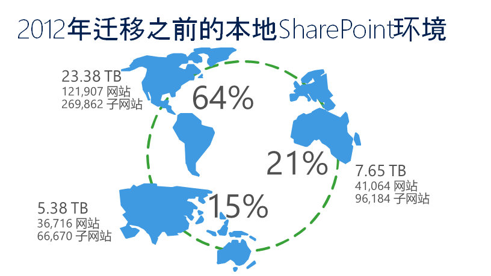

经过差不多五年的时间，微软IT部门分阶段完成了绝大部分网站向云端的迁移

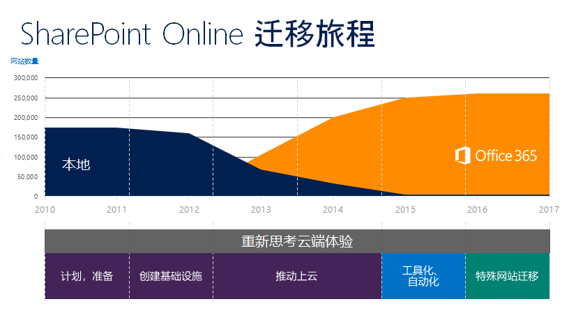

截至2016年，我们的SharePoint Online规模如下图所示

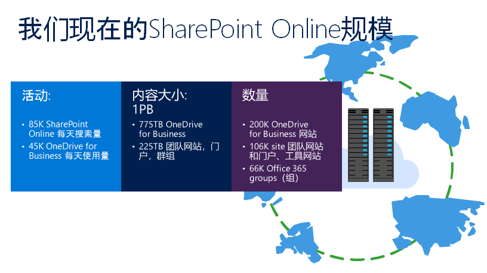

相比较2012年的数据，我们明显发现，网站数量是有所减少的（我们有部分网站还是保留在本地），但内容大小却激增了将近28倍，这说明向云迁移大大提升了员工使用SharePoint进行协作的意愿和能力，这也是云计算的一个重要思考：它不是简单的将本地的东西搬到云上，它其实是一种新的思维模式、工作方式，它当然会带来一些新的挑战，但总体而言，它代表了更多新的可能。

从迁移结果来看还是令人满意的，但过程却并非一帆风顺。我们也同样面临巨大的挑战

我此前在上海的SharePoint Saturday活动上给与会者分享过我们自己的这个故事，以及一些经验心得，总体而言我们可以得出的结论是：向云迁移是一个必然的趋势，这个过程不仅仅是一个技术上面的决策，还牵涉到信息架构的规划、工作文化的重塑等有意思的命题，如果真能跨出这一步，或能帮助企业在互联网的时代真正实现转型。

关于微软自己进行SharePoint 迁移的故事，如果有兴趣，也可以自行通过 <https://www.microsoft.com/itshowcase/Article/Content/691/SharePoint-to-the-cloud-Learn-how-Microsoft-ran-its-own-migration> 进行了解，有多个版本的文档可供下载。

为了便于大家访问，我给大家做了一个二维码

## SharePoint Server 和 SharePoint Online的分工

微软自己的迁移经验中，我觉得比较重要的是并非所有的都放在云上，而且也并不是所有的网站都迁移。有很多网站其实已经不用了，所谓的僵尸网站，倒不如趁这个向云迁移的项目集中清理掉。

实际上，我们现在是一个典型的混合架构

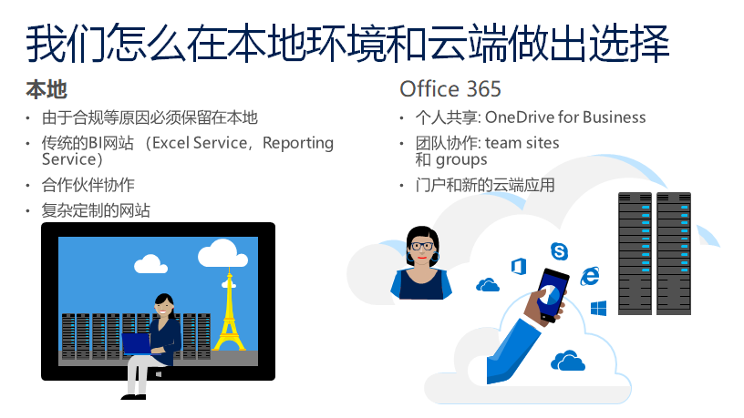

从功能上说，由于SharePoint Server的更新周期一般是三年一个版本，所以虽然SharePoint Online和SharePoint Server其实是一个研发团队（其中有相当一部分就在江苏苏州的研发中心），我们都是先做SharePoint Online上面的改进和创新，然后等一段时候，再视情况整合到SharePoint Server里面去。

微软对于客户的承诺是，我们将一直保留有本地SharePoint Server的版本，提供给客户多种选择。经过大量的实践，我们发现尤其对于中大型企业来说，混合的架构可能是更好的选择，而这也正好是微软Office 365平台的一个优势。

有关混合部署及其使用场景，详情请参考 <https://technet.microsoft.com/zh-cn/library/mt844709(v=office.16).aspx>

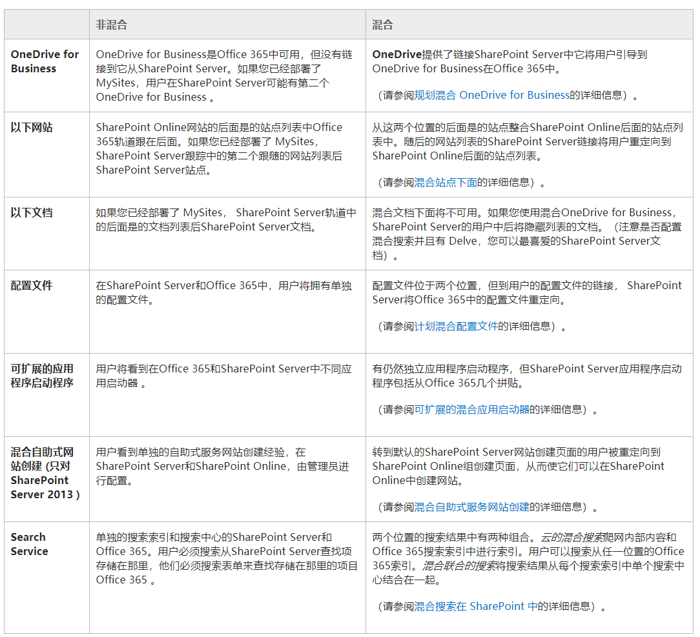

## SharePoint & OneDrive for Business的分工

OneDrive for Business这个功能，最早出现在SharePoint Server 2013中，它是从MySite这个功能演化过来的，并且借鉴了个人版OneDrive的一些经验。

OneDrive for Business 的成功出乎很多人意料，但如果从基于互联网思维的角度来看，这又是必然的。在前不久它被正式认定为企业级文件共享和协作解决方案的领导者。

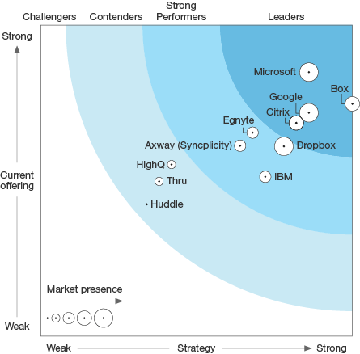

> 有关这个资格认定，详情请参考 <https://blogs.office.com/en-us/2017/12/06/microsoft-onedrive-recognized-as-a-forrester-wave-leader-in-enterprise-file-sync-and-share/?eu=true>

这绝不是浪得虚名。OneDrive for Business 也不仅仅是一款超大容量的个人网盘，而且具有企业级的安全性（灵活并且强大），基于文档的协作和智能发现，可扩展性等方面的优势。如果换一个角度，围绕OneDrive for Business，其实可以建立一个生态系统。

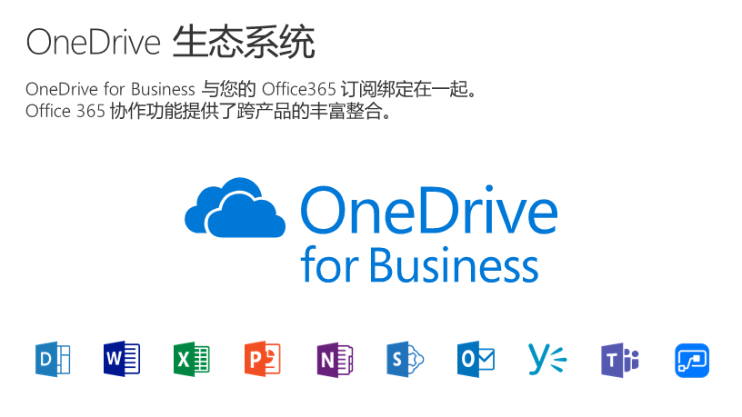

OneDrive for Business的强大以及由此带来的成功，让它在Office 365中的重要性也与日俱增。在Office 365 国际版，OneDrive for Business是可以单独购买的。

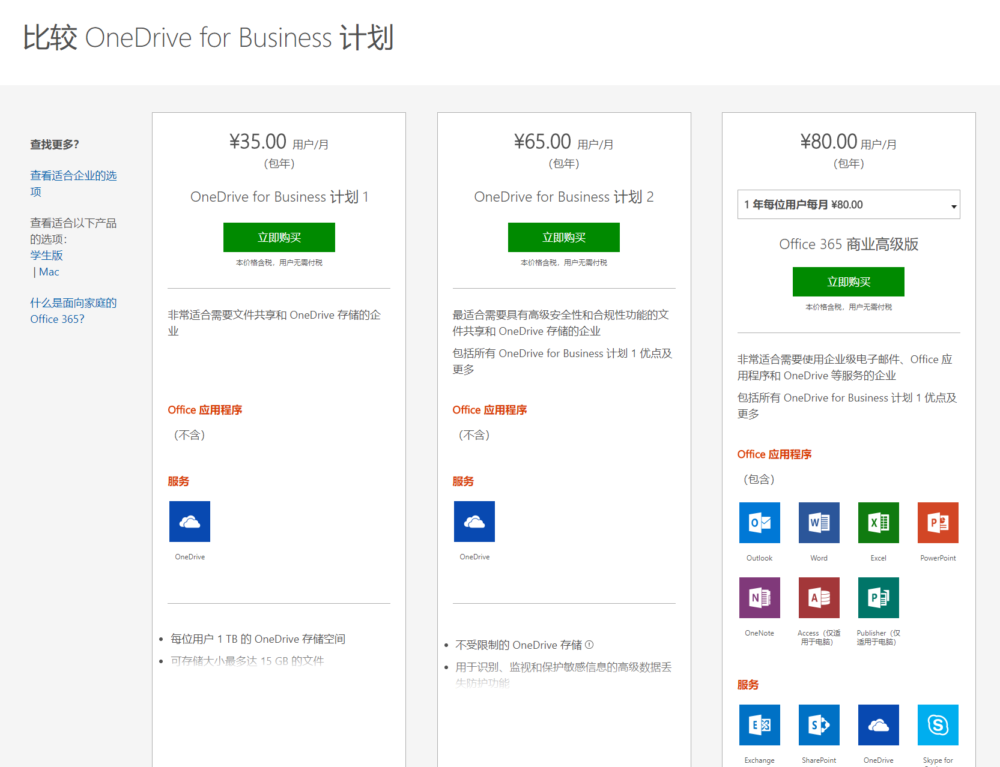

> 除了以上单独购买的情况，只要购买了SharePoint Online，默认就包含了OneDrive for Business

国际版最新的管理后台，OneDrive for Business也有了自己独立的管理中心，而不再依赖于SharePoint Online了。

不光是可以单独购买，可以单独管理，现在连OneDrive的开发，也有独立的开发中心了<https://developer.microsoft.com/zh-cn/onedrive>。

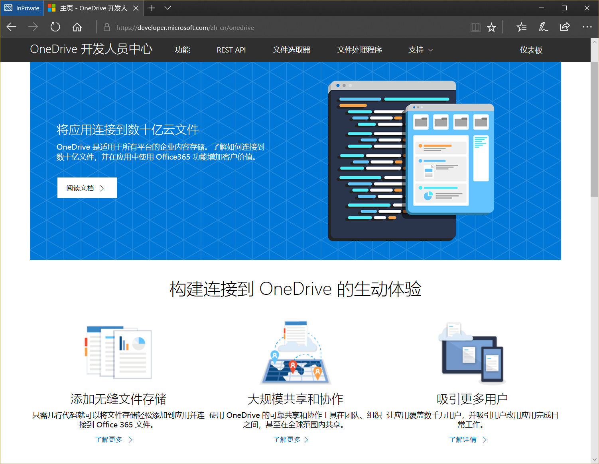

还有谁不服？！反正我是服了。话说回来，OneDrive for Business其实只是SharePoint的一个功能演化出来，如今能搞出这么大的动静来，这只能说明一个问题：SharePoint是多么有潜力的高价值的应用平台啊。当然，前提是我们要抓住机遇，并且跟上互联网的思维。

OneDrive for Business的成功代表着Office 365转型的一个信号，我期待着有更多创新性的服务、更加细粒度的服务能够开发开放出来，这是Office 365用户的福利，也是Office 365要成功的一个有力保障。

## SharePoint 在用户体验方面的改进

虽然SharePoint平台的功能非常强大（坊间传闻真正被客户用到的功能可能不到10%），但是在相当长一段时间内，因为种种原因，我们听到的更多是客户反馈说SharePoint不太易于使用，这相当一定程度上是因为协作需要在使用习惯上做出适应，另外，SharePoint的网页的技术特点决定了除非进行必要的定制，原生的界面可能跟一般的网络应用相比，在使用体验这个方面确实存在一些差距，包括在移动化支持这个方面。

下面这个截图是老版本的SharePoint Online团队网站的界面。很熟悉对吧，这应该也是SharePoint Server 2013的默认模板风格。

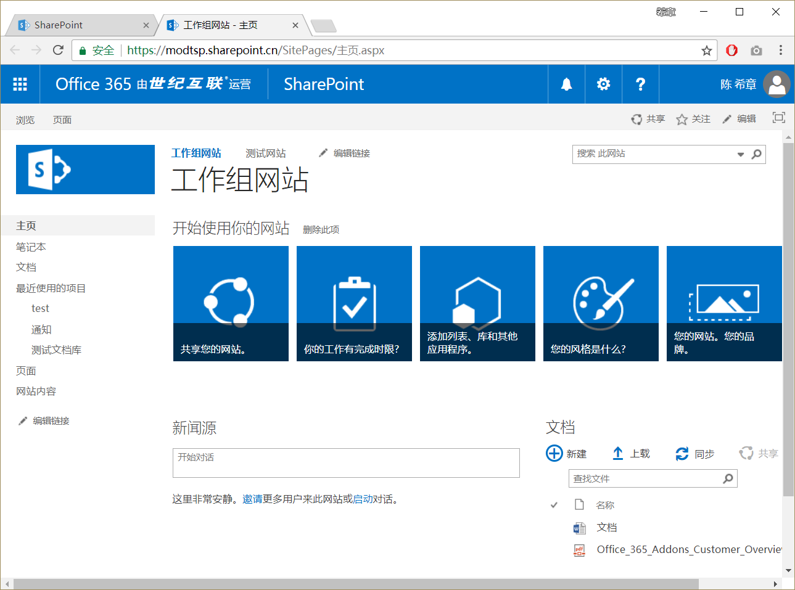

管理员要创建网站是下面这样的体验。我们上图看到的那个网站，其实就是所谓的“经典体验”

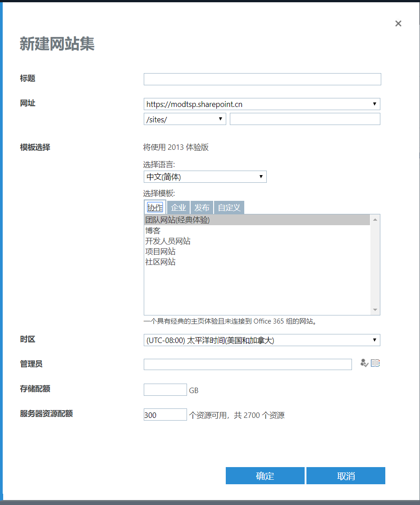

与经典体验相对应的是“现代体验”，我们内部将其称为SharePoint Modern Site。这个功能是从去年开始部署的，现在在世纪互联版本也是提供这个体验的。具体来说，它将SharePoint的网站归类两类，一类是要进行协作的团队网站，所有成员都可以参与内容创作、协作等；另一类是通信网站（或者准备地说是沟通网站，英文是Communication Site），它一般用来在企业内部发布内容，大部分其他用户是查看。

全新的团队网站体验如下

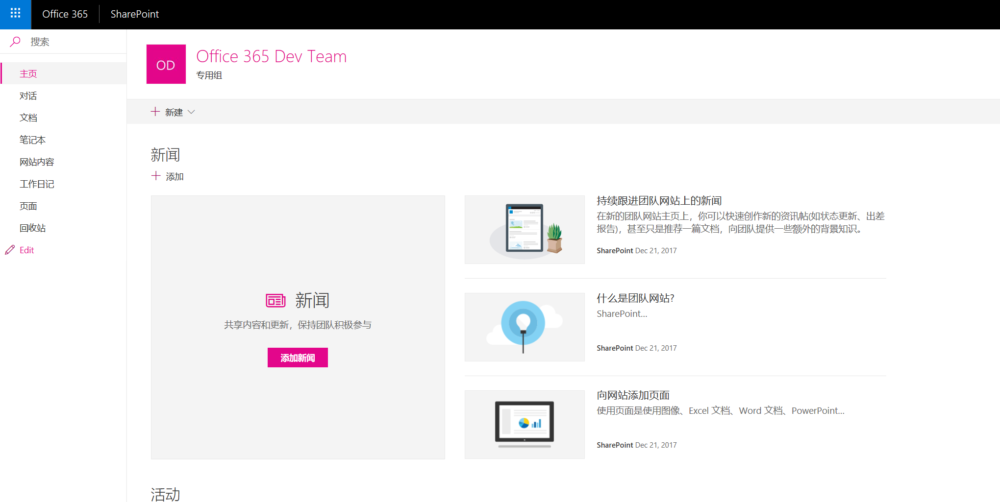

编辑页面的体验也有了本质的不同

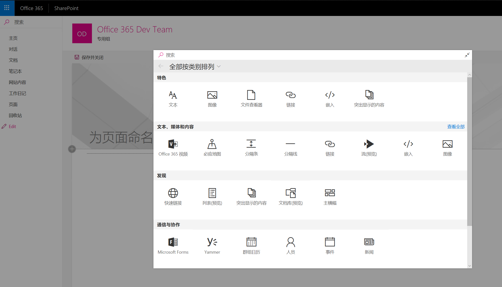

不仅仅是网站页面，文档库和列表的界面也有了很大的变化

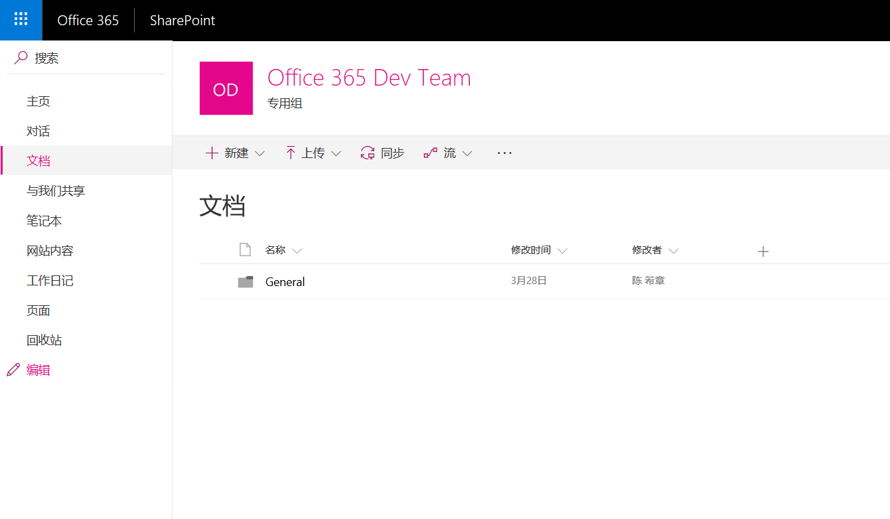

而一个典型的沟通网站体验如下

> 关于沟通网站，更多信息，请参考 <https://blogs.office.com/en-us/2017/06/27/sharepoint-communication-sites-begin-rollout-to-office-365-customers/?eu=true>

## 开发模式的变化

最后，我要谈一下SharePoint所支持的开发模式方面的变化，尤其是在SharePoint Online这个部分。

SharePoint Online 不支持服务器场和沙箱解决方案，但是继续支持用户直接在浏览器中定制和“开发”页面（可以写少量的脚本，改样式），以及通过SharePoint Designer进行定制（网页的高级定制，工作流定制等），与此同时，它还支持下面两种开发模式

1. SharePoint Add-in开发，允许开发人员独立开发一个Web应用，然后用iframe的方式嵌入到SharePoint的页面或者网站中去。
2. SharePoint Framework 开发，允许开发人员使用全新的客户端开发手段，定制Web Part和Extension。这是一个非常大的创新。

我后续会有专门的文章介绍这两种开发模式，在这里先不做过多的展开。

另外，如果需要通过编程访问SharePoint的资源，例如列表，文档库等，除了继续使用SharePoint Online自己提供的[REST API](https://msdn.microsoft.com/en-us/library/office/jj860569.aspx) 之外，现在也支持在Microsoft Graph中直接访问（有限支持）。

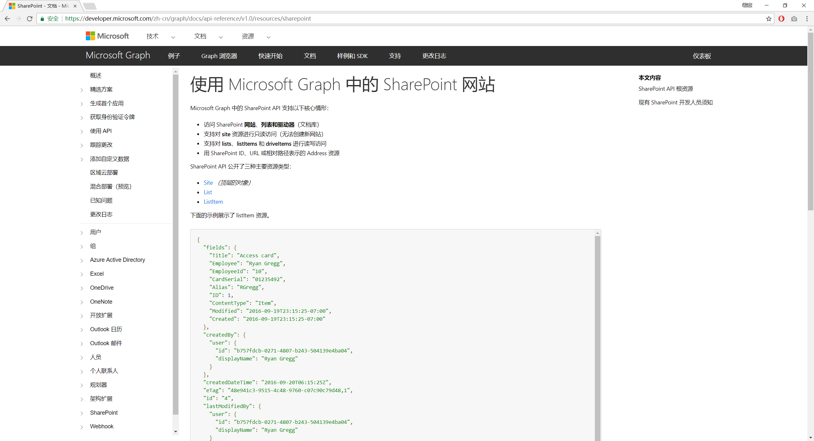

有关详情，请参考 <https://developer.microsoft.com/zh-cn/graph/docs/api-reference/v1.0/resources/sharepoint>

