# SharePoint Framework 简介
> 作者：陈希章 发表于 2017年12月25日

## 前言

通过前面几篇文章，我相信大家对于SharePoint Online的开发有了更加全面的认识，[上一篇](sharepointaddin.md) 介绍的SharePoint Add-in的开发，这种方式最开始是在2013年提出来的，目前仍然是受主流支持，不仅仅可用于SharePoint Server，也可以用于SharePoint Online。

与此同时，在2016年，一个新的开发框架浮出水面，它的名字叫做SharePoint Framework，也可以缩写为SPFx。产品组提出这套框架的主要原因，是因为SharePoint本身是在不断发展，另外很重要的一点也是源自客户和开发人员的反馈——我们需要有全新的一套框架来重新定义SharePoint 的开发——具体而言，希望能用更加原生的Web开发技术来实现，并且与SharePoint有更加自然的融合。

SharePoint Framework这套框架 (<https://aka.ms/spfx>) ，也基本实现了上面的承诺。这篇文章将带领大家管中窥豹，一探究竟。

> 目前在Youtube上面有一个入门系列教程，有条件的朋友可以参考: <https://www.youtube.com/watch?v=WX9FL0BjE0I&list=PLR9nK3mnD-OXvSWvS2zglCzz4iplhVrKq>

## SharePoint Framework的主要特性

1. 在当前用户的上下文和浏览器的连接中运行。没有像SharePoint Add-in那样使用IFrame，也不是将JavaScript 直接嵌入到页面中（安全风险较高，也可能受制于用户浏览器的设置而失效）。
1. 控件直接在页面 DOM 中呈现。
1. 控件支持响应式呈现，以适应不同尺寸的界面。
1. 允许开发人员更好地访问生命周期 - 其中包括呈现 - 加载、序列化和反序列化、配置更改等等。
1. 它未指定框架。可以使用喜欢的任何 JavaScript 框架：React、Handlebars、Knockout、Angular 等。
1. 工具链基于 npm、ypeScript、Yeoman、webpack 和 gulp 等常见开放源代码客户端开发工具。
1. 提供可靠的性能表现，相比较SharePoint Add-in来说有了极大的提升。
1. 最终用户可以在所有网站上使用租户管理员（或其代理）批准的 SPFx 客户端解决方案，其中包括自助式团队、组或个人网站。
1. SPFx Web 部件可添加到经典页面和新式页面，同时支持SharePoint Online和SharePoint Server。

## SharePoint Framework能做什么

目前来说，SPFx适合下面两个场景的开发

1. 客户端Web部件，你可以用Javascript实现所有的界面，并将其应用到任何的SharePoint页面中去。
1. 扩展程序（Extensions），包括修改页面逻辑的 `ApplicationCustomizers`，为字段提供定制的 `FieldCustomizers` ，还有为列表或者文档库添加自定义菜单和命令的 `CommandSets` 

## 准备SharePoint Framework的开发环境

如果你是Visual Studio的重度用户，你可能会希望直接使用Visual Studio来进行SPFx的开发。目前为止，我们还没有看到内置的模板，但SharePoint PnP提供了一个可供单独下载和安装的版本，请参考 <https://marketplace.visualstudio.com/items?itemName=SharePointPnP.SPFxProjectTemplate>。

另外一个好消息是，你可以使用Visual Studio Code 这一款更加轻量级的、跨平台的工具来进行SPFx开发，而且因为SPFx的框架无关性，你可以使用你最熟悉的Javascript框架（例如React、Handlebars、Knockout、Angular等）开发。如果你对C#很熟悉，你的经验可以得到复用，因为Visual Studio Code内置了对Typescript的支持。

1. NodeJS，请一定要下载安装6.x这个版本（<https://nodejs.org/dist/latest-v6.x/>）。据产品组的声明，目前SPFx在其他版本的NodeJS中运行可能会遇到一些小问题。请安装好之后对照下图确认一下版本信息：
    
1. 通过命令 `npm install -g yo gulp` 安装yeoman和gulp这两个模块
    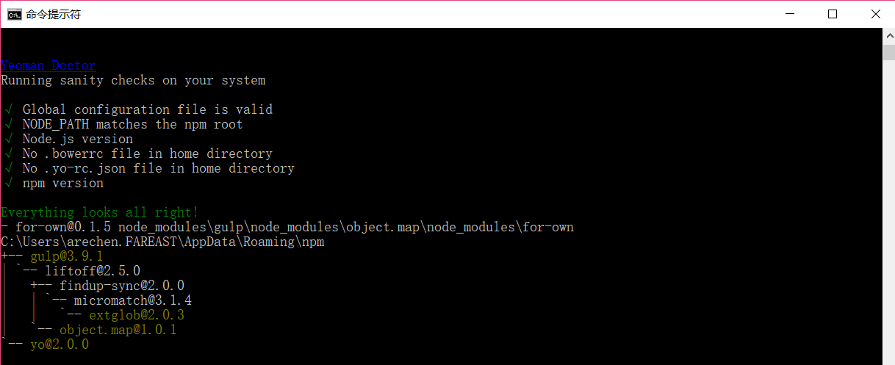
1. 安装微软提供的一个项目模板 `npm install -g @microsoft/generator-sharepoint`

## 开发和调试一个简单的客户端Web Part 

下面我用一个实例，带领大家来体验一下客户端Web Part的开发和部署。请创建一个 `spfx-sample` 的文件夹，然后运行下面的命令 `yo @microsoft/sharepoint`，然后在向导中每一步按照下面的提示进行选择

1. What is your solution name : 回车
1. Which baseline packages do you want to target for your component(s)?：回车选择默认的“SharePoint Online only (latest)”
1. Where do you want to place the files?：回车选择默认设置
1. Do you want to allow the tenant admin the choice of being able to deploy the solution to all sites immediately without running any feature deployment or adding apps in sites? : 回车选择默认的No
1. Which type of client-side component to create?：回车选择默认的WebPart
1. What is your Web part name? 输入名称spfxsample，然后回车
1. What is your Web part description? 留空，回车
1. Which framework would you like to use? ：回车选择默认的设置 No JavaScript framework

然后，你可能需要等个几分钟直到项目生成结束，这取决于你所使用的网络。

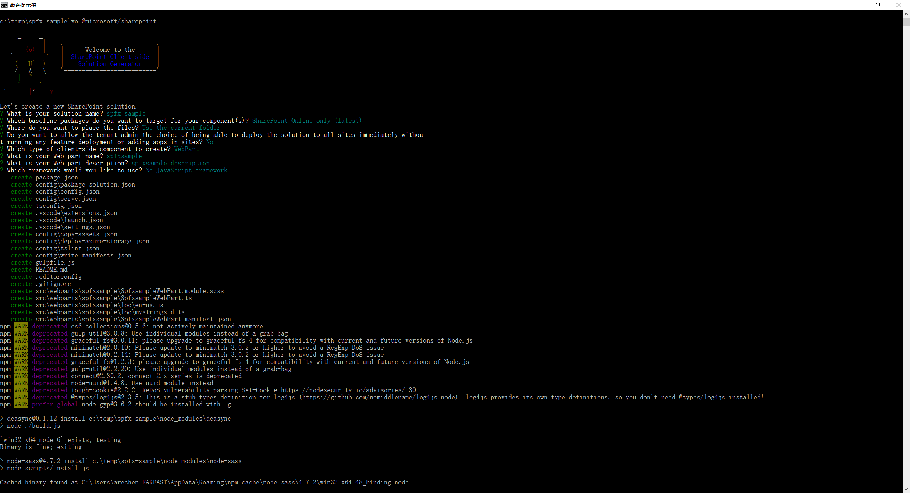

> 默认情况下，NodeJS的包是要从国外下载的，因为众所周知的原因，有时候你可能会感觉非常慢。有一个变通的办法是通过修改配置，让它使用国内的镜像。此类的镜像有很多，你可以使用 `npm config set registry https://registry.npm.taobao.org`，请注意，这样修改后要重新打开命令行窗口才会生效。

其实到这里为止，一个可以运行的WebPart项目已经准备就绪了。SharePoint Framework有一个很神奇的功能，就是支持在本地直接进行调试，不要求你安装SharePoint Server，也不需要你真的拥有SharePoint Online的环境（如果你只是显示内容，不需要涉及到调用SharePoint资源的话），这可是一个非常大的进步了。

但要开始本地调试之前，我们需要确保有一个用于测试的数字证书，因为SharePoint Framework要求网站的地址必须是支持SSL的。我们可以通过 `gulp trust-dev-cert` 这个命令生成一个本地的证书，并且选择信任它。正常情况下，你将会看到一个弹出的窗口，请你确认证书信息，命令正常运行后，会有如下的输出：

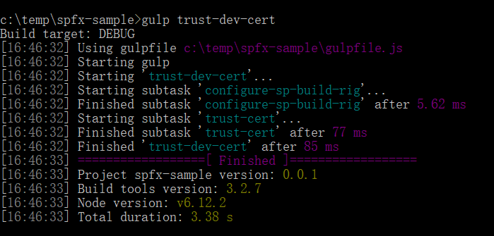

接下来通过 `gulp serve` 这个命令在本地启动一个Workbench文件，用来调试刚才创建的这个WebPart

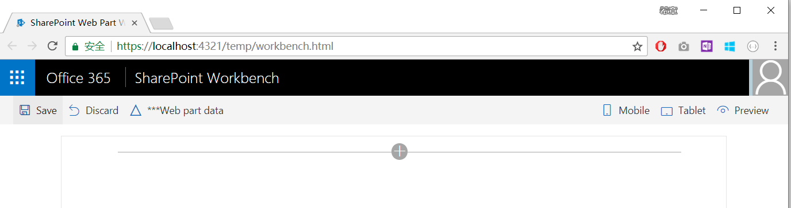

点击上图中央的加号(+)按钮，并且选择“spfxsample”这个Web Part

然后你会在浏览器中看到一个默认的Web Part被添加进来

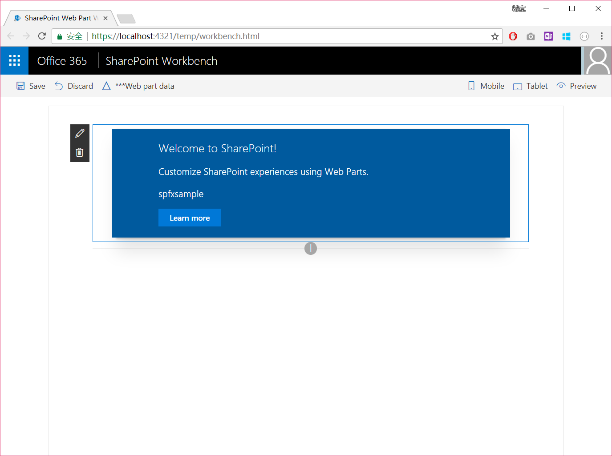

点击Web Part左上角的笔形图标，在页面的右侧会出现一个属性面板，然后我可以修改Description的信息，它会立即显示在WebPart的界面上，如下图所示

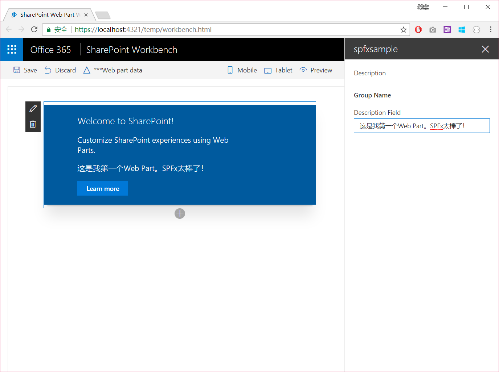

看起来怎么样，是不是挺神奇的？更神奇的事情还在后面呢。假设我已经有了一个SharePoint Online的网站，我想在它里面直接去调试这个WebPart，我可以简单的这样做：

1. 打开任何一个SharePoint Online站点，将其地址复制下来，例如 `https://microsoftapc.sharepoint.com/teams/Samplesiteforares`
1. 在上面的地址后面追加一段地址 `/_layouts/15/workbench.aspx`，在浏览器中访问这个地址后，你将看到一个跟刚才那个本地调试界面很类似的页面

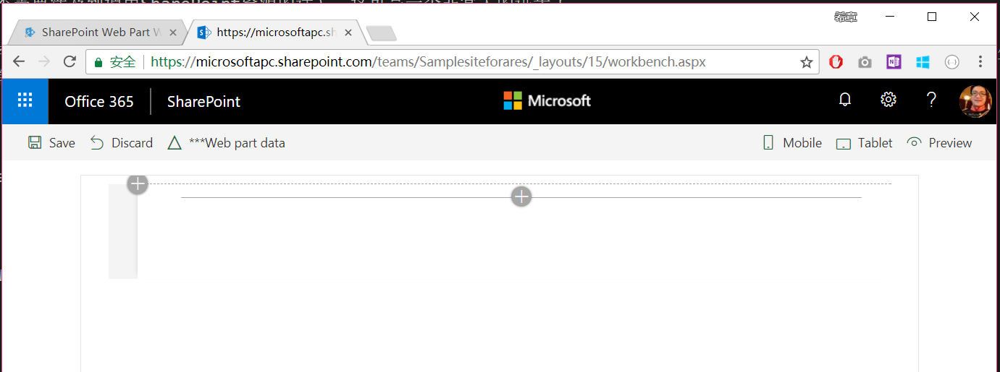

这是真实的一个在服务器端的页面，因为它是可以直接访问到SharePoint当前上下文的。（此处略），而且你在添加WebPart的时候，会看到很多在服务器才有的WebPart

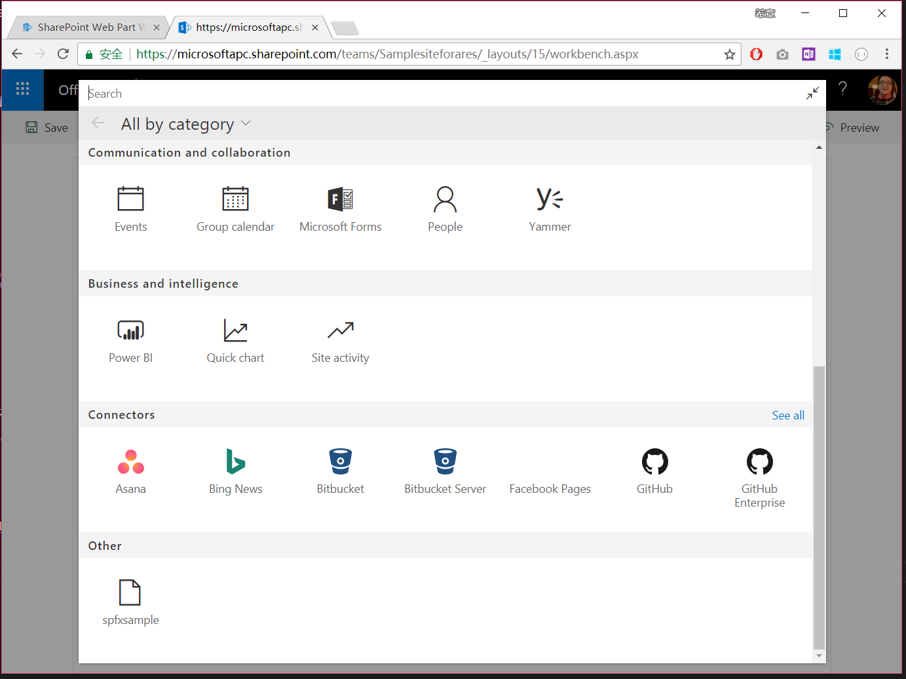

在Other里面有我们刚才开发的“spfxsample”，添加后，你可以像之前本地操作一样设置属性，查看页面的变化

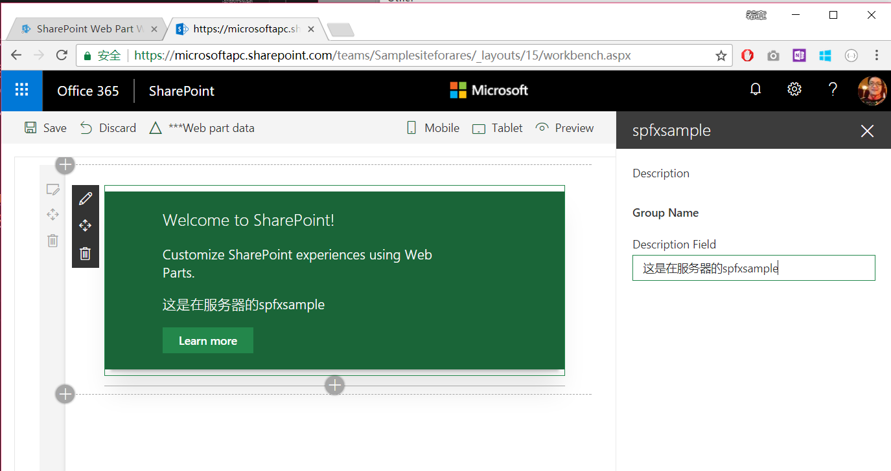

## 部署SPFx WebPart

上面的这个调试的功能，真是广大SharePoint 开发人员梦寐以求的吧，反正我是这么想的：本地不需要任何环境，就可以直接调试，甚至能直接在远程站点页面上面调试，多酷啊。

如果调试完成后，接下来就是真正部署起来，毕竟我们总不可能要求用户都去通过 `/_layouts/15/workbench.aspx` 这样的地址来访问吧。

首先，我们需要通过 `gulp bundle` 命令将当前项目进行生成捆绑

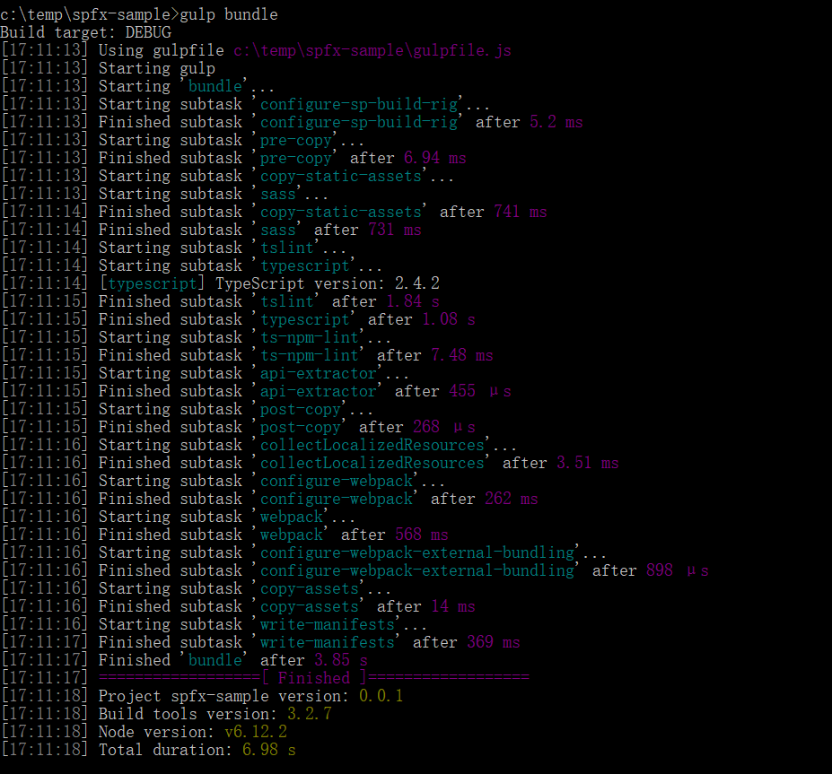

打包之后，通过`gulp package-solution`生成解决方案包

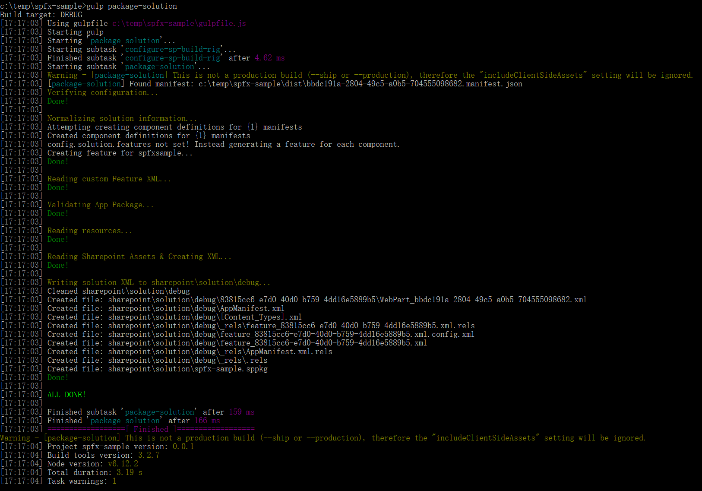

然后，你可以在项目的如下目录 `sharepoint\solution` 中找到一个sppkg文件

> 你可能会觉得gulp是一个无所不能的神器。事实上，它真的是。

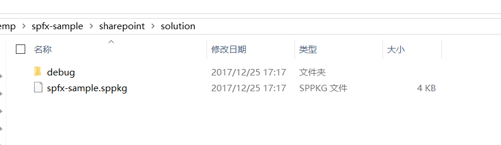

在我们之前创建好的“应用程序目录网站”上面，可以将这个包上传上去
>如果你对如何创建“应用程序目录网站” 不太清楚，可以参考 [这篇文章](sharepointaddin.md)

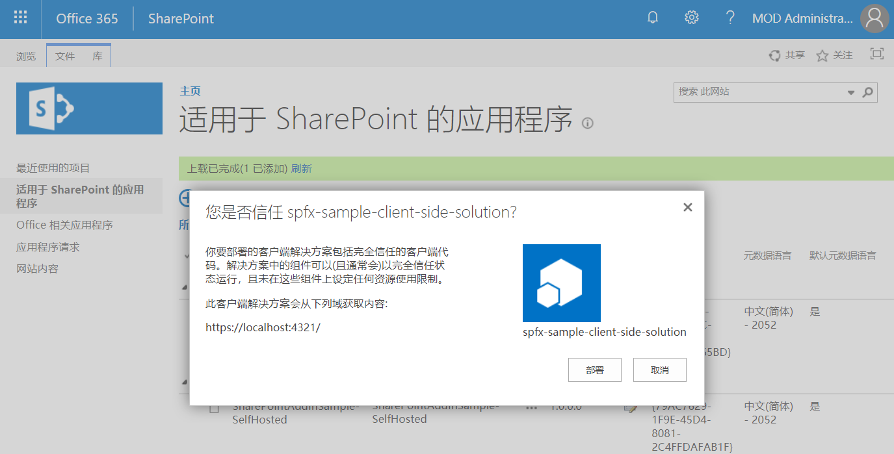

> 请注意，这里显示的地址仍然是 https://localhost:4321

然后你在测试网站中，就可以添加这个应用程序了

请等待应用程序安装完成

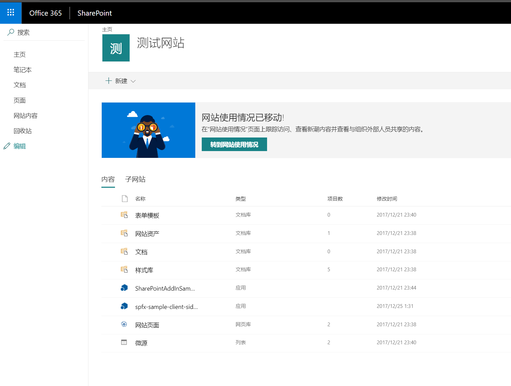

在当前站点，新建一个网页，在编辑网页的时候，能找到此前我们创建的WebPart

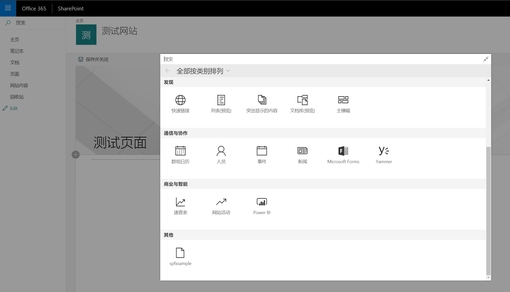

关于具体的使用，跟此前本地调试时是一样的

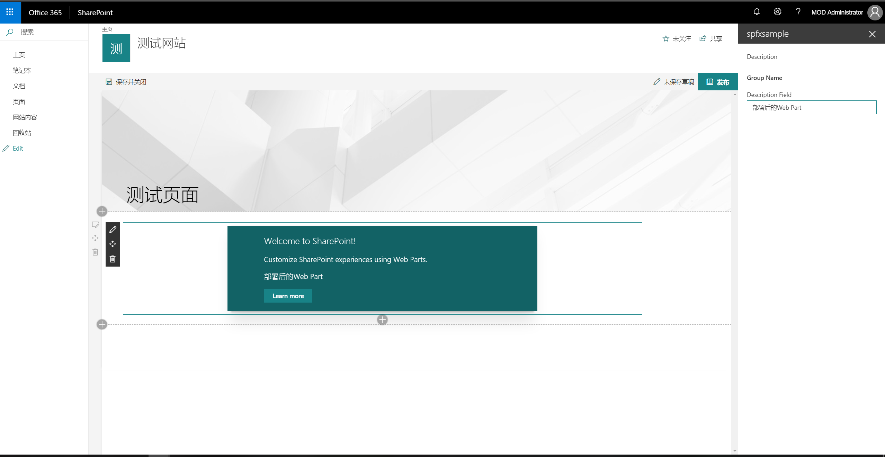

一切看起来都很完美，但是要注意，上面这种部署方式，其实我们的应用还是在本地运行的，所以你要确保运行了`gulp serve`，否则会报错。

但是，这显然也是不现实的。我们当然需要把这个应用部署在服务器，类似于SharPoint Add-in的那种所谓的Provider-Hosted模式。但是，在SharePoint Framework中，它支持将你的项目成果发布到SharePoint中去，它会用CDN（内容分发网络）帮助你托管，这样就不存在外部网址，以及由此产生的跨域访问等问题了。

要确保当前网站是否支持SharePoint CDN，你需要有Office 365全局管理员或者SharePoint 管理员的身份，并且按照下面的提示安装好相关的PowerShell管理工具。

<https://www.microsoft.com/en-us/download/details.aspx?id=35588>

打开SharePoint Online Management Shell，运行 `Connect-SPOService https://m365x810646-admin.sharepoint.com` 连接到你的SharePoint Online管理中心。

然后，运行 `Get-SPOTenantCdnEnabled -CdnType public` 确认当前租户是否支持CDN功能。如果是False，则继续执行 `Set-SPOTenantCdnEnabled -CdnType public`,然后再提示问题时输入a，执行脚本

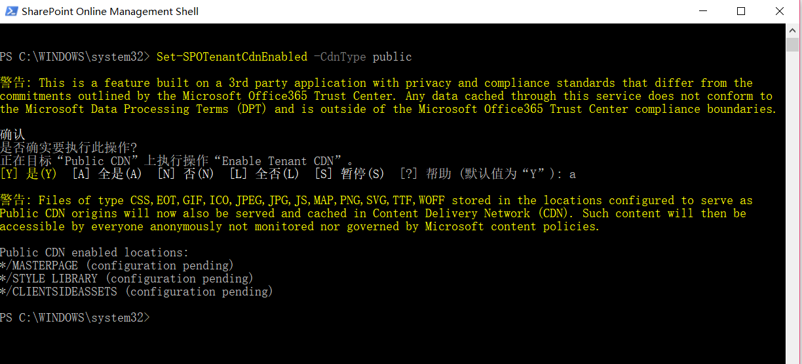 

接下来，我们就可以再次打包当前项目了。请注意命令有所改变，首先是 `gulp bundle --ship`，然后是 `gulp package-solution --ship`。

再次将生成的sppkg文件上传到应用程序目录网站，你会发现内容地址改成了“SharePoint Online”

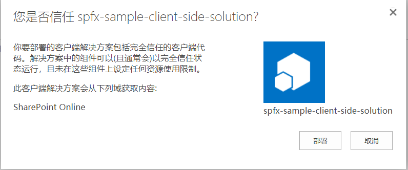

然后在测试网站中添加这个应用程序，现在可以发现即便本地并没有运行`gulp serve`，那个WebPart也能正常工作。

## 结语

SharePoint Framework（SPFx）是一个很好的创新，它将SharePoint开发提升到了一个全新的高度，开发人员可以使用最常见的Web开发工具、框架、语言，实现WebPart和Extensions，这些自定义组件，可以无缝地和SharePoint的原生内容整合在一起。

> 关于SPFx中WebPart开发的更多详细内容，限于篇幅这里就不一一展开了，有兴趣请参考 <https://docs.microsoft.com/en-us/sharepoint/dev/spfx/web-parts/overview-client-side-web-parts>，关于SPFx中Extensions开发，请参考 <https://docs.microsoft.com/en-us/sharepoint/dev/spfx/extensions/overview-extensions>