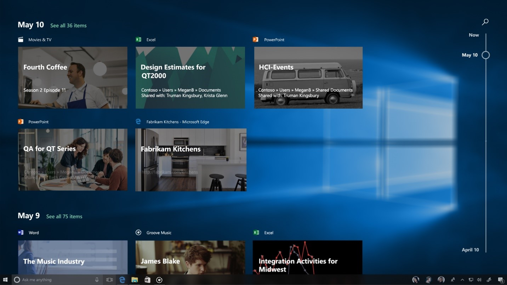
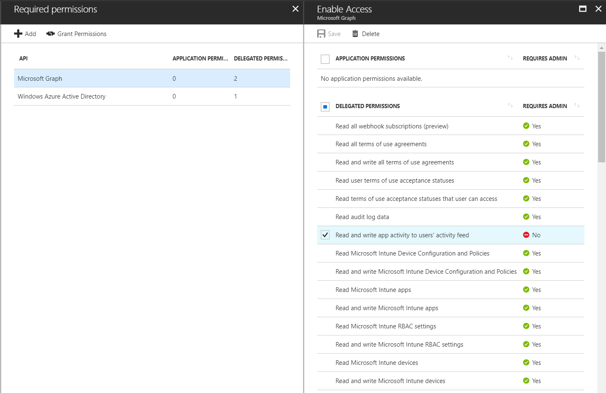
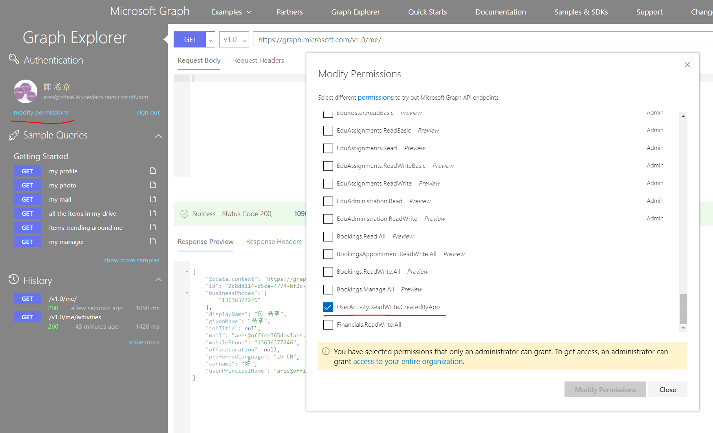
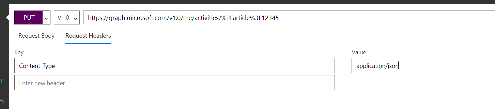
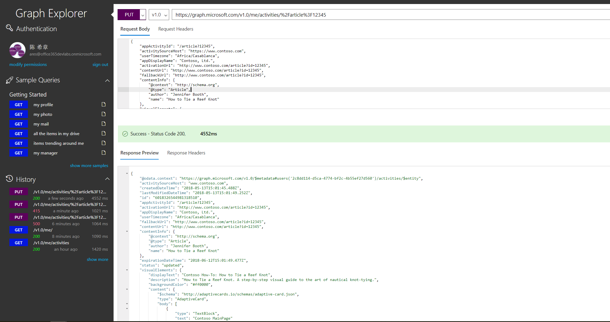
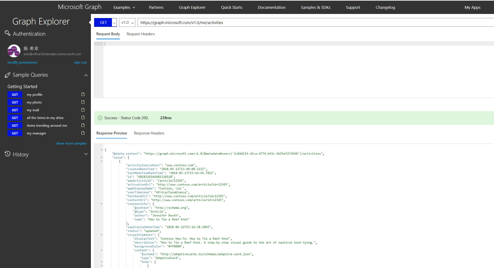

# 基于Microsoft Graph打造自己的Timeline应用
> 作者：陈希章 发表于 2018年5月13日

## 前言

前不久微软正式放出了Windows 10 春季更新（1803），其中有一个非常有特色的应用，就是Windows 10 新增了一个Timeline（时间线）的应用，这个应用可以让用户一目了然地看到最近一段时间所有在Windows中的活动，包括浏览过什么网页，打开过什么文档，设置过什么选项等。下图是一个示范的效果图：



请注意，这里看到的信息不是一个静态的图片，每一个卡片都是可以点击的，而且点击之后会通过调用对应的应用程序自动打开这些活动（恢复到之前的状态），就好像时光倒流了一样。

看起来很酷，不是吗？那么，这样一个应用到底是怎么实现的呢？我们如果也想实现类似的场景，有什么样的思路呢？答案在上周的Microsoft Build 大会上做了揭晓：其实Timeline是一个基于Microsoft Graph实现的应用，只不过他读取的数据，不仅限于Office 365的文档历史，还包括了Windows 10 上面的活动，这也是近年来一个重大的变化：微软已经把Office 365、Windows 10、EMS这三个产品合并为一个——Microsoft 365，将为最终用户提供最佳的体验，他们的能力也将统一通过Microsoft Graph向开发者提供服务。

## 原理解析

首先，从技术上说，要实现这个Timeline应用，用户需要允许相关的活动源将有关信息发送给Microsoft Graph。这里所谓的`活动源`，可以是Office客户端，也可以是Windows 10的应用程序。微软一直致力于保护用户的隐私，所以这个Timeline的功能，默认是不开启的，只有用户在被明确告知上述行为并且选择接受的情况下，才会开始收集数据并进行展现。

其次，除了Windows 10自带的Timeline应用，其实只要几行代码，就能实现一个类似的时间线应用。那么问题就来了，这些**应用之间的数据是不是隔离的**呢？答案是肯定的，也就是说Windows 10这个Timeline应用只能读取到它在经用户同意的前提下收集的那部分活动数据，而我们自定义的应用也是如此。

最后，这里面还有一个有意思的概念。一个活动（Activity）可以对应一个或者多个历史记录（History Items）。历史纪录相当于是活动在某个时间点的快照。

> 据说这个技术，最早在内部有一个代码叫做“Project Rome”，现在合并到了Microsoft Graph中，并且已经在V1.0中提供。相关官方文档请参考 <https://developer.microsoft.com/en-us/graph/docs/concepts/activity-feed-concept-overview> .

## 创建Timeline应用

有了如上概念，我们就闲话少说，撸起袖子加油干吧。因为要访问Microsoft Graph，所以你就必须要注册一个AAD的应用程序。注册这样一个应用程序没有什么特别的，唯一要了解的是，要支持用户活动的读写，需要申请一个UserActivity.ReadWrite.CreatedByApp的委派权限（Delegated Permission），如下图所示



大家可以看到，这个权限并不需要管理员认可就能工作。

> 请注意，目前UserActivity.ReadWrite.CreatedByApp这个权限，仅在国际版的环境中可以用，而且必须在AAD 1.0的环境中实现。AAD 2.0还不支持,国内版（Gallatin）也暂时不支持。

## 如何发布Activity

Windows 10自带的Timeline其实是一个UWP应用，不过你可以用你最熟悉的方式来实现自定义的Timeline应用。但抛开这些具体的界面，我们可以快速了解一下如何创建和更新用户活动（Activity）。

创建或更新Activity的API，请参考 <https://developer.microsoft.com/en-us/graph/docs/api-reference/v1.0/api/projectrome_put_activity>, 大体上说，这里的关键是用PUT方法操作，同时我们既可以单独创建Activity，也可以在创建Activity的时候同时创建History Item，后者也称为“Deep Insert”。

为了给大家直观演示效果，我这里简化一下步骤。我将采用官方的Microsoft Graph Explorer来模拟一个客户端，并且直接用REST API来进行操作。如果你对Microsoft Graph Explorer不太熟悉，你可能需要先阅读一下[这篇文章](graphexplorer.md)。

正如上一节提到的，你需要确保授予了UserActivity.ReadWrite.CreatedByApp这个权限，请参考下图



我直接用官方给的例子，为当前用户新增一个网络文章浏览的活动，请注意下面的`appActivityId`、`activitySourceHost`、`activationUrl`、`visualElements` 是必须的。这个例子的意思是指定义了用户这个活动是浏览了 `http://www.contoso.com/article?id=12345` 这个Url所指向的一篇文章。

``` json
{
    "appActivityId": "/article?12345",
    "activitySourceHost": "https://www.contoso.com",
    "userTimezone": "Africa/Casablanca",
    "appDisplayName": "Contoso, Ltd.",
    "activationUrl": "http://www.contoso.com/article?id=12345",
    "contentUrl": "http://www.contoso.com/article?id=12345",
    "fallbackUrl": "http://www.contoso.com/article?id=12345",
    "contentInfo": {
        "@context": "http://schema.org",
        "@type": "Article",
        "author": "Jennifer Booth",
        "name": "How to Tie a Reef Knot"
    },
    "visualElements": {
        "attribution": {
            "iconUrl": "http://www.contoso.com/icon",
            "alternateText": "Contoso, Ltd.",
            "addImageQuery": "false",
        },
        "description": "How to Tie a Reef Knot. A step-by-step visual guide to the art of nautical knot-tying.",
        "backgroundColor": "#ff0000",
        "displayText": "Contoso How-To: How to Tie a Reef Knot",
        "content": {
            "$schema": "http://adaptivecards.io/schemas/adaptive-card.json",
            "type": "AdaptiveCard",
            "body":
            [{
                "type": "TextBlock",
                "text": "Contoso MainPage"
            }]
        }
    }
}

```

在Microsoft Graph Explorer 中用PUT方法，将上述数据，发送到`https://graph.microsoft.com/v1.0/me/activities/%2Farticle%3F12345`, 同时记得设置Content-Type为application/json



如果一切正常的话，你将收到一个回复，里面包含了在Microsoft Graph中创建的Activity的信息，这里会返回全局唯一的`id`属性。



请注意，如果要更新，也是使用同样的一个命令。而如果要进行删除，则需要用 DELETE 方法，请参考 <https://developer.microsoft.com/en-us/graph/docs/api-reference/v1.0/api/projectrome_delete_activity>。

## 如何查询Activity

有两个接口用来查询用户活动（Activity），分别是

1. 获取用户活动（可以获取全部，也可以获取指定筛选条件的活动），如果需要同时包含历史信息，则需要添加查询参数 $expand=historyitems。 详细的API说明，请参考 <https://developer.microsoft.com/en-us/graph/docs/api-reference/v1.0/api/projectrome_get_activities> 。
1. 获取用户最近的活动。可以理解为上一种的简化版本，Microsoft Graph会查询最近的一个History Items，然后找到它们对应的活动条目。详细的API说明，请参考 <https://developer.microsoft.com/en-us/graph/docs/api-reference/v1.0/api/projectrome_get_recent_activities>。

下面是一个简单的查询例子



## 结语

这一篇文章带领大家了解了Windows 10最新版本中Timeline这个功能的实现原理，并且用实例演示了如何使用Microsoft Graph来实现自定义的类似应用，我用Microsoft Graph Explorer做了演示，大家可以一目了然地看到接口的调用和返回值。

因为这个功能比较新，Microsoft Graph的SDK中，还没有完全包含这个功能，我还发现.NET SDK中存在一点小问题，已经跟产品团队反馈了。所以，如果你现在开始做实践，建议还使用REST API的方式。