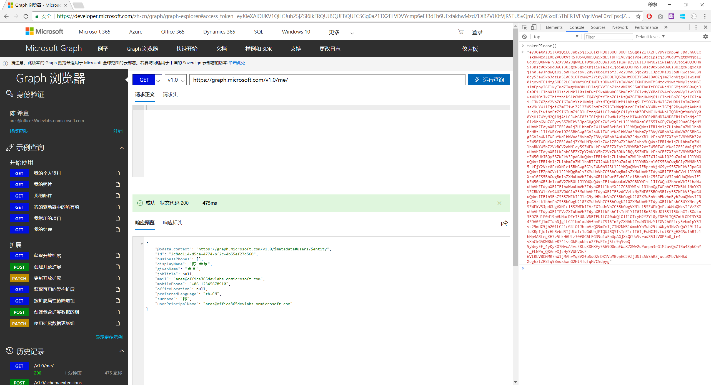
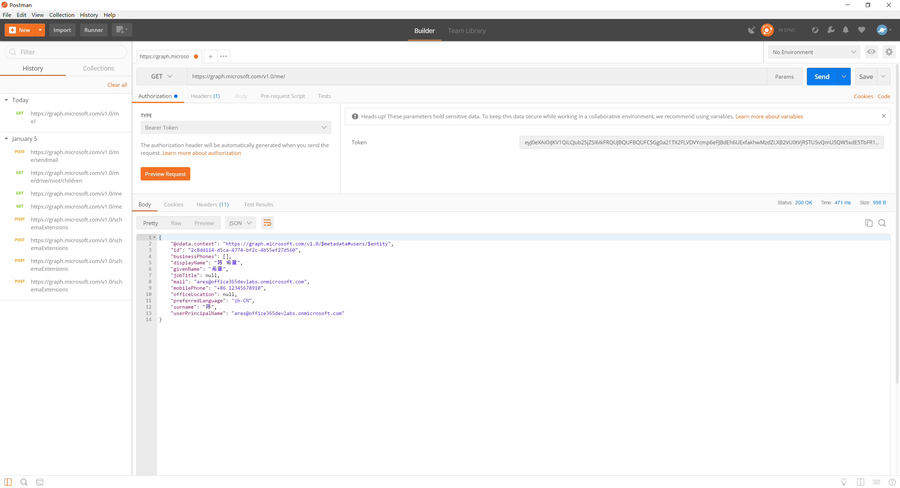
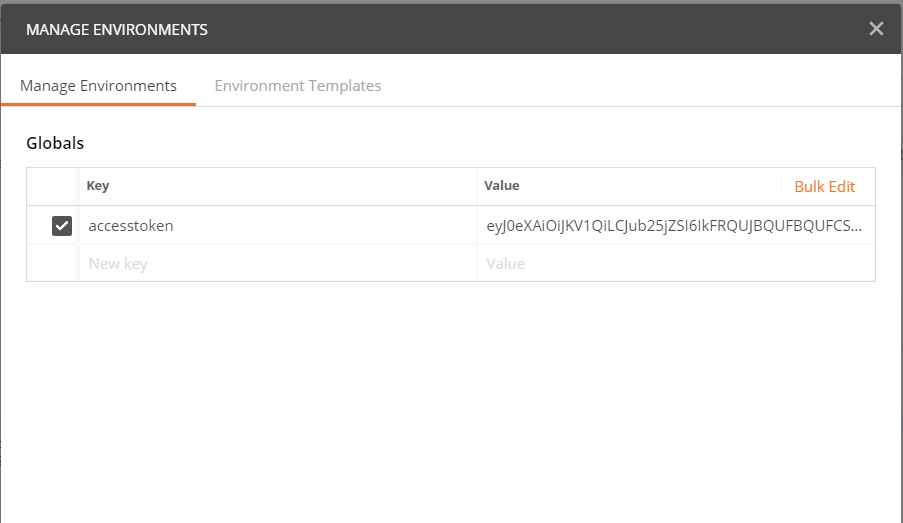
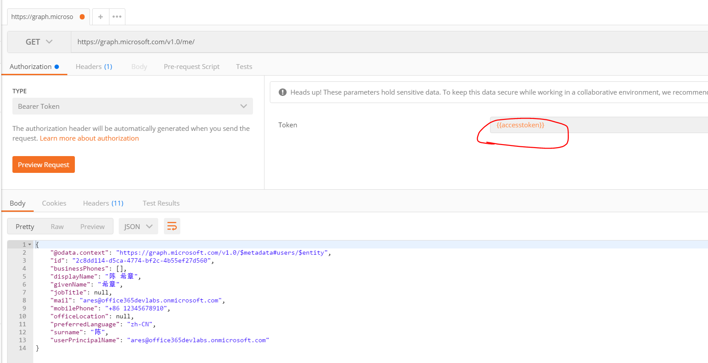
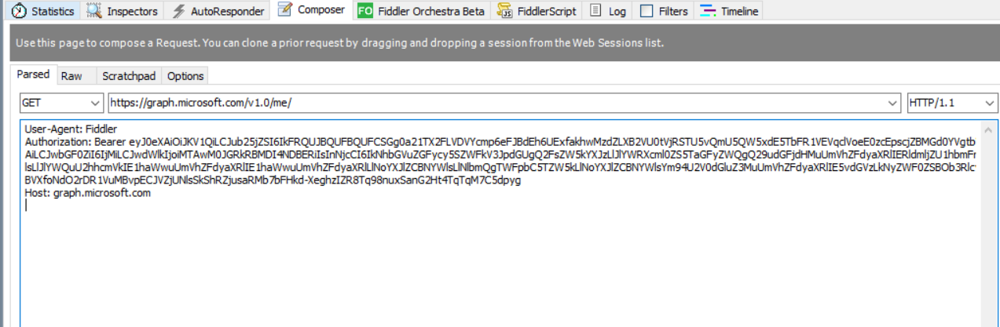

# 通过tokenPlease()函数获取accessToken
> 作者：陈希章 发表于 2018年1月5日

这是一个很小的技巧，而且用几句话就能讲明白。事情是这样的，我最近在回顾之前写过的文章：[通过其他第三方工具体验Microsoft Graph](graph-tools.md) 的时候，发现最近的PostMan这个工具无法正常地获取到accesstoken，具体原因不明，一阵找原因后，碰巧后来遇到了总部做Graph的产品组的同事，了解到他们正考虑在Graph Explorer中增加一个功能，可以直接根据在界面上当前用户登录的身份以及选择的权限集合，获取一个accesstoken，可以直接用于类似于PostMan这类第三方工具中。

话不多说，下面通过一个实例演示一下这个有用的功能。下图显示的是Graph Explorer，屏幕右侧显示的浏览器自带的开发工具（一般通过F12唤出）。我使用某个账号登录后，确保选择了必要的权限，然后在开发工具的Console窗口中输入tokenPlease()然后回车即可得到一串很长的内容，这就是accesstoken了。

有了这个accesstoken，我们可以直接使用到Postman这类工具中。

请注意，这里选择的Authorization类型是Bearer，然后将刚才得到的那个accesstoken粘贴过来即可。为了让这个accesstoken在多个请求中能够共用，你还可以将其添加为一个global的环境变量，如下图所示：

因为有了环境变量，所以在请求中可以通过下面的方式调用：

有了这个accesstoken，可以极大地方便开发人员在不同的工具中进行Graph的测试，除了PostMan，还有我们用到比较多的Fiddler，它也可以轻松地发起Graph的调用了。

大家可能会有一点担心，这样的话会不会有安全问题呢？只要你自己没有将这个accesstoken分发出去，就没有安全问题，而且这个accesstoken的有效期是只有2个小时的。