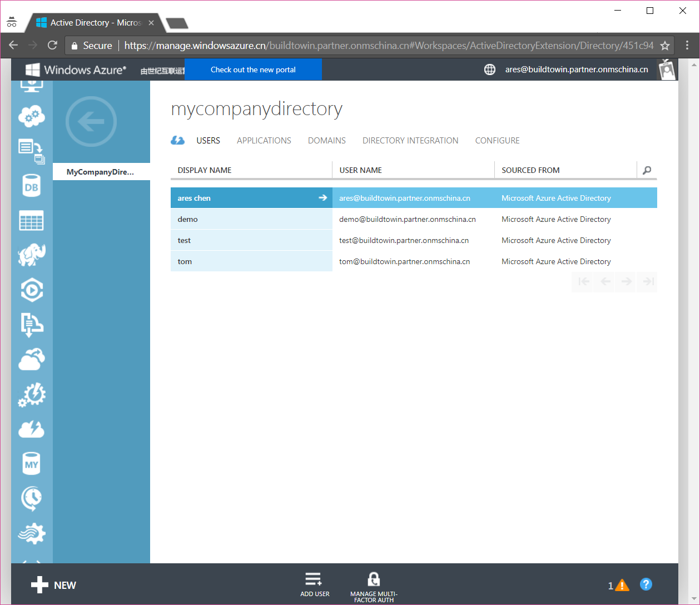
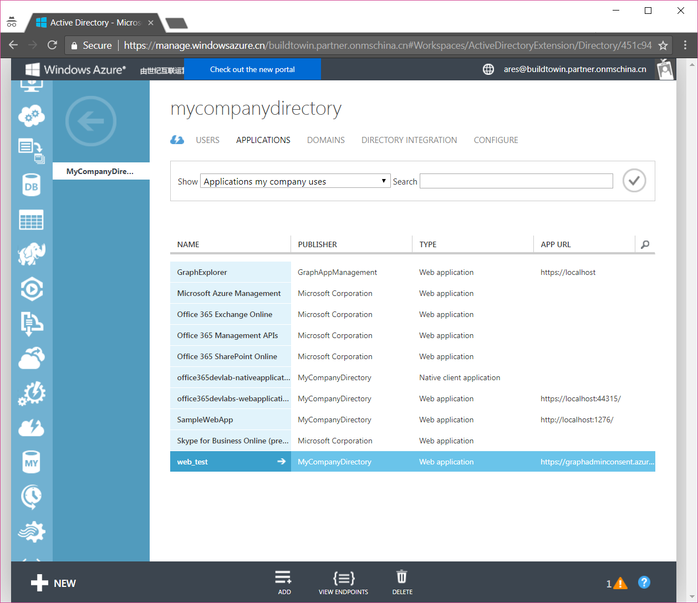
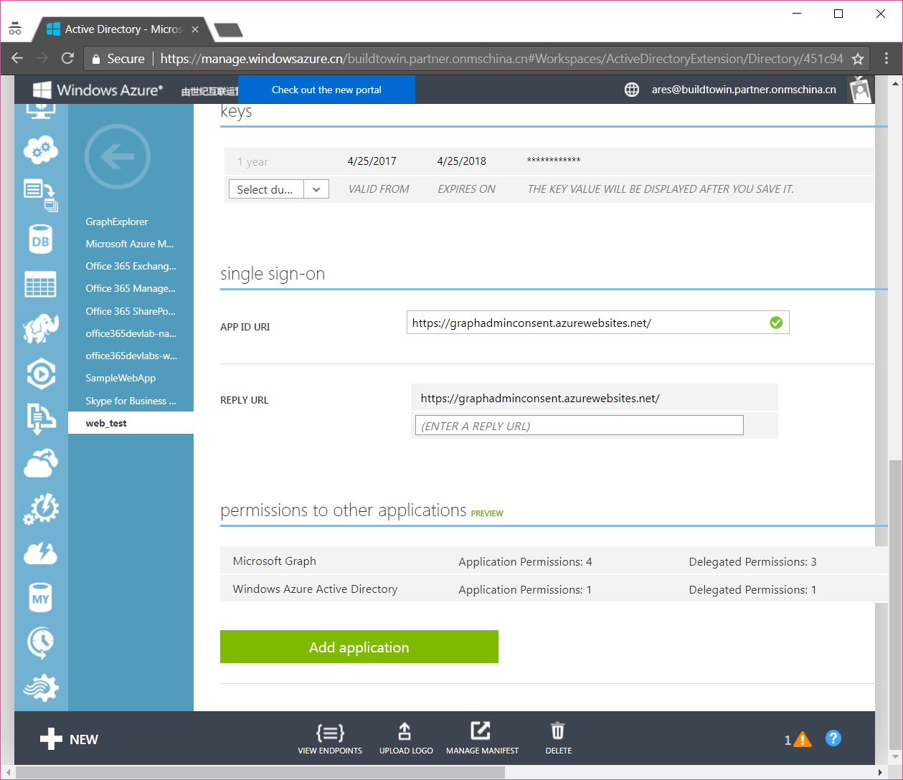
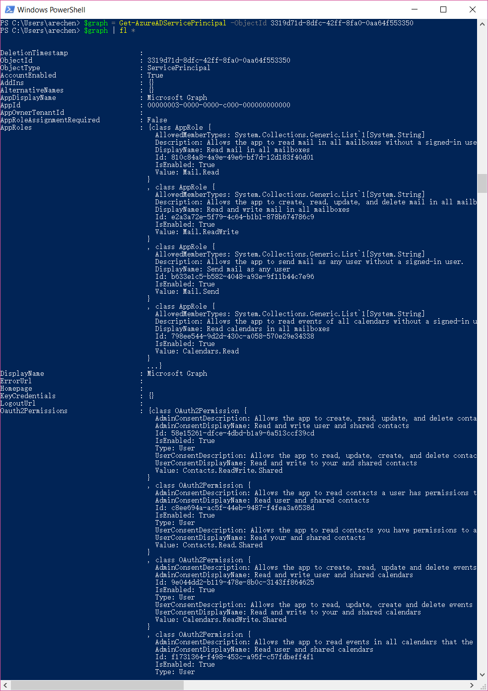

# 掀起Azure AD的盖头来————深入理解Microsoft Graph应用程序和服务声明
> 作者：陈希章 发表于 2017年7月12日

## 引子

这是一篇计划外的文章。我们都知道要进行Microsoft Graph的开发的话，需要进行应用程序注册。这个在此前我已经有专门的文章写过了。但这里存在一个小的问题：国内版的Office 365在申请好之后，并没有像国际版那样，有一个对应的可以注册和管理应用程序的Azure的界面。说起来有点绕，国际版的Office 365管理员可以直接登陆到portal.azure.com进行应用程序注册和管理，但国内版却不行。这个问题目前来说还是一个know issue。不过，在帮助一些客户解决这个问题的过程中，我们也有一些变通的做法，例如我下面的这篇文章就是摘自于世纪互联技术支持的标准做法。

[国内版Office 365和Azure AAD绑定的问题及解决方案](http://www.cnblogs.com/chenxizhang/p/6010139.html)

上述方案中建议客户要另外在购买一个Azure AD的订阅，然后可以跟Office 365那个Tenant绑定起来。这个从一定程度上解决了问题，但不是那么完美。本文给大家分享的是我们另外研究出来的一些经验做法。


## 理解Office 365与Azure AD的关系

从逻辑上说，Azure是微软的智能云平台，在这个平台上，不光是运行了全球不计其数的客户的应用程序，也承载着包括Office 365在内的规模庞大的一些SaaS平台。而Office 365的用户管理和应用管理，本质上就是用Azure AD来实现的。当然，国外的版本，Azure AD还可以做到更多，包括组织配置文件、设备管理、按条件的访问控制等等。限于篇幅，本文不对这些高级功能进行展开，我们仅仅针对用户管理和应用管理，尤其是应用管理这块来一探究竟。

> 本文的例子，因为主要是要演示如何解决国内版的问题，所以截图全部采用国内版Office 365或者Azure
> 请注意，登陆国内版本的Azure，有两种方式，一种是传统门户(manage.windowsazure.cn)，一种是新门户（portal.azure.cn)。新门户毫无疑问带来了一些新的功能，例如支持使用最新的Resource Management的方式创建和管理资源。但是，要进行Azure AD的操作的话，目前还只能在传统门户中进行



这就是我们喜闻乐见的Azure AD管理界面，用户管理不用多说了，这里可以增加和删除用户，修改用户的一些基本信息。我们重点关注的是应用管理的这个部分。



稍微简单地回顾一下相关的概念，注册应用程序（application）有两种不同类型（本机或者Web），除了提供一些基本信息（对于Web应用程序而言，关键一点在于提供ReplyUrl）之外，最重要的就是定义该应用程序需要访问的资源，以及申请的权限了。资源，在Azure AD内部的技术范畴来说，是较为ServicePrinciple的一个对象，而所谓的权限，又分为两种，一种是delegated permission，一种是application permission。前者也称为oauth权限，这是需要用户授权，并且模拟用户的身份去进行操作，适合于一些有用户交互的应用程序，而后者（也称为role权限）则适合于一些在后台运行的服务或者自动运行的脚本。



必须承认，就算是有图形化界面，要完全理解上面这些东西也多少需要一定的时间。与此同时，如果我们连图形化界面都没有的话，怎么来创建应用程序并且为其申请相关资源的权限呢，这有点挑战，但是谢天谢地，我们还是找到了一些方法。


## 通过PowerShell来创建应用程序并且定义服务和权限声明

我旗帜鲜明地喜欢PowerShell，尤其是用来管理Azure AD以及Office 365的时候，它总是能让我们事半功倍。为了演示下面的功能，我需要提醒你准备如下的软件环境。

请在Windows 10的机器上面，安装如下的几个组件
1. 下载安装官方提供的Microsoft Online Service Sign-in Assistant for IT Professionals https://go.microsoft.com/fwlink/p/?LinkId=286152
1. 下载安装官方提供的Azure Active Directory Connection http://connect.microsoft.com/site1164/Downloads/DownloadDetails.aspx?DownloadID=59185
1. 请在本地用管理员身份打开PowerShell，并运行命令 Install-Module -Name AzureAD

> 当然，你还得需要有一个Office 365 的管理员账号信息

为了验证你是否安装成功如上的组件，请重新打开一个PowerShell窗口，运行下面的命令

```
$credential = Get-Credential
# 此时会弹出一个登陆框，请输入Office 365管理员和密码信息，如果没有错误请继续

Connect-AzureAD -Credential $credential -AzureEnvironmentName AzureChinaCloud
# 如果没有错误请继续
Get-AzureADApplication

```

## 查询所有的服务定义信息

我们需要通过脚本获取到当前这个Azure AD中已经定义好的服务信息

```
Get-AzureADServicePrincipal
```

正常情况下将返回下面的结果

ObjectId         |                    AppId     |                           DisplayName
--------         |                   -----      |                         -----------
06d6e7e4-dcb4-4783-a617-78d89bb584f3 | 0000000f-0000-0000-c000-000000000000 | Microsoft.Azure.GraphExplorer
0a80ca08-a6b5-42d9-91a3-1a93c6c25b05 | 43e38210-29b3-411d-b9f7-4a75b5fd2786 | 工作流
0f6b73aa-9a6d-4c25-b518-5aef795042d6 | 00000002-0000-0ff1-ce00-000000000000 | Office 365 Exchange Online
13fc1a89-6a58-406a-9cb2-42e92c458fd3 | aa9ecb1e-fd53-4aaa-a8fe-7a54de2c1334 | Office 365 Configure
1a17c404-11db-442b-93ae-e0751e1563b7 | 00000007-0000-0ff1-ce00-000000000000 | Microsoft.ExchangeOnlineProtection
224fdbf8-fbe8-4d54-b98e-f8b9ad15cac8 | 00000005-0000-0000-c000-000000000000 | Microsoft.Azure.Workflow
26df55ee-6a90-4a17-879c-1a982094512c | 00000009-0000-0000-c000-000000000000 | Power BI Service
2ab85e47-1ba1-4948-9a95-f16eef6215aa | 00000003-0000-0ff1-ce00-000000000000 | Office 365 SharePoint Online
30236da4-3a49-4615-bb09-d665e5938602 | 181dc382-d034-45ad-b7d7-4f440986737b | sample
30ee19e0-47bd-4a3d-8e2b-3752f02d4ffc | 2d4d3d8e-2be3-4bef-9f87-7875a61c29de | OneNote
3319d71d-8dfc-42ff-8fa0-0aa64f553350 | 00000003-0000-0000-c000-000000000000 | Microsoft Graph
348ecf66-4f9c-4ec5-8db4-c86171859ea5 | c5393580-f805-4401-95e8-94b7a6ef2fc2 | Office 365 Management APIs
465b5392-ee37-4d69-be91-dad28b5fb77a | 00000004-0000-0ff1-ce00-000000000000 | Office 365 Lync Online
465eec3f-9bcd-4c27-b071-780b86f01083 | 0000000c-0000-0000-c000-000000000000 | Microsoft.Azure.ActiveDirectoryUX
4ba6a93c-053e-4575-83aa-419fcc7cadb5 | c84c5f13-394f-4807-9a35-317cffa11143 | 工作流
4fa14876-02c2-4089-a450-2b8b45d17ae0 | 00000002-0000-0000-c000-000000000000 | Windows Azure Active Directory
524c2aaa-6ca4-4db5-9876-b758bbd4d6c7 | 8d3a7d3c-c034-4f19-a2ef-8412952a9671 | MicrosoftOffice
6226889d-694d-4ee0-8717-0997c544b94e | ab27a73e-a3ba-4e43-8360-8bcc717114d8 | Microsoft.OfficeModernCalendar
63246e22-5673-4665-9744-e33f18aceaf3 | aa2cd2a1-5a04-4e64-b76a-0a0f21e9d1d9 | webappsample123
67749e7c-7d67-4338-abdd-82f13ff22010 | 00000006-0000-0ff1-ce00-000000000000 | Microsoft.Office365Portal
6de0d20c-2b7f-4aed-803c-f3157018b59b | 00000013-0000-0000-c000-000000000000 | Windows Azure Management Portal
72f64ca3-d200-423b-92da-4f3dd6621ef9 | 1142d051-c271-4044-b1ac-522c8029e3b7 | websampletest
76c56681-2887-4cd4-a375-971669f0d471 | 8fca0a66-c008-4564-a876-ab3ae0fd5cff | Microsoft.SMIT
778437c2-766d-4853-8738-2f397efeae06 | 0f698dd4-f011-4d23-a33e-b36416dcb1e6 | OfficeClientService
793601bf-1a81-400d-bb7d-68db352702c5 | ae675dd6-076c-4036-9d0b-f5a4e9c10c71 | nativeapplication
79a7fbfe-a0d5-4416-8c8f-6a523d45cd4c | 803ee9ca-3f7f-4824-bd6e-0b99d720c35c | Azure Media Service
7f07985a-6657-41cb-b5f6-14c3554b027d | 326128ad-f5f4-474c-bb19-c5e9b7780ba0 | 微软 Office 365 移动办公套件
866d1fbf-bf6d-4e30-a8ad-570317df9642 | 797f4846-ba00-4fd7-ba43-dac1f8f63013 | Windows Azure Service Management API
8ac0becf-4180-43fd-883f-18bda7f45827 | 0f6edad5-48f2-4585-a609-d252b1c52770 | AIGraphClient
8f5f81a0-7690-4bad-b097-bb22a9940041 | 168f7c69-e70d-4a14-ae22-c069b5d296bc | webapp
93a3c4d5-6451-4648-8195-b00eafe51b0e | f05ff7c9-f75a-4acd-a3b5-f4b6a870245d | SharePoint Android
94decd41-c70a-4255-b73a-0d52ead4dde9 | 2ab3d641-6164-4930-8f58-68d56787ab47 | testapplication
9c4b5e57-6ec2-4218-be29-70d197664262 | 595d87a1-277b-4c0a-aa7f-44f8a068eafc | Microsoft.SupportTicketSubmission
a4c307c2-d229-4cea-a51c-c498b146fc3f | 601d4e27-7bb3-4dee-8199-90d47d527e1c | Microsoft.Office365.ChangeManagement
a534ad32-c4a0-491e-810f-7499a8b9016a | c44b4083-3bb0-49c1-b47d-974e53cbdf3c | Ibiza Portal
a913c56c-7a86-479e-894e-9649f99f7841 | 8fad9a3d-ce06-4d85-8f9a-873164f0cafc | native
c259baa5-c050-420d-a4a9-3130dbeed2f9 | 6f82282e-0070-4e78-bc23-e6320c5fa7de | Microsoft.DiscoveryService
ce72c49b-a6df-45c6-9055-76d7eb684a9d | 3f56a5d5-7882-4290-9fd8-3908d734b3fe | deamon
dc4e9fbc-9e1d-4900-9ea1-dfc9b8d414c5 | 0000000b-0000-0000-c000-000000000000 | Microsoft.SellerDashboard
e1d2b488-d085-4af5-bd97-d2436f72fd7d | e3583ad2-c781-4224-9b91-ad15a8179ba0 | Microsoft.ExtensibleRealUserMonitoring
ebf95d4c-7ccf-4ecf-ac48-793d2782f98d | 67e3df25-268a-4324-a550-0de1c7f97287 | Microsoft.OfficeWebAppsService
f0df0bc2-1c0a-446b-9eb6-7a4cf9749079 | 61a7b0d6-2bc9-48b6-8653-ef6b496815cb | GraphExplorer

虽然列了这么多，但其实我们一般最关注就是下面这个服务
ObjectId         |                    AppId     |                           DisplayName
--------         |                   -----      |                         -----------
3319d71d-8dfc-42ff-8fa0-0aa64f553350 | 00000003-0000-0000-c000-000000000000 | Microsoft Graph

## 查询服务的权限信息

有了服务的基本信息，我们就可以查询它的详细信息，尤其是我们关注的权限定义这部分信息了

```
$graph = Get-AzureADServicePrincipal -ObjectId 3319d71d-8dfc-42ff-8fa0-0aa64f553350
# 这个命令将Microsoft Graph这个服务定义保存为一个变量

$graph | fl * 
# 这个命令将显示详细信息

```


下面我将演示一下如何将它的两类权限分别列举出来

```
$graph.Oauth2Permissions 
# 这个会列举出来所有的用户模拟权限

```

| Id                                   | IsEnabled | Type  | UserConsentDescription                                                                                                                                                                                                    | UserConsentDisplayName                                   | Value                      |
|--------------------------------------|-----------|-------|---------------------------------------------------------------------------------------------------------------------------------------------------------------------------------------------------------------------------|----------------------------------------------------------|----------------------------|
| 58e15261-dfce-4dbd-b1a9-6a513ccf39cd | True      | User  | Allows the app to read, update, create, and delete contacts you have permissions to access, including your own and shared contacts.                                                                                       | Read and write to your and shared contacts               | Contacts.ReadWrite.Shared  |
| c8ee694a-ac5f-44eb-9487-f4fea3a6538d | True      | User  | Allows the app to read contacts you have permissions to access, including your own and shared contacts.                                                                                                                   | Read your and shared contacts                            | Contacts.Read.Shared       |
| 9e044dd2-b119-478e-8b0c-3143ff864625 | True      | User  | Allows the app to read, update, create and delete events in all calendars in your organization you have permissions to access. This includes delegate and shared calendars.                                               | Read and write to your and shared calendars              | Calendars.ReadWrite.Shared |
| f1731364-f498-453c-a95f-c57fdbeff4f1 | True      | User  | Allows the app to read events in all calendars that you can access, including delegate and shared calendars.                                                                                                              | Read calendars?you can access                            | Calendars.Read.Shared      |
| 2bf44396-38c4-4826-813f-75074b46a125 | True      | User  | Allows the app to send mail as you or on-behalf of someone else.                                                                                                                                                          | Send mail on behalf of others or yourself                | Mail.Send.Shared           |
| 0772b0b8-18f9-4412-a1dc-cdbb000727fa | True      | User  | Allows the app to read, update, create, and delete mail you have permission to access, including your own and shared mail. Does not allow the app to send mail on your behalf.                                            | Read and write mail?you can access                       | Mail.ReadWrite.Shared      |
| 07382180-f05b-4f94-8e51-02736bd78f14 | True      | User  | Allows the app to read mail you can access, including shared mail.                                                                                                                                                        | Read mail you can access                                 | Mail.Read.Shared           |
| e1fe6dd8-ba31-4d61-89e7-88639da4683d | True      | User  | Allows you to sign in to the app with your organizational account and let the app read your profile. It also allows the app to read basic company information.                                                            | Sign you in and read your profile                        | User.Read                  |
| b4e74841-8e56-480b-be8b-910348b18b4c | True      | User  | Allows the app to read your profile, and discover your group membership, reports and manager. It also allows the app to update your profile information on your behalf.                                                   | Read and update your profile                             | User.ReadWrite             |
| b340eb25-3456-403f-be2f-af7a0d370277 | True      | User  | Allows the app to read a basic set of profile properties of other users in your organization on your behalf. Includes display name, first and last name, email address and photo.                                         | Read all users' basic profiles                           | User.ReadBasic.All         |
| a154be20-db9c-4678-8ab7-66f6cc099a59 | True      | Admin | Allows the app to read the full set of profile properties, reports, and managers of other users in your organization, on your behalf.                                                                                     | Read all users' full profiles                            | User.Read.All              |
| 204e0828-b5ca-4ad8-b9f3-f32a958e7cc4 | True      | Admin | Allows the app to read and write the full set of profile properties, reports, and managers of other users in your organization, on your behalf.                                                                           | Read and write all users' full profiles                  | User.ReadWrite.All         |
| 5f8c59db-677d-491f-a6b8-5f174b11ec1d | True      | Admin | Allows the app to list groups, and to read their properties and all group memberships on your behalf.  Also allows the app to read calendar, conversations, files, and other group content for all groups you can access. | Read all groups                                          | Group.Read.All             |
| 4e46008b-f24c-477d-8fff-7bb4ec7aafe0 | True      | Admin | Allows the app to create groups and read all group properties and memberships on your behalf.  Additionally allows the app to manage your groups and to update group content for groups you are a member of.              | Read and write all groups                                | Group.ReadWrite.All        |
| 06da0dbc-49e2-44d2-8312-53f166ab848a | True      | Admin | Allows the app to read data in your organization's directory.                                                                                                                                                             | Read directory data                                      | Directory.Read.All         |
| c5366453-9fb0-48a5-a156-24f0c49a4b84 | True      | Admin | Allows the app to read and write data in your organization's directory, such as other users, groups.  It does not allow the app to delete users or groups, or reset user passwords.                                       | Read and write directory data                            | Directory.ReadWrite.All    |
| 0e263e50-5827-48a4-b97c-d940288653c7 | True      | Admin | Allows the app to have the same access to information in your work or school directory as you do.                                                                                                                         | Access the directory as you                              | Directory.AccessAsUser.All |
| 570282fd-fa5c-430d-a7fd-fc8dc98a9dca | True      | User  | Allows the app to read email in your mailbox.                                                                                                                                                                             | Read your mail                                           | Mail.Read                  |
| 024d486e-b451-40bb-833d-3e66d98c5c73 | True      | User  | Allows the app to read, update, create and delete email in your mailbox. Does not include permission to send mail.                                                                                                        | Read and write access to your mail                       | Mail.ReadWrite             |
| e383f46e-2787-4529-855e-0e479a3ffac0 | True      | User  | Allows the app to send mail as you.                                                                                                                                                                                       | Send mail as you                                         | Mail.Send                  |
| 465a38f9-76ea-45b9-9f34-9e8b0d4b0b42 | True      | User  | Allows the app to read events in your calendars.                                                                                                                                                                          | Read your calendars                                      | Calendars.Read             |
| 1ec239c2-d7c9-4623-a91a-a9775856bb36 | True      | User  | Allows the app to read, update, create and delete events in your calendars.                                                                                                                                               | Have full access to your calendars                       | Calendars.ReadWrite        |
| ff74d97f-43af-4b68-9f2a-b77ee6968c5d | True      | User  | Allows the app to read contacts in your contact folders.                                                                                                                                                                  | Read your contacts                                       | Contacts.Read              |
| d56682ec-c09e-4743-aaf4-1a3aac4caa21 | True      | User  | Allows the app to read, update, create and delete contacts in your contact folders.                                                                                                                                       | Have full access of your contacts                        | Contacts.ReadWrite         |
| 10465720-29dd-4523-a11a-6a75c743c9d9 | True      | User  | Allows the app to read your files and files shared with you.                                                                                                                                                              | Read your files and files shared with you                | Files.Read                 |
| 5c28f0bf-8a70-41f1-8ab2-9032436ddb65 | True      | User  | Allows the app to read, create, update, and delete your files and files shared with you.                                                                                                                                  | Have full access to your files and files shared with you | Files.ReadWrite            |
| 8019c312-3263-48e6-825e-2b833497195b | True      | User  | Allows the app to read, create, update and delete files in the application's folder.                                                                                                                                      | Have full access to the application's folder             | Files.ReadWrite.AppFolder  |
| 17dde5bd-8c17-420f-a486-969730c1b827 | True      | User  | Allows the app to read and write files that you select. After you select a file, the app has access to the file for several hours.                                                                                        | Read and write selected files                            | Files.ReadWrite.Selected   |
| 5447fe39-cb82-4c1a-b977-520e67e724eb | True      | User  | Allows the app to read files that you select. After you select a file, the app has access to the file for several hours.                                                                                                  | Read selected files                                      | Files.Read.Selected        |
| 205e70e5-aba6-4c52-a976-6d2d46c48043 | True      | User  | Allow the application to read documents and list items in all site collections on your behalf                                                                                                                             | Read items in all site collections                       | Sites.Read.All             |


```
$graph.AppRoles
# 这个会列举出来所有的应用权限
```

| Description                                                                                                                                                                                                                                                                                    | DisplayName                               | Id                                   | IsEnabled | Value                   |
|------------------------------------------------------------------------------------------------------------------------------------------------------------------------------------------------------------------------------------------------------------------------------------------------|-------------------------------------------|--------------------------------------|-----------|-------------------------|
| Allows the app to read mail in all mailboxes without a signed-in user.                                                                                                                                                                                                                         | Read mail in all mailboxes                | 810c84a8-4a9e-49e6-bf7d-12d183f40d01 | True      | Mail.Read               |
| Allows the app to create, read, update, and delete mail in all mailboxes without a signed-in user. Does not include permission to send mail.                                                                                                                                                   | Read and write mail in all mailboxes      | e2a3a72e-5f79-4c64-b1b1-878b674786c9 | True      | Mail.ReadWrite          |
| Allows the app to send mail as any user without a signed-in user.                                                                                                                                                                                                                              | Send mail as any user                     | b633e1c5-b582-4048-a93e-9f11b44c7e96 | True      | Mail.Send               |
| Allows the app to read events of all calendars without a signed-in user.                                                                                                                                                                                                                       | Read calendars in all mailboxes           | 798ee544-9d2d-430c-a058-570e29e34338 | True      | Calendars.Read          |
| Allows the app to create, read, update, and delete events of all calendars without a signed-in user.                                                                                                                                                                                           | Read and write calendars in all mailboxes | ef54d2bf-783f-4e0f-bca1-3210c0444d99 | True      | Calendars.ReadWrite     |
| Allows the app to read all contacts in all mailboxes without a signed-in user.                                                                                                                                                                                                                 | Read contacts in all mailboxes            | 089fe4d0-434a-44c5-8827-41ba8a0b17f5 | True      | Contacts.Read           |
| Allows the app to create, read, update, and delete all contacts in all mailboxes without a signed-in user.                                                                                                                                                                                     | Read and write contacts in all mailboxes  | 6918b873-d17a-4dc1-b314-35f528134491 | True      | Contacts.ReadWrite      |
| Allows the app to read group properties and memberships, and read the calendar and conversations for all groups, without a signed-in user.                                                                                                                                                     | Read all groups                           | 5b567255-7703-4780-807c-7be8301ae99b | True      | Group.Read.All          |
| Allows the app to create groups, read all group properties and memberships, update group properties and memberships, and delete groups. Also allows the app to read and write group calendar and conversations.  All of these operations can be performed by the app without a signed-in user. | Read and write all groups                 | 62a82d76-70ea-41e2-9197-370581804d09 | True      | Group.ReadWrite.All     |
| Allows the app to read data in your organization's directory, such as users, groups and apps, without a signed-in user.                                                                                                                                                                        | Read directory data                       | 7ab1d382-f21e-4acd-a863-ba3e13f7da61 | True      | Directory.Read.All      |
| Allows the app to read and write data in your organization's directory, such as users, and groups, without a signed-in user.  Does not allow user or group deletion.                                                                                                                           | Read and write directory data             | 19dbc75e-c2e2-444c-a770-ec69d8559fc7 | True      | Directory.ReadWrite.All |
| Allows the app to read and write all device properties without a signed in user.  Does not allow device creation, device deletion or update of device alternative security identifiers.                                                                                                        | Read and write devices                    | 1138cb37-bd11-4084-a2b7-9f71582aeddb | True      | Device.ReadWrite.All    |
| Allows the app to read user profiles without a signed in user.                                                                                                                                                                                                                                 | Read all users' full profiles             | df021288-bdef-4463-88db-98f22de89214 | True      | User.Read.All           |
| Allows the app to read and update user profiles without a signed in user.                                                                                                                                                                                                                      | Read and write all users' full profiles   | 741f803b-c850-494e-b5df-cde7c675a1ca | True      | User.ReadWrite.All      |


## 创建应用程序

创建应用程序的PowerShell命令是New-AzureADApplication,它的详细用法请参考这里 <https://docs.microsoft.com/en-us/powershell/module/azuread/new-azureadapplication?view=azureadps-2.0> 

```
$app= New-AzureADApplication -DisplayName "yourapplicationname"  -ReplyUrls "https://websample.com/replyurl" -Homepage "https://websample.com" -IdentifierUris "https://websample.com"

# 这是用来创建Web应用程序的

$app= New-AzureADApplication -DisplayName "yourapplicationname"  -PublicClient $true

# 这是用来创建本地应用程序的，设置PublicClient属性为true即可

$app

#请保存app的具体信息，尤其是AppId

```

## 创建密钥

如果上面创建的是Web 应用程序，还需要为应用程序创建密钥。这里会用到的PowerShell命令是New-AzureADApplicationPasswordCredential，它的详细用法请参考这里 <https://docs.microsoft.com/en-us/powershell/module/azuread/new-azureadapplicationpasswordcredential?view=azureadps-2.0>

```
New-AzureADApplicationPasswordCredential -ObjectId $app.ObjectId

# 正常情况下，将返回一个为期一年的密钥信息

CustomKeyIdentifier :
EndDate             : 7/12/2018 10:25:28 AM
KeyId               :
StartDate           : 7/12/2017 10:25:28 AM
Value               : /TD0rbE5gwm/a6TGqUhqVY46LA16rir6Zwm7pK69prI=


# 请保存这个Value信息
```

## 绑定服务和设定权限

我们已经创建了应用程序，也为他申请了一个密钥，下面就是最后也是最关键的环节————为应用程序绑定服务并且设定权限了。下面这个代码段是为上面创建好的应用程序，并且为其申请了四个delegated permission。（具体这四个权限对应的是什么，请参考上面的表格）

```
$graphrequest = New-Object -TypeName "Microsoft.Open.AzureAD.Model.RequiredResourceAccess"

$graphrequest.ResourceAccess = New-Object -TypeName "System.Collections.Generic.List[Microsoft.Open.AzureAD.Model.ResourceAccess]"

$ids =@("024d486e-b451-40bb-833d-3e66d98c5c73","e383f46e-2787-4529-855e-0e479a3ffac0","e1fe6dd8-ba31-4d61-89e7-88639da4683d","b340eb25-3456-403f-be2f-af7a0d370277")

foreach($id in $ids){
    $obj = New-Object -TypeName "Microsoft.Open.AzureAD.Model.ResourceAccess" -ArgumentList $id,"Scope"
    # 如果是AppRole权限，则第二个参数为Role

    $graphrequest.ResourceAccess.Add($obj)
}

$graphrequest.ResourceAppId = "00000003-0000-0000-c000-000000000000"

Set-AzureADApplication -ObjectId $app.ObjectId -RequiredResourceAccess ($graphrequest)
# 这句命令的RequiredResourceAccess 参数中可以有多个对象

```


## 结语

这篇文章的篇幅较长，我尽可能详细地展示了很多Azure AD中注册应用程序，绑定服务和设定权限的细节，尤其是对于国内的Office 365客户以及合作伙伴来说应该有较高的实用价值。
当我们没有图形化界面可以使用的时候，你就会由衷地感慨，脚本（例如PowerShell）确实是很强大的，而且通过脚本的探索过程，你可以更加清晰地理解其背后的逻辑。

