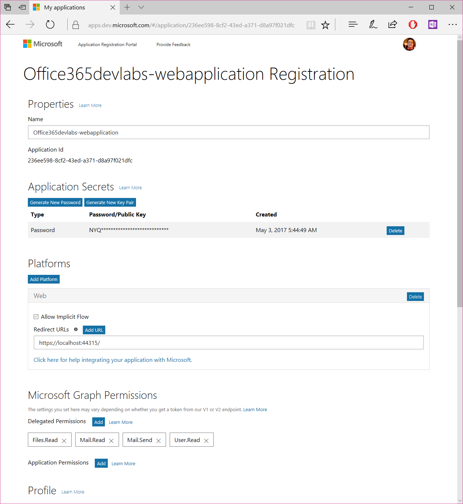
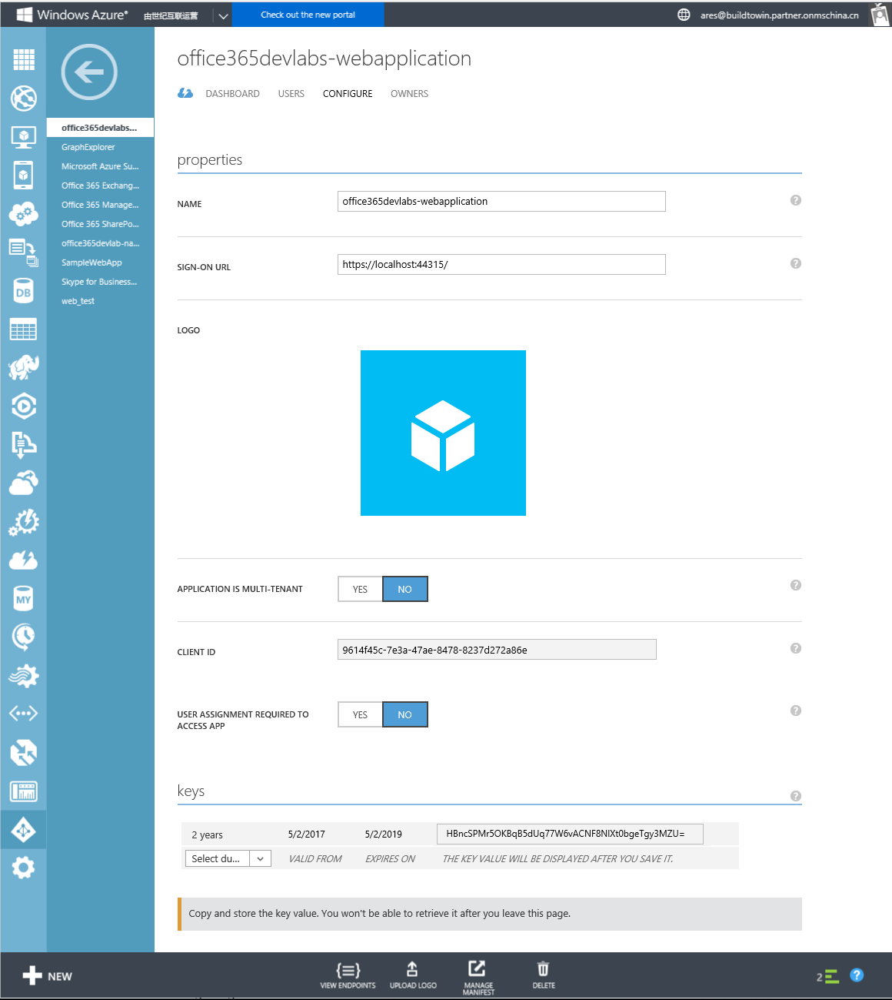
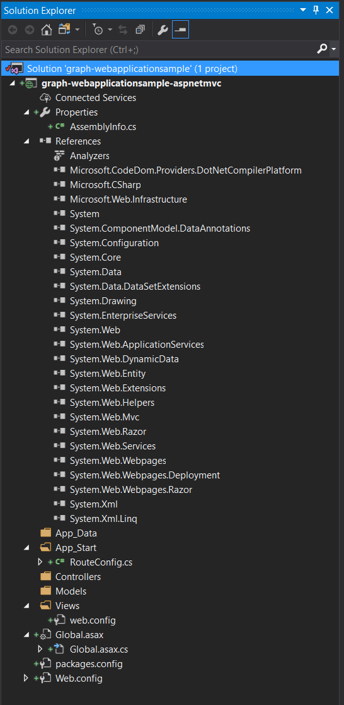
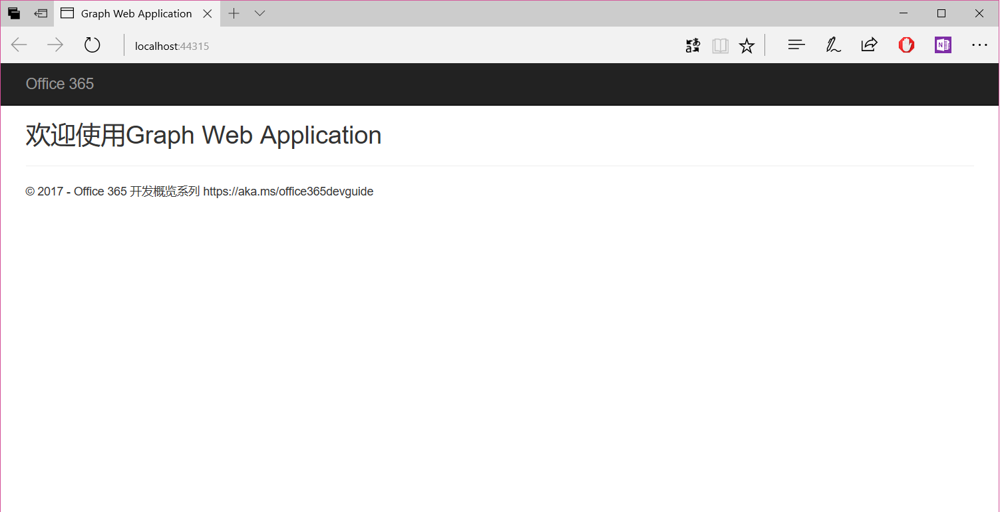
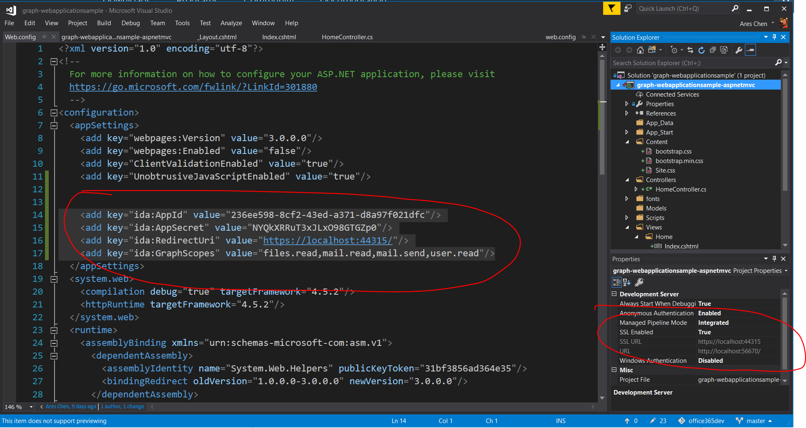
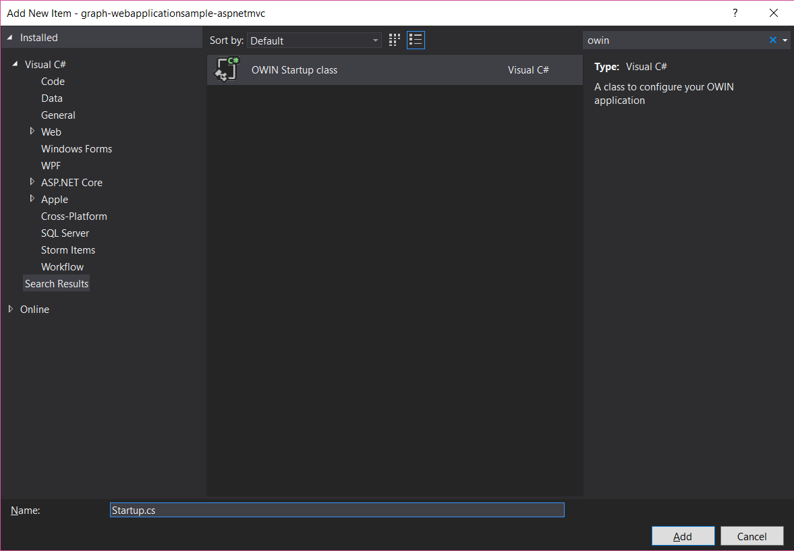

# Microsoft Graph Web应用程序
> 作者：陈希章 发表于 2017年5月2日

这一篇文章我们将用最简单的方式来创建Web Application，分别包括有用户界面的ASP.NET MVC应用，以及一个ASP.NET Web API服务.

## 注册应用程序

针对国际版Office 365，我采用Azure AD 2.0的方式注册应用程序
```
AppId:236ee598-8cf2-43ed-a371-d8a97f021dfc
Key: NYQkXRRuT3xJLxO98GTGZp0
RedirectUrl:https://localhost:44315/
Permission:files.read,mail.read,mail.send,user.read
```

> 请注意，与本地应用程序不一样的是，Web应用程序，需要申请一个Key。

针对国内版Office 365，我采用Azure AD 1.0的方式注册应用程序

```
AppId:9614f45c-7e3a-47ae-8478-8237d272a86e
Key:HBncSPMr5OKBqB5dUq77W6vACNF8NlXt0bgeTgy3MZU=
RedirectUrl:https://localhost:44315/
Permission:files.read,mail.read,mail.send,user.read
```


> 关于注册应用程序的细节，不清楚的读者可以参考之前的文章

## 创建ASP.NET MVC应用程序

为了让大家更加容易理解，如何用最小步骤一个ASP.NET MVC应用程序中添加Microsoft Graph的支持，请选择空白项目模板创建应用程序，但确保勾选了MVC


你看到的空白项目结构大致如下



请确认该项目的调试端口是44315，并且设置为https，同时为项目添加一个HomeController，简单地实现一下Index这个View。我这里看到的效果如下



为了后续的编程方便，我们将上面注册得到的应用程序信息保存在项目的web.config文件中
```
<add key="ida:AppId" value="236ee598-8cf2-43ed-a371-d8a97f021dfc"/>
<add key="ida:AppSecret" value="NYQkXRRuT3xJLxO98GTGZp0"/>
<add key="ida:RedirectUri" value="https://localhost:44315/"/>
<add key="ida:GraphScopes" value="files.read,mail.read,mail.send,user.read"/>

```


接下来我们需要为这个应用程序添加对Microsoft Graph的支持。针对国际版，我们需要安装以下两个Package，并且进行更新
```
Install-Package Microsoft.Graph
Install-Package Microsoft.Identity.Client -IncludePrerelease

Update-Package
```

## 使用 OWIN 中间件来处理用户身份认证
Owin的全称是Open Web interface for .NET，是在ASP.NET开发上面的一个重要创新，简单地说它是将原先紧密关联的IIS和ASP.NET Framework解耦了，一个典型效果就是，ASP.NET开发出来的应用程序（网站或者服务接口），不一定要托管在IIS（虽然很多时候托管在IIS仍然是一个不错的选择），而是可以根据用户的需要托管在其他的宿主程序中，甚至托管在非Windows平台上面（目前已经实现在Linux等平台的托管）。

Owin另外带来的一个好处就是，Server和Client之间可以更加灵活地配置中间件，可插拔式地实现一些强大的功能。例如我们本篇文章要讲到的就是插入一个中间件，将网站的身份认证请求重定向到Azure AD，在获取到用户的授权后，将有关的访问凭据（Access Token）保存在当前的会话中（Session）。

首先，我们要添加一个Owin的启动类（Startup Class）


```
Install-Package Microsoft.Owin.Security
```
未完待续