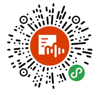

# 课程笔记

> 陈希章 于 2019-2-10

## Office 365 的版本

1. 产品官方网站 <https://products.office.com/zh-cn>
    >这里要理解不同的版本，包含的组件和服务是不一样的。同时理解客户端，云服务，租户的概念。

1. 如果购买国际版，数据在哪里 <https://products.office.com/zh-cn/where-is-your-data-located?ms.officeurl=datamaps&geo=All>

1. 世纪互联版本（Gallatin） <https://www.21vbluecloud.com/office365/>
    >这里要大致知道世纪互联这个版本跟国际版有啥核心不同，例如数据中心，运营模式，技术支持等。2014年进入中国。

1. 购买方式的不同（客户直接下单，通过合作伙伴下单，企业批量许可）

## Office 365账号意味着什么

1. 通过这篇文章了解更多细节 <https://mp.weixin.qq.com/s/knN6Ybk3IjQ0b0yPA8SXQg> 或用微信扫码收听

    

## 安装和更新Office 365

1. 如何安装Office 365的客户端
    * 国际版 <https://portal.office.com>
    * 中国版 <https://portal.partner.microsoftonline.cn>

1. 在管理中心配置更新频道 <https://admin.microsoft.com/Adminportal/Home?source=applauncher#/Settings/ServicesAndAddIns>
    >这个只能为所有人做一个设置

1. 管理安装和更新 <https://docs.microsoft.com/zh-cn/DeployOffice/manage-software-download-settings-office-365>
    >通过组策略或者部署脚本的方式，可以为不同的组或用户指定不同的更新频率

## Office 365 门户

1. 国际版 <https://portal.office.com>
1. 中国版 <https://portal.partner.microsoftonline.cn>
    >这里可以看到很多应用，同时也可以修改默认主页，颜色，语言等，甚至也能看到与当前用户密切相关的一些文档的信息。

## 应用商店

1. 国际版 <https://store.office.com>
    >目前国内版本还没有应用商店

## 常见问题解答

1. 官方网站 <https://products.office.com/zh-CN/business/microsoft-office-365-frequently-asked-questions> 
1. 机器人，请关注"微软Office365”这个公众号，可以通过自然语言问答的形式获取解答

    
